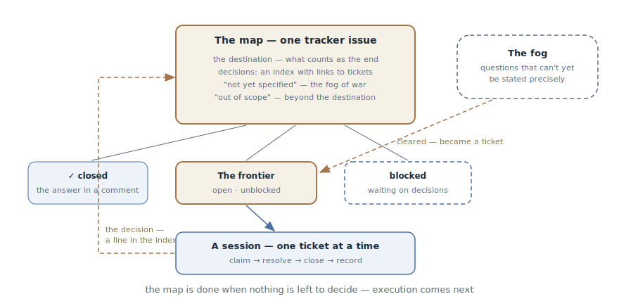

# Investigation Map

## Intent

Plan work that is bigger than one session and wrapped in fog — the idea
exists, the way isn't visible — as a shared map of investigation tickets on
the issue tracker. The agent closes one ticket per session, each answer
clears a patch of fog — until the way to the destination is clear. The map
produces decisions, not code: it is done when nothing is left to decide.

## Also known as

Wayfinder, wayfinding; the `/wayfinder` skill from Matt Pocock's pack.

## Problem

A big, loose idea has arrived: "we're moving to a new payment platform",
"we're doing an enterprise tier". It is clearly bigger than one session —
and, worse, the way isn't visible: it's not even known which decisions lie
ahead.

- Writing a specification right away is premature specification at full
  size: half of the pinned-down "requirements" will turn out to be guesses.
- The [Feature List](feature-list-harness.md) doesn't fit: it works from a
  known end state, and here it isn't known what exactly to build.
- Sorting it out in one long conversation — the knowledge dies with the
  session, and a second person or a second agent can't join in parallel.
- Keeping the questions in your head means re-remembering every time what
  has been decided, what is blocked, and what is even left.

## Solution

Three moves: name the destination, chart the map, walk it one ticket at a
time.

**The destination.** The first act is fixing what the end of the road looks
like: a specification ready to hand into the pipeline; a decision made; a
change completed. The destination fixes the scope — whatever lies beyond it
doesn't get onto the map.

**The map.** One tracker issue with the map label — an index, not a store:

- *the destination* — one or two lines every session orients to;
- *decisions* — one line per closed ticket with a link: the gist on the
  map, the detail in the ticket;
- *not yet specified* — the fog of war: questions that can be felt but not
  yet stated precisely;
- *out of scope* — what has been consciously cut: the frontier doesn't go
  past the destination.

**The tickets.** Child issues of the map, each one question sized to a
session. A ticket has a type: *research* — the agent reads documentation
and brings back a summary; *prototype* — a cheap artifact to argue over
(see the [Throwaway Prototype](prototype-to-answer.md)); *grilling* — a
conversation with the developer, one question at a time; *task* — manual
work without which a decision can't be made (set up a sandbox, provision
access). Blocking uses the tracker's native relationships: the
**frontier** — open, unblocked, unclaimed tickets — is visible right in the
tracker's UI.

**The work.** A session loads the map at low resolution, takes the first
frontier ticket, claims it (the assignment is the claim — parallel sessions
skip it), resolves it, records the answer as a comment, closes it — and
adds a line to the decisions. The answer usually clears some fog: whatever
can now be stated precisely graduates into new tickets. One ticket per
session — strictly.

The discipline rule: **decide, don't do**. A ticket produces a decision,
not a deliverable; the pull to "just build it already" is the signal that
the map has ended and it's time to hand the work into execution.

## Structure

At the top, the map — the index of the whole journey: the destination, the
accumulated decisions with links, the fog, and what was cut from scope.
Beneath it, the tickets in three states: closed with answers, the
frontier — open and takeable, and the blocked ones waiting on others'
decisions. The session at the bottom takes exactly one ticket from the
frontier; its answer goes as a line into the map's index, and the cleared
fog on the right graduates new tickets onto the frontier. The cycle repeats
until no tickets remain.

## Participants / Components

- **The map** — the index issue: destination, decisions, fog, out of scope.
- **The destination** — the definition of the road's end; it fixes the
  scope.
- **A ticket** — one session-sized question, with a type and blocking
  edges; the answer lives in it, the map only links.
- **The frontier** — open, unblocked, unclaimed tickets: the edge of the
  known.
- **The fog** — questions that can't yet be stated precisely; the map's
  legalized incompleteness.
- **Agent and developer** — the agent drives research and task tickets
  alone; grilling and prototype need the human; sessions may run in
  parallel.

## When to use

- The work is bigger than a session *and* the way isn't visible: a loose
  idea with a dozen unresolved questions behind it.
- Several people or several parallel sessions work the investigation — the
  map and the frontier in the tracker keep everyone in sync.
- The decisions matter enough to keep: every closed ticket is a recorded
  answer with a link, not a remark in a dead conversation.

Not needed when the way is clear: if the idea turns directly into a
specification and tasks, that's the [SDD pipeline](spec-driven-development.md)
without an investigation. And it's overkill when the whole investigation
fits in one session.

## Consequences and trade-offs

- ➕ The knowledge lives in the tracker: decisions, their reasons, and
  their links outlive any session and any participant.
- ➕ Parallelism for free: the frontier is visible in the tracker's UI, and
  any session can take a free ticket.
- ➕ The fog is legalized: no need to pretend everything is visible — the
  unclear sits honestly in "not yet specified" and ripens.
- ➕ A cutoff is cheap: a session is one ticket; if it dies, at most that
  ticket is lost.
- ➖ Tracker overhead: the map, child tickets, blocking edges — for an idea
  with three questions this is bureaucracy.
- ➖ The "decide, don't do" discipline is counterintuitive: the map doesn't
  produce product, and you have to stop in time and hand off to execution.
- ➖ The map's quality is bounded by the questions' quality: blurry tickets
  yield blurry decisions.

## Implementation

1. Charting is its own session. First, an interview down to the
   destination: what exactly are we finding — a spec, a decision, a change.
   Then a second interview breadth-first, not depth-first: fan out across
   the whole space of questions. If no fog surfaces — no map is needed, the
   way is already clear.
2. Create the map and the tickets that can already be stated precisely;
   wire the blocking edges in a second pass. The unstated goes into the
   fog, not into tickets: the test is "can I phrase the question precisely
   now", not "can I answer it".
3. A working session: load the map, take the first frontier ticket, claim
   it, resolve it — pulling in skills by ticket type — record the answer,
   close it, add the line to the decisions.
4. After every answer, revisit the fog: graduate what has ripened into
   tickets, delete what has been devalued, move what fell beyond the
   destination into "out of scope" with a one-line why.
5. One ticket per session — the same rule as
   [One Feature at a Time](one-feature-at-a-time.md), in the world of
   decisions.
6. In anything a human reads, call tickets by their names, not numbers: a
   wall of `#42, #47, #51` is illegible.
7. When no tickets remain — the way is clear: hand off into execution,
   usually the [SDD pipeline](spec-driven-development.md), with a link to
   the map as the decision log.

## Example

The idea: "we're moving billing to the PayFlow payment platform." The
charting session interviews the developer and fixes the destination: *an
approved migration specification — the chosen data model and a transition
plan with no interruption to charging*. The first tickets:

- research: "compare the subscription APIs of PayFlow and the current
  provider — what doesn't map" (the agent alone);
- task: "set up a PayFlow sandbox account" — blocks the research;
- grilling: "what happens to active subscriptions during the transition";
- fog: "the refund model", "migrating saved cards" — felt, but hanging on
  the answers above.

Sessions close the tickets one at a time. The transition-period answer
("double-entry, a gateway facade for a month") graduates two new tickets
from the fog — a facade prototype and webhook research. The "payments
account page redesign" that surfaced along the way goes into "out of scope"
as one line. Nine tickets later the frontier is empty: every decision is
made and recorded — the specification is assembled from the map's index,
and the work is handed into the pipeline.

## Anti-patterns and common mistakes

- **Doing instead of deciding.** A ticket ended in a shipped feature — the
  map has turned into an execution backlog. A deliverable is the sign it's
  time to hand off, not to widen the map.
- **Ticketing the fog.** Slicing the unstated into tickets "for later"
  yields hollow questions that will have to be rewritten. The fog ripens in
  its own section.
- **Several tickets per session.** The same breadth trap: three "almost
  decided" questions instead of one closed.
- **A map-as-store.** Full answers in the map's body instead of links — the
  map bloats, stops being readable in a minute, and drifts from the
  tickets.
- **Numbers instead of names.** "`#42` blocks `#47`" is illegible to a
  human; a name with the link inside reads at a glance.
- **A frontier without blocking.** With no edges wired, everything is
  "takeable" at once — and sessions grab questions whose answers hang on
  decisions not yet made.

## Known uses

- **Matt Pocock's skills** — `/wayfinder`: the pattern's primary source —
  the labeled map on the tracker, four ticket types, the fog of war, the
  frontier through native blocking, and the "decide, don't do" rule.
- **Dual-track agile** — the pre-agent kin: a discovery track running ahead
  of the delivery track, producing decisions rather than product
  increments.
- **Spike hierarchies in XP** — investigation tasks carved out of a large
  unknown; the map adds a shared index and the fog on top.

## Related patterns

- [Feature List](feature-list-harness.md) — the mirror neighbor: the list
  drives toward a known end state, the map finds the way to one not yet
  known; the map often ends where the list begins.
- [One Feature at a Time](one-feature-at-a-time.md) — the same pass
  discipline: one ticket per session, carried to a recorded decision.
- [Throwaway Prototype](prototype-to-answer.md) — a ticket type on the
  map: a question answered by an artifact rather than a conversation.
- [Spec-Driven Development](spec-driven-development.md) — the receiver of
  the result: when the way is clear, the map's decisions fold into a
  specification and go into the pipeline.
- [Session Handoff](handoff.md) — the mechanics of moving between the
  map's sessions and into execution: an extract for the goal instead of the
  conversation's tail.
