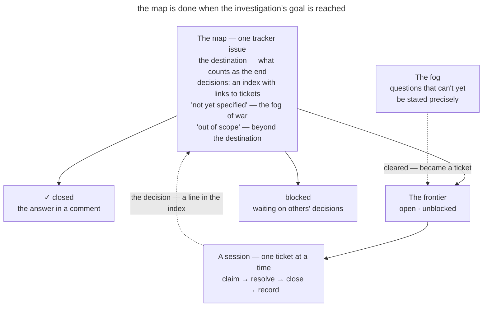

# Investigation Map

## Intent

Organize large, uncertain work as a map of investigation questions on the issue tracker. Each ticket yields a decision or new information that brings the team closer to an agreed implementation plan.

## Also known as

Wayfinder, wayfinding; the `/wayfinder` skill from Matt Pocock's pack.

## Problem

The team wants to move billing to a new platform but doesn't yet know how to migrate active subscriptions and saved payment methods. First it needs to find out the constraints and make several related decisions.

If you write a detailed specification right away, the unknown parts get filled with assumptions. The [Feature List](feature-list-harness.md) becomes useful once the required behavior is chosen. Right now the team needs a queue of the questions that behavior depends on. A long conversation makes it hard to hand results over to another participant. A shared map keeps track of what has already been decided and which questions are still open for investigation.

## Solution

Define the goal of the investigation, keep a map of the questions, and resolve them one at a time.

**The goal** describes the completion condition, for example an agreed migration specification. It limits the investigation to the questions needed for that result.

**The map** lives in a separate issue as a short index.

- _Goal_ helps every session keep its direction.
- _Decisions_ holds short conclusions and links to closed tickets.
- _Not yet specified_ keeps areas of uncertainty for which there isn't enough information yet.
- _Out of scope_ explains which questions are excluded from the investigation.

**A ticket** asks one question, with a work type and dependencies. Research requires reading sources, [prototype](prototype-to-answer.md) tests the question with an experiment, grilling refines a decision together with you, and task prepares the necessary access or environment. Open, unclaimed tickets whose dependencies are closed form the **frontier** of available work.

A session reads the map, assigns itself an available ticket, and investigates it. The answer is saved in the ticket, and a short conclusion with a link is added to the map. New information can turn an area of uncertainty into concrete questions for the next tickets.

**End the investigation with a recorded decision.** When the remaining work comes down to implementing an agreed approach, hand it over to the development queue.

## Structure

In the diagram, the map ties together decisions, open questions, and the investigation's boundaries.

```mermaid
---
title: the map is done when the investigation's goal is reached
---
flowchart TB
  map["The map — one tracker issue<br/>the destination — what counts as the end<br/>decisions: an index with links to tickets<br/>'not yet specified' — the fog of war<br/>'out of scope' — beyond the destination"]:::accent
  fog["The fog<br/>questions that can't yet<br/>be stated precisely"]:::muted
  closed["✓ closed<br/>the answer in a comment"]
  frontier["The frontier<br/>open · unblocked"]:::accent
  blocked["blocked<br/>waiting on others' decisions"]:::muted
  session["A session — one ticket at a time<br/>claim → resolve → close → record"]
  map --> closed
  map --> frontier
  map --> blocked
  fog -. "cleared — became a ticket" .-> frontier
  frontier --> session
  session -. "the decision — a line in the index" .-> map
```

A session picks one available ticket. Its answer updates the map and may open the next questions. The cycle ends when the investigation's goal is reached.

## Participants / Components

- **The map** holds a short state of the investigation and links.
- **The goal** sets the completion condition.
- **A ticket** holds a question, dependencies, and a detailed answer.
- **The frontier** shows available, unclaimed tickets.
- **Areas of uncertainty** keep questions that can't yet be stated precisely.
- **The agent and the developer** investigate information and make decisions depending on the ticket type.

## When to use

- The investigation spans several sessions, and the way to implement it is still unknown.
- Several participants need a shared picture of the questions and dependencies.
- The reasons for decisions must remain accessible after the sessions end.

If the way is already clear, move on to [SDD](spec-driven-development.md). For a one-session investigation, a short list of questions is usually enough.

## Consequences and trade-offs

- ➕ Decisions and their reasons are available to all participants through the tracker.
- ➕ Independent questions can be investigated in parallel.
- ➕ Uncertainty is visible explicitly, without premature detailing.
- ➕ A session cutoff affects only the current question, and earlier answers are saved.
- ➖ The map and the dependencies take time to maintain.
- ➖ You have to end the investigation in time and move on to implementation.
- ➖ A vague question makes it hard to get a verifiable answer.

## Implementation

1. In a separate session, agree on the goal and list the areas of uncertainty.
2. Create tickets for the questions that can already be stated precisely, and specify the dependencies.
3. Pick an available ticket, assign an owner, save the answer, and update the map.
4. After each answer, revisit the open areas. Create new concrete questions and remove the ones that have lost their relevance.
5. Finish one question per pass, as in the [One Feature at a Time](one-feature-at-a-time.md) pattern.
6. Give links with ticket names so the reader can see what a dependency means.
7. Once the goal is reached, hand the decisions over to the [SDD process](spec-driven-development.md) with a link to the map.

## Example

For a billing migration to PayFlow, the team sets the goal of getting a transition specification with no interruption to charging. The first questions concern API compatibility and the state of active subscriptions.

- A research ticket compares the subscription APIs of PayFlow and the current provider on a test account.
- A task ticket creates a sandbox account and blocks that comparison.
- A grilling ticket refines how active subscriptions behave during the transition period.
- The refund model and migrating saved cards remain areas of uncertainty for now.

Once a double-entry transition period is chosen, questions about a gateway facade and webhooks appear. The team builds a prototype and investigates event delivery. The payment account page redesign is excluded from the scope. When the migration questions are resolved, the team assembles the specification from the map's links.

## Anti-patterns and common mistakes

- **Implementation inside the investigation.** If the decision has already been made, create a development task and close the investigation ticket.
- **Tickets without a precise question.** Keep an area of uncertainty on the map until there is enough information to state it.
- **Several unfinished questions.** Carry the current ticket to a recorded answer before moving on to the next.
- **A map-as-store.** Full answers bloat the index and duplicate the tickets. Leave short conclusions with links.
- **Numbers only.** Add names so the meaning of the links is visible without opening each ticket.
- **No dependencies.** A participant may start a question before the decisions it needs are ready.

## Known uses

- **Matt Pocock's skills** implement the map, the question types, and the workflow through `/wayfinder`.
- **Dual-track agile** separates solution discovery from product delivery.
- **Spike tasks in XP** test technical questions with short experiments.

## Related patterns

- [Feature List](feature-list-harness.md) organizes execution after the end behavior is chosen.
- [One Feature at a Time](one-feature-at-a-time.md) sets the limit on the current pass.
- [Throwaway Prototype](prototype-to-answer.md) tests questions with an experiment.
- [Spec-Driven Development](spec-driven-development.md) uses the decisions made for implementation.
- [Session Handoff](handoff.md) preserves the state for the next stage of the investigation.
