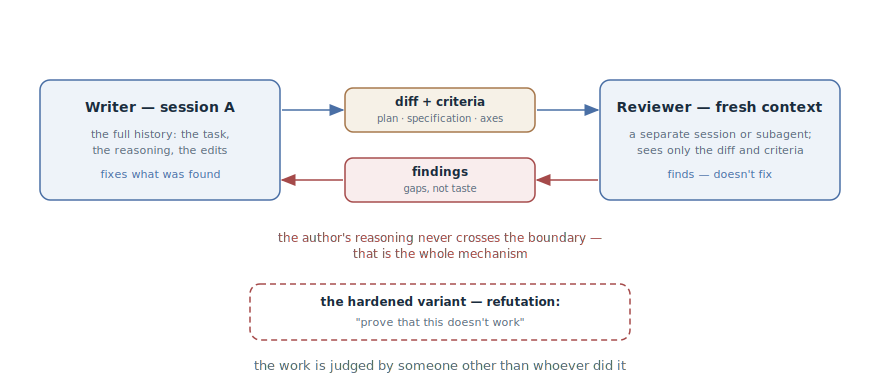

# Writer and Reviewer

## Intent

Hand the diff for review to an agent with a fresh context — a separate
session or a subagent — so the work is judged by someone other than whoever
did it. The reviewer sees only the diff and the criteria, not the reasoning
that led to the diff — and therefore evaluates the result instead of
agreeing with the train of thought.

## Also known as

Writer/Reviewer, independent review, "fresh eyes"; the hardened variant —
adversarial review.

## Problem

An agent is biased toward the code it has just written — for the same reason
a human is: its window holds the entire chain of reasoning that led to the
solution. Ask it to check its own work, and it will check the reasoning —
which, of course, will check out.

- [Reflection](reflection.md) hits this ceiling: a critic in the same window
  shares the author's blind spots. It will find a missed case; a flaw in the
  approach itself — no.
- The longer the agent worked autonomously, the higher the price: a series
  of plausible decisions, each "verified" by their own author, arrives at
  your desk whole.
- The only unbiased reviewer — the human — becomes the bottleneck:
  everything an agent produces in a day won't fit through one person's
  review.

## Solution

Split the roles across contexts. The writer is the session that did the
work, with all its history. The reviewer is a fresh context: a separate
session or a subagent that receives exactly two inputs:

- **the diff** — what actually changed;
- **the criteria** — what to check against: the plan, the specification, the
  review axes ("every requirement implemented, the listed edge cases have
  tests, nothing outside the scope touched").

What the reviewer does *not* receive is the history of reasoning. That is
the whole mechanism: not knowing *why* the author decided this way, it has
to evaluate what is there — like an external reviewer opening a pull
request.

The findings go back to the writer, who fixes and resubmits for re-review.
In the subagent form the cycle closes without copying text between windows:
the findings arrive straight in the author's session.

For critical code there is a hardened variant — the adversarial one: the
reviewer's task is not to "assess" but to **refute** — "prove that this
doesn't work; find an input that breaks it." An evaluator motivated to find
a counterexample is stronger than one motivated to deliver a verdict.

One calibration is mandatory: a reviewer asked to find gaps will always find
some — that's the framing. Ask it to separate correctness gaps and
deviations from requirements from taste preferences — and don't fix
everything it reports: chasing every finding ends in extra abstraction
layers and tests for impossible cases.

## Structure

Two contexts, and between them — only artifacts. On the left, the writer
with the session's full history; the diff and the criteria travel right, the
findings come back. The author's reasoning never crosses the boundary — that
is not a limitation but the pattern's very mechanism. At the bottom, the
hardened variant: the reviewer is tasked with refutation, not assessment.

## Participants / Components

- **Writer** — the session that did the work: full history, reasoning,
  edits. Fixes what was found.
- **Reviewer** — a fresh context: a separate session or a subagent. Only
  finds — doesn't fix.
- **Diff** — the subject of the review: the actual change, without the
  backstory.
- **Criteria** — the plan, the specification, the review axes; they define
  what counts as a finding.
- **Findings** — correctness gaps and deviations from requirements; filtered
  by the developer.

## When to use

- A serious diff before merging: several modules, a public contract,
  critical logic.
- After autonomous work: the longer the agent worked unattended, the more an
  independent check matters before counting the work as done.
- As the overfit check after [TDD](tdd-with-agent.md): is the implementation
  fitted to the specific tests.
- As a plan check: is everything promised implemented, and was anything
  extra done.

For small edits [Reflection](reflection.md) is enough — a full cycle with a
separate context costs more than the edit itself.

## Consequences and trade-offs

- ➕ The author's bias is removed by construction: the reviewer physically
  cannot see the reasoning it might agree with.
- ➕ The result is checked against criteria — like an external review, at
  the price of an agent call.
- ➕ Human review gets a better input: the typical gaps are caught before a
  person opens the diff.
- ➖ More expensive than reflection: a second context, artifact handover,
  iterations.
- ➖ A reviewer without the history may not understand deliberate decisions —
  conscious trade-offs must be visible from the criteria, ADRs, or comments,
  or they'll get "fixed".
- ➖ There will always be findings: without calibration the pattern turns
  into an over-engineering generator.

## Implementation

1. Set up a reviewer with a fresh context: a subagent ("review this with a
   fresh subagent...") or a separate session that receives only the diff.
2. Assemble the input: the diff, the criteria (plan, specification, axes),
   and whatever explains the deliberate — ADRs, the
   [Domain Vocabulary](domain-context-file.md). Don't pass the session
   history — it is the very source of the bias.
3. State what counts as a finding: "correctness gaps and deviations from the
   plan, not style preferences."
4. For critical code — refutation: "find an input that breaks this; prove
   that requirement X is not met."
5. Return the findings to the writer and iterate to a clean pass; the author
   always does the fixing — a reviewer that starts fixing has stopped being
   a reviewer.
6. Filter the findings yourself: correctness gaps get fixed, taste is
   optional. Don't turn every finding into an edit.
7. Package the recurring cycle into a command: ready-made ones are
   `/code-review` in Claude Code and the two-axis review in
   [Matt Pocock's skills](matt-pocock-skills.md).

## Example

Session A implemented a rate limiter for the public API according to the
approved plan. Instead of "check your work", the developer brings up a
reviewer:

> With a fresh subagent, review the rate limiter diff against PLAN.md: every
> requirement implemented, the plan's edge cases have tests, nothing outside
> the task's scope changed. Report gaps, not style.

The reviewer, not knowing how the author arrived at the solution, returns
three findings: a race is possible when two workers refill tokens at once —
the limit is briefly exceeded; the plan promises a `Retry-After` header, and
there is no test for it; a neighboring middleware got renamed along the
way — out of scope.

The author fixes the race and adds the test, and reverts the rename. The
re-review is clean. Note: reflection would not have found the race — in the
author's reasoning the token refill is "obviously atomic", and a critic in
the same window would have inherited that obviousness.

## Anti-patterns and common mistakes

- **"Check your code" in the same window.** That is
  [Reflection](reflection.md) — a useful but different instrument: the
  author's bias hasn't gone anywhere.
- **A reviewer with the history.** Feeding the reviewer the whole session
  "for context" hands it the author's reasoning and, with it, the bias. The
  reviewer's context is the diff and the criteria.
- **Review without criteria.** Without a plan and axes the reviewer produces
  taste — many words, few findings.
- **Blind trust in findings.** Fixing everything that was found is the
  straight road to over-engineering: the reviewer will *always* find
  something; the filter is the developer's job.
- **The reviewer fixes things itself.** Mixing the roles brings back the
  original problem: now it's *its* edits that nobody has independently
  checked.

## Known uses

- **Claude Code best practices** — the primary source: the two-session
  Writer/Reviewer table, the adversarial review step by a subagent ("the
  reviewer sees only the diff and the criteria, not the reasoning"), and the
  warning about over-engineering from findings.
- **Claude Code `/code-review`** — the bundled skill: a review of the
  current diff by a fresh subagent with findings returned to the session.
- **Matt Pocock's skills** — `/code-review` along two axes: adherence to the
  codebase's standards and adherence to the specification; the mandatory
  finale of `/implement`.
- **Superpowers** — `requesting-code-review`: checking the result against
  the specification as a mandatory checkpoint before finishing a branch.
- **The "test writer — code writer" variant** — the same roles on different
  material: one session writes the tests, another writes the code to pass
  them.

## Related patterns

- [Reflection](reflection.md) — the cheap rung below: self-critique in the
  same window; a filter before the real review, not its replacement.
- [Feedback Loop](give-agent-a-way-to-verify.md) — writer-reviewer is the
  "second opinion", the top rung of the verification ladder — for what
  doesn't reduce to a binary oracle.
- [TDD with an Agent](tdd-with-agent.md) — supplies the reviewer with a
  ready-made question: is the implementation fitted to the frozen tests.
- [Spec-Driven Development](spec-driven-development.md) — supplies the
  reviewer with criteria: the specification and the plan turn "look at the
  code" into a check against a list.
