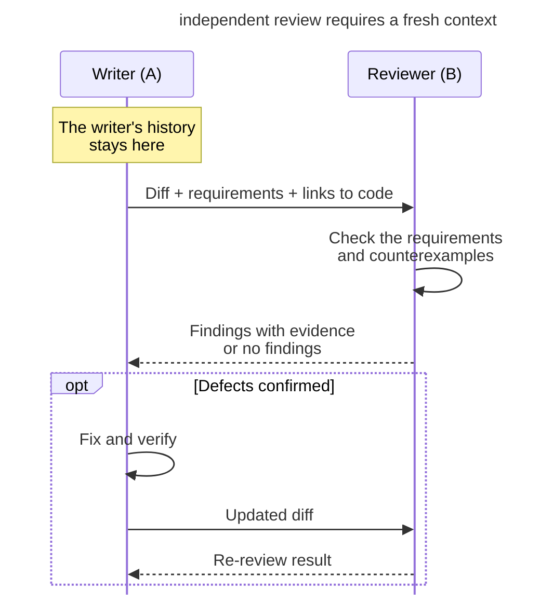

# Writer and Reviewer

## Intent

Hand the diff to an agent with a fresh context, together with the review criteria. A separate reviewer judges the result against the requirements and returns findings to the writer for fixing.

## Also known as

Writer/Reviewer, independent review, "fresh eyes", adversarial review.

## Problem

When checking its own code, the agent may repeat the assumption the implementation was built on. For example, it believes the counter update is atomic and misses the race in both passes.

[Reflection](reflection.md) helps find omissions, but it keeps the same reasoning context. After a long stretch of autonomous work, several such unchecked assumptions can pile up. A separate reviewer helps prepare the diff for human review, although its conclusions also need confirmation.

## Solution

Split the roles across sessions. The writer keeps the history of the work, and the reviewer receives the materials to check.

- **The diff** shows the actual change.
- **The criteria** set the requirements, constraints and expected checks.

Give the reviewer access to the relevant code, the specification and the ADRs, but leave the writer's reasoning history in the writer's session. The reviewer can then match the change against the requirements on its own.

The writer receives the findings, fixes the confirmed defects and submits the result for another review.

For critical logic, ask the reviewer to look for counterexamples. An input on which a requirement fails gives a verifiable basis for the fix.

Don't demand a fixed number of findings. The reviewer must justify each defect and may finish the review with no findings. Treat style preferences separately from behavior bugs.

## Structure

The writer and the reviewer work in different contexts. Only the review artifacts and the findings pass between them.

```mermaid
---
title: independent review requires a fresh context
config:
  sequence:
    mirrorActors: false
    width: 130
    height: 45
    actorMargin: 35
    messageMargin: 28
---
sequenceDiagram
  participant W as Writer (A)
  participant R as Reviewer (B)
  Note over W: The writer's history<br/>stays here
  W->>R: Diff + requirements + links to code
  R->>R: Check the requirements<br/>and counterexamples
  R-->>W: Findings with evidence<br/>or no findings
  opt Defects confirmed
    W->>W: Fix and verify
    W->>R: Updated diff
    R-->>W: Re-review result
  end
```

Session B starts with a fresh context: the writer's reasoning is not carried over into it. The reviewer reads the code it needs and reports its findings. The fixes stay with the writer and go through another review.

## Participants / Components

- **Writer** implements the change and fixes the confirmed findings.
- **Reviewer** checks the result in a fresh context.
- **Diff** sets the scope of the review.
- **Criteria** define the required behavior and constraints.
- **Findings** describe the defect, the conditions under which it shows up, and the evidence.

## When to use

- The change touches several modules or a public contract.
- The agent worked autonomously for a long time before the review.
- After [TDD](tdd-with-agent.md), you need to check whether the implementation was fitted to the tests.
- You need to check the result for completeness against the plan.

For a small edit, you can start with [Reflection](reflection.md) and automated checks.

## Consequences and trade-offs

- ➕ The reviewer reconstructs the solution from the code and the requirements on its own.
- ➕ The criteria make findings concrete and verifiable.
- ➕ Some defects can be fixed before human review.
- ➖ A second context and repeated passes increase the cost.
- ➖ Without written-down constraints, the reviewer may mistake a deliberate trade-off for a bug.
- ➖ Unverified findings can lead to unnecessary edits.

## Implementation

1. Create a separate session or a subagent with a fresh context. For more independence, give the review to an agent on a different model.
2. Pass the diff, the plan and the specification. Add links to the ADRs and the [Domain Vocabulary](domain-context-file.md) that explain the constraints.
3. Ask for verifiable defects and requirement violations.
4. For critical behavior, ask for counterexamples.
5. Pass the confirmed findings to the writer and review the fixes again.
6. Reject findings that the code or the requirements don't support.
7. Save a recurring process as a command, or use `/code-review` from [Matt Pocock's skills](matt-pocock-skills.md).

## Example

Session A has implemented a rate limiter. The developer hands the result over for independent review.

> Review the rate limiter diff in a fresh context against PLAN.md. Find requirement violations and behavior bugs. For each finding, show the conditions under which it shows up and the code that causes it.

The reviewer finds a race when two workers refill tokens. It shows the sequence of operations in which both read the stale counter and let the limit be exceeded. It also notices a missing check for `Retry-After` and a neighboring middleware renamed outside the task's scope.

The writer fixes the race, adds a test for the header and reverts the unrelated rename. The re-review checks these changes. The fresh context helped question the assumption that the counter is atomic.

## Anti-patterns and common mistakes

- **Review in the same window.** That is [Reflection](reflection.md), which can keep the writer's original assumptions.
- **The whole history for the reviewer.** The full discussion can steer the review along the line of thought already chosen. Pass the requirements and the evidence for decisions.
- **No criteria.** Without requirements, findings can boil down to style preferences.
- **Every finding becomes an edit.** First confirm the defect and judge whether it needs fixing.
- **The reviewer changes the code.** Its edits will need an independent review too.

## Known uses

- **Claude Code best practices** describe the Writer/Reviewer split and the search for counterexamples in a separate session.
- **The [codex-plugin-cc](https://github.com/openai/codex-plugin-cc) plugin** from OpenAI runs Codex inside Claude Code. The `/codex:review` command reviews uncommitted changes or a branch, and `/codex:adversarial-review` challenges implementation and design decisions. The reviewer has not only a fresh context but also a different model.
- **Codex** reviews a branch, uncommitted changes or a single commit with the `/review` command.
- **Review skills** automate handing over the diff and returning findings to the writer.
- **Matt Pocock's skills** check the project's standards and the specification with `/code-review`.
- **Superpowers** uses `requesting-code-review` before finishing a branch.
- **Separate test and code writers** apply a similar principle to the criteria and the implementation.

## Related patterns

- [Reflection](reflection.md) helps prepare the result in the current session.
- [Feedback Loop](give-agent-a-way-to-verify.md) complements review with reproducible checks.
- [TDD with an Agent](tdd-with-agent.md) provides criteria for spotting an implementation fitted to the tests.
- [Spec-Driven Development](spec-driven-development.md) keeps the requirements for an independent reviewer.
