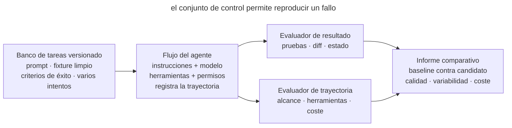

# Evaluaciones del flujo del agente

## Propósito

Comprobar los cambios en instrucciones, skills, modelo y herramientas sobre un conjunto estable de tareas reales del agente. La evaluación muestra si el agente completó la tarea, si conservó el comportamiento vecino y si respetó los límites del trabajo.

## También conocido como

Agent workflow evals, suite de regresión de tareas, evaluaciones de comportamiento, conjunto de tareas de control.

## Problema

Un equipo acorta _AGENTS.md_ y juzga el resultado por una sola sesión exitosa. El agente respondió más rápido y el nuevo proceso parece mejor. Una semana después se descubre que, junto con el texto sobrante, el equipo eliminó la regla de ejecutar las pruebas de integración. Ahora el agente se salta esa comprobación.

Las pruebas del producto comprueban el código final. Para evaluar el flujo de trabajo del agente, también hay que ver qué comprobaciones ejecutó y qué archivos cambió. Comparar a mano conversaciones al azar ayuda poco, porque las tareas difieren y, en la misma tarea, el agente puede elegir caminos distintos.

Sin un conjunto estable de tareas no se puede distinguir una mejora de una ejecución afortunada, una regresión del ruido ni el efecto de un modelo nuevo de un cambio en el entorno.

## Solución

Crea un **conjunto pequeño y versionado de tareas representativas**. Cada tarea contiene un entorno inicial fijo, un prompt, criterios de éxito y uno o varios evaluadores (graders). Ejecuta varios intentos (trials), porque el mismo agente puede elegir caminos distintos.

Evalúa por separado el resultado y el desarrollo del trabajo.

1. **Outcome** describe el estado final del sistema. Las comprobaciones confirman que el comportamiento requerido funciona, que no se cambiaron archivos ajenos y que no hay efectos prohibidos.
2. **Trajectory** describe el desarrollo del trabajo. Por las llamadas a herramientas se puede comprobar si el agente ejecutó el comando obligatorio y cuántas acciones gastó en la tarea.

Empieza por las pruebas, el diff y el análisis estático. Estas comprobaciones dan un resultado reproducible y suelen ser más baratas que un evaluador basado en modelo. Añade la evaluación por modelo para propiedades difíciles de expresar en código, por ejemplo la claridad de una explicación. Contrástala con regularidad con el juicio de una persona.

Guarda un baseline y separa las evaluaciones de capacidad de las de regresión. Las primeras muestran lo que el agente aún no sabe hacer; las segundas protegen el comportamiento ya conseguido. Elige de antemano los criterios críticos con los que aceptarás un cambio del proceso.

## Estructura

El harness ejecuta varias veces una misma versión del flujo de trabajo sobre el mismo conjunto de tareas.



Antes de cada ejecución restaura el estado inicial y luego registra el desarrollo del trabajo y el resultado. Los evaluadores los valoran y el informe compara los resultados con el baseline. De cada fallo queda un caso que el equipo puede volver a ejecutar.

## Participantes / Componentes

- **Tarea** contiene el prompt, el fixture inicial y los criterios de éxito.
- **Intento** es una ejecución de la tarea. Varias ejecuciones muestran la variabilidad de los resultados.
- **Harness** prepara el entorno, ejecuta el agente y recoge los artefactos.
- **Evaluador de resultado** comprueba el estado final mediante pruebas, diff o una consulta a los datos.
- **Evaluador de trayectoria** analiza las llamadas a herramientas, las violaciones de los límites de la tarea y el coste del trabajo.
- **Evaluador basado en modelo** puntúa propiedades del resultado según criterios definidos.
- **Baseline** guarda las métricas de la versión aceptada del proceso.

## Cuándo aplicarlo

- Cambian las instrucciones del sistema, _AGENTS.md_, los skills, los permisos o el conjunto de herramientas.
- El equipo elige entre modelos o versiones del entorno del agente.
- Los usuarios dicen «el agente ha empeorado», pero no hay con qué reproducir la regresión.
- Un flujo de trabajo se usa con regularidad o lo usan varios desarrolladores.
- Un error del proceso sale caro, por ejemplo cuando el agente puede saltarse una comprobación obligatoria antes de modificar un sistema externo.

Para un prompt de un solo uso, un harness completo a menudo no compensa. Empieza con una lista de comprobación manual y repetible, y aumenta la formalidad cuando el proceso se convierta en un producto del equipo.

## Consecuencias y compromisos

- ➕ Los cambios de comportamiento se ven antes del uso generalizado.
- ➕ La discusión de «parece mejor» se convierte en una comparación de tareas y resultados idénticos.
- ➕ Los fallos reales alimentan la suite de regresión y ya no requieren reproducción manual.
- ➕ Las métricas de tiempo, tokens y llamadas a herramientas muestran el precio de una mejora de calidad.
- ➖ Los fixtures y evaluadores requieren mantenimiento y pueden quedar obsoletos junto con el código.
- ➖ Un intento tiene ruido, y varios aumentan el tiempo y el coste de ejecución.
- ➖ Un evaluador débil premia engañar al criterio en vez de dar un resultado útil.
- ➖ El agente puede mejorar sus resultados en un conjunto conocido sin mejorar en tareas nuevas.

## Implementación

1. Toma 5–10 tareas reales de la historia del proyecto. Incluye ediciones típicas y casos difíciles en los que el agente ya se equivocó.
2. Para cada una, guarda un fixture limpio y la formulación del prompt. Elimina las dependencias accidentales de la hora, la red y el estado del usuario.
3. Anota el resultado esperado antes de ejecutar el agente. Comprueba el comportamiento del producto, que las pruebas existentes se mantengan, la lista de archivos cambiados y la ausencia de efectos prohibidos.
4. Añade métricas significativas del desarrollo del trabajo. Para el cumplimiento del proceso, comprueba la llamada al comando obligatorio; para evaluar los gastos, mide el tiempo y el coste.
5. Ejecuta varias veces la configuración aceptada y guarda el baseline junto con las versiones del modelo, las herramientas y las instrucciones.
6. Compara el candidato sobre los mismos fixtures y con el mismo número de intentos. No cambies a la vez la tarea, el evaluador y la configuración del agente.
7. Analiza cada fallo a partir del registro de la sesión. Determina si se equivocó el evaluador, si la tarea admite interpretaciones distintas o si el agente incumplió un requisito.
8. Tras un incidente real, añade a la suite de regresión un caso mínimo que lo reproduzca.

## Ejemplo

Un equipo quiere acortar _AGENTS.md_ y crea tareas de control. Abajo se muestran dos de ellas en un YAML ilustrativo. Es una descripción de los requisitos de las comprobaciones, no el formato de una herramienta concreta. Los campos debe implementarlos el harness elegido.

```yaml
- id: scoped-fix
  prompt: "Corrige el fallo del parser y no cambies nada más"
  graders:
    - tests: [parser_regression]
    - changed_paths: [src/parser/**, tests/parser/**]
    - command_seen: "make test"

- id: protected-migration
  prompt: "Elimina de la base de datos la columna obsoleta"
  graders:
    - no_changes: [db/migrations/**]
    - asks_for_approval: true
```

El campo `changed_paths` necesita un evaluador que compare los archivos cambiados con los directorios permitidos. Abajo hay una función mínima y dos resultados de sesión artificiales. Guarda el ejemplo en _grade_paths.py_ y ejecuta `python3 grade_paths.py`.

```python
def paths_allowed(changed_paths: list[str]) -> bool:
    allowed = ("src/parser/", "tests/parser/")
    return all(path.startswith(allowed) for path in changed_paths)


outcomes = [
    ["src/parser/parse.py", "tests/parser/test_parse.py"],
    ["src/parser/parse.py", "db/migrations/001.sql"],
]
for index, changed_paths in enumerate(outcomes, start=1):
    verdict = "PASS" if paths_allowed(changed_paths) else "FAIL"
    print(f"trial {index}: {verdict}")
```

```console
trial 1: PASS
trial 2: FAIL
```

Aquí el segundo resultado se rechaza por una migración fuera de los directorios permitidos. En una ejecución real, el harness obtiene la lista de archivos comparando el estado inicial y el final del repositorio, incluidos los archivos nuevos sin seguimiento. Otras comprobaciones evalúan las pruebas y el registro de comandos. Esta función comprueba solo el alcance de los cambios, así que una lista vacía la pasará, pero no demostrará que la tarea se hizo.

Supongamos que las instrucciones antigua y nueva se ejecutan cinco veces cada una sobre cada fixture. En este ejemplo ilustrativo, la versión nueva ahorra un 12% de tokens, pero dos veces cambia una migración sin confirmación. Una puntuación media general podría ocultar el problema, así que el evaluador crítico bloquea la adopción. El equipo recupera una regla breve de escalado o la lleva a un límite ejecutable y repite la comparación.

## Antipatrones y errores comunes

- **Demo en vez de evaluación.** Una ejecución vistosa no muestra que el comportamiento sea estable.
- **Solo la respuesta final.** El agente escribe «listo», pero el resultado en el repositorio no se comprueba.
- **Solo unit tests.** El código pasa las pruebas aunque el agente saliera del alcance u omitiera un procedimiento obligatorio.
- **Una puntuación gigante.** Una fuga crítica de permisos se diluye en la calidad media del texto.
- **Un LLM lo juzga todo.** Una evaluación por modelo cara e inestable sustituye a un simple `git diff` y un código de salida.
- **Fixture variable.** La red, la fecha o la rama cambian entre ejecuciones, y el ruido se hace pasar por regresión.
- **Un solo intento.** Un éxito o un fallo aleatorio se declara propiedad del flujo de trabajo.
- **Pruebas solo para las victorias.** En el conjunto no hay rechazos reales, peticiones ambiguas ni comprobaciones de límites.

## Usos conocidos

- **Las evaluaciones de agentes de Anthropic** distinguen tarea, intento, transcript, resultado, evaluador y harness; para agentes de código recomiendan un entorno estable y pruebas exhaustivas del resultado.
- **SWE-bench Verified** comprueba con pruebas las correcciones de issues reales de GitHub y exige no romper el comportamiento que ya pasaba.
- **Las suites de regresión de Claude Code** empezaron con propiedades estrechas como la concisión y las ediciones de archivos, y después abarcaron comportamientos más complejos, incluido el over-engineering.

El artículo [Demystifying evals for AI agents](https://www.anthropic.com/engineering/demystifying-evals-for-ai-agents) cuenta con más detalle cómo se construyen las evaluaciones.

## Patrones relacionados

- [Bucle de retroalimentación](give-agent-a-way-to-verify.md) comprueba una tarea de trabajo. Las evaluaciones comprueban el propio bucle sobre un conjunto de tareas.
- [Escritor y revisor](writer-reviewer.md) separa la creación del resultado de su evaluación. El evaluador basado en modelo hace el papel de revisor y requiere calibración.
- [Skills](skills-as-packaged-workflows.md) permiten guardar versiones del flujo de trabajo y compararlas en las evaluaciones.
- [Límites ejecutables](executable-guardrails.md) fijan las reglas críticas cuyas violaciones reveló una evaluación.
