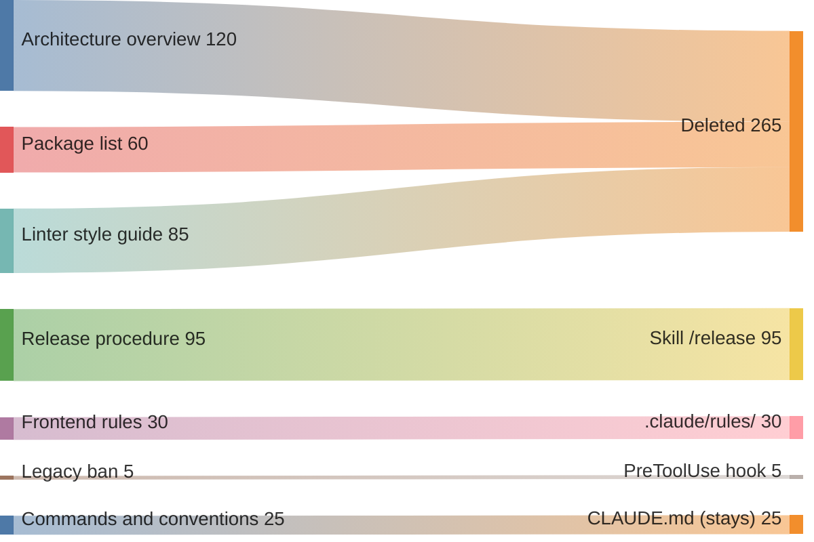

# Memoria hinchada

## También conocido como

Bloated CLAUDE.md, archivo de memoria sobreespecificado, memoria vertedero.

## Contexto

Durante meses, el equipo va ampliando el archivo de memoria del proyecto. Después de cada incidente con el agente, los desarrolladores añaden una regla, pero rara vez comprueban si sigue haciendo falta. El archivo crece y nunca se reduce.

## Problema

En el archivo de memoria se acumulan cientos de líneas con duplicados, contradicciones y paráfrasis del código. Al agente le cuesta más distinguir las instrucciones aplicables entre las demás, así que incluso una regla escrita puede pasar desapercibida.

## Por qué se hace

- Cada regla fue necesaria en algún momento, y los desarrolladores temen borrarla sin conocer el motivo original.
- El equipo espera que más instrucciones hagan más predecible el comportamiento del agente y no comprueba el efecto de acumularlas.
- Los desarrolladores meten en la memoria descripciones de la arquitectura y procedimientos largos que estarían mejor en documentos aparte.
- Todo el equipo amplía el archivo, pero nadie se encarga de revisarlo.

## Consecuencias

- ➖ El agente pasa por alto la instrucción necesaria entre muchas otras.
- ➖ Cada línea sobrante gasta tokens en todas las sesiones que cargan el archivo.
- ➖ Cuando las instrucciones se contradicen, el agente puede elegir reglas distintas en sesiones distintas.
- ➖ Los nuevos compañeros tienen que desentrañar un archivo largo para encontrar la convención que buscan.

## Señales

- El archivo tiene cientos de líneas y sigue creciendo.
- El agente hace lo que la memoria prohíbe explícitamente.
- El archivo parafrasea la estructura de directorios y las dependencias que el agente puede leer en el repositorio.
- Hay reglas que el agente cumple incluso sin la instrucción.
- Nadie sabe decir para qué sirve la mitad de las líneas.

## Cómo hacerlo mejor

Revisa la memoria con la regla del [patrón del mismo nombre](claude-md-memory.md). Para cada línea, averigua qué error evita. Si el agente obtiene la misma información del código o cumple la regla sin recordatorio, la línea se puede borrar. Lleva los procedimientos largos a [skills](skills-as-packaged-workflows.md) que se cargan bajo demanda. Después de recortar el archivo, comprueba con tareas reales si se conserva el comportamiento necesario.

## Ejemplo

**Antes:**

> En CLAUDE.md se han acumulado 420 líneas. La mayor parte la ocupan un panorama de la arquitectura, la lista de paquetes y reglas del linter copiadas. Entre ellas, en la línea 287, está la prohibición de tocar el código legacy que el agente incumplió ayer.

En el diagrama, eliminas 265 líneas que repiten información del código y de la configuración del linter. Trasladas el procedimiento de release de 95 líneas a un skill, colocas las 30 líneas de reglas del frontend en _.claude/rules/_ y aseguras con un hook la prohibición de legacy de cinco líneas. En la memoria quedan 25 líneas de comandos y convenciones. Cada regla vive ahora donde se aplica.

**Después:**

> En CLAUDE.md quedan 25 líneas de comandos y convenciones. El agente obtiene el procedimiento de release del skill `/release` y carga las reglas del frontend desde _.claude/rules/_ al trabajar con los archivos correspondientes. Un hook PreToolUse bloquea la escritura en el código legacy.

## Patrones y antipatrones relacionados

- [Memoria del proyecto](claude-md-memory.md) fija las reglas para seleccionar y revisar las instrucciones permanentes.
- [Skills](skills-as-packaged-workflows.md) permiten cargar procedimientos bajo demanda.
- [Ingeniería de contexto](context-engineering.md) explica cómo el texto sobrante impide usar la información necesaria.
- [Especificación prematura](premature-specification.md) describe un intento parecido de ganar control mediante instrucciones excesivas.
