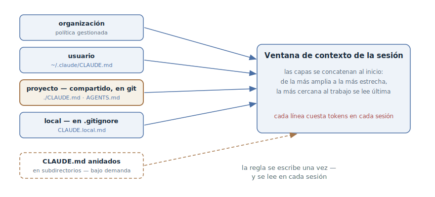

# Memoria del proyecto

## Propósito

Mantener en el repositorio un archivo permanente con las reglas del
proyecto — comandos, convenciones, límites — que el agente lee
automáticamente al comienzo de cada sesión. La regla se escribe una vez — y
rige en cada nueva ventana de contexto, en lugar de contarse de nuevo en cada
conversación.

## También conocido como

CLAUDE.md, AGENTS.md, memory file; en otras herramientas — project rules,
custom instructions.

## Problema

Cada sesión del agente empieza con una ventana de contexto limpia. El agente
no sabe cómo se compila el proyecto, con qué se ejecutan los tests, qué
convenciones tiene el equipo y qué no se puede tocar aquí. El desarrollador lo
explica en la conversación — y la explicación muere con la sesión:

- Las mismas aclaraciones se teclean de nuevo cada sesión: «usamos pnpm, no
  npm», «los tests van con make test», «esa carpeta no se toca».
- El agente comete el mismo error por segunda semana consecutiva — no hay
  manera de decírselo *para siempre*.
- El conocimiento vive en la cabeza de un desarrollador. El colega de la mesa
  de al lado le explica lo mismo a su agente — con otras palabras y con otro
  éxito.

Guardar esas reglas en la especificación de la tarea tampoco es una salida: no
son sobre la tarea, son sobre el proyecto — y hacen falta en todas las tareas.

## Solución

Un archivo en la raíz del repositorio que el agente carga al comienzo de cada
sesión. En él se escribe lo que de otro modo habría que explicar de nuevo:
comandos de compilación y tests, convenciones de código y de commits, límites
(«siempre X», «nunca Y»), particularidades no evidentes del proyecto.

El archivo crece con disparadores simples:

- el agente cometió el mismo error por segunda vez;
- la revisión de código atrapó algo que el agente estaba obligado a saber
  sobre esta base de código;
- estás tecleando una aclaración que ya tecleaste en la sesión pasada;
- un compañero nuevo necesitaría el mismo contexto para ser productivo.

El archivo vive bajo control de versiones, así que las reglas son comunes a
todo el equipo y pasan por la revisión habitual. Editas el texto — y cambias
el comportamiento de todos los agentes del proyecto desde la sesión siguiente.

Un límite importante: esto es contexto, no configuración. El archivo de
memoria *orienta* el comportamiento del agente, pero no lo garantiza. Las
prohibiciones que deben cumplirse siempre — «no hacer push a main», «no tocar
producción» — se duplican con mecánica: hooks, permisos, ajustes de la
herramienta.

## Estructura



La memoria tiene capas: el nivel de la organización (política gestionada), el
nivel personal del usuario, el nivel del proyecto y un archivo local con
ajustes personales para el repositorio concreto. Al iniciar la sesión las
capas se concatenan en la ventana — de lo amplio a lo estrecho, de modo que
las reglas del proyecto se leen después de las personales, y las locales al
final. La capa de equipo — el archivo del proyecto en git — es el objeto de
este patrón; los demás niveles lo complementan sin sustituirlo. Los archivos
de memoria anidados en subdirectorios no se cargan al inicio sino bajo
demanda — cuando el agente empieza a trabajar con archivos junto a ellos.

## Participantes / Componentes

- **Archivo de memoria del proyecto** (`./CLAUDE.md`, `./AGENTS.md`) — las
  reglas del equipo; vive en git, pasa por revisión.
- **Archivo personal del usuario** (`~/.claude/CLAUDE.md`) — las preferencias
  del desarrollador para todos sus proyectos.
- **Archivo local** (`CLAUDE.local.md` en `.gitignore`) — lo personal de este
  proyecto: URLs de entornos, datos de prueba.
- **Desarrollador y equipo** — alimentan el archivo según los disparadores y
  lo limpian con regularidad.
- **Agente** — lee las capas al inicio; a petición, añade nuevas reglas él
  mismo.

## Cuándo aplicarlo

- En cualquier repositorio donde un agente trabaje con regularidad — es el
  primer archivo que conviene crear.
- Compensa especialmente cuando las convenciones del proyecto se apartan de
  los valores por defecto de las herramientas: comandos no estándar, estilo
  propio, límites estrictos entre módulos.
- Cuando varias personas y varios agentes trabajan sobre una misma base de
  código — el archivo alinea las reglas para todos.

## Consecuencias y compromisos

- ➕ Las reglas sobreviven a la sesión: «explica una vez» en lugar de
  «explica cada vez».
- ➕ El conocimiento pasa a ser del equipo: las reglas viven en git, no en la
  cabeza de alguien, y todos los agentes del proyecto comparten una misma
  imagen del mundo.
- ➕ Las correcciones son baratas: es markdown bajo revisión — cambiar una
  regla cuesta una línea de diff.
- ➖ El archivo compite por la ventana de contexto: cada línea son tokens en
  cada sesión de cada desarrollador (ver
  [ingeniería de contexto](context-engineering.md)).
- ➖ Sin cuidado degenera en un vertedero: las reglas se duplican, se
  contradicen, y el agente empieza a ignorar la mitad.
- ➖ No es un mecanismo de imposición: las prohibiciones críticas anotadas
  solo en la memoria algún día se violarán.

## Implementación

1. Genera un archivo inicial — en Claude Code es `/init`: el agente estudia la
   base de código por sí mismo y encuentra los comandos y las convenciones.
   Limpia del resultado todo lo que el agente puede deducir del código por su
   cuenta (estructura de directorios, listas de dependencias): son tokens sin
   señal. Deja lo que el código no muestra.
2. Escribe formulaciones verificables: «sangría — dos espacios», «antes del
   commit — `make test`», y no «formatea con cuidado» ni «prueba tus cambios».
3. Mantén el archivo corto — del orden de doscientas líneas. Cuanto más largo,
   peor se cumple: las reglas se ahogan unas a otras.
4. Trocea las instrucciones crecientes por ubicación: las reglas que solo
   necesita una parte de la base de código van a archivos modulares ligados a
   rutas (en Claude Code — `.claude/rules/` con el campo `paths`), para que se
   carguen solo cuando el agente trabaja con los archivos correspondientes.
5. Separa los niveles: lo del equipo — al archivo del proyecto bajo git, lo
   personal para todos los proyectos — al nivel del usuario, lo personal de
   este proyecto — al archivo local bajo `.gitignore`.
6. Alimenta el archivo con el disparador «lo explico por segunda vez» — y
   pídeselo directamente al agente: «añade esta regla a CLAUDE.md». Limpia con
   regularidad: una regla obsoleta es peor que una ausente.

### AGENTS.md: una memoria para todos los agentes

La convención [AGENTS.md](https://agents.md/) lleva las mismas reglas a un
archivo con nombre estándar que leen decenas de herramientas — Codex, Cursor,
Copilot, Gemini CLI y otras; el formato lo tutela la Agentic AI Foundation
bajo la Linux Foundation y lo usan más de 60 mil repositorios abiertos. En un
monorepo los archivos se anidan: el agente toma el más cercano al código que
edita.

Claude Code lee `CLAUDE.md`, así que a un equipo con AGENTS.md le basta un
symlink — `ln -s AGENTS.md CLAUDE.md` — o un import `@AGENTS.md` como primera
línea de CLAUDE.md, si hay que añadir instrucciones específicas de Claude.
Una memoria, sin duplicación.

### En los toolkits de desarrollo orientado a especificaciones

Los frameworks de SDD tienen sus propias encarnaciones del mismo patrón — un
archivo permanente que el agente coteja en cada fase:

- **GitHub Spec Kit** — la «constitución» (`/speckit.constitution`):
  principios inmutables del proyecto contra los que se validan la
  especificación y el plan.
- **OpenSpec** — `openspec/project.md`: el stack, las convenciones y el
  contexto del proyecto, comunes a todos los cambios.
- **Kiro** — los archivos de steering (product, tech, structure), conectados
  a cada sesión de especificación.
- **Skills de Matt Pocock** — el pack se instala sobre AGENTS.md y lo mantiene
  deliberadamente fino: los procedimientos se van a los skills, en la memoria
  quedan solo las reglas.

## Ejemplo

Un fragmento del archivo de memoria de un servicio pequeño — corto, concreto,
solo lo que el código no muestra:

```markdown
# Proyecto: billing-service

## Comandos
- Compilación y tests: `make test` (no `npm test` — hacen falta contenedores)
- Ejecución local: `make up`, entorno en :8080

## Convenciones
- Gestor de paquetes — pnpm; el lock file se commitea
- Commits — Conventional Commits, en inglés
- Las migraciones no se editan retroactivamente — solo una migración nueva

## Límites
- Los dominios se comunican solo mediante eventos; los imports directos
  entre `src/domains/*` están prohibidos
- En los tests está prohibido el sleep — solo esperas explícitas
```

El agente recibe la tarea «añade a facturación la notificación de cobro
fallido» y va a importar directamente el módulo de notificaciones — pero la
regla sobre los límites de dominios ya está en la ventana, y construye la
interacción mediante un evento. En la conversación no se dijo ni una palabra
al respecto.

Una semana después la revisión atrapa un commit del agente con `npm install`
en vez de pnpm. El desarrollador cierra el agujero para siempre:

> Añade a CLAUDE.md: las dependencias se instalan solo con pnpm;
> package-lock.json no debe aparecer en el repositorio.

Desde la sesión siguiente, todos los agentes del proyecto conocen esta regla.

## Antipatrones y errores comunes

- **Memoria hinchada.** Cientos de líneas, duplicados y contradicciones — el
  agente ignora la mitad, porque lo importante es indistinguible del ruido. Un
  error tan frecuente que tiene su propio capítulo en la sección de
  antipatrones.
- **Vertedero de lo deducible.** Estructura de directorios, listas de
  dependencias, panorama de la arquitectura — todo eso el agente lo ve en el
  código por sí mismo. No tiene sitio en la memoria: tokens gastados, señal
  cero.
- **Esperar imposición.** «Nunca hagas push a main» en el archivo de memoria
  es un deseo, no una prohibición. Duplica los límites duros con hooks y
  permisos.
- **Lo personal en el archivo del equipo.** Las URLs de tus entornos y tus
  preferencias de gusto van a los niveles personal y local, no al archivo
  común bajo git.
- **Escribir y olvidar.** Las reglas caducan y el agente sigue ejecutándolas
  con seguridad. Limpiar la memoria es una tarea tan regular como actualizar
  dependencias.

## Usos conocidos

- **Claude Code** — `CLAUDE.md` con su jerarquía de niveles (organización →
  usuario → proyecto → local), generación con `/init`, reglas modulares
  `.claude/rules/` ligadas a rutas; al lado — la auto memory, las notas que el
  agente lleva sobre el proyecto por su cuenta.
- **AGENTS.md** — la convención entre herramientas: más de 60 mil
  repositorios, incluidos Apache Airflow y Temporal; el monorepo de OpenAI
  contiene 88 archivos anidados.
- **Reglas de los editores** — `.cursor/rules` en Cursor, custom instructions
  en GitHub Copilot: la misma idea en los formatos de cada herramienta.
- **Toolkits de SDD** — la constitución en [Spec Kit](spec-kit.md),
  `project.md` en [OpenSpec](openspec.md), los archivos de steering en
  [Kiro](kiro.md).

## Patrones relacionados

- [Ingeniería de contexto](context-engineering.md) — el archivo de memoria es
  la capa permanente del contexto: se carga en cada sesión y compite por el
  presupuesto de atención.
- [Vocabulario del dominio](domain-context-file.md) — el otro eje de la capa
  permanente: «qué significan las palabras», no «cómo trabajamos».
- [Desarrollo orientado a especificaciones](spec-driven-development.md) — las
  convenciones del proyecto sirven de entrada permanente de la tubería SDD; en
  los toolkits el patrón se encarna en la constitución, project.md y los
  archivos de steering.
