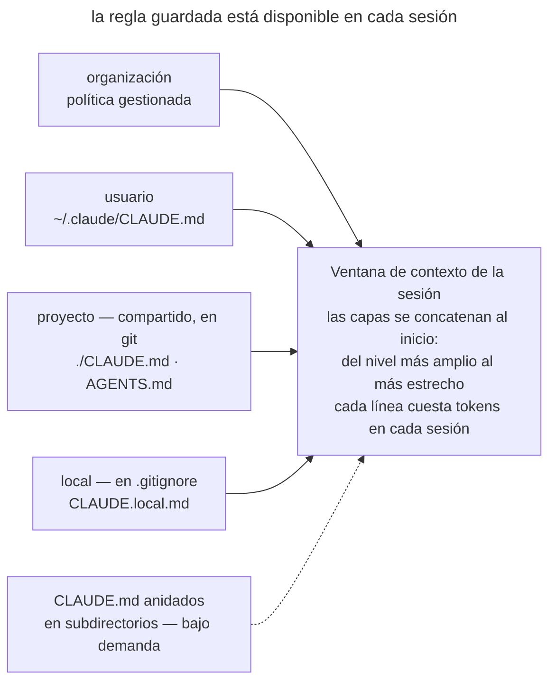

# Memoria del proyecto

## Propósito

Mantener en el repositorio un archivo permanente con los comandos, las convenciones y las restricciones del proyecto, que el agente lee al inicio de cada sesión. Escribes una regla una vez y las sesiones siguientes la obtienen del archivo.

## También conocido como

CLAUDE.md, AGENTS.md, memory file, archivo de memoria, project rules, custom instructions.

## Problema

Una sesión nueva puede no saber cómo el equipo compila el proyecto y ejecuta los tests. Explicas las reglas en la conversación, pero la sesión siguiente necesita las mismas aclaraciones. Esto se nota sobre todo con un comando de verificación no estándar.

Por ejemplo, el agente ejecuta el script de tests habitual, aunque el proyecto exige `make test` con preparación de fixtures. Corriges el comando en el chat. Si la regla se guarda solo en la conversación, un compañero en una sesión nueva se topará con el mismo fallo.

Las reglas del proyecto hacen falta en tareas distintas. Es más cómodo guardarlas aparte de la especificación de una funcionalidad concreta.

## Solución

Crea en el repositorio un archivo que el agente cargue al arrancar. Anota en él los comandos y las convenciones no evidentes que de otro modo habría que explicar en cada sesión. Indica los límites de los módulos si el agente no puede reconstruirlos de forma fiable a partir del código.

Amplía el archivo cuando veas una necesidad recurrente de contexto.

- el agente cometió el mismo error por segunda vez;
- la revisión detectó algo que el agente debía saber sobre esta base de código;
- estás escribiendo una aclaración que ya escribiste en la sesión anterior;
- un compañero nuevo necesitaría el mismo contexto para ser productivo.

Guarda el archivo en el control de versiones. Así el equipo podrá discutir los cambios en la revisión y las sesiones nuevas obtendrán una versión consensuada de las reglas.

El archivo de memoria orienta el comportamiento del agente, pero no garantiza que se cumplan las reglas. Refuerza las prohibiciones críticas, como la de escribir en una rama protegida, con permisos y hooks.

## Estructura

El diagrama muestra los niveles de memoria de Claude Code.


```mermaid
---
title: la regla guardada está disponible en cada sesión
---
flowchart LR
  org["organización<br/>política gestionada"]
  user["usuario<br/>~/.claude/CLAUDE.md"]
  project["proyecto — compartido, en git<br/>./CLAUDE.md · AGENTS.md"]:::accent
  local["local — en .gitignore<br/>CLAUDE.local.md"]
  nested["CLAUDE.md anidados<br/>en subdirectorios — bajo demanda"]:::muted
  window["Ventana de contexto de la sesión<br/>las capas se concatenan al inicio:<br/>del nivel más amplio al más estrecho<br/>cada línea cuesta tokens en cada sesión"]
  org --> window
  user --> window
  project --> window
  local --> window
  nested -.-> window
```

La organización fija una política gestionada, el usuario guarda sus preferencias personales y el equipo registra las reglas del proyecto en git. Un archivo local las complementa con los ajustes del desarrollador para un repositorio concreto. Los archivos anidados aportan instrucciones para directorios concretos cuando el agente trabaja con ellos. El patrón trata del archivo del equipo, que pasa por la revisión junto con el código.

## Participantes / Componentes

- **Archivo de memoria del proyecto** (_./CLAUDE.md_, _./AGENTS.md_) guarda las reglas del equipo en git y pasa por la revisión.
- **Archivo personal del usuario** (_~/.claude/CLAUDE.md_) guarda las preferencias del desarrollador para sus proyectos.
- **Archivo local** (_CLAUDE.local.md_ en _.gitignore_) contiene los ajustes del desarrollador para este proyecto.
- **Desarrollador y equipo** añaden reglas a partir de fallos observados y revisan el archivo con regularidad.
- **Agente** lee las instrucciones y, si se le pide, añade reglas nuevas.

## Cuándo aplicarlo

- El agente trabaja con regularidad en el repositorio.
- Las convenciones del proyecto difieren de los ajustes por defecto de las herramientas.
- Varios desarrolladores y agentes necesitan reglas de trabajo comunes.

## Consecuencias y compromisos

- ➕ Las sesiones nuevas obtienen las reglas guardadas sin explicaciones repetidas.
- ➕ El equipo guarda una versión común de las reglas en git y discute los cambios en la revisión.
- ➕ Para precisar una regla basta un pequeño cambio en Markdown.
- ➖ Cada línea ocupa espacio en el contexto de cada sesión que lee el archivo (véase [ingeniería de contexto](context-engineering.md)).
- ➖ Sin revisión, en el archivo se acumulan duplicados y contradicciones.
- ➖ Las instrucciones de texto no garantizan que se respeten las prohibiciones críticas.

## Implementación

1. Genera un archivo inicial con el comando `/init` en Claude Code. Comprueba los comandos y convenciones que encontró y luego elimina el resumen de la estructura de directorios y de las dependencias. Deja la información que al agente le cuesta obtener del código.
2. Formula las acciones de modo que se puedan comprobar. Por ejemplo, «antes del commit ejecuta `make test`» fija un comando de verificación concreto.
3. Mantén el archivo corto. La referencia de doscientas líneas ayuda a notar el crecimiento, pero cada regla debe seguir resolviendo un problema observado.
4. Lleva las reglas para partes concretas del proyecto a archivos ligados a rutas. En Claude Code para eso sirve _.claude/rules/_ con el campo `paths`.
5. Guarda las reglas del equipo en git, las preferencias personales en el nivel del usuario y los ajustes locales del repositorio en un archivo bajo _.gitignore_.
6. Si explicas una misma regla por segunda vez, pide al agente que la añada al archivo de memoria. Elimina con regularidad las instrucciones obsoletas.

### Memoria común mediante AGENTS.md

La convención [AGENTS.md](https://agents.md/) fija un nombre común para el archivo de instrucciones en las herramientas de agentes, entre ellas Codex, Cursor, Copilot y Gemini CLI. En un monorepo, los archivos anidados permiten precisar las reglas para directorios concretos.

Para un equipo con AGENTS.md, el archivo _CLAUDE.md_ puede apuntar a él mediante `ln -s AGENTS.md CLAUDE.md`. Otra opción usa el import `@AGENTS.md` al principio de _CLAUDE.md_ y permite añadir instrucciones propias para Claude.

### En los toolkits de desarrollo orientado a especificaciones

Los frameworks de SDD también guardan las reglas del proyecto en documentos permanentes que el agente usa en distintas fases del trabajo.

- **GitHub Spec Kit** guarda los principios del proyecto en una constitución, que se crea con `/speckit.constitution` y se coteja con la especificación y el plan.
- **OpenSpec** guarda el contexto común del proyecto en sus documentos de configuración.
- **Kiro** conecta archivos de steering con la descripción del producto, las tecnologías y la estructura del proyecto.
- **Skills de Matt Pocock** llevan los procedimientos a skills, para que en AGENTS.md queden reglas breves del proyecto.

## Ejemplo

A continuación se muestra un fragmento de la memoria de un servicio pequeño con comandos y convenciones difíciles de deducir del código.

```markdown
# Proyecto: billing-service

## Comandos
- Compilación y tests: `make test` (no `npm test` — hacen falta contenedores)
- Ejecución local: `make up`, entorno en :8080

## Convenciones
- Gestor de paquetes — pnpm; el lock file se commitea
- Commits — Conventional Commits, en inglés
- Las migraciones no se editan retroactivamente — solo una migración nueva

## Límites
- Los dominios se comunican solo mediante eventos; los imports directos
  entre `src/domains/*` están prohibidos
- En los tests está prohibido el sleep — solo esperas explícitas
```

El agente recibe la tarea de añadir a facturación una notificación de cobro fallido. En la memoria consta que los dominios interactúan mediante eventos, así que el agente usa un evento para disparar la notificación. No tienes que repetir esta regla en la tarea.

Una semana después, la revisión descubre que el agente ejecutó `npm install` en un proyecto con pnpm. Amplías la memoria.

> Añade a CLAUDE.md la regla de instalar las dependencias solo con pnpm. Indica que package-lock.json no debe aparecer en el repositorio.

La sesión siguiente obtendrá esta regla al leer la memoria del proyecto.

## Antipatrones y errores comunes

- **Memoria hinchada.** Los duplicados y las contradicciones dificultan encontrar las reglas aplicables. Este error se analiza en un capítulo aparte, [«Memoria hinchada»](bloated-claude-md.md).
- **Vertedero de lo deducible.** El resumen de la estructura de directorios y de las dependencias ocupa contexto, aunque el agente puede obtener esa información de los archivos del proyecto.
- **Esperar imposición.** Una prohibición de texto de hacer push a main no bloquea el comando. Refuerza el límite con permisos.
- **Lo personal en el archivo del equipo.** Guarda las URLs de entornos personales y las preferencias del desarrollador en el nivel del usuario o en el local.
- **Escribir y olvidar.** Las instrucciones obsoletas pueden llevar al agente a una decisión equivocada. Revísalas junto con los cambios del proyecto.

## Usos conocidos

- **Claude Code** usa _CLAUDE.md_, la generación con `/init` y reglas modulares en _.claude/rules/_. La auto memory las complementa con notas del agente.
- **AGENTS.md** fija un formato común de instrucciones para varias herramientas de agentes.
- **Reglas de los editores** aplican la misma idea mediante _.cursor/rules_ en Cursor y custom instructions en GitHub Copilot.
- **Toolkits de SDD** guardan los principios comunes en la constitución de GitHub Spec Kit, los archivos de steering de Kiro y los documentos de contexto de OpenSpec.

## Patrones relacionados

- [Ingeniería de contexto](context-engineering.md) ayuda a seleccionar la información para el archivo de memoria permanente.
- [Vocabulario del dominio](domain-context-file.md) complementa las instrucciones de trabajo con definiciones de los términos del proyecto.
- [Desarrollo orientado a especificaciones](spec-driven-development.md) usa las convenciones del proyecto al preparar la especificación y el plan.
- [Memoria hinchada](bloated-claude-md.md) describe un archivo de memoria en el que, sin revisión, se han acumulado duplicados, contradicciones y un resumen del código.
- [Mantenimiento programado](scheduled-maintenance.md) contrasta una vez al mes el archivo de memoria con la práctica y quita lo que sobra.
