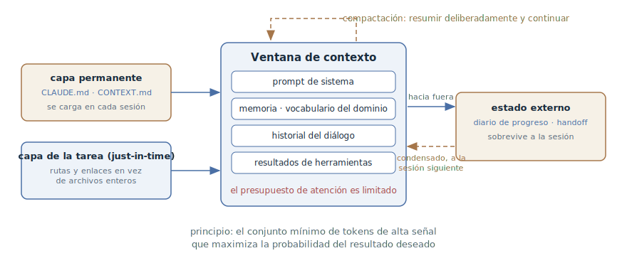

# Ingeniería de contexto

## Propósito

Tratar la ventana de contexto del agente como un recurso finito: seleccionar
deliberadamente el conjunto mínimo de tokens de alta señal en lugar de volcar
en la sesión todo lo que pudiera servir. Este es el capítulo panorámico de la
sección: fija el vocabulario — la ventana, el presupuesto de atención, las
capas del contexto — sobre el que se apoyan los demás patrones de trabajo con
el contexto.

## También conocido como

Context engineering.

## Problema

La intuición dice: cuanto más sepa el agente, mejor trabajará. De ahí la
costumbre de pegar en el prompt archivos enteros, logs de principio a fin e
instrucciones para todos los casos. Pero la ventana de contexto no es un disco
duro — es memoria de trabajo, y se comporta de forma contraintuitiva:

- **Degradación del contexto (context rot).** A medida que crece el número de
  tokens en la ventana, cae la capacidad del modelo para recordar con
  precisión lo que hay en ella. El efecto se reproduce en todos los modelos —
  solo varía el grado.
- **Presupuesto de atención.** Un transformer mantiene relaciones por pares
  entre todos los tokens de la ventana, y fue entrenado sobre todo con
  secuencias cortas. Cuanto más largo el contexto, más fina se reparte la
  atención: cada token innecesario gasta un presupuesto que le faltará a lo
  importante.
- **El contexto se acumula solo.** El agente trabaja en un bucle: cada llamada
  a una herramienta añade resultados a la ventana — listados, diffs, logs. Al
  final de una sesión larga la ventana está llena de ruido ya procesado, y la
  regla dicha al principio ha sido desplazada a los márgenes de la atención.

La ingeniería de prompts no ayuda aquí: optimiza la redacción de una
instrucción, mientras que el problema es *qué conjunto de información* acaba
en la ventana en cada paso siguiente del bucle — y qué permanece en ella.

## Solución

Cambiar la pregunta de «cómo redacto el prompt» a «qué verá el modelo en este
momento y por qué exactamente eso». El principio rector de la disciplina,
tomado del artículo de Anthropic: *el conjunto mínimo de tokens de alta señal
que maximiza la probabilidad del resultado deseado.*

El contexto se compone de capas, y cada una tiene su propia técnica de
gestión:

1. **La capa permanente** — lo que el agente debe saber en cada sesión: las
   reglas del proyecto y el lenguaje del dominio. Vive en archivos del
   repositorio y se carga automáticamente, en lugar de contarse de nuevo en la
   conversación.
2. **La capa de la tarea** — el código y los datos de la tarea concreta. No
   precargar todo: dar al agente rutas y enlaces y dejar que traiga lo
   necesario por sí mismo (just-in-time). Los nombres de archivo, la
   estructura de directorios y las marcas de tiempo son señales por sí solos.
3. **La capa de estado** — lo que se acumula durante el trabajo: decisiones,
   progreso, hipótesis descartadas. Se saca fuera de la ventana — a notas, a
   un diario de progreso, a un documento de traspaso — y se recupera cuando
   hace falta.
4. **Instrucciones y ejemplos** — reglas a la «altura» adecuada: ni lógica
   rígida caso por caso, ni un vago «escribe buen código», sino heurísticas
   fuertes; en lugar de enumerar todos los casos límite, unos pocos ejemplos
   canónicos.

Mínimo no significa corto: si el comportamiento estable exige una página de
reglas, pues es una página. Lo sobrante es lo que no cambia el comportamiento
del agente pero le gasta la atención.

## Estructura

En el centro está la ventana de contexto con su presupuesto de atención. A la
izquierda, lo que *entra* en la ventana: la capa permanente (la memoria del
proyecto y el vocabulario del dominio) se carga en cada sesión, y la capa de
la tarea se trae bajo demanda — por rutas y enlaces, no por precarga. A la
derecha, lo que se *saca* de la ventana: el estado del trabajo largo se
deposita en el diario de progreso y en el documento de traspaso y vuelve a la
sesión nueva ya condensado. El bucle discontinuo de arriba es la compactación:
cuando la ventana se acerca a su límite, su contenido se resume
deliberadamente y el ciclo continúa.

## Participantes / Componentes

- **Desarrollador** — el curador del contexto: decide qué vive en la capa
  permanente, qué se trae bajo demanda, qué se saca de la ventana.
- **Agente** — llena la ventana por sí mismo: lee archivos por ruta, toma
  notas, actualiza el estado externo.
- **Ventana de contexto** — el recurso finito: los tokens compiten por el
  presupuesto de atención del modelo.
- **Archivos permanentes de contexto** — la memoria del proyecto y el
  vocabulario del dominio; se leen en cada sesión.
- **Estado externo** — el diario de progreso y los documentos de traspaso;
  sobreviven a la ventana y a la sesión.

## Cuándo aplicarlo

- Siempre, como disciplina de fondo — la única pregunta es cuánto esfuerzo
  justifica a tu escala de tareas.
- De forma aguda — cuando las sesiones son largas y hacia el final el agente
  «se vuelve tonto» a ojos vista: olvida reglas, repite lo ya recorrido,
  propone lo ya descartado.
- Cuando el trabajo es más grande que una ventana de contexto y el estado hay
  que traspasarlo entre sesiones.
- Cuando las mismas explicaciones — convenciones, términos, comandos — se
  repiten sesión tras sesión.

## Consecuencias y compromisos

- ➕ El agente se mantiene preciso más tiempo: lo importante no se ahoga en
  ruido ya procesado.
- ➕ Más barato y más rápido: menos tokens por llamada al modelo.
- ➕ El conocimiento del proyecto se reutiliza: una sesión nueva, otro agente
  y un colega nuevo parten de la misma capa permanente, no de un recuento.
- ➖ La curaduría es trabajo continuo: las capas de contexto hay que
  alimentarlas y limpiarlas; solas no se mantienen.
- ➖ Una capa permanente desactualizada es peor que su ausencia: el agente
  ejecuta las reglas de ayer con la seguridad de hoy.
- ➖ El exceso de ahorro golpea la calidad: quitar de la ventana algo de lo
  que depende el comportamiento es más fácil de lo que parece — el agente
  rellenará el hueco con suposiciones.

## Implementación

1. Empieza con lo mínimo: un modelo fuerte e instrucciones cortas. Añade
   reglas en respuesta a fallos observados, no por adelantado.
2. Saca las reglas permanentes del proyecto — convenciones, comandos,
   restricciones — a un archivo de memoria y mantenlo corto.
3. El lenguaje del dominio — términos y decisiones arquitectónicas
   aceptadas — a un archivo de dominio aparte: es otro eje distinto de «cómo
   trabajamos».
4. No pegues en el prompt archivos ni logs enteros: da rutas y enlaces — el
   agente leerá lo necesario y la ventana no se llenará de tokens de baja
   señal.
5. Saca el trabajo largo fuera de la ventana: un diario de progreso sobre la
   marcha, un documento de traspaso en la frontera de la sesión.
6. Compacta deliberadamente, no por umbral automático: conserva las
   decisiones, el estado actual y las preguntas abiertas; desecha los
   resultados de herramientas ya procesados.

Cada técnica de esta lista tiene su propio capítulo en esta sección:

- [Memoria del proyecto](claude-md-memory.md) — la capa permanente de «cómo
  trabajamos»: reglas, convenciones y comandos en un archivo que el agente lee
  en cada sesión.
- [Vocabulario del dominio](domain-context-file.md) — la capa permanente de
  «qué significan las palabras»: un glosario y decisiones arquitectónicas como
  lenguaje canónico del proyecto.
- [Diario de progreso](progress-file.md) — un registro del estado durante el
  trabajo largo, con el que un agente con ventana fresca reconstruye el
  panorama.
- [Traspaso de sesión](handoff.md) — empaquetar deliberadamente la sesión en
  un documento en su frontera, en lugar de confiar en el resumen automático.

## Ejemplo

La tarea: averiguar por qué es inestable el test de integración de la pasarela
de pagos.

**El enfoque ingenuo.** El desarrollador pega en el prompt el log de CI
entero — tres mil líneas — más tres archivos de test «para dar contexto», y
enuncia la regla del proyecto sobre la marcha: «aquí están prohibidos los
sleep en los tests». El agente empieza seguro, pero la ventana ya está medio
ocupada por el log. Una docena de intercambios después la regla ha sido
desplazada por el ruido — el agente propone «estabilizar el test» con
`sleep(5)`.

**El enfoque de ingeniería.** La regla sobre los sleep vive en el archivo de
memoria del proyecto — no hace falta enunciarla. En lugar de archivos pegados,
el prompt da coordenadas:

> Averigua por qué es inestable `tests/integration/payment_gateway_test.py`.
> Las ejecuciones fallidas están en el job integration-tests — mira las tres
> últimas.

El agente extrae de los logs solo los fragmentos fallidos, lee el test y el
código adyacente por rutas y encuentra una carrera entre el webhook y el
sondeo de estado. No dio tiempo a arreglarlo en esta sesión — el desarrollador
la cierra con un documento de traspaso:

> Terminamos. Prepara un handoff: qué averiguamos sobre la causa, qué
> hipótesis quedaron descartadas, por dónde empezar la próxima sesión.

La sesión siguiente arranca con dos pantallas de texto condensado — no con
tres mil líneas de log y una reconstrucción de memoria.

## Antipatrones y errores comunes

- **Archivo de memoria hinchado.** La capa permanente se convierte en un
  vertedero de cientos de reglas — y el agente ignora la mitad, porque lo
  importante es indistinguible del ruido. Un error tan frecuente que tiene su
  propio capítulo en la sección de antipatrones.
- **«Lo pego entero, por si acaso».** Archivos y logs enteros en lugar de
  rutas y enlaces: la ventana queda ocupada por tokens de baja señal antes de
  empezar el trabajo.
- **Compactación automática silenciosa.** Confiar el resumen de decisiones
  importantes a un umbral automático — las decisiones se tiran junto con el
  ruido. La compactación es una jugada deliberada del desarrollador, y en la
  frontera de la sesión — un traspaso completo.
- **Ahorrar en lo necesario.** Mínimo no significa corto: quita del contexto
  aquello de lo que depende el comportamiento y el agente rellenará el hueco
  con suposiciones — seguras y erróneas.

## Usos conocidos

- **Claude Code** — la capa permanente en `CLAUDE.md`, compactación
  deliberada con el comando `/compact`, subagentes con ventanas limpias para
  subtareas aisladas.
- **La memory tool de Anthropic** — notas estructuradas del agente en memoria
  externa: la base de conocimiento se acumula entre sesiones sin ocupar la
  ventana.
- **El sistema de investigación multiagente de Anthropic** — los subagentes
  excavan hondo pero devuelven un resumen condensado de 1–2 mil tokens: la
  división del trabajo como forma de proteger la ventana del coordinador.
- **AGENTS.md y las reglas de los editores** — la misma capa permanente en
  otras herramientas: `.cursor/rules` en Cursor, custom instructions en
  GitHub Copilot.
- El término lo consolidó el artículo de Anthropic [Effective context
  engineering for AI
  agents](https://www.anthropic.com/engineering/effective-context-engineering-for-ai-agents) —
  la fuente primaria de los principios de este capítulo.

## Patrones relacionados

- [Memoria del proyecto](claude-md-memory.md),
  [vocabulario del dominio](domain-context-file.md),
  [diario de progreso](progress-file.md) y [traspaso de sesión](handoff.md) —
  las técnicas concretas de la disciplina, un capítulo para cada una.
- [Desarrollo orientado a especificaciones](spec-driven-development.md) — los
  artefactos de SDD también son ingeniería de contexto: una especificación es
  contexto de la tarea curado y de alta señal que sobrevive a la sesión.
- [Cuatro fases](explore-plan-code-commit.md) — la fase de exploración de ese
  ciclo es precisamente el llenado just-in-time de la ventana: el agente reúne
  por sí mismo el contexto de la tarea antes del plan.
