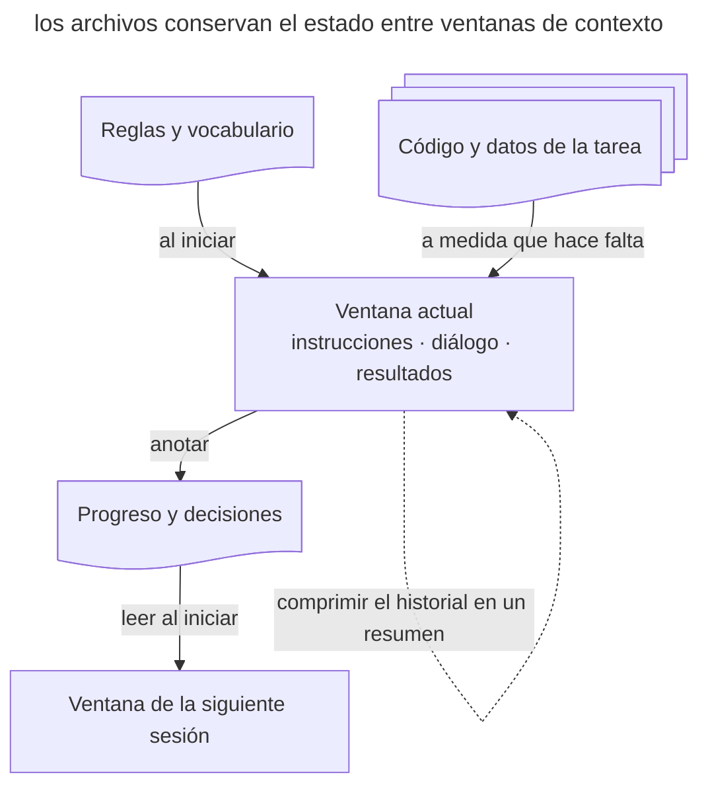

# Ingeniería de contexto

## Propósito

Seleccionar el contexto para la tarea actual y tener en cuenta el tamaño limitado de la ventana del agente. El capítulo explica cómo elegir la información, cargarla a medida que hace falta y conservar el estado del trabajo entre sesiones.

## También conocido como

Context engineering.

## Problema

Un desarrollador puede pegar en el prompt todo el log de CI, con la idea de darle al agente más información. Pero el error que importa ocupa en él unas pocas líneas. El resto de la salida ocupa la ventana y dificulta encontrar la causa del fallo. La gestión del contexto empieza por seleccionar los datos para un paso concreto del trabajo.

**La degradación del contexto (context rot)** se manifiesta cuando el modelo aprovecha peor la información en una ventana larga. La magnitud del efecto depende del modelo y de la tarea, así que la capacidad de la ventana por sí sola no garantiza una respuesta precisa. La ventana tiene un **presupuesto de atención**. El término describe el problema práctico de seleccionar la información que el modelo debe tener en cuenta a la vez. Por ejemplo, la regla para ejecutar los tests puede perderse entre logs ya procesados. El agente amplía el contexto con cada llamada a una herramienta. Si guardas todos los listados y resultados de las comprobaciones, al final de la sesión ocuparán el espacio que necesita la siguiente decisión.

La redacción del prompt resuelve solo una parte del problema. El desarrollador también tiene que decidir qué información verá el agente en cada paso y qué conservará al terminar el paso.

## Solución

Antes de la siguiente acción, averigua qué necesita saber el agente para realizarla. El artículo de Anthropic describe este enfoque como la búsqueda del conjunto mínimo de información significativa que basta para el resultado deseado.

La forma de gestionar el contexto depende de cuánto vive la información.

1. **La capa permanente** contiene las reglas del proyecto y el lenguaje del dominio. Guárdalas en archivos del repositorio y cárgalas en las sesiones nuevas.
2. **La capa de la tarea** contiene el código y los datos necesarios. Dale al agente rutas y enlaces para que los lea a medida que hagan falta (just-in-time).
3. **La capa de estado** conserva las decisiones tomadas, el progreso y las hipótesis ya comprobadas. Anótalas en un diario y en un documento de traspaso para que la siguiente sesión pueda continuar el trabajo.
4. **Las instrucciones y los ejemplos** ayudan a elegir acciones. Formula reglas comprobables y muestra ejemplos de cómo se aplican a casos típicos.

Recortar ayuda mientras el agente conserve la información de la que depende la decisión. Si el comportamiento estable exige una página de reglas, déjala. Elimina el texto que ocupa el contexto y no ayuda a cumplir la tarea.

## Estructura

La ventana de contexto recibe información de varias fuentes. Para continuar el trabajo, las decisiones se guardan aparte del historial de la conversación.

```mermaid
---
title: los archivos conservan el estado entre ventanas de contexto
config:
  flowchart:
    rankSpacing: 30
---
flowchart TB
  rules@{ shape: doc, label: "Reglas y vocabulario" }
  files@{ shape: docs, label: "Código y datos de la tarea" }
  current["Ventana actual<br/>instrucciones · diálogo · resultados"]:::accent
  saved@{ shape: doc, label: "Progreso y decisiones" }
  next["Ventana de la siguiente sesión"]:::accent
  rules -- "al iniciar" --> current
  files -- "a medida que hace falta" --> current
  current -- "anotar" --> saved
  saved -- "leer al iniciar" --> next
  current -. "comprimir el historial en un resumen" .-> current
```

Las instrucciones permanentes se cargan también en la siguiente sesión; el código de la tarea lo lee a medida que hace falta. El diario de progreso y el handoff conservan las decisiones fuera de la ventana. El bucle discontinuo muestra la compresión del historial dentro de la sesión actual: los resultados de herramientas ya procesados ceden su lugar a un resumen breve.

## Participantes / Componentes

- **Desarrollador** decide qué información hace falta siempre y cuál se puede leer bajo demanda.
- **Agente** lee archivos, toma notas y actualiza el estado del trabajo.
- **Ventana de contexto** alberga el volumen limitado de información disponible para el modelo en el paso actual.
- **Archivos permanentes de contexto** guardan las reglas del proyecto y el vocabulario del dominio.
- **Estado externo** en el diario y en los documentos de traspaso permite continuar el trabajo después de terminar la sesión.

## Cuándo aplicarlo

- El coste de leer el contexto es notable en relación con el tamaño de la tarea.
- Al final de una sesión larga el agente olvida reglas o repite propuestas ya descartadas.
- Cuando el trabajo es más grande que una ventana de contexto y el estado hay que traspasarlo entre sesiones.
- El desarrollador repite comandos y convenciones en cada sesión.

## Consecuencias y compromisos

- ➕ Al agente le resulta más fácil encontrar la información necesaria para la decisión actual.
- ➕ Un contexto más pequeño reduce el coste de las llamadas al modelo.
- ➕ Una sesión nueva y un colega nuevo reciben la misma versión del conocimiento del proyecto.
- ➖ El desarrollador tiene que ampliar y revisar con regularidad los archivos de contexto.
- ➖ Las instrucciones desactualizadas pueden llevar al agente a una decisión equivocada.
- ➖ Si recortas demasiado, el agente suplirá la información que falta con suposiciones.

## Implementación

1. Empieza con instrucciones breves y añade reglas a partir de los fallos observados.
2. Saca los comandos y las convenciones permanentes del proyecto a un archivo de memoria.
3. Anota los términos del dominio y las razones de las decisiones arquitectónicas en documentos aparte.
4. Da rutas a archivos y logs. El agente podrá leer el fragmento necesario antes de decidir.
5. Durante un trabajo largo, actualiza el diario de progreso, y antes de cambiar de sesión prepara un documento de traspaso.
6. Al compactar el contexto, conserva las decisiones, el estado actual y las preguntas abiertas. Elimina los resultados de herramientas que ya no influyen en el trabajo.

Los siguientes capítulos analizan estas técnicas en detalle.

- [Memoria del proyecto](claude-md-memory.md) guarda los comandos y las convenciones permanentes.
- [Vocabulario del dominio](domain-context-file.md) fija los términos del proyecto y conserva las razones de las decisiones arquitectónicas.
- [Diario de progreso](progress-file.md) ayuda a reconstruir el estado de un trabajo largo.
- [Traspaso de sesión](handoff.md) guarda el contexto en un documento antes de pasar a una ventana nueva.

## Ejemplo

El desarrollador necesita averiguar por qué el test de integración de la pasarela de pagos falla a veces.

**El enfoque ingenuo.** El desarrollador pega tres mil líneas de log de CI y tres archivos de test. Sobre la marcha añade la regla «aquí están prohibidos los sleep en los tests». Tras unos cuantos intercambios el agente propone `sleep(5)`, aunque ese retardo solo oculta la inestabilidad. En un contexto lleno de log, la regla no influyó en la elección de la solución.

**El enfoque de ingeniería.** La regla sobre los sleep está en la memoria del proyecto. En la petición, el desarrollador indica dónde están el test y las ejecuciones fallidas.

> Averigua por qué es inestable _tests/integration/payment_gateway_test.py_. Mira las tres últimas ejecuciones fallidas en el job integration-tests.

El agente lee los fragmentos fallidos de los logs, el test y el código relacionado. Encuentra una carrera entre el webhook y el sondeo de estado, pero la sesión tiene que terminar antes de la corrección. El desarrollador le pide que guarde el resultado de la investigación.

> Prepara un handoff con la causa del fallo, las hipótesis comprobadas y la primera acción para la siguiente sesión.

La siguiente sesión recibe un resumen breve y las rutas a las pruebas. El agente puede empezar por corregir la carrera encontrada.

## Antipatrones y errores comunes

- **Archivo de memoria hinchado.** Entre cientos de reglas al agente le cuesta más distinguir las instrucciones aplicables. Este error se analiza en el capítulo [«Memoria hinchada»](bloated-claude-md.md).
- **«Lo pego entero, por si acaso».** Los logs completos ocupan la ventana antes de que empiece la investigación. Pasa rutas y precisa qué fragmento hace falta.
- **Compactación automática silenciosa.** En la compactación automática pueden perderse decisiones. Revisa el resumen y prepara un handoff antes de cambiar de sesión.
- **Corregir sobre un intento fallido.** Una réplica del tipo «no ha funcionado, prueba de otra forma» deja en la ventana el enfoque fallido y la discusión sobre él. Rebobina la conversación hasta el punto anterior al intento y repite la petición teniendo en cuenta lo que se ha averiguado.
- **Ahorrar en lo necesario.** Si eliminas la información de la que depende la decisión, el agente empezará a hacer suposiciones.

## Usos conocidos

- **Claude Code** admite instrucciones permanentes en _CLAUDE.md_, compactación con `/compact` y contextos separados para los subagentes.
- **El equipo de Claude Code** [aconseja](https://claude.com/blog/using-claude-code-session-management-and-1m-context) rebobinar la conversación con `/rewind` en lugar de corregir un intento fallido. En la ventana quedan los archivos ya leídos y una única petición precisada. Antes de rebobinar puedes pedirle al agente que anote brevemente lo que ha averiguado.
- **Codex** compacta una conversación larga con el comando `/compact` y la bifurca con el comando `/fork` cuando el trabajo realmente se divide en variantes.
- **La memory tool de Anthropic** permite al agente guardar notas estructuradas fuera de la ventana actual.
- **El sistema de investigación multiagente de Anthropic** usa subagentes para líneas de investigación separadas. El coordinador recibe resúmenes breves de sus resultados.
- **AGENTS.md y las reglas de los editores** guardan instrucciones permanentes en los formatos de distintas herramientas.
- El artículo de Anthropic [Effective context engineering for AI agents](https://www.anthropic.com/engineering/effective-context-engineering-for-ai-agents) es la fuente de los principios de este capítulo.

## Patrones relacionados

- [Memoria del proyecto](claude-md-memory.md), [vocabulario del dominio](domain-context-file.md), [diario de progreso](progress-file.md) y [traspaso de sesión](handoff.md) implementan formas concretas de gestionar el contexto.
- [Desarrollo orientado a especificaciones](spec-driven-development.md) conserva el contexto seleccionado de la tarea en la especificación y el plan.
- [Cuatro fases](explore-plan-code-commit.md) dedica a la exploración una etapa aparte, en la que el agente reúne el contexto antes de planificar.
- [Memoria hinchada](bloated-claude-md.md) describe una capa permanente de contexto sobrecargada de duplicados y reglas desactualizadas.
