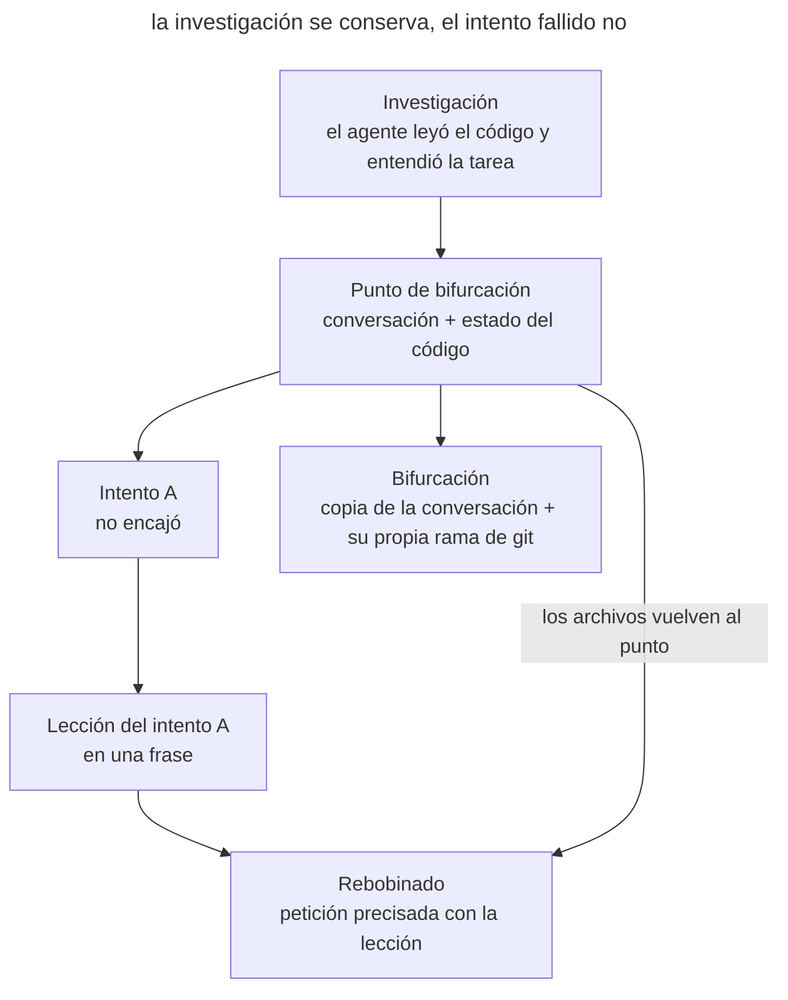

# Bifurcación del contexto

## Propósito

Volver al punto de la conversación en el que el agente ya ha reunido el contexto necesario y continuar desde ahí otra línea de trabajo. El intento fallido no se queda en la ventana y la investigación no hay que repetirla en una sesión nueva. El código debe corresponder a la rama de la conversación elegida.

## También conocido como

Context forking; rebobinado de la conversación (`/rewind`, `Esc Esc`) y `/branch` en Claude Code; `/fork` en Codex.

## Problema

El agente ha leído la cola de tareas, el cliente de correo y la configuración, y después ha implementado una primera solución. No encaja. La reacción natural es escribir «así no, prueba de otra forma». Entonces en la ventana quedan los archivos leídos, el enfoque fallido, tu objeción y el segundo enfoque. El intento fallido sigue influyendo en las respuestas, y el espacio de la ventana se gasta en lo que ya no hace falta.

Una sesión nueva te libra del fracaso, pero pierde la investigación. El agente tendrá que volver a leer los mismos archivos, o tú tendrás que preparar un [documento de traspaso](handoff.md) para un trabajo que no ha terminado.

Algo parecido ocurre cuando hay que comparar dos enfoques. Si los pruebas uno tras otro en la misma conversación, la segunda variante se construye pensando en la primera. Y si un comando ha sacado un log enorme, el contexto valioso anterior queda enterrado bajo la salida.

La dificultad es que el trabajo tiene dos estados: la conversación y los archivos. Rebobinar la conversación no devuelve por sí solo el código, y una copia de la conversación trabaja en el mismo directorio que el original.

## Solución

Trata el historial de la conversación como un árbol. El punto de bifurcación es el momento en que la investigación ha terminado y la solución aún no ha empezado. Desde él hay dos movimientos posibles.

- **Rebobinado.** Vuelve al punto de bifurcación y repite la petición teniendo en cuenta lo que se ha averiguado. La rama fallida se descarta; en la ventana quedan la investigación y una única petición precisada.
- **Bifurcación.** Copia la conversación y sigue trabajando en la copia, dejando el original intacto. Así puedes probar una variante arriesgada o comparar enfoques desde la misma comprensión de partida.

Con cada movimiento, pon el código en correspondencia con la rama de la conversación. Después de rebobinar, devuelve los archivos al estado del punto de bifurcación. Para una bifurcación, crea una rama de git aparte y, si las ramas trabajan a la vez, un worktree aparte.

Traslada la lección de la rama fallida de forma explícita: con una frase en la nueva petición o con un resumen breve que el agente escribe antes de rebobinar.

## Estructura

El diagrama muestra un punto de bifurcación y dos caminos que salen de él. Fíjate en que, al rebobinar, los archivos vuelven junto con la conversación.

El intento A se descarta junto con sus cambios, pero su lección pasa a la nueva petición. La bifurcación parte del mismo punto y recibe su propio estado del código, así que las variantes no se mezclan.

## Participantes / Componentes

- **Punto de bifurcación** fija la conversación después de la investigación y el estado del código que le corresponde.
- **Rama de la conversación** continúa el trabajo desde el punto de bifurcación: sustituye el intento fallido o avanza en paralelo al original.
- **Estado del código** se vincula a la rama mediante los checkpoints de la herramienta, una rama de git o un worktree.
- **Lección de la rama fallida** traslada lo aprendido a la nueva petición sin el intento en sí.
- **Desarrollador** elige el punto de bifurcación, decide si rebobinar o bifurcar y compara los resultados de las ramas.

## Cuándo aplicarlo

- El agente tomó un camino equivocado después de una investigación valiosa.
- Hay que comparar dos enfoques partiendo de la misma comprensión del código.
- Una operación llenó la ventana de salida y el contexto anterior todavía hace falta.

Si empieza una tarea nueva, abre una sesión nueva. Si el trabajo pasa a otra sesión, prepara un [documento de traspaso](handoff.md).

## Consecuencias y compromisos

- ➕ El intento fallido no ocupa la ventana ni influye en las respuestas siguientes.
- ➕ La investigación se reutiliza sin volver a contarla.
- ➕ Las variantes se comparan desde la misma comprensión de partida de la tarea.
- ➖ Es fácil desincronizar la conversación y el código: si solo rebobinas la conversación, los cambios se quedan en los archivos y el agente ya no sabe de ellos.
- ➖ Los checkpoints de la herramienta no registran todos los cambios. Los comandos de shell, los efectos externos y los cambios de los subagentes en segundo plano hay que revertirlos con git o a mano.
- ➖ Las ramas en el mismo directorio de trabajo ven los cambios de las demás.
- ➖ La lección de una rama descartada se pierde si no la trasladas de forma explícita.
- ➖ Solo puedes rebobinar hasta el límite de uno de tus mensajes, no hasta la mitad de una cadena de llamadas a herramientas.

## Implementación

1. Cuando la investigación haya terminado, marca el punto de bifurcación: haz commit o guarda en stash el estado actual del código. Esto también te da un punto de apoyo para los cambios que los checkpoints no registran.
2. Si un intento no encajó, decide qué necesitas: sustituirlo, o conservarlo y probar otra variante al lado.
3. Antes de rebobinar, pídele al agente que anote brevemente lo que ha averiguado. En Claude Code, el menú `/rewind` tiene para ello la opción «Summarize from here».
4. Rebobina la conversación junto con el código. Después comprueba `git status`: la herramienta no revertirá los cambios hechos por comandos de shell y migraciones.
5. Repite la petición y añade la lección del intento fallido.
6. Para comparar enfoques, crea una rama de la conversación por cada variante y una rama de git aparte para su código. Si las variantes trabajan a la vez, dale a cada una su propio worktree (consulta [Trabajo paralelo aislado](isolated-parallel-work.md)).
7. Compara las variantes con las mismas comprobaciones. Cierra las ramas sobrantes y traslada la decisión y sus motivos a documentos permanentes.

## Ejemplo

Un servicio de notificaciones necesita reenviar correos ante errores temporales de SMTP. El agente ha estudiado la cola de tareas, el cliente de correo y la configuración de los workers. Has hecho commit de un estado limpio y le has pedido que implemente los reintentos.

El agente añadió un bucle de reintentos con `sleep` dentro del cliente de correo. Los tests pasan, pero cuando el servidor no está disponible, cada worker espera hasta un minuto y deja de coger otras tareas. Recuerdas que la cola ya sabe aplazar tareas.

En lugar de objetar en la misma ventana, abres `/rewind`, eliges tu mensaje en el que pedías implementar los reintentos y restauras el código y la conversación. `git status` muestra un árbol limpio: el agente cambió los archivos con sus herramientas de edición y el checkpoint los revirtió. La petición original vuelve al campo de entrada y la amplías.

> Añade el reenvío de correos ante errores temporales de SMTP. Los reintentos dentro del cliente de correo no sirven: bloquean el worker. La cola ya admite tareas aplazadas mediante `enqueue(..., delay=...)`. Úsala, aumenta el retraso de forma exponencial y, tras el quinto intento, marca el correo como no enviado.

En la ventana quedaron los archivos leídos y una única petición precisada. El agente programa el reintento como tarea aplazada y añade un test para el quinto intento. La discusión sobre el bucle bloqueante no llegó al contexto.

## Antipatrones y errores comunes

- **Rebobinar la conversación sin el código.** El agente continúa desde un punto en el que aún no había cambios, pero los archivos ya han cambiado. La siguiente solución se construye sobre cambios que no ve.
- **Confiar por completo en los checkpoints.** Los archivos borrados por un comando, las migraciones aplicadas y las peticiones enviadas no se revierten con la conversación. Mantén un commit en el punto de bifurcación.
- **Dos ramas en un mismo directorio.** Las ramas paralelas de la conversación sobrescriben los cambios de la otra. Dale a cada una su propia rama de git o su worktree.
- **Rebobinar sin la lección.** Si no trasladas la lección, el agente puede repetir el mismo error.
- **Bifurcar demasiado tarde.** Un punto de bifurcación posterior al intento fallido ya contiene el fracaso. Elige un momento anterior al primer intento.

## Usos conocidos

- **Claude Code** abre el menú de rebobinado con `/rewind` o con un doble `Esc`. Puedes restaurar el código y la conversación, solo la conversación o solo el código, y también comprimir parte de la conversación en un resumen. `/branch` y `claude --continue --fork-session` copian la conversación y conservan el original. La [documentación](https://code.claude.com/docs/en/checkpointing) advierte de que los checkpoints no registran los comandos de shell ni los cambios externos y no sustituyen a git.
- **El equipo de Claude Code** [aconseja](https://claude.com/blog/using-claude-code-session-management-and-1m-context) rebobinar la conversación en lugar de corregir un intento fallido y propone anotar la lección con «Summarize from here» antes de rebobinar.
- **Codex** permite, con un doble `Esc`, [editar un mensaje anterior](https://learn.chatgpt.com/docs/developer-commands?surface=cli) y bifurcar la conversación desde ese punto. El comando `/fork` copia la conversación actual, `/side` abre una bifurcación temporal para una pregunta lateral y `/worktree` continúa la conversación en un worktree nuevo.
- **HumanLayer** [describe](https://www.humanlayer.dev/blog/context-forking-to-save-time-trouble-and-tokens) tres motivos para bifurcar: corregir el rumbo, comparar variantes de diseño y rescatar contexto valioso tras una salida de herramienta demasiado grande.

## Patrones relacionados

- [Ingeniería de contexto](context-engineering.md) explica por qué un intento fallido en la ventana estorba a las respuestas siguientes.
- [Traspaso de sesión](handoff.md) lleva el contexto a una sesión nueva mediante un documento, cuando la bifurcación dentro de la conversación ya no sirve.
- [Trabajo paralelo aislado](isolated-parallel-work.md) da a las ramas paralelas worktrees separados.
- [Diseña dos veces](design-it-twice.md) compara variantes de diseño; la bifurcación permite construirlas a partir de la misma investigación.
- [Prototipo desechable](prototype-to-answer.md) comprueba una pregunta con un experimento que conviene llevar en una rama aparte.
