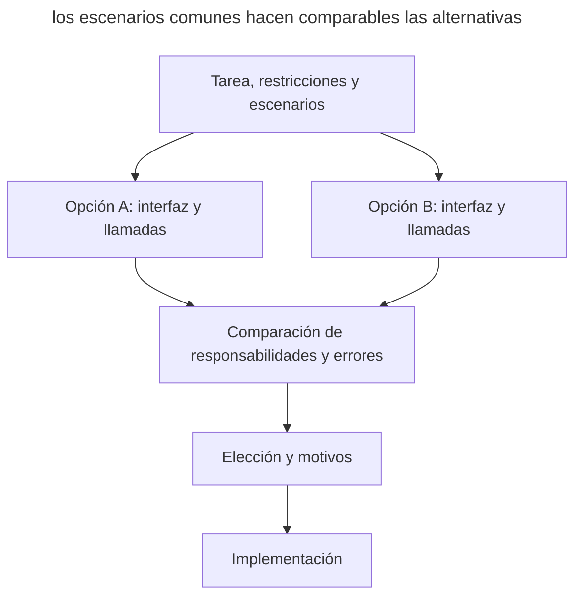

# Diseña dos veces

## Propósito

Comparar varias soluciones sustancialmente distintas antes de la implementación. Tú fijas unos requisitos comunes, el agente prepara alternativas y muestra cómo se usan, y después eliges el enfoque según sus consecuencias concretas para el proyecto.

## También conocido como

Design It Twice, el principio «diseña dos veces» de John Ousterhout.

## Problema

El agente propone un plan verosímil y le pides enseguida que lo implemente. La discusión posterior afina el diseño elegido: qué métodos añadir, dónde tratar un error, qué tests escribir. Mientras tanto, el reparto de responsabilidades entre módulos en sí nunca se compara con alternativas.

Por ejemplo, el agente divide una importación de CSV en leer, validar y guardar filas. El código que llama enlaza estos pasos y decide qué hacer con los errores. Esta opción puede servirle al proyecto, pero sin una alternativa es difícil ver su coste: cada nuevo consumidor conocerá el orden de los pasos y las reglas del guardado parcial.

Cuando la implementación ya está escrita, cambiar el diseño exige rehacer el código y los tests. Comparar bocetos pequeños permite tomar esa decisión antes.

## Solución

Pide al agente que diseñe al menos dos opciones para la misma tarea. Dales a ambas los mismos requisitos, restricciones y escenarios. La diferencia debe afectar a cómo está construida la solución: quién dirige el proceso, dónde vive el estado, qué sabe el código que llama.

Cada opción necesita una interfaz pequeña, un ejemplo de llamada y una descripción del comportamiento ante errores. Con ellos se ve qué conocimiento se queda en el consumidor y qué cambios afectarán a varios sitios. Las valoraciones generales como «flexible» o «sencillo» no bastan para elegir.

Compara las opciones en el escenario habitual y en uno o dos casos difíciles. Pide al agente que recomiende una solución y que nombre las condiciones en las que es preferible la alternativa. Deja registrada la elección y sus motivos antes de la implementación. Si la pregunta clave requiere observaciones, dedícale un [prototipo desechable](prototype-to-answer.md).

## Estructura

Los requisitos comunes se bifurcan en dos bocetos, que después se comparan con los mismos escenarios.



Las opciones pueden surgir una tras otra en la misma sesión. Lo que importa es la diferencia de diseño y una base común para la comparación; el número de agentes por sí solo no la garantiza.

## Participantes / Componentes

- **Desarrollador** fija las restricciones y toma la decisión teniendo en cuenta las necesidades del proyecto.
- **Agente** propone alternativas, muestra las llamadas y analiza los compromisos.
- **Escenarios comunes** permiten comparar el comportamiento de las soluciones en las mismas condiciones.
- **Bocetos** describen las interfaces, las responsabilidades y los errores antes de la implementación completa.
- **Registro de la decisión** conserva la elección, los motivos y las condiciones para revisarla.

## Cuándo aplicarlo

- Se diseña una API que usarán varios módulos.
- En una refactorización hay que decidir adónde trasladar una responsabilidad o un estado.
- La primera propuesta parece convincente, pero aún no hay con qué comparar sus ventajas.
- Cambiar más tarde el diseño elegido afectará a mucho código que llama.

Para una corrección local con una solución inequívoca, la comparación puede costar más que el propio trabajo. Limítala a una decisión concreta que influya en el desarrollo posterior.

## Consecuencias y compromisos

- ➕ El código de uso ayuda a ver la complejidad que la interfaz traslada al consumidor.
- ➕ La elección se apoya en los escenarios y las restricciones del proyecto.
- ➕ La opción descartada deja motivos útiles para una revisión futura.
- ➖ Preparar y leer alternativas lleva tiempo.
- ➖ El agente puede proponer diferencias superficiales o hacer una opción deliberadamente más débil.
- ➖ Un boceto no confirma el rendimiento ni la corrección de la implementación futura.

## Implementación

1. Elige una decisión para comparar: por ejemplo, el límite del módulo de importación.
2. Encarga al agente leer el código existente y nombrar las restricciones con referencias a lugares del proyecto.
3. Nombra el escenario habitual y uno o dos casos difíciles con los que compararás las variantes.
4. Pide dos repartos de responsabilidades distintos. Limita el resultado a interfaces, código de llamada y descripción de errores.
5. Comprueba que cada opción cumple todos los requisitos obligatorios. Si una omitió un requisito, devuélvela para que se complete.
6. Contrasta las opciones por el código de uso y por los sitios que habrá que cambiar. Analiza la recomendación del agente.
7. Anota la decisión en la tarea o en un ADR y pasa el contrato elegido a la implementación.

Si un agente reproduce la primera opción con otros nombres, dale al segundo enfoque una dirección explícita: por ejemplo, traslada el control del proceso del código que llama al interior del módulo. Puedes encargar los bocetos a agentes separados, dando a cada uno el mismo contexto de partida y su propia dirección de búsqueda. Todos los requisitos obligatorios se mantienen. Para comparar interfaces no suelen hacer falta ramas separadas con implementaciones completas.

## Ejemplo

Hay que importar usuarios desde un CSV. La importación la lanzan un manejador HTTP y un comando CLI. El archivo está limitado a 10 000 filas. Las filas correctas se guardan, y para las incorrectas se devuelven el número de fila y el motivo. Si el almacenamiento no está disponible, la importación se detiene; las filas ya guardadas se quedan, y el informe contiene su número. Relanzar la importación y eliminar duplicados requieren una decisión aparte y no forman parte de este ejemplo.

Le das al agente el marco de la comparación:

> Diseña dos veces la API de importación de usuarios desde CSV: en una variante los pasos los dirige el código que llama, en la otra, el módulo de importación. Compáralas para el manejador HTTP y la CLI

A continuación, bocetos de ejemplo en JavaScript. Los nombres de las funciones representan el contrato propuesto; el código muestra el reparto de responsabilidades y no es una implementación terminada de la importación. En ambas opciones, un error de sintaxis del CSV detiene la importación con el código `invalid_csv`; un error en el contenido de una fila concreta va al informe y no impide procesar las demás filas.

**Opción A: el consumidor dirige los pasos.** `readCsv` produce filas numeradas, `validateUser` devuelve un usuario o una lista de errores, `users.save` guarda un usuario. Si el almacenamiento no está disponible, `save` lanza `StorageUnavailable`.

```js
const report = { saved: 0, rejected: [], stopped: null };

try {
  for await (const { line, fields } of readCsv(source)) {
    const result = validateUser(fields);
    if (!result.ok) {
      report.rejected.push({ line, errors: result.errors });
      continue;
    }

    await users.save(result.user);
    report.saved += 1;
  }
} catch (error) {
  if (error instanceof StorageUnavailable) {
    report.stopped = "storage_unavailable";
  } else if (error instanceof InvalidCsv) {
    report.stopped = "invalid_csv";
  } else {
    throw error;
  }
}
```

El código que llama controla cada paso. También sabe cuándo seguir procesando, cuándo detenerse y cómo contar las filas guardadas. El manejador HTTP y la CLI necesitarán estas reglas. Si trasladas todo el proceso mostrado a una operación común, el límite de responsabilidades se acerca a la segunda opción.

**Opción B: el módulo dirige la importación.** Al crearse, el módulo recibe el almacenamiento. El método `run` lee el CSV, valida y guarda las filas y construye el mismo informe. Los motivos de detención esperados se devuelven en `stopped`; los errores inesperados se lanzan hacia fuera.

```js
// Al montar la aplicación:
const userImport = createUserImport({ users });

// En el manejador HTTP o en la CLI:
const report = await userImport.run(source);
```

En ambas opciones, dos usuarios correctos y una fila incorrecta dan el mismo resultado:

```json
{
  "saved": 2,
  "rejected": [{ "line": 3, "errors": ["Email no válido"] }],
  "stopped": null
}
```

Si la primera fila se guarda y al guardar la segunda el almacenamiento deja de estar disponible, el informe esperado es `saved: 1`, `rejected: []`, `stopped: "storage_unavailable"`. Estos ejemplos fijan el contrato para ambas opciones; durante la implementación hay que comprobarlos con tests.

| Escenario o cambio | Opción A | Opción B |
|---|---|---|
| Fila incorrecta | El consumidor añade el error al informe y continúa el bucle | El módulo devuelve el error de la fila en el informe terminado |
| Almacenamiento no disponible | El consumidor detiene el bucle y conserva el contador | El módulo detiene la importación y devuelve el contador |
| Añadir un segundo consumidor | Hay que repetir o extraer las reglas de procesamiento | El nuevo consumidor llama a `run` |
| Una acción especial antes de guardar una fila | El consumidor la añade a su bucle | Hay que cambiar el módulo o ampliar su contrato |

Para la tarea planteada elegimos B: HTTP y CLI usan las mismas reglas de importación, así que conviene tenerlas en un solo sitio. La opción A tiene sentido si los consumidores necesitan secuencias de procesamiento distintas. Un registro breve de la decisión conserva esta condición:

> Elegimos un módulo con la operación run: se encarga del procesamiento de filas y de construir el informe para HTTP y CLI. Las filas correctas se guardan de forma independiente; un fallo esperado detiene la importación con un informe del resultado parcial. Revisaremos el límite si los consumidores necesitan procesos de tratamiento distintos.

## Antipatrones y errores comunes

- **Dos nombres para una misma solución.** Se renombran clases y funciones, pero la responsabilidad sigue igual. Pide que muestre qué conocimiento sobre el proceso se ha trasladado a otro módulo.
- **Condiciones desiguales.** Una opción resuelve solo el escenario de éxito y la otra trata los errores. Primero lleva ambas hasta los requisitos comunes.
- **Comparar por el número de métodos.** Un solo método puede ocultar decenas de ajustes obligatorios y un orden de preparación complicado. Examina todo el código de uso.
- **Implementación completa de cada opción.** El volumen de trabajo crece antes de formular la pregunta que requiere ejecutar algo. Empieza por los bocetos y separa los experimentos.
- **Enumeración sin fin.** Aparecen opciones nuevas sin un criterio nuevo de elección. Termina la comparación cuando los requisitos estén cubiertos y los compromisos importantes se entiendan.
- **Aceptar la recomendación automáticamente.** El agente puede valorar mal las necesidades futuras del proyecto. Comprueba las suposiciones en las que se apoya la elección.

## Usos conocidos

- **John Ousterhout** trata Design It Twice en el libro [A Philosophy of Software Design](https://web.stanford.edu/~ouster/cgi-bin/aposd.php); el principio también figura en los [materiales de su curso CS 190](https://web.stanford.edu/~ouster/cs190-winter24/lectures/aposd/). Aquí está adaptado al trabajo de un desarrollador con un agente.
- **Los skills de Matt Pocock** incluyen [Design It Twice dentro de codebase-design](https://github.com/mattpocock/skills/blob/main/skills/engineering/codebase-design/DESIGN-IT-TWICE.md): varios agentes diseñan interfaces distintas, muestran cómo se usan y comparan qué complejidad oculta el módulo y dónde se concentrarán los cambios. Es una forma de organizar el trabajo; el proceso descrito en este capítulo también se puede hacer en una sola sesión.

## Patrones relacionados

- [Grilling](grilling.md) comprueba las suposiciones de un plan terminado; comparar alternativas ayuda a elegir el propio diseño.
- [Prototipo desechable](prototype-to-answer.md) aporta observaciones para las preguntas que quedan tras comparar los bocetos.
- [Cuatro fases](explore-plan-code-commit.md) reservan un sitio para la comparación antes de la implementación, en la fase de planificación.
- [Vocabulario del dominio](domain-context-file.md) ayuda a usar términos comunes en las opciones y a conservar la decisión en un ADR.
