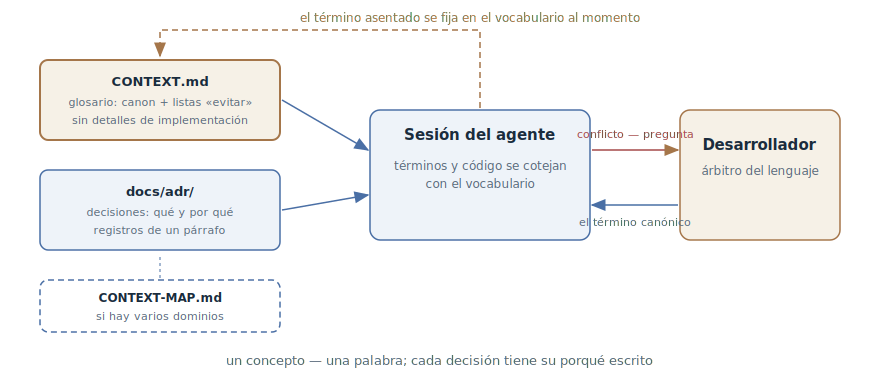

# Vocabulario del dominio

## Propósito

Fijar el lenguaje canónico del proyecto en el repositorio: un glosario de
términos del dominio y un registro de decisiones arquitectónicas que el agente
lee en cada sesión. Un concepto — una palabra, y cada decisión no evidente
tiene su porqué escrito: cura la deriva de términos, los renombrados en
círculo y los intentos de «arreglar» lo deliberado.

## También conocido como

CONTEXT.md, glosario del dominio; el lenguaje ubicuo (ubiquitous language) de
DDD llevado a un archivo; ADR — architecture decision records.

## Problema

Un proyecto vivo tiene un lenguaje propio, y no está escrito en ninguna parte:

- Un concepto lleva tres nombres. «Cuenta» en la conversación, `Customer` en
  el código, `client` en la tabla nueva. El agente, sin conocer el canon, usa
  legítimamente cualquiera — y cada sesión añade sinónimos.
- El agente propone renombrados. Para él `Enrollment` parece un nombre raro
  para una suscripción — y lo «mejora» a `Subscription`, rompiendo el lenguaje
  con el que el equipo habla con el negocio.
- Las decisiones pierden su porqué. Medio año después nadie — ni humano ni
  agente — recuerda que la comunicación de los servicios mediante eventos en
  vez de llamadas directas fue una elección consciente. El agente ve
  «complejidad innecesaria» y propone REST — y hay que rebatirlo de nuevo en
  cada sesión.

La [memoria del proyecto](claude-md-memory.md) no cierra este agujero:
responde a «cómo trabajamos» — comandos, convenciones, límites. «Qué
significan las palabras» es otro eje, y volcar el glosario en el archivo
general de reglas significa hincharlo.

## Solución

Dos artefactos en el repositorio que el agente recibe en cada sesión.

**El glosario** — `CONTEXT.md`: la lista de términos del dominio. El formato
es estricto y deliberadamente pobre:

- Una palabra canónica por concepto; los demás sinónimos se listan bajo la
  marca «evitar».
- Definición de una o dos frases: qué *es* la cosa, no qué hace.
- Solo términos de este dominio. Los conceptos generales de programación —
  timeouts, reintentos, patrones — no viven en el vocabulario, aunque el
  proyecto esté lleno de ellos.
- Nada de detalles de implementación: el vocabulario no es una especificación
  ni un borrador.

**El registro de decisiones** — `docs/adr/`: notas breves de «qué decidimos y
por qué», un archivo por decisión. Un ADR se crea solo cuando se cumplen las
tres condiciones: la decisión es difícil de revertir, sorprendería a un lector
sin contexto, y es el resultado de una elección real entre alternativas. Basta
un párrafo — el valor está en que la decisión y su motivo quedan *escritos*,
no en secciones rellenadas.

A partir de ahí el vocabulario trabaja en ambos sentidos. El agente coteja con
él su propio discurso y el código — y deja de criar sinónimos. Y cuando el
desarrollador usa una palabra que choca con el glosario, el agente está
obligado a discutir: «el glosario define cancellation como anular el pedido
completo, pero parece que hablas de una parcial — ¿cuál de las dos?» El
término nuevo se anota en el vocabulario en el momento en que se asienta — sin
dejarlo para luego.

## Estructura



A la izquierda, los artefactos: el glosario con sus términos canónicos y el
registro de decisiones; en repositorios grandes con varios dominios los une un
mapa de contextos (`CONTEXT-MAP.md` — dónde vive cada vocabulario y cómo se
comunican los contextos). Ambos artefactos entran en la sesión del agente
junto con la capa permanente del contexto. Dentro de la sesión funciona el
ciclo de cotejo: el agente detecta un conflicto de término y pide aclaración
al desarrollador, el desarrollador dictamina la palabra canónica — y esta se
fija en el vocabulario de inmediato. La flecha discontinua de vuelta es esa
actualización: el vocabulario crece en el momento en que el término
cristaliza, no al final de la semana.

## Participantes / Componentes

- **Glosario** (`CONTEXT.md`) — términos canónicos con definiciones y listas
  «evitar».
- **Registro de decisiones** (`docs/adr/`) — notas de un párrafo sobre
  decisiones no evidentes con su porqué.
- **Mapa de contextos** (`CONTEXT-MAP.md`) — para repositorios con varios
  dominios: qué contextos hay, dónde viven sus vocabularios, cómo se
  relacionan.
- **Desarrollador** — fuente y árbitro del lenguaje: aprueba términos,
  resuelve disputas.
- **Agente** — coteja discurso y código con el vocabulario, cuestiona los
  conflictos, actualiza el vocabulario cuando las decisiones se asientan.

## Cuándo aplicarlo

- El dominio tiene lenguaje propio: términos de negocio que no deben
  difuminarse — facturación, logística, seguros, educación.
- El proyecto vive mucho tiempo y sobrevivirá a cientos de sesiones: sin
  canon, el lenguaje deriva con cada una.
- El agente ya confunde términos, llama a un concepto de formas distintas o
  propone renombrar lo que se llama así a propósito.
- La base de código está dividida en varios dominios y una palabra significa
  cosas distintas en lugares distintos — hace falta el mapa de contextos.

Para una utilidad de fin de semana el vocabulario es excesivo: el lenguaje no
tendrá tiempo de derivar.

## Consecuencias y compromisos

- ➕ El agente habla el mismo idioma que el código y que tú: los nombres del
  código nuevo coinciden con el lenguaje del equipo sin recordatorios.
- ➕ La deriva de renombrados se detiene: el agente solo puede «mejorar» un
  nombre canónico cuestionando el vocabulario explícitamente.
- ➕ Las decisiones dejan de «arreglarse»: el ADR responde al «por qué es así»
  antes de que el agente proponga rehacerlo.
- ➕ El vocabulario también sirve a las personas: el desarrollador nuevo recibe
  el lenguaje del proyecto del mismo archivo que el agente.
- ➖ Un artefacto más que mantener: un vocabulario desactualizado desinforma
  con aire de autoridad.
- ➖ Exige disciplina del momento: el término se fija cuando se asienta — si lo
  dejas para luego, se pierde.
- ➖ La tentación de hinchar: los detalles de implementación y los términos
  generales convierten el vocabulario en un vertedero, y un ADR por cada
  estornudo devalúa el registro.

## Implementación

1. Crea con pereza: `CONTEXT.md` — cuando se asiente el primer término,
   `docs/adr/` — cuando aparezca la primera decisión digna de registro. No
   hacen falta plantillas vacías.
2. Mantén pobre el formato del glosario: término, una o dos frases de «qué
   es», lista «evitar». Sé categórico: de los sinónimos sobrevive uno.
3. Filtra en la puerta: solo conceptos únicos de este dominio. Si un término
   aparecería en cualquier proyecto, aquí no pinta nada.
4. Crea los ADR según los tres criterios — difícil de revertir, sorprendente
   sin contexto, elección real. Un párrafo: contexto, decisión, motivo.
   Numera secuencialmente (`0001-...`, `0002-...`).
5. Conecta el vocabulario a cada sesión — lo más simple: un import desde la
   [memoria del proyecto](claude-md-memory.md) (en Claude Code — la línea
   `@CONTEXT.md` en CLAUDE.md).
6. Encarga al agente defender el lenguaje: pídele cotejar los términos y
   discutir ante un conflicto, y anotar lo resuelto en el vocabulario de
   inmediato.
7. En un repositorio con varios dominios añade `CONTEXT-MAP.md`: la lista de
   contextos, sus vocabularios y las relaciones entre ellos; los vocabularios
   se mudan junto a sus módulos.

En los [skills de Matt Pocock](matt-pocock-skills.md) el patrón lo implementa
el skill `domain-modeling`: mantiene CONTEXT.md y los ADR según las reglas
descritas, mientras los demás skills del pack — la entrevista, la
especificación, la implementación — leen el vocabulario como fuente del
lenguaje.

## Ejemplo

El glosario de una plataforma educativa — corto y categórico:

```markdown
# Aprendizaje

El contexto de cursar: desde la inscripción hasta el certificado.

## Lenguaje

**Inscripción (Enrollment)**:
El hecho del acceso de un estudiante a un curso. Se crea al apuntarse,
vive hasta su revocación.
_Evitar_: suscripción, compra, acceso

**Cohorte (Cohort)**:
Grupo de estudiantes que cursan con un calendario común.
_Evitar_: grupo, clase, promoción

**Finalización (Completion)**:
Inscripción con todos los módulos obligatorios completados.
_Evitar_: graduación, cierre del curso
```

Y un ADR, `docs/adr/0003-enrollment-not-subscription.md`:

```markdown
# La inscripción no está ligada al pago

El acceso al curso y la facturación están separados a propósito: las
inscripciones también las crean contratos corporativos y becas, donde no
existe suscripción alguna. Por eso Enrollment es una entidad propia, no un
estado de Subscription.
```

El desarrollador plantea la tarea: «haz que al cancelar la suscripción el
estudiante pierda el acceso al curso». El agente, tras leer el vocabulario,
responde con una pregunta:

> El glosario marca «suscripción» como evitar — aquí esto es Enrollment, y
> según el ADR-0003 no está ligado al pago. ¿Quieres revocar las
> inscripciones creadas específicamente por facturación, o todas las
> inscripciones del usuario?

La ambigüedad que en el código se habría convertido en un bug para los
estudiantes corporativos murió en la primera réplica. Sin el vocabulario el
agente habría ligado obedientemente Enrollment a la facturación — y de paso
habría «mejorado» los nombres.

## Antipatrones y errores comunes

- **Vocabulario-especificación.** En las definiciones se cuelan detalles de
  implementación, nombres de tablas y órdenes de llamada — el vocabulario se
  convierte en un duplicado caducante del código. Define *qué es*; el resto
  vive en el código y las especificaciones.
- **Vocabulario-enciclopedia.** Los términos generales de programación y las
  obviedades hinchan el archivo — las palabras del dominio se ahogan (ver
  [ingeniería de contexto](context-engineering.md): cada línea cuesta
  atención).
- **Sinónimos sin árbitro.** Anotar todas las variantes de «como se dice
  aquí» sin elegir el canon es legalizar la deriva en vez de detenerla.
- **Vocabulario muerto.** El archivo existe pero no está conectado a la
  sesión y no se actualiza con las decisiones — al mes miente, y el agente
  con él.
- **Un ADR por cada estornudo.** Las notas sobre decisiones triviales
  entierran las importantes. Los tres criterios son un filtro en la puerta,
  no una formalidad.

## Usos conocidos

- **Skills de Matt Pocock** — el skill `domain-modeling`: CONTEXT.md con el
  formato «término + evitar», ADR de un párrafo con los tres criterios, mapa
  de contextos para repos multi-dominio; la fuente primaria del patrón en su
  forma agéntica.
- **Domain-Driven Design** — el lenguaje ubicuo y los bounded contexts de
  Eric Evans: la raíz de la idea, aquí trasladada de las cabezas del equipo a
  un archivo para el agente.
- **La convención ADR** — los architecture decision records de Michael Nygard
  y herramientas como adr-tools; una práctica con una década de historia que
  el agente lee como contexto.
- **Kiro** — el archivo de steering product.md como análogo parcial: contexto
  de producto conectado a cada sesión de especificación.

## Patrones relacionados

- [Memoria del proyecto](claude-md-memory.md) — el eje vecino de la capa
  permanente: «cómo trabajamos» frente a «qué significan las palabras»; el
  vocabulario se conecta a la sesión a través de ella.
- [Ingeniería de contexto](context-engineering.md) — el vocabulario y los ADR
  forman parte de la capa permanente del contexto y obedecen su economía:
  corto y de alta señal.
- [Desarrollo orientado a especificaciones](spec-driven-development.md) — las
  especificaciones escritas en el lenguaje canónico no divergen entre sí en
  los términos; el vocabulario es el denominador común de todos los
  artefactos.
