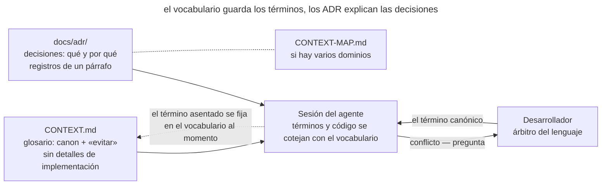

# Vocabulario del dominio

## Propósito

Registrar en el repositorio los términos del proyecto y las razones de las decisiones de arquitectura. El agente podrá cotejar con ellos los nombres en el código y las propuestas de cambio del sistema. Para cada concepto el equipo elige un nombre, y para una decisión no evidente guarda su justificación.

## También conocido como

CONTEXT.md, glosario del dominio, lenguaje ubicuo (ubiquitous language) de DDD; architecture decision records (ADR).

## Problema

Un proyecto tiene su propio lenguaje, que un participante nuevo no siempre puede reconstruir a partir del código. Por ejemplo, en una plataforma educativa, la inscripción en un curso y una suscripción de pago pueden dar un acceso parecido, pero tener fundamentos distintos.

Si el agente los considera sinónimos, renombrará `Enrollment` a `Subscription` y ligará el acceso al pago. Los estudiantes corporativos pueden perder entonces el acceso, aunque sus inscripciones se pagaron de otra forma.

La razón de la separación original puede haber quedado solo en una conversación antigua. Sin un registro, el equipo tiene que explicarla de nuevo cada vez que alguien propone «simplificar» el modelo.

La [memoria del proyecto](claude-md-memory.md) guarda las instrucciones de trabajo. Las definiciones de los conceptos del dominio conviene llevarlas a un vocabulario aparte y conectarlo a la sesión a través del archivo de memoria.

## Solución

Guarda en el repositorio un glosario y un registro de decisiones que el agente pueda usar al trabajar en una tarea.

**El glosario** en _CONTEXT.md_ define los términos del dominio. Le basta un formato breve.

- Cada concepto tiene un único nombre aceptado. Las demás variantes se enumeran con la marca «evitar».
- La definición explica el sentido del concepto en una o dos frases.
- El vocabulario incluye solo los conceptos a los que el proyecto da un sentido especial.
- Los detalles de implementación se quedan en el código y en los planes técnicos.

**El registro de decisiones** en _docs/adr/_ guarda la decisión tomada y su razón en un archivo aparte. En esta variante del patrón, el ADR hace falta para una elección difícil de revertir y difícil de entender sin contexto. El registro debe explicar qué alternativas consideró el equipo y por qué eligió una de ellas. Para un caso sencillo basta un párrafo.

El agente coteja los términos con el vocabulario y aclara las discrepancias antes de cambiar el código. Por ejemplo, si cancellation significa cancelar todo el pedido, una petición de cancelación parcial exige una aclaración. Cuando el equipo ha acordado un concepto nuevo, el agente anota su definición de inmediato.

## Estructura

En el diagrama, el glosario y el registro de decisiones entran en el contexto del agente.


```mermaid
---
title: el vocabulario guarda los términos, los ADR explican las decisiones
---
flowchart LR
  glossary["CONTEXT.md<br/>glosario: canon + «evitar»<br/>sin detalles de implementación"]:::accent
  adr["docs/adr/<br/>decisiones: qué y por qué<br/>registros de un párrafo"]
  map["CONTEXT-MAP.md<br/>si hay varios dominios"]:::muted
  session["Sesión del agente<br/>términos y código se cotejan con el vocabulario"]
  dev["Desarrollador<br/>árbitro del lenguaje"]:::accent
  glossary --> session
  adr --> session
  adr -.- map
  session -- "conflicto — pregunta" --> dev
  dev -- "el término canónico" --> session
  session -. "el término asentado se fija en el vocabulario al momento" .-> glossary
```

Si un término de la tarea difiere del vocabulario, el agente pide una aclaración al desarrollador y guarda la definición aceptada. La flecha discontinua muestra esa actualización. En un proyecto con varios dominios, _CONTEXT-MAP.md_ indica dónde están los vocabularios y cómo se relacionan sus contextos.

## Participantes / Componentes

- **Glosario** (_CONTEXT.md_) guarda las definiciones y los sinónimos no deseados.
- **Registro de decisiones** (_docs/adr/_) explica las elecciones de arquitectura no evidentes.
- **Mapa de contextos** (_CONTEXT-MAP.md_) conecta los vocabularios de varios dominios.
- **Desarrollador** aprueba los términos y resuelve las contradicciones.
- **Agente** coteja el texto y el código con el vocabulario y anota las definiciones acordadas.

## Cuándo aplicarlo

- El dominio usa términos cuyo sentido importa conservar, por ejemplo en facturación o en educación.
- En el proyecto trabajan distintas personas y agentes que necesitan un vocabulario común.
- El agente ya confunde términos, llama a un mismo concepto de formas distintas o propone renombrar algo que se llama así a propósito.
- En dominios distintos una misma palabra tiene sentidos diferentes.

Para una utilidad pequeña y de un solo uso, un vocabulario aparte no suele compensar.

## Consecuencias y compromisos

- ➕ Los nombres nuevos en el código concuerdan con el lenguaje del equipo.
- ➕ Antes de renombrar, el agente tiene que explicar la discrepancia con el vocabulario.
- ➕ El ADR ayuda a evaluar una propuesta de rehacer algo teniendo en cuenta las razones originales.
- ➕ Un desarrollador nuevo aprende los términos en el mismo documento que lee el agente.
- ➖ El equipo tiene que mantener las definiciones al día.
- ➖ Si se aplaza la anotación de un término acordado, la siguiente sesión puede elegir otro nombre.
- ➖ Las definiciones sobrantes y los registros de decisiones triviales dificultan encontrar el contexto necesario.

## Implementación

1. Crea _CONTEXT.md_ cuando se haya acordado el primer término, y _docs/adr/_ cuando aparezca una decisión que haya que explicar a un lector futuro.
2. Para cada término, escribe una definición breve y los sinónimos no deseados. Elige un único nombre para usar en el proyecto.
3. Añade solo los conceptos cuyo sentido depende del dominio.
4. En el ADR, anota el contexto, la decisión tomada y la razón de la elección. Numera los archivos de forma consecutiva (`0001-...`, `0002-...`).
5. Conecta el vocabulario a través de la [memoria del proyecto](claude-md-memory.md). En Claude Code puedes usar para ello la línea `@CONTEXT.md` en CLAUDE.md.
6. Pide al agente que detecte contradicciones en los términos y anote las definiciones acordadas justo después de la discusión.
7. En un proyecto con varios dominios, coloca los vocabularios junto a los módulos y conéctalos mediante _CONTEXT-MAP.md_.

En las [skills de Matt Pocock](matt-pocock-skills.md), el skill `domain-modeling` mantiene CONTEXT.md y los ADR. Los demás skills usan estos documentos durante la entrevista, la preparación de la especificación y la implementación.

## Ejemplo

A continuación se muestra el glosario de una plataforma educativa.

```markdown
# Aprendizaje

El contexto de cursar: desde la inscripción hasta el certificado.

## Lenguaje

**Inscripción (Enrollment)**:
El hecho del acceso de un estudiante a un curso. Se crea al apuntarse, vive hasta su revocación.
_Evitar_: suscripción, compra, acceso

**Cohorte (Cohort)**:
Grupo de estudiantes que cursan con un calendario común.
_Evitar_: grupo, clase, promoción

**Finalización (Completion)**:
Inscripción con todos los módulos obligatorios completados.
_Evitar_: graduación, cierre del curso
```

La razón de la elección del nombre la guarda el ADR _docs/adr/0003-enrollment-not-subscription.md_.

```markdown
# La inscripción no está ligada al pago

El acceso al curso y la facturación están separados a propósito: las
inscripciones las crean tanto contratos corporativos como becas, donde no
existe suscripción alguna. Por eso Enrollment existe como entidad aparte.
```

Pides que el estudiante pierda el acceso al curso al cancelar la suscripción. El agente lee el vocabulario y aclara la tarea.

> En el vocabulario, el nombre aceptado para el acceso al curso es Enrollment. Según el ADR-0003, la inscripción no está necesariamente ligada al pago. ¿Hay que revocar solo las inscripciones creadas mediante facturación o todas las inscripciones del usuario?

La aclaración permite conservar el acceso de los estudiantes corporativos, cuyas inscripciones no están ligadas a una suscripción personal. Detectas la ambigüedad antes de que se convierta en una condición para retirar el acceso.

## Antipatrones y errores comunes

- **Vocabulario-especificación.** Los nombres de tablas y el orden de las llamadas se quedan obsoletos enseguida. Deja en el vocabulario el sentido de los conceptos y describe la implementación en el código y en los planes técnicos.
- **Vocabulario-enciclopedia.** Los términos generales de programación dificultan encontrar los conceptos del proyecto y ocupan contexto (véase [ingeniería de contexto](context-engineering.md)).
- **Sinónimos sin árbitro.** Una lista de todas las variantes sin elegir el nombre principal conserva la ambigüedad.
- **Vocabulario muerto.** Un documento que nadie lee ni actualiza se va alejando poco a poco del lenguaje del proyecto.
- **Un ADR por cada estornudo.** Entre registros de decisiones triviales cuesta más encontrar las razones de las elecciones de arquitectura.

## Usos conocidos

- **Skills de Matt Pocock** implementan el patrón mediante `domain-modeling`, que mantiene el vocabulario, los ADR y el mapa de contextos.
- **Domain-Driven Design** de Eric Evans introduce el lenguaje ubicuo y los contextos delimitados en los que se apoya este patrón.
- **La convención ADR** de Michael Nygard y herramientas como adr-tools ayudan a conservar las razones de las decisiones de arquitectura.
- **Kiro** conecta el contexto del producto mediante el archivo de steering product.md.

## Patrones relacionados

- [Memoria del proyecto](claude-md-memory.md) conecta el vocabulario a la sesión del agente.
- [Ingeniería de contexto](context-engineering.md) ayuda a seleccionar la información para el vocabulario y los ADR.
- [Desarrollo orientado a especificaciones](spec-driven-development.md) usa el vocabulario común al escribir especificaciones.
