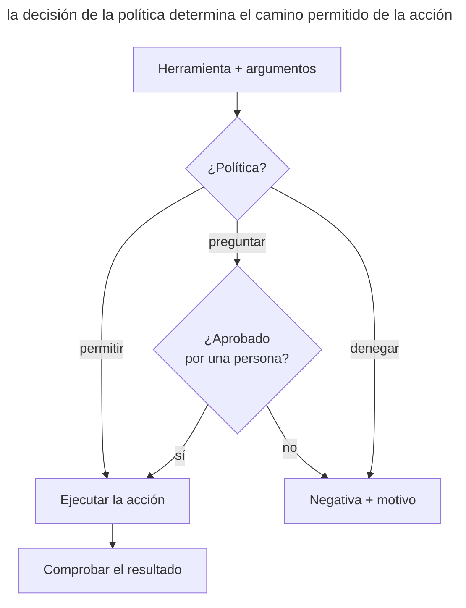

# Límites ejecutables

## Propósito

Fijar las reglas críticas del trabajo del agente con permisos de acceso, un sandbox, hooks y comprobaciones automáticas. Dentro del área permitida, el agente actúa por su cuenta. Si intenta salir de sus límites, el sistema lo detiene.

## También conocido como

Executable guardrails, policy as code, restricciones aplicadas, raíles para agentes.

## Problema

En _AGENTS.md_ está escrita la prohibición de cambiar las migraciones. El agente puede pasarla por alto en un contexto largo o llamar a una herramienta que modifique el archivo como efecto secundario. El texto de la prohibición no detendrá la escritura por sí solo. Una regla crítica necesita un mecanismo que compruebe la acción antes de ejecutarla.

Confirmar cada comando también exige atención. Tras decenas de peticiones iguales, puedes empezar a aprobarlas mecánicamente. Quitar todas las restricciones reduce el número de peticiones, pero amplía el área que puede afectar un error.

No todas las reglas son iguales. «Prefiere funciones pequeñas» requiere juicio y pertenece a la guía. «No escribas fuera del repositorio» se comprueba de forma inequívoca y debe aplicarlo una máquina. Si una regla determinista se queda solo en el prompt, el proyecto confía en un cumplimiento probabilístico de algo que se puede garantizar.

## Solución

Separa las reglas en **recomendaciones** e **invariantes**. Deja las recomendaciones en la memoria del proyecto, donde el agente puede tener en cuenta el contexto. Para los invariantes que se comprueban de forma inequívoca, elige el mecanismo adecuado.

1. **El sandbox** restringe los directorios, la red y los procesos disponibles.
2. **Los permisos** admiten de antemano un conjunto estrecho de acciones seguras y exigen la decisión de una persona fuera de él.
3. **Un hook previo a la acción** comprueba la intención antes de ejecutar y bloquea lo prohibido.
4. **Un hook posterior o de parada** comprueba el resultado y no deja dar el trabajo por terminado sin la señal obligatoria.
5. **La CI** repite las comprobaciones críticas fuera de la sesión del agente y protege la rama objetivo.

Un límite debe comprobar una condición estrecha y explicar el motivo de la negativa. Junto con la negativa, devuelve un siguiente paso permitido. Así el agente puede seguir trabajando dentro del área permitida sin confirmaciones constantes.

## Estructura

El mecanismo comprueba la acción antes de ejecutarla. La política determina si puede ejecutarse de inmediato, si necesita la confirmación de una persona o si está prohibida.



La confirmación de una persona abre solo la rama prevista por la política. No anula las prohibiciones estrictas del sandbox ni de los hooks. Ante una negativa, el agente recibe el motivo y un siguiente paso permitido. Tras la ejecución, una comprobación aparte confirma los requisitos del resultado.

## Participantes / Componentes

- **La política** define una regla que se comprueba de forma inequívoca.
- **El agente** propone una acción y recibe el resultado de la comprobación.
- **El mecanismo de restricción** comprueba la acción mediante el sandbox, los permisos, una allowlist, un hook o la CI.
- **El área segura** incluye las acciones permitidas sin intervención humana.
- **El escalado** pasa a una persona la acción que no se puede permitir ni prohibir automáticamente.
- **La auditoría** guarda la regla que se activó, sin secretos ni datos innecesarios.

## Cuándo aplicarlo

- Violar la regla puede borrar datos, revelar un secreto, modificar un sistema externo o estropear un lanzamiento.
- El agente trabaja sin supervisión constante o lanza procesos hijos.
- La misma regla prohibitiva hay que repetirla en los prompts.
- Las condiciones se comprueban de forma rápida e inequívoca por el comando, la ruta, el diff o el código de salida.
- El equipo quiere reducir el número de confirmaciones manuales sin ampliar el acceso del agente sin control.

El requisito «la arquitectura debe ser simple» no tiene una comprobación rápida e inequívoca. Déjalo como guía para el diseño y la revisión. Un hook con una condición así o bloqueará trabajo legítimo o creará una apariencia de control.

## Consecuencias y compromisos

- ➕ Los invariantes críticos se cumplen independientemente de lo lleno que esté el contexto y de la calidad de una respuesta concreta.
- ➕ El agente ejecuta comandos permitidos conocidos sin tu intervención.
- ➕ La negativa muestra qué regla se activó y por qué.
- ➕ La política se guarda en git, pasa revisión y funciona igual para todo el equipo.
- ➖ Un error en un límite bloquea trabajo útil; los límites necesitan un conjunto de pruebas positivas y negativas.
- ➖ Los hooks síncronos añaden latencia, así que conviene llevar las comprobaciones pesadas a un hook de parada o a la CI.
- ➖ La allowlist crece poco a poco; una regla amplia como «permitir cualquier shell» destruye el sentido del límite.
- ➖ El sandbox reduce el radio de impacto, pero no demuestra que el código sea correcto ni sustituye las pruebas.

## Implementación

1. Toma una prohibición que el agente ya ha incumplido o que repites en los prompts. Si la violación se ve en el comando, la ruta o el diff, se puede fijar con un mecanismo.
2. Empieza por la escritura y la publicación: permite las ediciones en el directorio de trabajo y los tests, y deja `git push` y la red pendientes de confirmación.
3. Pon el límite en el nivel correcto. El sandbox del SO restringe el acceso a archivos y red; un hook previo a la herramienta comprueba un comando concreto; las pruebas y la CI comprueban la calidad del resultado.
4. En la respuesta a una negativa, nombra la regla y el siguiente paso permitido.
5. Comprueba que el mecanismo bloquea la acción prohibida y deja pasar la permitida más cercana. Añade comprobaciones del escapado de la entrada y del tiempo de espera.
6. Lleva una auditoría mínima de las decisiones, pero no registres tokens, el contenido de archivos secretos ni datos completos de usuarios.
7. Analiza los bloqueos falsos y ajusta la condición concreta que los provocó.

## Ejemplo

El agente puede modificar el servicio en _./app_, ejecutar pruebas y leer la documentación. La escritura fuera del repositorio está prohibida y la publicación requiere confirmación. En la memoria del proyecto queda una regla general de trabajo.

> Trabaja dentro de la tarea y prefiere cambios reversibles.

Primero anotamos las decisiones de política deseadas en una notación ilustrativa. Es pseudocódigo para discutir las reglas, que aún hay que expresar con la configuración del sandbox y los permisos elegidos.

```text
write path ./app/**          allow
write path ./docs/**         allow
write path ../**             deny: outside workspace
command make test            allow
command git push *           ask: external state change
network registry.npmjs.org   allow
network *                    deny: domain not approved
```

Después de configurar los mecanismos, comprobamos las decisiones esperadas. La llamada a `git push` debe pedir confirmación, la escritura en _~/.ssh/config_ debe bloquearse y `make test` debe ejecutarse sin preguntar. El bloque de pseudocódigo por sí mismo no establece esas restricciones.

Un límite real y estrecho se puede mostrar con la prohibición de hacer commit de cambios en las migraciones. Guarda el siguiente script como _.git/hooks/pre-commit_ en un repositorio de prueba con un directorio _.git_ normal y hazlo ejecutable con `chmod +x .git/hooks/pre-commit`.

```sh
#!/bin/sh
set -eu

changes=$(git diff --cached --name-only -- db/migrations/)
if [ -n "$changes" ]; then
    printf '%s\n' 'Blocked: staged migration changes require review.' >&2
    exit 1
fi
printf '%s\n' 'Allowed: no staged migration changes.'
```

En este script, `git diff --cached` comprueba los cambios preparados para el commit. Si entre ellos hay un archivo de _db/migrations/_, el hook devuelve el código 1 y Git detiene el commit. En un repositorio temporal, llamar al hook antes y después de añadir una migración da este resultado.

```console
$ .git/hooks/pre-commit
Allowed: no staged migration changes.
$ mkdir -p db/migrations
$ touch db/migrations/001.sql
$ git add db/migrations/001.sql
$ .git/hooks/pre-commit
Blocked: staged migration changes require review.
$ echo $?
1
```

Este hook protege el momento del commit. No prohíbe escribir el archivo y se puede desactivar, así que una restricción obligatoria necesita una comprobación fuera del control del agente, por ejemplo en la CI con protección de rama. Para prohibir la propia escritura se usan los permisos de archivos o el sandbox.

## Antipatrones y errores comunes

- **Todo en el prompt.** Las prohibiciones deterministas compiten por la atención con la descripción de la tarea y a veces pierden.
- **Prohibirlo todo.** Cada comando requiere confirmación; te cansas y empiezas a aprobar sin leer.
- **Permitir el shell entero.** Una allowlist estrecha se sustituye por un bypass universal de todo el modelo de amenazas.
- **Un hook con inteligencia.** Un hook lento con LLM intenta juzgar la intención de cada comando y vuelve el límite caro e impredecible.
- **Negativa silenciosa.** El agente solo ve un código distinto de cero y empieza a buscar un rodeo en vez de un camino seguro.
- **Secretos en la auditoría.** La propia protección contra fugas copia datos sensibles en el log.
- **Protección solo local.** El agente desactiva el hook o no lo ejecuta; un invariante crítico debe repetirse en la CI o en la protección de rama.

## Usos conocidos

- **GitHub Copilot hooks** ejecutan comandos en puntos clave de la sesión. El hook previo a la herramienta puede permitir o rechazar la llamada; otros hooks comprueban el estado y llevan la auditoría.
- **Claude Code sandboxing** fija restricciones del sistema de archivos y de la red a nivel del SO, incluidos los procesos hijos, y permite trabajar libremente dentro del área permitida.
- **Git hooks y la CI** aplican el mismo principio al formato del commit, a las pruebas y a las reglas de la rama.

Los mecanismos se describen en la documentación de [GitHub Copilot hooks](https://docs.github.com/en/copilot/concepts/agents/hooks) y en el artículo sobre [Claude Code sandboxing](https://www.anthropic.com/engineering/claude-code-sandboxing).

## Patrones relacionados

- [Memoria del proyecto](claude-md-memory.md) guarda las recomendaciones y explica el propósito de las restricciones.
- [Bucle de retroalimentación](give-agent-a-way-to-verify.md) comprueba que el resultado obtenido sea correcto.
- [Trabajo paralelo aislado](isolated-parallel-work.md) usa worktrees cuyos límites se pueden fijar con el sandbox y los permisos.
- [Memoria hinchada](bloated-claude-md.md) describe la acumulación de prohibiciones que conviene llevar a mecanismos ejecutables.
