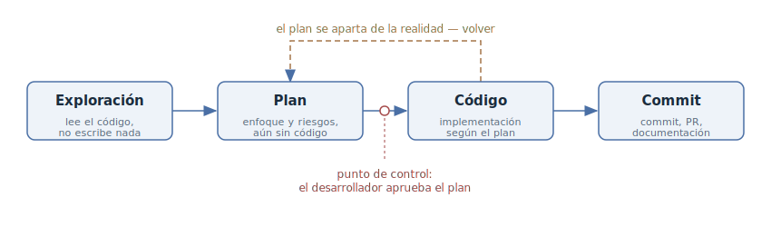

# Exploración — plan — código — commit

## Propósito

Dividir el trabajo del agente sobre una tarea no trivial en cuatro fases
explícitas — exploración, planificación, implementación y confirmación del
resultado — para que el agente primero entienda la tarea y acuerde el enfoque
con el desarrollador, y solo después escriba código.

## También conocido como

Explore–Plan–Code–Commit (EPCC), «primero el plan, después el código».

## Problema

Por defecto, el agente empieza a escribir código desde el primer mensaje. Para
un cambio simple está bien, pero en una tarea no trivial aún no ha visto los
archivos relevantes, no conoce las convenciones del proyecto y fácilmente
resuelve el problema equivocado. El desarrollador lo descubre solo al revisar
el diff terminado — en el punto más caro: rehacer el trabajo cuesta más que
toda la conversación anterior.

Intentar asegurarse con un prompt más detallado lleva al extremo opuesto — la
especificación prematura: dictas la implementación en lugar de la tarea. Hace
falta una forma de detectar una dirección equivocada a tiempo, sin quitarle al
agente la elección del enfoque.

## Solución

Guiar al agente explícitamente por cuatro fases secuenciales y prohibirle
escribir código en las dos primeras.

1. **Exploración.** El agente lee el código relevante y reúne contexto. Nada de
   cambios — solo entender la tarea.
2. **Plan.** El agente propone un enfoque: qué cambiar, en qué orden, qué
   riesgos hay. El desarrollador lee el plan y lo aprueba o lo corrige. Es el
   punto de control principal: corregir el rumbo a nivel de plan es mucho más
   barato que a nivel de código.
3. **Código.** El agente implementa el plan aprobado, contrastándolo con el
   plan y con las verificaciones disponibles (tests, build, linter).
4. **Commit.** El resultado se fija: un commit con un mensaje con sentido, un
   pull request y, si hace falta, la actualización de la documentación.

## Estructura

Las fases van estrictamente en orden, pero el proceso no es unidireccional: si
durante la implementación el plan se aparta de la realidad, lo correcto es
volver a la fase de plan y reacordarlo — no estirar el código para que encaje
en un documento obsoleto. El punto de control entre el plan y el código
pertenece al desarrollador: sin su «sí» explícito el agente no pasa a la
implementación.

## Participantes / Componentes

- **Desarrollador** — plantea la tarea, lee y aprueba el plan, acepta el
  resultado.
- **Agente** — explora la base de código, propone un plan, lo implementa.
- **Plan** — el artefacto intermediario: un documento breve de «qué y cómo». Se
  puede editar, guardar, ejecutar en una sesión nueva o pasar a otro agente.
- **Base de código** — la fuente de contexto en la fase de exploración y el
  objeto de cambio en la fase de código.

## Cuándo aplicarlo

- La tarea no es trivial: toca varios módulos, una parte desconocida del
  sistema o exige elegir entre enfoques.
- Una dirección equivocada sale cara: un diff grande, una migración, un
  contrato público.
- Quieres revisar la dirección, no solo el resultado terminado.

Para cambios de una línea y ediciones mecánicas el patrón es excesivo — las
cuatro fases solo ralentizan el trabajo.

## Consecuencias y compromisos

- ➕ El agente resuelve el problema que realmente tenías en mente: la dirección
  equivocada se detecta en el plan, no en la revisión del diff.
- ➕ Revisar un plan es un orden de magnitud más barato que revisar código —
  tanto para el humano como en tokens.
- ➕ El plan queda como artefacto: se puede refinar, ejecutar en una sesión
  nueva o reutilizar como descripción del pull request.
- ➖ Para tareas simples el ciclo es más lento y caro que un «hazlo» directo.
- ➖ El plan se queda obsoleto durante la implementación — volver a la fase de
  plan exige disciplina; si no, código y plan divergen en silencio.
- ➖ La tentación de convertir el plan en una instrucción paso a paso devuelve
  a la especificación prematura.

## Implementación

1. Activa el modo de planificación: el agente no podrá tocar archivos hasta
   que el plan se apruebe, y no hará falta prohibir el código en los prompts.
2. Empieza por la exploración: «Lee los archivos responsables de X y entiende
   cómo funciona Y». Después pide un plan e indica las restricciones que no se
   ven en el código.
3. Lee el plan como si revisaras código: haz preguntas, tacha lo innecesario,
   exige alternativas. Itera hasta estar de acuerdo — es la fase más barata
   para discutir.
4. Aprueba el plan con la confirmación propia de la herramienta e indica con
   qué puede verificarse el agente: tests, build, linter.
5. Cierra con la fase de commit: mensaje con sentido, pull request con el plan
   en la descripción y actualización de la documentación si los cambios la
   tocaron.

No hace falta montar el patrón a mano con prompts — los toolkits populares de
desarrollo orientado a especificaciones lo implementan con comandos ya hechos.
A continuación, las fases de EPCC mapeadas a los cuatro más extendidos.

### Con GitHub Spec Kit

[Spec Kit](https://github.com/github/spec-kit) te lleva por las fases con una
serie de comandos slash, cada uno dejando un artefacto en el repositorio:

- **Exploración y plan** — `/speckit.specify` fija *qué* se construye
  (requisitos e historias de usuario), `/speckit.clarify` hace preguntas sobre
  los puntos poco definidos, `/speckit.plan` escribe el plan técnico y
  `/speckit.tasks` lo corta en tareas. El punto de control es revisar y editar
  estos artefactos antes de que empiece el código.
- **Código** — `/speckit.implement` ejecuta la lista de tareas.
- **Commit** — el flujo git habitual; `/speckit.analyze` verifica además la
  coherencia entre especificación, plan y tareas.

### Con OpenSpec

[OpenSpec](https://github.com/Fission-AI/OpenSpec) organiza el trabajo en torno
a un «cambio» con ciclo de vida propose → review → apply → archive:

- **Exploración** — `/opsx:explore`: un modo de «socio para pensar» que lee el
  código y sopesa opciones sin cambiar nada.
- **Plan** — `/opsx:propose` crea un conjunto de artefactos: `proposal.md` (por
  qué y qué cambia), `specs/` (requisitos y escenarios), `design.md` (enfoque
  técnico), `tasks.md` (lista de tareas de implementación). El punto de control
  es revisar el conjunto antes de la primera línea de código.
- **Código** — `/opsx:apply` ejecuta las tareas de `tasks.md`.
- **Commit** — el cambio terminado se archiva en `openspec/changes/archive/`:
  la historia de decisiones queda en el repositorio junto al código.

### Con Superpowers

[Superpowers](https://github.com/obra/superpowers) es un paquete de skills para
Claude Code con puntos de control obligatorios tras cada fase:

- **Exploración y plan** — `brainstorming` afina la idea con preguntas y
  presenta el diseño por secciones para validarlo; con el diseño aprobado,
  `writing-plans` escribe un plan de tareas pequeñas (2–5 minutos cada una) con
  rutas de archivo y pasos de verificación. La implementación no arranca hasta
  que digas «go» explícitamente.
- **Código** — `subagent-driven-development`: un subagente nuevo por tarea, con
  `test-driven-development` sosteniendo el ciclo red–green–refactor por dentro
  y `using-git-worktrees` aislando el trabajo en un worktree aparte.
- **Commit** — `requesting-code-review` contrasta el resultado con la
  especificación y `finishing-a-development-branch` lleva la rama hasta el
  merge o el PR.

### Con los skills de Matt Pocock

Si el proyecto tiene instalado el [paquete de skills de Matt
Pocock](https://github.com/mattpocock/skills), el patrón se monta con comandos
ya hechos — su flujo principal «idea → ship» reproduce las fases de EPCC:

- **Exploración y plan** — `/grill-with-docs`: el skill lee la base de código y
  te entrevista hasta que al plan no le queden agujeros; lo aprendido queda en
  `CONTEXT.md` y en los ADR. Una pregunta que no se resuelve conversando se
  saca a `/prototype`, con `/handoff` como puente.
- **Fijar el plan** — para trabajo de más de una sesión, `/to-spec` convierte
  la conversación en una especificación y `/to-tickets` la corta en tickets
  bala-trazadora con sus dependencias bloqueantes.
- **Código** — `/implement` lleva la implementación por ticket, ejecutando
  `/tdd` por dentro, un ciclo red–green cada vez.
- **Commit** — `/implement` cierra con `/code-review` (dos ejes: estándares y
  especificación) y solo después hace commit.

El punto de control del patrón se conserva: tanto el resultado de
`/grill-with-docs` como las costuras de prueba de `/to-spec` se confirman
explícitamente con el desarrollador.

## Ejemplo

Tarea: en la exportación de informes a CSV, la hora aparece desplazada una hora
para algunos usuarios. El desarrollador activa el modo de planificación — el
agente no puede cambiar archivos hasta que el plan se apruebe, así que no hace
falta prohibir el código en los prompts.

**Exploración:**

> Lee el código de exportación de informes y averigua de dónde sale la hora en
> el CSV y dónde puede desplazarse con el cambio de horario de verano.

**Plan:**

> Redacta un plan de corrección. Ten en cuenta que el formato del archivo no se
> puede cambiar — lo leen integraciones externas.

El agente propone dos opciones: convertir la hora al escribir o al leer. El
desarrollador responde:

> Convertir al leer rompe los archivos ya exportados. Toma la primera opción y
> añade al plan un test para el límite del cambio de horario.

**Código:** el desarrollador acepta el plan corregido con la confirmación
propia de la herramienta — el agente sale del modo de planificación, implementa
el plan y ejecuta los tests del exportador.

**Commit:**

> Haz commit y abre un pull request; pon en la descripción el plan y la opción
> que elegimos.

La dirección equivocada — corregir en el lado de lectura — se descartó con una
sola réplica en la fase de plan. De haber aparecido en la revisión, habría que
tirar una implementación terminada.

## Antipatrones y errores comunes

- **Saltarse la exploración.** El agente planifica a partir de suposiciones
  sobre la base de código — el plan parece convincente pero no encaja con el
  código real.
- **Aprobar el plan sin leerlo.** El punto de control se vuelve un trámite y el
  patrón solo añade sobrecarga a un simple «hazlo».
- **El plan como instrucción.** Exigir al plan detalle paso a paso antes de
  entender el problema es especificación prematura.
- **Estirar el código hacia un plan obsoleto.** Si la realidad se apartó del
  plan, vuelve a la fase de plan en lugar de forzar el código a coincidir con
  el documento.

## Usos conocidos

- **Claude Code** — plan mode como soporte integrado de la fase de plan; el
  propio flujo aparece el primero en [Claude Code best
  practices](https://code.claude.com/docs/en/best-practices).
- Existen modos análogos de «primero el plan» en otros agentes — por ejemplo,
  plan mode en Cursor y architect mode en aider.
- **Toolkits orientados a especificaciones** — GitHub Spec Kit, OpenSpec,
  Superpowers y el paquete de skills de Matt Pocock — despliegan EPCC en
  metodologías completas; sus comandos se detallan en la sección
  «Implementación».

## Patrones relacionados

- [Desarrollo orientado a especificaciones](spec-driven-development.md) — el
  mismo principio de «primero acordar, después codificar», desplegado en
  artefactos que sobreviven a la sesión: especificación → plan → tareas →
  implementación.
- [Especificación prematura](premature-specification.md) — el antipatrón en el
  que degenera la fase de plan si se exige detalle antes de entender el
  problema.
