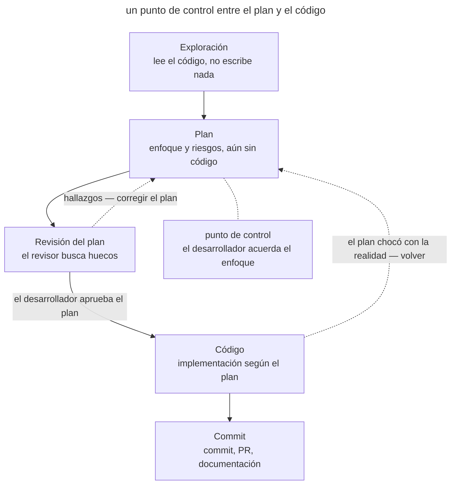

# Cuatro fases

## Propósito

Si la tarea no es trivial, divide el trabajo del agente en cuatro fases: exploración, plan, código y commit. Primero el agente estudia el código y acuerda contigo el enfoque. Solo después escribe el código y comprueba el resultado.

## También conocido como

Explore–Plan–Code–Commit (EPCC), «primero el plan, después el código».

## Problema

Si el agente se pone a escribir código de inmediato, puede no ver una restricción de una interfaz existente. Encontrarás el error solo al revisar el código terminado, y el agente tendrá que rehacer la implementación. Si el agente hubiera estudiado antes el código y te hubiera mostrado un plan, habrías detectado esa restricción antes.

Un prompt detallado también puede fijar un error. Si dictas en él la implementación de antemano, el agente la ejecutará incluso cuando la solución sea incorrecta (ver [especificación prematura](premature-specification.md)). Por eso es mejor que dejes al agente explorar la tarea por su cuenta y proponer un enfoque. Y tú compruebas ese enfoque antes de que el agente empiece a cambiar el código.

## Solución

Guía explícitamente al agente por las cuatro fases en orden y prohíbele escribir código en las dos primeras.

1. **Exploración.** El agente lee el código necesario y reúne contexto, pero no modifica nada.
2. **Plan.** El agente describe el enfoque, el orden de los cambios y los riesgos. Antes de que leas el plan, lo revisa un revisor con contexto fresco: busca huecos, contradicciones con el código y pasos que no hay con qué comprobar. El autor corrige el plan según los hallazgos. Después lees el plan y precisas las restricciones antes de que el agente se ponga con el código.
3. **Código.** El agente implementa el plan aprobado. Se contrasta con el plan y con las comprobaciones disponibles: tests, build, linter.
4. **Commit.** El agente guarda el resultado comprobado en un commit con un mensaje con sentido y prepara un pull request. Si el comportamiento cambió, actualiza la documentación.

## Estructura

En el diagrama, el agente recorre las cuatro fases en orden.

```mermaid
---
title: un punto de control entre el plan y el código
---
flowchart TB
  explore["Exploración<br/>lee el código, no escribe nada"]
  plan["Plan<br/>enfoque y riesgos, aún sin código"]
  check["Revisión del plan<br/>el revisor busca huecos"]:::muted
  code["Código<br/>implementación según el plan"]
  commit["Commit<br/>commit, PR, documentación"]
  explore --> plan
  plan --> check
  check -. "hallazgos — corregir el plan" .-> plan
  check -- "el desarrollador aprueba el plan" --> code
  code --> commit
  code -. "el plan chocó con la realidad — volver" .-> plan
  gate["punto de control<br/>el desarrollador acuerda el enfoque"]:::warn
  plan -.- gate
```

El revisor le quita al plan los errores mecánicos: archivos olvidados, contradicciones con el código, pasos sin comprobación. Así lees un plan ya depurado y dedicas tu atención a elegir el enfoque. Si durante el trabajo con el código resulta que el plan tiene un error, el agente vuelve a la planificación y acuerda contigo el cambio. En esta variante del proceso apruebas el plan explícitamente, y solo entonces el agente escribe el código.

## Participantes / Componentes

- **Desarrollador** plantea la tarea, aprueba el plan y acepta el resultado.
- **Agente** explora el código, propone un plan y lo implementa.
- **Revisor del plan** es un agente con contexto fresco que comprueba el plan según criterios antes de que lo leas tú. No ha visto el razonamiento del autor, así que nota lo que falta en el plan.
- **Plan** es el enfoque que acordaste con el agente. Puedes precisarlo o pasarlo a otra sesión.
- **Base de código** es lo que el agente estudia en la exploración y contra lo que comprueba la solución.

## Cuándo aplicarlo

- La tarea afecta a varios módulos o hay que elegir un enfoque.
- Una solución errónea es cara de rehacer. Por ejemplo, si cambia un contrato público.
- Quieres comprobar la dirección del trabajo antes de que el agente escriba código.

Un cambio de una línea o mecánico suele ser más fácil de pedir directamente, sin un plan aparte.

## Consecuencias y compromisos

- ➕ Notas que el agente se fue por mal camino antes de que escriba mucho código.
- ➕ Un plan corto suele comprobarse más rápido que una implementación terminada.
- ➕ El revisor encuentra huecos y contradicciones en el plan, y dedicas tu atención a las decisiones y no a buscar archivos olvidados.
- ➕ Puedes pasar el plan guardado a una sesión nueva o pegarlo en la descripción del pull request.
- ➖ En una tarea sencilla, cuatro fases van más lentas y cuestan más que pedir «hazlo».
- ➖ La revisión del plan añade otra pasada del agente. Parte de los hallazgos del revisor resultan ser ruido y hay que filtrarlos.
- ➖ Si por el camino descubres algo nuevo, hay que revisar el plan junto con el código.
- ➖ Surge la tentación de detallar el plan hasta convertirlo en instrucciones paso a paso. Así vuelves a la [especificación prematura](premature-specification.md).

## Implementación

1. Activa el modo de planificación para que el agente no toque el código hasta que apruebes el enfoque.
2. Pasa al agente la tarea o un enlace al ticket. Pídele que estudie el código antes de redactar el plan.
3. Antes de leer el plan, entrégalo para revisión a un subagente con contexto fresco, como en el patrón [Escritor y revisor](writer-reviewer.md). Pasa la tarea, el plan y los criterios: el plan se apoya en el código real, cubre toda la tarea, nombra los riesgos e indica con qué se comprueba cada paso. Que el autor corrija el plan según los hallazgos con los que estés de acuerdo.
4. Lee el plan. Precisa las restricciones ocultas, discute alternativas y tacha el trabajo sobrante.
5. Aprueba el plan y nombra los comandos con los que el agente comprobará el resultado.
6. Pide al agente que haga commit del resultado, prepare un pull request y actualice la documentación afectada por los cambios.

Si trabajas con una herramienta de [desarrollo orientado a especificaciones](spec-driven-development.md), tiene comandos listos para estas fases. A continuación, lo que hace cada herramienta en cada fase.

### Con GitHub Spec Kit

[Spec Kit](https://github.com/github/spec-kit) guarda el resultado de cada fase en el repositorio.

- **Exploración y plan.** Los comandos `/speckit.specify`, `/speckit.clarify`, `/speckit.plan` y `/speckit.tasks` registran por turnos los requisitos, las aclaraciones, el enfoque técnico y las tareas. Además, `/speckit.analyze` comprueba que los documentos no se contradicen entre sí. Esta es la comprobación automática del plan: lees los documentos después de ella, antes de empezar con el código.
- **Código.** El comando `/speckit.implement` implementa las tareas de la lista.
- **Commit.** Aquí trabajas con Git como de costumbre.

### Con otras herramientas

Los [skills](skills-as-packaged-workflows.md) ya hechos y otras herramientas de desarrollo orientado a especificaciones guardan los resultados de las fases de formas distintas. Los comandos y cuándo elegir cada herramienta se tratan en perfiles aparte.

| Herramienta | Exploración y plan | Código | Commit |
| --- | --- | --- | --- |
| [OpenSpec](openspec.md) | Paquete de cambio con propuesta y deltas de requisitos | Tareas del paquete | Validación, sincronización de especificaciones y archivado |
| [Superpowers](superpowers.md) | Acordar la pregunta, un diseño en el chat o una especificación escrita — según el tamaño de la tarea | Procedimientos de implementación y TDD | Revisión y cierre de la rama |
| [Skills de Matt Pocock](matt-pocock-skills.md) | Entrevista, especificación y tickets en el tracker | Ejecución del ticket elegido con tests | Revisión según estándares y requisitos |

Cuando hablas con el agente sobre el dominio, los skills de Matt Pocock también registran un vocabulario de términos y [ADR](domain-context-file.md). Los ADR son registros de decisiones de arquitectura con sus motivos. Gracias a ellos, el siguiente ejecutor entenderá por qué se eligió precisamente ese enfoque. El orden de las fases no cambia.

## Ejemplo

En el backlog hay un ticket: para algunos usuarios, la hora en la exportación CSV está desplazada una hora. Activas el modo de planificación y pasas el ticket al agente.

> Investiga REP-1432 y prepara un plan de corrección.

En la fase de **exploración**, el agente encuentra el código que convierte la hora al escribir el CSV.

En el **plan**, el agente propone dos opciones: convertir la hora al escribir o al leer. Antes de leer el plan, lo mandas a revisión.

> Pide a un subagente con contexto fresco que revise el plan: si todo en él se apoya en el código y con qué se comprueba cada paso.

El revisor advierte que el plan no tiene un test que reproduzca el desfase de una hora. El agente añade ese test al plan. Lees el plan corregido y precisas una restricción que el revisor no podía conocer.

> El formato de los archivos ya exportados lo usan integraciones externas. Corregimos la conversión al escribir. En el test, usa una fecha de cambio al horario de verano.

Apruebas el plan. En la fase de **código**, el agente hace el cambio y ejecuta los tests del exportador.

Compruebas el resultado y pides el **commit**.

> Haz commit y abre un pull request; en la descripción pon el plan y la solución que elegimos.

La opción de convertir al leer la descartaste enseguida, mientras discutíais el plan; si no, el agente habría rehecho código ya terminado.

## Antipatrones y errores comunes

- **Saltarse la exploración.** El agente no ha leído el código y construye el plan a base de conjeturas. Un plan así puede contradecir cómo está hecho el proyecto.
- **Aprobar el plan sin leerlo.** Si apruebas el plan sin leerlo, el punto de control se vuelve una formalidad. Entonces el patrón solo añade trabajo extra a un simple «hazlo». La revisión del revisor no sustituye a la lectura: encuentra huecos y contradicciones, pero elegir el enfoque y nombrar las restricciones ocultas solo puedes tú.
- **Plan como instrucciones.** Si exiges al plan detalles paso a paso antes de entender la tarea, obtendrás una [especificación prematura](premature-specification.md).
- **Plan obsoleto.** Si durante el trabajo con el código el plan chocó con la realidad, no sigas con el plan viejo. Vuelve a la planificación y acuerda un nuevo enfoque.

## Usos conocidos

- **Claude Code** admite el modo de planificación (plan mode). Este flujo de trabajo se describe en [Claude Code best practices](https://code.claude.com/docs/en/best-practices).
- Otros agentes tienen modos parecidos: plan mode en Cursor y architect mode en aider.
- **Las herramientas de desarrollo orientado a especificaciones** registran el resultado de cada fase en documentos y enlazan las fases con comandos.

## Patrones relacionados

- [Desarrollo orientado a especificaciones](spec-driven-development.md) registra la especificación, el plan y las tareas en documentos para que el trabajo pueda continuar en otra sesión.
- [Especificación prematura](premature-specification.md) surge cuando el plan se detalla antes de entender la tarea.
- [Escritor y revisor](writer-reviewer.md) describe la revisión por un agente fresco. Aquí se aplica la misma técnica al plan y no al diff.
- [Reflexión](reflection.md) es una opción más barata: el agente revisa su propio plan según criterios en la misma ventana, pero se le escapa más que a un revisor aparte.
