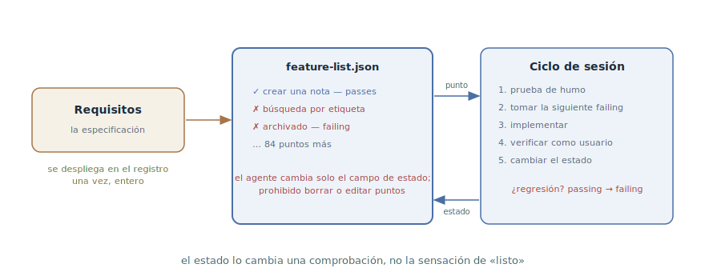

# Lista de funcionalidades

## Propósito

Mantener un registro permanente de las funcionalidades del proyecto en el
que cada una nace con estado «no funciona» y pasa a «funciona» solo tras una
comprobación real. La columna vertebral del trabajo largo: en cualquier
momento se ve qué está hecho, qué no y qué tomar a continuación — y se ve
por los estados, no por sensaciones.

## También conocido como

Feature list, feature list harness, registro de funcionalidades.

## Problema

Un trabajo de decenas de funcionalidades y muchas sesiones — un greenfield,
un módulo grande, ejecuciones autónomas. A esa escala las formas habituales
de seguir el progreso se rompen:

- El criterio de finalización es difuso: el agente da por hecho lo que
  *escribió*, no lo que *funciona*. Un «80 % listo» no lo respalda nada.
- Lo hecho regresa en silencio: una funcionalidad que funcionaba hace tres
  sesiones se rompió con el cambio de ayer y nadie lo notó — ya no se
  comprueba.
- La sesión nueva no sabe qué tomar: sin una lista común, cada una empieza
  reinventando el plan, y las funcionalidades se duplican o se caen.
- El [diario de progreso](progress-file.md) sostiene la narración — «dónde
  estamos y por qué» —, pero los estados en prosa el agente tarde o
  temprano los reformula o los machaca: las marcas actualizadas
  mecánicamente no viven en el texto.

## Solución

Un archivo-registro en el repositorio: la lista completa de funcionalidades
con estado binario. El registro se crea entero al comienzo del trabajo —
desplegando los requisitos en puntos concretos y verificables, cada uno con
descripción, pasos de verificación y estado `passes: false`.

A partir de ahí rigen las reglas:

1. **El estado lo cambia una comprobación, no una sensación.** Una
   funcionalidad gana `passes: true` solo después de que el agente la haya
   recorrido como usuario — un escenario de extremo a extremo, en la web a
   través del navegador y con capturas, no solo tests unitarios (ver el
   [bucle de retroalimentación](give-agent-a-way-to-verify.md)).
2. **El registro es intocable.** Borrar funcionalidades y reformular puntos
   a posteriori está prohibido — con dureza y sin rodeos: «es inaceptable
   quitar o editar puntos, porque eso lleva a funcionalidad perdida o
   rota». El agente cambia solo el campo de estado.
3. **Las regresiones devuelven el estado.** La prueba de humo al comienzo
   de la sesión puede devolver un `passing` a `failing` — el registro
   refleja la realidad, no una historia de logros.

El formato es JSON, no Markdown: un archivo actualizado mecánicamente en
JSON el agente lo estropea y lo sobreescribe bastante menos que un texto
markdown — la actualización se reduce a cambiar un solo campo.

La sesión trabaja desde el registro: leerlo, tomar la siguiente
funcionalidad no superada, implementar, verificar, cambiar el estado — una
por pasada (por qué una es un [capítulo aparte](one-feature-at-a-time.md)).

## Estructura



A la izquierda, los requisitos — de ellos el registro se despliega una vez,
entero, antes de que empiece la implementación. En el centro, el propio
registro: puntos con estados, y el único cambio permitido al agente es el
campo de estado. A la derecha, el ciclo de sesión: tomar la siguiente
funcionalidad no superada, implementar, verificar como usuario, cambiar el
estado. La flecha discontinua hacia abajo es la regresión: la prueba de humo
devuelve la funcionalidad rota a «no funciona», y vuelve a la cola.

## Participantes / Componentes

- **El registro** — un archivo JSON en el repositorio: la lista completa con
  estados; la fuente de verdad sobre el progreso.
- **La funcionalidad** — un punto concreto y verificable: descripción, pasos
  de verificación, estado.
- **El agente** — toma la siguiente no superada, implementa, verifica,
  cambia el estado.
- **La comprobación** — un recorrido de extremo a extremo como usuario; solo
  ella cambia el estado.
- **El desarrollador** — revisa el troceado del registro al principio y
  coteja estados con la realidad por muestreo.

## Cuándo aplicarlo

- Trabajo largo con un estado final claro: un greenfield «monta la
  aplicación según la especificación», un módulo grande, una migración con
  lista de control.
- Ejecuciones autónomas: el agente trabaja por sesiones sin vigilancia, y el
  progreso debe verse por un artefacto, no por un recuento.
- Varios agentes, o turnos agente/humano, sobre un mismo frente — el
  registro alinea el panorama para todos.

Para una tarea de unos pocos pasos el registro sobra — bastan el `tasks.md`
de la tubería SDD o el plan dentro de la sesión.

## Consecuencias y compromisos

- ➕ El progreso es objetivo: «34 de 200» está respaldado por
  comprobaciones, no por sensaciones.
- ➕ Las regresiones se ven: la funcionalidad rota vuelve a la cola en vez
  de desaparecer de la vista.
- ➕ Las sesiones se encadenan sin recuentos: cualquier sesión nueva sabe
  qué tomar a continuación.
- ➖ La calidad del registro es la calidad del troceado: puntos demasiado
  grandes no son verificables, demasiado pequeños entierran la señal en
  burocracia.
- ➖ La intocabilidad se sostiene en instrucciones: sin formulaciones duras
  en el prompt y la memoria del proyecto, el agente algún día «ordenará» un
  punto incómodo.
- ➖ El estado binario es tosco: «funciona a medias» hay que expresarlo
  troceando en funcionalidades más pequeñas.

## Implementación

1. Despliega los requisitos en el registro antes de empezar la
   implementación: cada punto es un comportamiento verificable con un
   escenario de extremo a extremo («el usuario abre un chat, escribe una
   consulta y ve la respuesta»), no una tarea («montar el enrutado»).
2. Mantén el formato estructurado: JSON con campos de categoría,
   descripción, pasos de verificación y `passes`. Todo empieza en `false`.
3. Anota las reglas en la [memoria del proyecto](claude-md-memory.md): el
   estado, solo tras una comprobación de extremo a extremo; quitar y editar
   puntos es inaceptable; el agente cambia solo `passes`.
4. Fija el ritual de sesión: leer el registro → prueba de humo → tomar la
   siguiente no superada → implementar → verificar como usuario → cambiar.
5. Empareja con el [diario de progreso](progress-file.md): el registro
   sostiene los estados, el diario la narración; se complementan, no se
   duplican.
6. Revisa el registro como una especificación: el troceado y las
   formulaciones son tu zona; coteja por muestreo las funcionalidades
   `passing` con la realidad.

## Ejemplo

El agente construye un servicio de notas según la especificación. La sesión
inicializadora la desplegó en un registro de 87 puntos:

```json
[
  {
    "category": "notes",
    "description": "El usuario crea una nota y la ve en la lista",
    "steps": ["abrir /notes", "pulsar «Crear»", "escribir el texto",
              "guardar", "comprobar que la nota está en la lista"],
    "passes": true
  },
  {
    "category": "search",
    "description": "La búsqueda por etiqueta devuelve solo notas con esa etiqueta",
    "steps": ["crear notas con etiquetas work y home",
              "buscar por la etiqueta work",
              "comprobar que no hay notas home en los resultados"],
    "passes": false
  }
]
```

La siguiente sesión empieza con la prueba de humo: crear una nota funciona,
pero el archivado — `passing` desde la semana pasada — falla tras un cambio
reciente del esquema. El agente lo pasa a `false`, lo informa y toma la
siguiente no superada — la búsqueda por etiqueta. Implementa, recorre los
pasos del registro en el navegador, adjunta una captura de los resultados —
y solo entonces `passes: true`.

El desarrollador, echando un vistazo al registro por la tarde, ve un
panorama honesto: 41 de 87, incluida una regresión — sin leer diffs ni
preguntar.

## Antipatrones y errores comunes

- **Casilla sin comprobación.** El estado se cambió porque «el código está
  escrito» — el registro se convierte en una lista de buenas intenciones.
  El cambio es el final de un
  [bucle de retroalimentación](give-agent-a-way-to-verify.md), no un gesto.
- **El agente edita el registro.** Un punto reformulado «según lo que
  salió» y una funcionalidad incómoda borrada en silencio son funcionalidad
  perdida. La prohibición debe ser dura y estar escrita.
- **Estados en prosa.** Un registro entretejido en una narración Markdown
  el agente lo machaca al actualizar — las marcas mecánicas viven en un
  archivo estructurado.
- **El registro en vez de la especificación.** El registro es un derivado
  de los requisitos, no su sustituto: el «para qué» y el contexto viven en
  la especificación; el registro sostiene solo estados verificables.
- **Tests unitarios como comprobación.** Unidades en verde sin recorrido de
  extremo a extremo es éxito prematuro: la funcionalidad «funciona» hasta el
  primer usuario.

## Usos conocidos

- **El harness de Anthropic para agentes de larga duración** — la fuente
  primaria: un registro de más de 200 funcionalidades para un clon de
  claude.ai, el agente inicializador, la regla «es inaceptable quitar o
  editar puntos» y la verificación de extremo a extremo por el navegador
  antes de cambiar un estado.
- **Los harnesses de evaluación** — la misma mecánica en la evaluación de
  agentes: una lista fija de escenarios verificables con estados que no se
  pueden amañar al resultado.
- **Toolkits de SDD** — `tasks.md` en [Spec Kit](spec-kit.md) y
  [OpenSpec](openspec.md) como la forma débil: la lista de control existe,
  pero la marca no siempre es una comprobación; el registro endurece
  justamente ese punto.

## Patrones relacionados

- [Bucle de retroalimentación](give-agent-a-way-to-verify.md) — cambiar un
  estado es cerrar el bucle: el registro es una lista de bucles que quedan
  por cerrar.
- [Una funcionalidad a la vez](one-feature-at-a-time.md) — la disciplina de
  trabajar el registro: un punto por pasada, contra el intento de hacerlo
  todo de golpe.
- [Diario de progreso](progress-file.md) — el vecino en la capa de estado:
  la narración «dónde estamos y por qué» frente a los estados mecánicos de
  «qué funciona».
- [Desarrollo orientado a especificaciones](spec-driven-development.md) —
  el registro se deriva de la especificación, como el plan y las tareas; es
  su proyección verificable.
