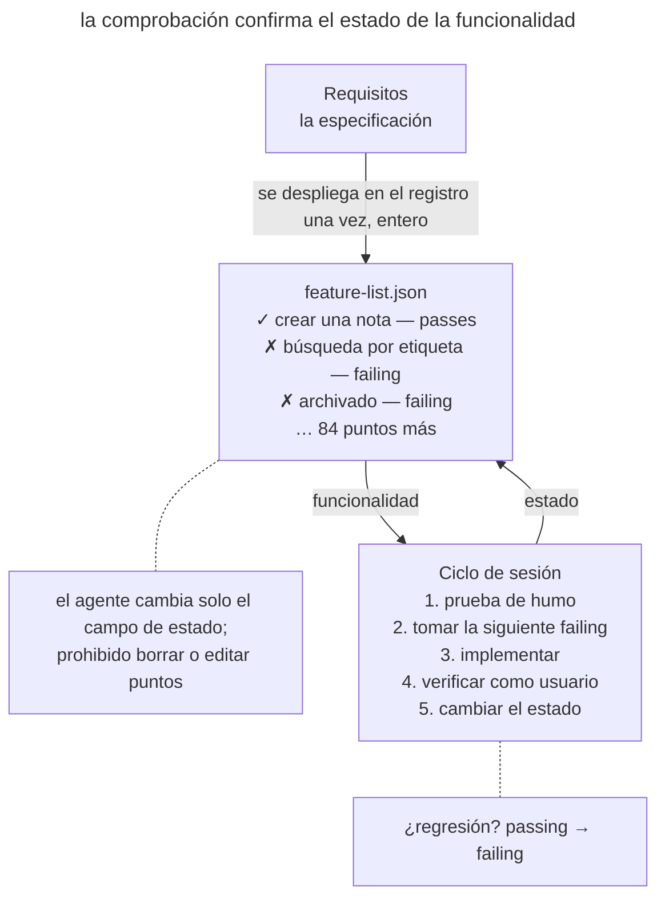

# Lista de funcionalidades

## Propósito

Mantener un registro de funcionalidades con estados verificables. Cada funcionalidad empieza con estado «no funciona» y pasa a «funciona» tras una comprobación de extremo a extremo. Por el registro, una sesión nueva ve el trabajo que queda.

## También conocido como

Feature list, feature list harness, registro de funcionalidades.

## Problema

Cuando trabajas en decenas de funcionalidades, un informe de «80 % listo» no basta. El agente pudo escribir el código sin haber comprobado todavía el escenario de usuario.

Por ejemplo, crear una nota pasó su comprobación hace una semana, pero el cambio de esquema de ayer lo rompió. Si el estado no está ligado a volver a ejecutar la comprobación, la siguiente sesión da la funcionalidad por terminada y sigue trabajando sobre una base rota.

Sin un registro común, una sesión nueva además pierde tiempo reconstruyendo la cola de tareas. El [diario de progreso](progress-file.md) explica cómo avanzó el trabajo y por qué se tomaron las decisiones. Para los estados hace falta un archivo estructurado aparte, en el que el agente cambia campos concretos.

## Solución

Antes de empezar la implementación, despliega los requisitos en un registro. Para cada funcionalidad, anota una descripción del comportamiento de usuario, los pasos de verificación y el estado inicial `passes: false`.

Las reglas de actualización ligan el registro a los resultados de las comprobaciones.

1. **El éxito lo confirma un escenario de extremo a extremo.** El agente pone `passes: true` tras verificar a través de la interfaz de usuario. Para una aplicación web puede ser un escenario en el navegador con capturas (ver el [bucle de retroalimentación](give-agent-a-way-to-verify.md)).
2. **Los requisitos están protegidos contra el amaño.** Durante la implementación el agente cambia solo el estado. Borrar o reformular un punto exige una decisión aparte sobre los requisitos.
3. **Una regresión devuelve la funcionalidad al trabajo.** Si una comprobación repetida falla, el agente cambia `passes` a `false`.

JSON da al registro una estructura explícita y limita la actualización habitual a un solo campo. Un esquema y una revisión del diff ayudan a detectar un cambio accidental en la descripción o en los pasos de verificación.

La sesión lee el registro, elige una funcionalidad no superada, la implementa y actualiza el estado tras la comprobación. Limitarse a [una funcionalidad por pasada](one-feature-at-a-time.md) permite terminar un escenario antes de pasar al siguiente.

## Estructura

En el diagrama, los requisitos se convierten en un registro antes de la implementación.


```mermaid
---
title: la comprobación confirma el estado de la funcionalidad
---
flowchart TB
  req["Requisitos<br/>la especificación"]:::accent
  ledger["feature-list.json<br/>✓ crear una nota — passes<br/>✗ búsqueda por etiqueta — failing<br/>✗ archivado — failing<br/>… 84 puntos más"]
  rules["el agente cambia solo el campo de estado;<br/>prohibido borrar o editar puntos"]:::warn
  cycle["Ciclo de sesión<br/>1. prueba de humo<br/>2. tomar la siguiente failing<br/>3. implementar<br/>4. verificar como usuario<br/>5. cambiar el estado"]
  regression["¿regresión? passing → failing"]:::warn
  req -- "se despliega en el registro una vez, entero" --> ledger
  ledger -- "funcionalidad" --> cycle
  cycle -- "estado" --> ledger
  ledger -.- rules
  cycle -.- regression
```

El agente elige de él un punto y recorre el ciclo de desarrollo con verificación. La flecha discontinua devuelve una funcionalidad a la cola si más tarde se descubre una regresión.

## Participantes / Componentes

- **El registro** guarda la lista de funcionalidades y sus estados en JSON.
- **La funcionalidad** describe un comportamiento verificable y los pasos para comprobarlo.
- **El agente** implementa el punto elegido y actualiza el estado según el resultado de la comprobación.
- **La comprobación** confirma el escenario de usuario.
- **El desarrollador** revisa la composición del registro y coteja por muestreo los estados con el comportamiento del producto.

## Cuándo aplicarlo

- Un trabajo grande tiene un resultado final claro que se puede descomponer en escenarios.
- El agente trabaja en varias sesiones autónomas, y el progreso debe verse por un archivo.
- Varios participantes necesitan una cola de trabajo común.

Para una tarea pequeña suele bastar un plan o _tasks.md_.

## Consecuencias y compromisos

- ➕ El número de funcionalidades terminadas se apoya en resultados de comprobaciones.
- ➕ Tras una regresión, la funcionalidad rota vuelve a verse en la cola.
- ➕ Una sesión nueva puede elegir el siguiente punto sin un recuento de toda la historia.
- ➖ Los puntos demasiado grandes son difíciles de verificar, y los demasiado pequeños complican el mantenimiento del registro.
- ➖ La prohibición escrita de cambiar requisitos hay que reforzarla con una revisión de los cambios del registro.
- ➖ El comportamiento que funciona a medias hay que dividirlo en escenarios independientes.

## Implementación

1. Despliega los requisitos en escenarios verificables antes de la implementación. Por ejemplo, «el usuario abre un chat, hace una pregunta y ve la respuesta» describe un resultado que se puede reproducir.
2. Guarda la categoría, la descripción, los pasos de verificación y `passes` en JSON. Fija el estado inicial en `false`.
3. Anota en la [memoria del proyecto](claude-md-memory.md) que el agente cambia solo `passes`, y solo según el resultado de una comprobación de extremo a extremo.
4. Empieza la sesión leyendo el registro y ejecutando una prueba de humo. Después elige un punto, impleméntalo, compruébalo y actualiza el estado.
5. Guarda los motivos de las decisiones en el [diario de progreso](progress-file.md) y los estados en el registro.
6. Revisa la composición del registro como requisitos y repite por muestreo los escenarios de las funcionalidades terminadas.

## Ejemplo

El agente construye un servicio de notas. La sesión inicial despliega la especificación en un registro de puntos no superados. Abajo se muestra un fragmento tras verificar la creación de una nota. La búsqueda por etiqueta aún no está verificada.

```json
[
  {
    "category": "notes",
    "description": "El usuario crea una nota y la ve en la lista",
    "steps": ["abrir /notes", "pulsar «Crear»", "escribir el texto",
              "guardar", "comprobar que la nota está en la lista"],
    "passes": true
  },
  {
    "category": "search",
    "description": "La búsqueda por etiqueta devuelve solo notas con esa etiqueta",
    "steps": ["crear notas con etiquetas work y home",
              "buscar por la etiqueta work",
              "comprobar que no hay notas home en los resultados"],
    "passes": false
  }
]
```

Al empezar la sesión, la prueba de humo detecta que el archivado falla tras un cambio de esquema. El agente devuelve su estado a `false` y registra la regresión. Después de restaurar el escenario básico, toma la búsqueda por etiqueta, la implementa y recorre los pasos de verificación en el navegador. Solo entonces la búsqueda recibe `passes: true`.

Por la tarde ves en el registro 41 funcionalidades verificadas de 87, y en el diario puedes leer sobre la regresión encontrada y corregida.

## Antipatrones y errores comunes

- **Casilla sin comprobación.** Marcar una funcionalidad porque el código está escrito oculta comportamiento no verificado. Actualiza el estado después del [bucle de retroalimentación](give-agent-a-way-to-verify.md).
- **Amañar el registro.** Cambiar un requisito para que encaje con el código terminado oculta funcionalidad que falta. Revisa esos cambios por separado.
- **Estados dentro de la narración.** Al reescribir Markdown, el agente puede perder una marca sin querer. Guarda los estados en campos estructurados.
- **El registro en vez de la especificación.** El objetivo y las restricciones se quedan en la especificación. El registro guarda los escenarios verificables derivados de ella.
- **Solo tests unitarios.** Las funciones sueltas pueden funcionar mientras el escenario de usuario está roto.

## Usos conocidos

- **El harness de Anthropic para agentes de larga duración** usa un registro de funcionalidades y verificación en el navegador antes de cambiar un estado.
- **Los harnesses de evaluación** usan un conjunto fijo de escenarios protegido contra el amaño al resultado.
- **Los toolkits de SDD** guardan las tareas en _tasks.md_, como en [OpenSpec](openspec.md). El registro además liga la marca a una comprobación del comportamiento.

## Patrones relacionados

- [Bucle de retroalimentación](give-agent-a-way-to-verify.md) da el fundamento para actualizar un estado.
- [Una funcionalidad a la vez](one-feature-at-a-time.md) limita el alcance de una pasada.
- [Diario de progreso](progress-file.md) guarda los motivos de las decisiones y el estado del trabajo sin terminar.
- [Desarrollo orientado a especificaciones](spec-driven-development.md) aporta los requisitos para el registro.
- [Éxito prematuro](premature-success.md) aparece cuando el estado se cambia sin una comprobación de extremo a extremo del escenario.
