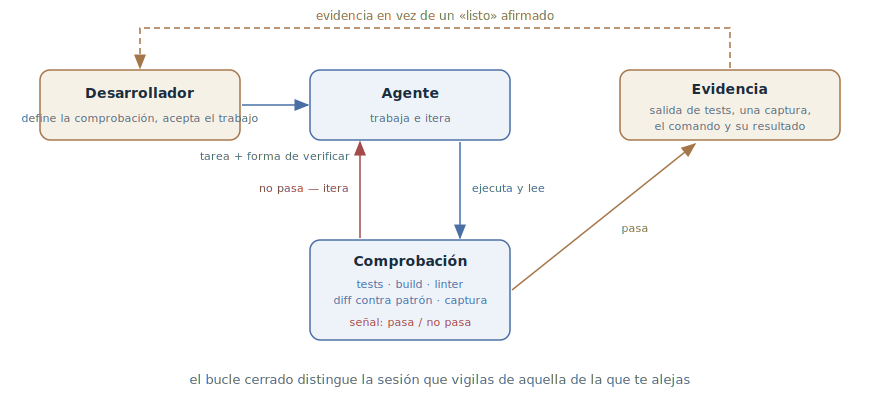

# Bucle de retroalimentación

## Propósito

Dar al agente una comprobación con resultado binario — tests, una
compilación, un linter, una captura comparada con el diseño — que él mismo
ejecuta, lee e itera hasta el verde. El bucle de verificación se cierra
dentro de la sesión, no a través del desarrollador.

## También conocido como

Give the agent a way to verify its work, verification loop, ciclo cerrado de
verificación.

## Problema

El agente se detiene cuando el trabajo *parece* terminado. Si no tiene una
comprobación que pueda ejecutar, «parece terminado» es la única señal a su
alcance. A partir de ahí empiezan los males conocidos:

- El bucle de retroalimentación eres tú: cada error espera a que lo note un
  humano. La sesión no se puede dejar sola — no puedes alejarte ni a por un
  café.
- El código es plausible pero no funciona: compila, se lee con fluidez y se
  cae en el caso límite. La plausibilidad es lo que mejor hace el modelo, y
  justo por eso no se le puede creer bajo palabra.
- «Listo» no significa nada: el agente informa del éxito con sinceridad,
  porque el criterio de éxito no quedó fijado en ninguna parte.

## Solución

Antes de empezar el trabajo, dar al agente una comprobación — cualquiera que
devuelva una señal de «pasa / no pasa» que él pueda leer: una suite de
tests, el código de salida de la compilación, un linter, un script que
compara la salida con un patrón, una captura contra el diseño. Y pedirlo
explícitamente: ejecútala, lee el resultado, itera hasta el verde.

Desde ese momento el bucle se cierra sin ti: el agente da un paso, ejecuta
la comprobación, lee el fallo, lo arregla — y así hasta que pasa. Tu
participación se desplaza de «notar errores» a los dos extremos del bucle:
fijar la comprobación a la entrada y aceptar la evidencia a la salida.

Cuán duro bloquea la comprobación la parada es una escalera de cuatro
peldaños; cada uno cambia configuración por autonomía:

1. **En un solo prompt** — «ejecuta los tests e itera»; funciona en
   cualquier tarea ahora mismo.
2. **Objetivo de sesión** — la comprobación se vuelve una condición que se
   reverifica tras cada turno del agente hasta cumplirse.
3. **Puerta determinista** — un hook de parada: un script bloquea el final
   de la sesión mientras la comprobación esté en rojo.
4. **Segunda opinión** — un subagente con contexto fresco intenta refutar
   el resultado: el trabajo no lo califica quien lo hizo (ver
   [Escritor y revisor](writer-reviewer.md)).

Y la regla final: evidencia en vez de afirmaciones. Que el agente muestre la
salida de los tests, el comando con su resultado o una captura — leer
evidencia es más rápido que reverificar tú mismo, y es la única forma de
aceptar el trabajo de una sesión que no vigilabas.

## Estructura

El desarrollador está en los extremos del bucle: a la entrada entrega al
agente la tarea junto con la forma de verificarla, a la salida acepta la
evidencia. Dentro del bucle hay un ciclo sin humano: el agente trabaja,
ejecuta la comprobación, lee la señal; la señal roja lo devuelve al trabajo,
la verde abre la salida con evidencia. Cuanto más dura la puerta de salida
(prompt → objetivo → hook → segunda opinión), más tiempo puede girar el
bucle sin vigilancia.

## Participantes / Componentes

- **Desarrollador** — fija la comprobación y los criterios antes de empezar;
  acepta el trabajo por su evidencia.
- **Agente** — trabaja, ejecuta la comprobación, lee la señal, itera.
- **Comprobación** — un oráculo con resultado binario: tests, compilación,
  linter, script de diff, captura contra el diseño.
- **Señal** — pasa / no pasa, leída por el agente dentro de la sesión.
- **Evidencia** — la salida de la comprobación, presentada al desarrollador
  en lugar de la palabra «listo».

## Cuándo aplicarlo

- Dondequiera que el resultado sea comprobable — es higiene básica del
  trabajo con un agente, no una técnica para ocasiones especiales.
- Obligatorio antes de dejar una sesión sin vigilancia: sin comprobación, el
  trabajo autónomo significa acumulación autónoma de errores.
- Para UI — mediante capturas: el agente compara el resultado con el diseño
  y enumera las diferencias.
- Si no hay comprobación — primero la comprobación: en código legado la
  primera tarea del agente no es «arréglalo» sino «escribe un test que
  falle y reproduzca el bug».

## Consecuencias y compromisos

- ➕ El bucle se cierra sin humano — la diferencia entre una sesión que
  vigilas y una de la que te alejas.
- ➕ Los errores se atrapan dentro del ciclo, al precio de una iteración del
  agente, no en la revisión al precio de tu tiempo.
- ➕ La evidencia acelera la aceptación: leer la salida de los tests es más
  rápido que ejecutarlos tú mismo.
- ➖ La comprobación hay que tenerla o construirla: en código sin tests el
  patrón empieza por escribir la comprobación, y ese es trabajo aparte.
- ➖ El agente optimiza exactamente para la comprobación: una comprobación
  débil produce basura verde. La calidad del bucle es la calidad del
  oráculo.
- ➖ La comprobación se puede «hackear»: un test amañado, una condición
  suavizada, un error suprimido. La prohibición de editar la comprobación
  es parte del patrón.

## Implementación

1. Formula el criterio antes de empezar y escríbelo en el prompt: no «haz
   un validador» sino «haz un validador; casos: X — true, Y — false;
   ejecuta los tests tras implementar».
2. Si no hay comprobación — constrúyela: pide al agente escribir primero un
   test que falle y reproduzca el problema, y solo después arreglar (la
   forma disciplinada es [TDD con agente](tdd-with-agent.md)).
3. Cierra el bucle explícitamente: «ejecuta, lee el resultado, itera hasta
   el verde». Sin esa instrucción el agente ejecuta la comprobación una
   vez — o ninguna.
4. Prohíbe cambiar la comprobación: editar un test, suavizar una condición
   y suprimir un error son decisiones del desarrollador, no jugadas de la
   iteración. Ancla la prohibición con un hook si hace falta.
5. Sube por la escalera según crezca la autonomía: a una tarea vigilada le
   basta el prompt; a una sesión de la que te alejas — un objetivo o un
   hook; al trabajo autónomo largo — la revisión de un subagente fresco.
6. Exige evidencia: salida de tests, el comando y su resultado, una
   captura. «Hecho» sin evidencia no es una señal.
7. Ancla los comandos de verificación en la
   [memoria del proyecto](claude-md-memory.md) para que el agente los
   conozca en cada sesión.

En los toolkits del desarrollo orientado a especificaciones el bucle está
integrado en la tubería: en [Spec Kit](spec-kit.md) y
[OpenSpec](openspec.md) cada tarea de `tasks.md` lleva su forma de
verificarse, en [Kiro](kiro.md) los criterios de aceptación se escriben en
notación EARS ya en la fase de requisitos, en [Superpowers](superpowers.md)
el ciclo red–green–refactor es obligatorio dentro de cada tarea, y en los
[skills de Matt Pocock](matt-pocock-skills.md) `/implement` no termina sin
`/tdd` y la revisión de dos ejes.

## Ejemplo

La tarea — un validador de códigos promocionales. El prompt fija la
comprobación junto con la tarea:

> Escribe validatePromoCode. Casos: SUMMER25 con promoción activa — true;
> un código caducado — false con motivo expired; un código de otra región —
> false con motivo region; cadena vacía — false. Convierte los casos en
> tests, ejecútalos e itera hasta que pasen. No edites los tests.

El agente escribe la implementación y los tests, los ejecuta: dos de cuatro
en rojo — el código caducado pasa, porque la comparación de fechas ignora la
zona horaria. El agente lo arregla, ejecuta de nuevo — verde. En la
respuesta, la salida del test runner: 4 passed.

El desarrollador estuvo todo ese tiempo en otra cosa: el bug de la zona
horaria fue atrapado y corregido dentro del bucle, al precio de una
iteración del agente. Sin la comprobación habría llegado a la revisión — o a
los usuarios.

## Antipatrones y errores comunes

- **Creer bajo palabra.** «Listo» sin la salida de la comprobación no es
  una señal, es cortesía. Pedir evidencia no es desconfianza, es protocolo.
- **Oráculo débil.** Una comprobación deshonestamente fácil de pasar
  produce basura verde: el agente optimiza para ella, no para la tarea.
- **Hay comprobación, pero no hay bucle.** Los tests están en el
  repositorio, pero nadie pidió al agente ejecutarlos — y no los ejecuta.
  El bucle lo cierra la instrucción.
- **El agente edita el oráculo.** Un test amañado y un error suprimido
  parecen progreso. Editar la comprobación es siempre una decisión aparte
  del desarrollador.
- **Tests unitarios como final.** Unidades en verde aún no son una
  funcionalidad que funciona: sin la comprobación de extremo a extremo como
  usuario, eso es éxito prematuro — ver el antipatrón homónimo.

## Usos conocidos

- **Claude Code best practices** — la fuente primaria: la comprobación es
  «la diferencia entre una sesión que vigilas y una de la que te alejas»;
  la tabla de antes/después de prompts con criterios.
- **Claude Code** — la escalera mecanizada: `/goal` como condición de
  sesión, los Stop hooks como puerta determinista, los subagentes de
  revisión como segunda opinión.
- **El harness de Anthropic para agentes de larga duración** — la lista de
  funcionalidades con estados `passing/failing` que solo cambian tras una
  comprobación real, y la prueba de humo de extremo a extremo al comienzo
  de cada sesión.
- **Toolkits de SDD** — criterios de aceptación y tareas verificables como
  parte obligatoria de la tubería: EARS en Kiro, las listas `tasks.md` en
  Spec Kit y OpenSpec, el TDD obligatorio en Superpowers.

## Patrones relacionados

- [TDD con agente](tdd-with-agent.md) — la forma disciplinada del bucle: la
  comprobación se escribe antes del código, una por paso.
- [Escritor y revisor](writer-reviewer.md) — verificación por juicio para lo
  que no se reduce a un oráculo binario: calidad, completitud, adherencia
  al plan.
- [Reflexión](reflection.md) — la forma más barata y más débil de
  verificación: autocrítica sin oráculo externo.
- [Cuatro fases](explore-plan-code-commit.md) — el bucle vive en la fase de
  código: el plan aprobado nombra las comprobaciones con las que el agente
  coteja la implementación.
