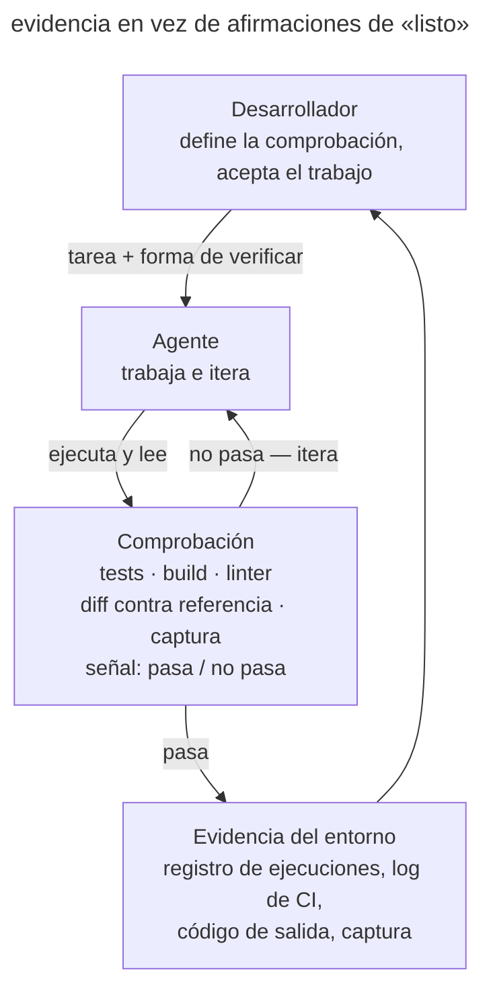

# Bucle de retroalimentación

## Propósito

Dar al agente una forma de comprobar el resultado, leer el fallo y repetir el trabajo hasta cumplir el criterio. El agente ejecuta la comprobación dentro de la sesión, y tú recibes el resultado junto con la evidencia.

## También conocido como

Give the agent a way to verify its work, verification loop, ciclo cerrado de verificación.

## Problema

Sin comprobación, el agente puede detenerse en un código verosímil. Por ejemplo, un validador acepta un código promocional válido pero se equivoca con uno caducado.

Si no hay test, el error tienes que notarlo tú. Hasta entonces, el agente da la tarea por terminada.

El criterio de terminado debe describir un comportamiento observable. Así el agente puede distinguir una implementación escrita de un resultado verificado.

## Solución

Antes de empezar, define una comprobación con un resultado claro. Puede ser un test, una compilación o la comparación de la salida con una referencia. Para una interfaz, aporta un diseño y los criterios de comparación visual. Pide al agente que ejecute la comprobación tras sus cambios, analice los fallos y repita el ciclo.

El agente hace una edición, ejecuta la comprobación y corrige el fallo encontrado. Tú eliges los criterios antes de empezar el trabajo y evalúas la evidencia al final.

El grado de automatización del bucle se puede elegir según la tarea.

1. **Una instrucción en el prompt** pide al agente ejecutar las comprobaciones y corregir los fallos encontrados.
2. **Un objetivo de sesión** fija una condición a la que el agente vuelve tras cada paso.
3. **Una puerta determinista** bloquea la finalización mientras la comprobación obligatoria no pase.
4. **Una segunda opinión** añade una revisión en un contexto fresco para comprobar la completitud y la calidad (ver [Escritor y revisor](writer-reviewer.md)).

La evidencia debe venir del entorno, no del relato del agente. Una salida que el agente copió en su mensaje final también pudo inventarla: escribir `4 passed` sin ejecutar nada o tomarlo de una ejecución anterior a la última edición. Verifica contra un registro que guardó el harness: la llamada a la herramienta en el log de la sesión, el log de CI, el código de salida en un hook, una captura de la herramienta de navegador. Estos datos muestran qué comprobó exactamente el agente y te permiten aceptar el trabajo sin reconstruir toda la sesión.

## Estructura

En el diagrama, el desarrollador entrega la tarea y los criterios de verificación.

```mermaid
---
title: evidencia en vez de afirmaciones de «listo»
---
flowchart TB
  dev["Desarrollador<br/>define la comprobación, acepta el trabajo"]:::accent
  agent["Agente<br/>trabaja e itera"]
  check["Comprobación<br/>tests · build · linter<br/>diff contra referencia · captura<br/>señal: pasa / no pasa"]
  evidence["Evidencia del entorno<br/>registro de ejecuciones, log de CI,<br/>código de salida, captura"]:::accent
  dev -- "tarea + forma de verificar" --> agent
  agent -- "ejecuta y lee" --> check
  check -- "no pasa — itera" --> agent
  check -- "pasa" --> evidence
  evidence --> dev
```

El agente repite el ciclo de ediciones y comprobaciones hasta tener éxito, y luego devuelve la evidencia. Un hook puede fijar la condición de salida, y una revisión independiente puede complementar las comprobaciones automáticas.

## Participantes / Componentes

- **Desarrollador** fija los criterios y acepta el resultado por su evidencia.
- **Agente** cambia el código, ejecuta la comprobación y analiza el resultado.
- **Comprobación** evalúa la propiedad especificada del resultado.
- **Señal** indica al agente si el criterio se cumple.
- **Evidencia** conserva el comando, la salida o una imagen del estado verificado. La registra el entorno, no el agente.

## Cuándo aplicarlo

- El resultado se puede comprobar de forma reproducible.
- El agente debe hacer varias iteraciones sin supervisión constante.
- Una interfaz se puede comparar con un diseño según criterios dados.
- Un bug se puede reproducir con un test antes de empezar la corrección.

## Consecuencias y compromisos

- ➕ El agente analiza los fallos encontrados sin esperar una comprobación manual de cada paso.
- ➕ Parte de los defectos se detecta antes de la revisión.
- ➕ Los resultados guardados te muestran cuánta verificación se hizo realmente.
- ➖ Si no hay comprobación, prepararla requiere un trabajo aparte.
- ➖ Una comprobación débil deja pasar una implementación que no resuelve la tarea por completo.
- ➖ El agente puede debilitar la comprobación para tener éxito. Los cambios en los criterios hay que controlarlos por separado.

## Implementación

1. Describe el comportamiento esperado antes de la implementación e indica cómo comprobarlo.
2. Si no hay comprobación, empieza con un test que reproduzca el problema (ver [TDD con agente](tdd-with-agent.md)).
3. Pide al agente ejecutar la comprobación tras sus ediciones, leer el resultado y corregir los fallos encontrados.
4. Protege los criterios del amaño. Acuerda por separado cualquier cambio en un test o debilitamiento de una condición; si hace falta, fija la restricción con un hook.
5. Para trabajo autónomo largo, añade control de finalización y una revisión en un contexto fresco.
6. Acepta el trabajo por los registros del entorno: el log de llamadas a herramientas, el log de CI o el resultado del hook. El relato del resultado en el mensaje final del agente no cuenta como evidencia.
7. Fija los comandos de verificación en la [memoria del proyecto](claude-md-memory.md) para que el agente los conozca en cada sesión.

En [OpenSpec](openspec.md), [Superpowers](superpowers.md) y las [skills de Matt Pocock](matt-pocock-skills.md), las comprobaciones forman parte del flujo de implementación. El mecanismo concreto depende del conjunto de skills y de los criterios de la tarea.

## Ejemplo

Para un validador de códigos promocionales, fijas los casos a comprobar junto con la tarea.

> Escribe validatePromoCode. Un SUMMER25 vigente debe aceptarse. Para un código caducado devuelve false con motivo expired, para un código de otra región devuelve false con motivo region. Rechaza la cadena vacía. Convierte los casos en tests, ejecútalos y corrige la implementación hasta que pasen. Una vez acordados los tests, no los cambies sin una discusión aparte.

El agente escribe los tests y la implementación. La comprobación del código caducado falla porque la comparación de fechas ignora la zona horaria. Tras la corrección, el agente vuelve a ejecutarlos. El log de la sesión muestra la última ejecución de los tests tras la edición final, con el resultado `4 passed`.

Recibes una implementación en la que el bug de la zona horaria ya se encontró y corrigió. Tu participación solo hizo falta para fijar los escenarios y aceptar el resultado.

## Antipatrones y errores comunes

- **Creer bajo palabra.** Un mensaje de «listo» no muestra qué comprobó el agente. Exige los resultados de la ejecución.
- **Salida relatada.** La línea `4 passed` en el mensaje final sigue siendo palabra del agente. Contrástala con la ejecución en el log de la sesión o en CI.
- **Oráculo débil.** La comprobación puede pasar por alto casos significativos. Contrástala con los requisitos de la tarea.
- **Comprobación sin ejecución.** Que haya tests en el repositorio no significa que el agente los ejecutara. Fija el comando y la condición de finalización.
- **Amañar la comprobación.** Una condición debilitada oculta el defecto. Los cambios del criterio requieren una decisión aparte.
- **Tests unitarios como final.** Para una funcionalidad de usuario, comprueba también el escenario de extremo a extremo; si no, te arriesgas al [éxito prematuro](premature-success.md).

## Usos conocidos

- **Claude Code best practices** describen cómo plantear tareas con criterios y ejemplos de verificación.
- **Las herramientas de agentes** pueden admitir objetivos de sesión, Stop hooks y subagentes de revisión.
- **El harness de Anthropic para agentes de larga duración** vincula los estados de las funcionalidades con comprobaciones y ejecuta una prueba de humo al comienzo de cada sesión.
- **Los toolkits de SDD** incluyen criterios de aceptación en las especificaciones y las tareas, y Superpowers usa el ciclo TDD.

## Patrones relacionados

- [TDD con agente](tdd-with-agent.md) empieza cada iteración con un test antes de cambiar el código.
- [Escritor y revisor](writer-reviewer.md) comprueba propiedades que requieren juicio.
- [Reflexión](reflection.md) ayuda a encontrar defectos mediante autocrítica, pero necesita confirmación externa.
- [Cuatro fases](explore-plan-code-commit.md) fija las comprobaciones en el plan y las usa durante la implementación.
- [Éxito prematuro](premature-success.md) surge cuando el trabajo se declara terminado sin una comprobación de extremo a extremo del escenario de usuario.
- [One-shotting](one-shotting.md) describe esperar un resultado terminado de una sola pasada, sin ciclo de verificación.
