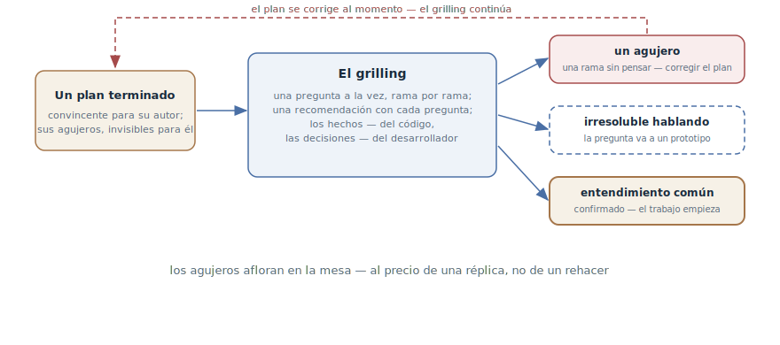

# Grilling

## Propósito

Entregar un plan terminado al agente para su interrogatorio: te entrevista
sin piedad sobre cada aspecto — pregunta a pregunta, rama por rama — hasta
que los agujeros afloran y surge un entendimiento común confirmado. Una
prueba de estrés de *tu* pensamiento antes de empezar el trabajo, no una
recogida de requisitos.

## También conocido como

Grilling, el interrogatorio; `/grilling` en los skills de Matt Pocock.

## Problema

El plan está escrito y parece convincente — a ti, su autor. Ahí está
justamente el problema:

- Tus propios agujeros son invisibles: el plan convence precisamente porque
  está construido sobre tus propias suposiciones — la misma ceguera de
  autor que tiene el agente con su propio código.
- La revisión de un colega es cara y a menudo superficial: «parece
  razonable» es la respuesta más frecuente y más inútil que recibe un plan.
- Los agujeros afloran en la implementación — en el punto más caro: una
  rama de diseño sin pensar se convierte en un rehacer, no en una réplica
  de la conversación.

## Solución

Antes de empezar el trabajo — el interrogatorio:

> Entrevístame sin piedad sobre cada aspecto de este plan hasta que
> lleguemos a un entendimiento común. Recorre las ramas del árbol de
> decisiones, resolviendo las dependencias entre decisiones una a una. Para
> cada pregunta, propone tu respuesta recomendada. Pregunta de una en una.
> Los hechos búscalos tú en la base de código — pero cada decisión
> plantéamela y espera mi respuesta. No empieces el trabajo hasta que yo
> confirme que el entendimiento es común.

Tres reglas sostienen la construcción:

- **Una pregunta a la vez.** Un lote de preguntas desconcierta — y permite
  responder las cómodas saltándose las incómodas.
- **Los hechos del código, las decisiones tuyas.** Todo lo que se puede
  averiguar leyendo la base de código, el agente lo averigua solo; a ti te
  llegan solo las bifurcaciones de verdad.
- **Una recomendación con cada pregunta.** Una pregunta con respuesta
  propuesta es una posición con la que discutir; una pregunta desnuda es
  trabajo descargado.

Cada pregunta tiene tres desenlaces: la respuesta cierra la rama; la
respuesta destapa un agujero — el plan se corrige y el interrogatorio
sigue; la pregunta no se resuelve hablando — se lleva a un
[prototipo desechable](prototype-to-answer.md). El final es único: la
confirmación explícita del entendimiento común — y solo después empieza el
trabajo.

## Estructura

A la izquierda, el plan terminado — convincente para su autor, con agujeros
que él no ve. En el centro, el ciclo del interrogatorio: pregunta con
recomendación, decisión del desarrollador, siguiente rama. A la derecha,
los tres desenlaces: el agujero destapado vuelve al plan como corrección —
y el grilling continúa; la pregunta que hablar no resuelve se va a un
prototipo; las ramas agotadas terminan en la confirmación del entendimiento
común — la única puerta hacia el comienzo del trabajo.

## Participantes / Componentes

- **El plan** — el objeto del interrogatorio: un documento escrito, no una
  idea en la cabeza.
- **El agente entrevistador** — recorre el árbol de decisiones, saca los
  hechos del código, recomienda respuestas; con la instrucción de ser
  implacable.
- **El desarrollador** — dueño de las decisiones; lo que se pone a prueba
  es su pensamiento.
- **Los agujeros** — el producto del interrogatorio: ramas sin pensar,
  destapadas antes de la implementación.
- **El entendimiento común** — el criterio del final: una confirmación
  explícita sin la cual el trabajo no empieza.

## Cuándo aplicarlo

- Antes de empezar un trabajo importante según un plan escrito en
  solitario: cuanto más cara la implementación, más barata una hora de
  interrogatorio.
- La decisión es difícil de revertir: una elección arquitectónica, un
  contrato público, una migración.
- El plan es «demasiado liso»: ni una sola pregunta abierta es señal segura
  de que las preguntas simplemente no se hicieron.

No hace falta para planes de media hora — ahí el agujero cuesta menos que
el interrogatorio. Y no lo confundas con la
[entrevista del agente](let-claude-interview-you.md): la entrevista
*construye* una especificación desde cero, el grilling *ataca* un plan
terminado.

## Consecuencias y compromisos

- ➕ Los agujeros afloran en la mesa y no en la implementación — al precio
  de una réplica, no de un rehacer.
- ➕ Las recomendaciones del agente hacen sustancioso el interrogatorio:
  discutes con una posición en vez de rellenar un cuestionario.
- ➕ Las decisiones quedan dichas en voz alta: tras el grilling el plan lo
  comparten dos, no lo supone uno.
- ➖ Es desagradable: el plan está bajo fuego, y un interrogatorio bien
  construido encuentra agujeros casi siempre. Es el precio, no un defecto.
- ➖ Tiempo: un interrogatorio de verdad son docenas de preguntas;
  presupuesta una sesión, no cinco minutos.
- ➖ Un agente complaciente es inútil: sin el explícito «sin piedad» el
  interrogatorio degenera en cumplidos al plan.

## Implementación

1. Interroga un documento, no un pensamiento: el plan debe estar escrito —
   el agente construye el árbol de decisiones desde el texto, no desde
   conjeturas.
2. Empieza con el prompt de las tres reglas: sin piedad, una pregunta a la
   vez, los hechos del código — las decisiones mías, el final es la
   confirmación del entendimiento.
3. Responde con honestidad, incluido el «no lo sé»: no saber es un agujero
   encontrado, no un interrogatorio fallido.
4. Corrige el plan sobre la marcha: el agujero destapado es una edición
   inmediata del documento, no una nota de «luego lo arreglo».
5. Lleva lo irresoluble a un prototipo: la discusión que se quedó sin
   argumentos es señal para un
   [prototipo desechable](prototype-to-answer.md), no para la terquedad.
6. Registra las decisiones en el acto: los términos asentados y las
   bifurcaciones tomadas van al
   [vocabulario del dominio](domain-context-file.md) y a los ADR mientras
   están calientes.
7. Termina explícitamente: «el entendimiento es común, empezamos» — dicho
   con palabras, no dado a entender con silencio.

## Ejemplo

El desarrollador escribió el plan de migración de tarifas y, antes de
empezar, lo entrega al interrogatorio. El agente recorre las ramas:

> El plan aplica la subida de tarifa de inmediato, pero no dice nada de la
> bajada. Recomiendo: la bajada entra en vigor con el siguiente periodo,
> sin devolución proporcional. ¿De acuerdo?

El desarrollador acepta — la rama se cierra, el plan se completa. Unas
preguntas después:

> El plan asume que la suscripción siempre está ligada al pago. Pero el
> vocabulario del dominio dice que las inscripciones también las crean los
> contratos corporativos — sin suscripción alguna. ¿Cómo migran las tarifas
> corporativas con inicio diferido?

El plan no dice ni una palabra — un agujero. La discusión choca con el
modelo de cancelaciones: los argumentos se agotan, ambas partes son
plausibles. La pregunta se va a un prototipo — y así empieza la historia
conocida por los capítulos del [traspaso de sesión](handoff.md) y del
[prototipo](prototype-to-answer.md). Las demás ramas se cierran en una
hora; el desarrollador confirma el entendimiento común, y el trabajo
empieza — con un plan cuyo agujero más caro se encontró antes de la primera
línea de código.

## Antipatrones y errores comunes

- **Interrogar una idea en vez de un plan.** Sin documento escrito, el
  grilling degenera en una [entrevista](let-claude-interview-you.md) —
  otro instrumento para otra etapa.
- **Lotes de preguntas.** Cinco preguntas de golpe — y respondes las tres
  cómodas. De una en una, esperando la respuesta.
- **El agente se responde a sí mismo.** Un entrevistador que cierra sus
  propias preguntas con sus propias recomendaciones, sin tu respuesta, pone
  a prueba su pensamiento, no el tuyo.
- **Agujeros «para luego».** El agujero destapado que no se anota en el
  plan de inmediato se evapora antes del final de la sesión.
- **El entrevistador educado.** Sin la instrucción de implacabilidad el
  agente elogia el plan y hace preguntas de trámite — la prueba de estrés
  no ocurre.

## Usos conocidos

- **Skills de Matt Pocock** — `/grilling`: la fuente primaria, con la
  fórmula «sin piedad, una pregunta a la vez, los hechos del código — las
  decisiones del usuario, no empieces sin confirmación»; en
  `/grill-with-docs` las decisiones se asientan en CONTEXT.md y los ADR, y
  en el [mapa de investigación](wayfinder.md) el grilling es un tipo
  estándar de ticket.
- **Los premortems** — el linaje pre-agente: «imagina que el proyecto
  fracasó — ¿por qué?»; el grilling automatiza el rol del escéptico que
  hace esa pregunta en cada rama.
- **Las revisiones de documentos de diseño** — la misma función en la
  cultura de ingeniería de equipo; el agente la pone al alcance de los
  equipos de una sola persona.

## Patrones relacionados

- [Entrevista del agente](let-claude-interview-you.md) — el vecino espejo:
  la entrevista construye una especificación, el grilling ataca un plan
  terminado.
- [Prototipo desechable](prototype-to-answer.md) — la salida para las
  preguntas que hablar no resuelve: la discusión se vuelve experimento.
- [Escritor y revisor](writer-reviewer.md) — el mismo principio de «el
  autor no ve sus agujeros» aplicado al código; el grilling lo aplica al
  plan — y a ti.
- [Vocabulario del dominio](domain-context-file.md) — el receptor de las
  decisiones del interrogatorio: términos y bifurcaciones se registran
  mientras están calientes.
