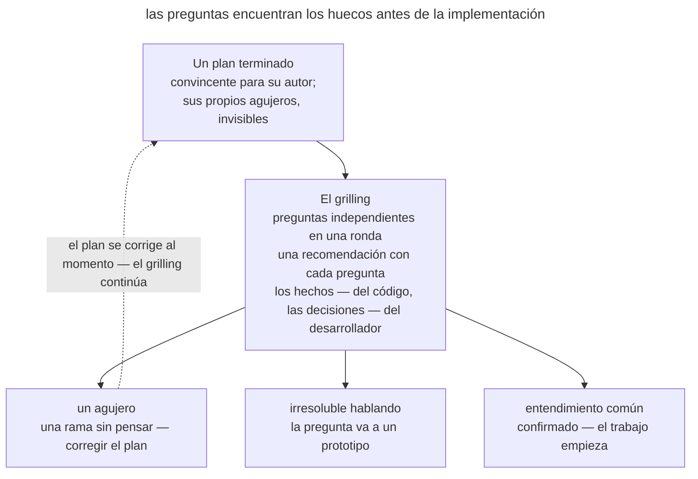

# Grilling

## Propósito

Pide al agente que ponga a prueba un plan terminado con una serie de preguntas, para destapar las suposiciones y las dependencias entre decisiones antes de empezar la implementación.

## También conocido como

Grilling, el interrogatorio; `/grilling` en los skills de Matt Pocock.

## Problema

Supón que escribiste un plan de migración de tarifas. Describe la suscripción normal, pero se salta las inscripciones corporativas. El plan te parece completo porque recuerdas las suposiciones que no escribiste. Pero otro participante, por ejemplo el agente, no las ve.

Si antes de la implementación nadie pregunta por las inscripciones corporativas, el agente aplicará una sola regla a todos los usuarios. Por eso recorre con el agente cada rama del plan: así un hueco como este aparece antes de que el agente cambie el código.

## Solución

Antes de que el agente empiece la implementación, pídele que pruebe el plan con preguntas. Por ejemplo:

> Revisa cada suposición de este plan. Primero averigua qué decisiones dependen de otras. Las preguntas cuyas respuestas necesarias ya se conocen, hazlas juntas, en una ronda breve. Una pregunta que depende de una respuesta que aún no tienes, déjala para la siguiente ronda. Para cada pregunta propone la respuesta que recomiendas y explica por qué. Los hechos búscalos tú en el código. Las decisiones consúltalas conmigo y espera mi respuesta. Empieza la implementación solo cuando yo confirme que tenemos un entendimiento común del plan.

En este prompt le das al agente tres reglas.

- **Dependencias entre preguntas.** Las preguntas que no dependen unas de otras, el agente las hace juntas. Si la siguiente pregunta depende de la respuesta a la anterior, el agente espera esa respuesta. La ronda debe ser tal que te dé tiempo a revisar todos los puntos.
- **Hechos del código.** Todo lo que se puede averiguar leyendo el proyecto, el agente lo encuentra solo. A ti te pregunta solo por las decisiones.
- **Recomendación con justificación.** Para cada pregunta el agente propone una respuesta recomendada y explica por qué aconseja precisamente esa. Así tienes una opción concreta que discutir.

Tu respuesta o confirma un punto del plan o muestra que hay que corregirlo. A veces una pregunta no se resuelve hablando: para responderla hay que ejecutar algo y mirar el resultado. Lleva esa pregunta a un [prototipo desechable](prototype-to-answer.md). Cuando todas las ramas importantes están revisadas, confirmas el plan y el agente empieza la implementación.

## Estructura

En el diagrama el agente recibe un plan terminado y recorre las ramas de decisiones.

```mermaid
---
title: las preguntas encuentran los huecos antes de la implementación
---
flowchart TB
  plan["Un plan terminado<br/>convincente para su autor;<br/>sus propios agujeros, invisibles"]:::accent
  grill["El grilling<br/>preguntas independientes en una ronda<br/>una recomendación con cada pregunta<br/>los hechos — del código, las decisiones — del desarrollador"]
  hole["un agujero<br/>una rama sin pensar — corregir el plan"]:::warn
  proto["irresoluble hablando<br/>la pregunta va a un prototipo"]:::muted
  shared["entendimiento común<br/>confirmado — el trabajo empieza"]:::accent
  plan --> grill
  grill --> hole
  grill --> proto
  grill --> shared
  hole -. "el plan se corrige al momento — el grilling continúa" .-> plan
```

Un hueco encontrado te devuelve enseguida al plan, y una pregunta que necesita un experimento va a un prototipo. Solo tú puedes terminar el grilling: el agente no decide por su cuenta que se ha alcanzado el entendimiento común.

## Participantes / Componentes

- **El plan** — el documento sobre el que el agente hace las preguntas.
- **El agente** — hace las preguntas, comprueba él mismo los hechos en el código y propone opciones de decisión.
- **El desarrollador** — responde a las preguntas y aprueba los cambios del plan.
- **Los huecos encontrados** — escenarios y dependencias que el plan aún no cubre.
- **El entendimiento común** — tú y el agente entendéis el plan de la misma manera. Antes de la implementación lo confirmas de forma explícita.

## Cuándo aplicarlo

- Tienes por delante un trabajo serio según un plan que escribiste en solitario.
- La decisión es difícil de revertir: por ejemplo, cambia un contrato público o un esquema de datos.
- El plan contiene suposiciones que nadie ha puesto a prueba con preguntas.

Si el cambio es pequeño y fácil de revertir, el grilling puede salir más caro que la propia implementación. Y si aún no hay plan, empieza por la [entrevista del agente](let-claude-interview-you.md): allí el agente redacta la especificación inicial a partir de tus respuestas. El grilling pone a prueba un plan ya escrito.

## Consecuencias y compromisos

- ➕ Encuentras los escenarios olvidados antes de que el agente escriba código.
- ➕ Para cada pregunta el agente da una recomendación, así que discutes una opción concreta.
- ➕ Las suposiciones que tenías en la cabeza quedan escritas en el plan.
- ➖ Cuesta revisar decisiones que dabas por definitivas.
- ➖ Una revisión detallada requiere reservarle un tiempo aparte.
- ➖ El agente puede darte la razón y saltarse los puntos débiles si no le pones la tarea clara de revisar el plan de forma crítica.

## Implementación

1. Escribe el plan para que el agente pueda referirse a decisiones concretas.
2. Pide al agente que revise las suposiciones y que haga juntas las preguntas independientes. Con las respuestas, el agente precisa el plan y decide qué preguntas hacer en la siguiente ronda.
3. Si no sabes la respuesta, dilo tal cual: «no lo sé». Anota esa pregunta en el plan como abierta.
4. Incorpora al plan cada cambio acordado en el momento, sobre la marcha de la conversación.
5. Las preguntas que necesitan un experimento, llévalas a un [prototipo desechable](prototype-to-answer.md).
6. Anota los términos acordados en el [vocabulario del dominio](domain-context-file.md), y las razones de las decisiones arquitectónicas en un ADR (architecture decision record), un archivo breve con la decisión y su razón.
7. Antes de la implementación, confirma el plan de forma explícita.

## Ejemplo

Antes de la migración de tarifas entregas el plan al agente para que lo revise. El agente empieza por las reglas de cambio de tarifa.

> En el plan la subida de tarifa se aplica de inmediato. Propongo aplicar la bajada desde el inicio del siguiente periodo y no devolver la diferencia por los días restantes. ¿Le sirve esta regla al producto?

La pregunta sobre los acuerdos corporativos no depende de la regla de bajada, y el agente la hace en la misma ronda. En cambio, la fecha de recálculo del pago sí depende de ella, así que el agente aplaza esa pregunta hasta tu respuesta.

> En el plan la suscripción siempre está ligada al pago. Pero según el vocabulario, un acuerdo corporativo crea una inscripción — el acceso a un curso — sin suscripción. ¿Cómo migrar los acuerdos corporativos que aún no han entrado en vigor?

Ese escenario no está en el plan. Precisas la regla de producto: si un acuerdo se cancela antes de su fecha de inicio, en esa fecha el acceso no debe abrirse. Queda una pregunta técnica: si el evento de inicio del acuerdo ya está en la cola, ¿no abrirá el acceso después de la cancelación?

Esta pregunta no se responde hablando, hace falta un [prototipo](prototype-to-answer.md). En el prototipo creas un acuerdo con una fecha de inicio futura, lo cancelas y adelantas el reloj al día siguiente a la fecha de inicio. Si el acceso se abre, el manejador del evento de inicio no tiene en cuenta la cancelación.

El agente prepara un [traspaso de sesión](handoff.md) con esta pregunta y el escenario. Volverás a la migración cuando hayas comprobado la solución.

## Antipatrones y errores comunes

- **No hay plan inicial.** Entonces no pones a prueba decisiones, sino que recoges requisitos, y la conversación se convierte en una [entrevista](let-claude-interview-you.md).
- **Preguntas dependientes en la misma ronda.** Una pregunta posterior puede apoyarse en una decisión que aún no has tomado. Por ejemplo, la fecha de recálculo del pago depende de la regla de bajada. Aplaza esa pregunta hasta la respuesta. Y si una ronda de preguntas independientes es tan larga que te saltas parte de los puntos, acórtala.
- **El agente responde por ti.** La recomendación del agente todavía no es una decisión. La decisión la tomas tú, así que el agente debe esperar tu respuesta.
- **Agujeros «para luego».** Si no anotas en el plan enseguida el agujero encontrado, para el final de la sesión se habrá perdido.
- **Conformidad formal.** El agente elogia el plan, pero no revisa las suposiciones. Así los escenarios olvidados no se encuentran.

## Usos conocidos

- **Los skills de Matt Pocock** implementan este proceso en `/grilling` y `/grill-with-docs`. En el [mapa de investigación](wayfinder.md) el grilling es uno de los tipos de trabajo: un ticket de este tipo precisa una decisión contigo.
- **El premortem** — antes de empezar el proyecto imaginas que ha fracasado y buscas por qué pudo pasar.
- **Las revisiones de documentos de diseño** resuelven un problema parecido: el plan no lo revisa su autor, sino otro participante.

## Patrones relacionados

- [Entrevista del agente](let-claude-interview-you.md) reúne los requisitos iniciales cuando aún no hay plan.
- [Prototipo desechable](prototype-to-answer.md) responde a las preguntas que no se resuelven hablando.
- [Escritor y revisor](writer-reviewer.md) revisa de forma independiente el código ya escrito.
- [Vocabulario del dominio](domain-context-file.md) guarda los términos y las decisiones acordados.
