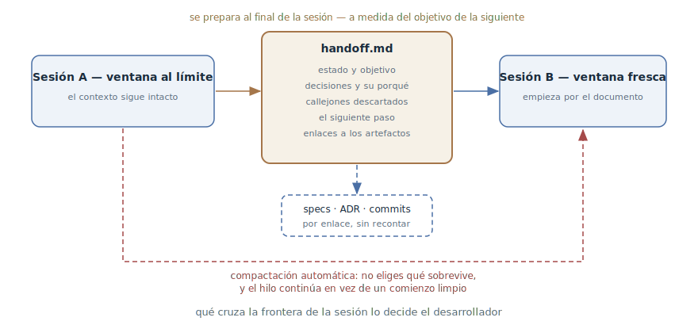

# Traspaso de sesión

## Propósito

En la frontera de la sesión, empaquetar deliberadamente su contenido en un
documento de traspaso desde el que empezará la siguiente sesión u otro
agente — en lugar de confiar en que el resumen automático decida qué
sobrevive del contexto.

## También conocido como

Handoff; `/handoff` en los skills de Matt Pocock; documento de traspaso.

## Problema

Toda sesión tiene una frontera: la ventana se acaba, el trabajo pasa a otro
agente, o la siguiente etapa conviene hacerla desde cero. El contexto no
cruza la frontera por sí solo, y las dos vías estándar de llevarlo son malas:

- **La compactación automática** se dispara por umbral y resume según su
  propio criterio. Qué sobrevive — las decisiones tomadas o el recuento de
  logs ya procesados — no lo eliges tú. Y pierde en silencio: te enteras
  solo cuando el agente «olvida» un acuerdo.
- **El recuento manual** es caro y agujereado: el desarrollador reconstruye
  de memoria lo que el agente sabía con más precisión — y pierde
  inevitablemente los motivos de las decisiones y los callejones
  descartados.

Hay una tercera desgracia: el resumen continúa *el mismo* trabajo en *el
mismo* hilo. Pero la siguiente sesión a menudo se necesita para otra cosa —
un prototipo, la implementación de un plan terminado, una revisión. No
necesita el recuento de toda la historia, sino un extracto a la medida de su
objetivo concreto.

## Solución

Como último acto de la sesión, el desarrollador pide al agente preparar un
documento de traspaso — y le dice para qué será la siguiente sesión. El
agente, con todo el contexto aún en la ventana, lo empaqueta para ese
objetivo:

- el estado actual y el objetivo de la siguiente sesión;
- las decisiones clave — con sus motivos, no solo los resultados;
- qué ya se probó y se descartó, para no probarlo de nuevo;
- el siguiente paso concreto;
- enlaces a los artefactos permanentes — especificaciones, ADR, commits,
  tickets — en lugar de recontarlos;
- pistas para el siguiente agente: qué skills y herramientas servirán.

Los secretos — claves, contraseñas, datos personales — se limpian: el
documento sale de los límites de la sesión. El documento es desechable y no
se commitea al repositorio: el conocimiento de larga vida pertenece a las
especificaciones, los ADR y el [diario de progreso](progress-file.md),
mientras que el traspaso vive de una sesión a la siguiente.

La sesión nueva empieza leyendo el documento — y recibe contexto denso y
curado para su tarea, no la lotería de la compactación automática ni la cola
de una historia ajena.

## Estructura



El camino superior es el patrón: la sesión saliente, con el contexto aún
intacto, prepara el documento de traspaso para el objetivo nombrado; la
siguiente sesión lo lee como primer mensaje. Los artefactos permanentes no se
reescriben en el documento — este los referencia, y la sesión nueva lee por
su cuenta lo que necesite. El camino inferior discontinuo es aquello a lo que
el patrón se opone: la compactación automática lleva a través de la frontera
lo que ella elige, y continúa el mismo hilo en vez de un comienzo limpio
hacia el objetivo nuevo.

## Participantes / Componentes

- **La sesión saliente** — el único momento en que el contexto aún está
  completo; prepara el documento.
- **El documento de traspaso** — un extracto desechable a la medida del
  objetivo: estado, decisiones, callejones, siguiente paso, enlaces.
- **La siguiente sesión** — una ventana fresca (otro agente, otro tipo de
  trabajo); empieza leyendo el documento.
- **El desarrollador** — nombra el objetivo de la siguiente sesión y decide
  cuándo llegó la frontera.
- **Los artefactos permanentes** — especificaciones, ADR, commits, tickets;
  entran en el documento como enlaces.

## Cuándo aplicarlo

- La ventana está al límite y el trabajo no está terminado — traspaso en vez
  de esperanza en la compactación automática.
- Cambia el carácter del trabajo: exploración → prototipo, plan →
  implementación, implementación → revisión. La etapa siguiente necesita una
  hoja limpia y un extracto, no toda la historia.
- El trabajo pasa a otro agente o a un colega.
- Una discusión larga acumuló decisiones que da pena confiar a la
  compactación.

Si el trabajo continúa en la misma sesión con el mismo rumbo, basta el
[diario de progreso](progress-file.md); el traspaso es una jugada
precisamente en la frontera.

## Consecuencias y compromisos

- ➕ Qué sobrevive a la frontera lo decide el desarrollador, no el umbral de
  la compactación automática.
- ➕ La sesión siguiente arranca con contexto cortado a su objetivo — más
  denso y más barato que la cola de una historia ajena.
- ➕ Los motivos de las decisiones y los callejones descartados cruzan
  explícitamente — justo lo que el resumen automático pierde primero.
- ➖ Una jugada manual: la frontera hay que verla venir — un documento
  preparado después de la compactación empaqueta un contexto ya recortado.
- ➖ La calidad depende del empaquetado: un documento mal preparado pierde lo
  mismo que el automatismo.
- ➖ La tentación de duplicar artefactos: recontar la especificación en el
  traspaso son tokens gastados y una segunda fuente de verdad.

## Implementación

1. Prepara un comando: el skill `/handoff` ya existe en el
   [pack de Matt Pocock](matt-pocock-skills.md), y en Claude Code es fácil
   hacer un slash command propio. La clave es una sola invocación, no un
   ritual de memoria.
2. Nombra siempre el objetivo: «prepara un handoff para una sesión que hará
   X». Un documento para implementar y uno para revisar son documentos
   distintos.
3. Mantén el contenido: estado y objetivo, decisiones con motivos, lo
   descartado, el siguiente paso, enlaces a artefactos, skills recomendados.
4. No dupliques: todo lo ya anotado en especificaciones, ADR, commits y
   tickets entra como enlace, no como recuento.
5. Limpia los secretos: el documento se leerá fuera de esta sesión.
6. Guárdalo fuera del repositorio — en un directorio temporal: es un
   documento desechable. Lo que deba vivir mucho pasa a los artefactos
   permanentes al cerrar la sesión.
7. Empieza la sesión siguiente por el documento: «lee tal archivo y
   continúa».
8. Vigila la ventana: el traspaso se prepara *antes* de la compactación. Si
   la herramienta muestra la ventana llenándose, es la señal de preparar la
   frontera.

## Ejemplo

Una sesión planificó la migración de tarifas y chocó con una pregunta
abierta: ¿aguanta el modelo elegido de cancelación de suscripciones los
contratos corporativos? Conviene resolverla con un prototipo en una sesión
limpia. El desarrollador cierra la actual:

> Prepara un handoff para la siguiente sesión: hará un prototipo del modelo
> de cancelaciones; la pregunta es si el modelo aguanta contratos
> corporativos con inicio diferido.

El agente escribe `handoff-cancellation-prototype.md` en el directorio
temporal:

```markdown
# Handoff: prototipo del modelo de cancelaciones

## Objetivo de la sesión
Verificar con un prototipo: ¿aguanta el modelo de cancelaciones basado
en eventos los contratos corporativos con inicio diferido?

## Contexto
El plan de migración de tarifas está listo
(ver docs/specs/tariff-migration.md). La pregunta abierta n.º 3 de ahí
es el modelo de cancelaciones.

## Decisiones
- La cancelación es un evento con fecha de efecto, no un cambio de
  estado: facturación necesita la historia (ADR-0009).

## Descartado
- Un flag cancelled_at en la suscripción: pierde las cancelaciones
  repetidas tras la reactivación.

## Siguiente paso
Prototipo: tres escenarios — cancelación inmediata, cancelación con
fecha, cancelación antes del inicio del contrato.

## Skills recomendados
/prototype — la sesión va entera de código desechable.
```

La sesión nueva empieza con una sola línea:

> Lee /tmp/handoff-cancellation-prototype.md y ponte en marcha.

La sesión del prototipo no arrastra tres horas de planificación — solo el
extracto para su pregunta y un enlace a la especificación por si hacen falta
detalles.

## Antipatrones y errores comunes

- **Confiar la frontera a la compactación automática.** Las decisiones y los
  motivos se van en silencio; el patrón existe precisamente para que eso no
  pase.
- **Traspaso-volcado.** Descargar toda la historia «por si acaso» — la
  sesión siguiente empieza con ruido ajeno en vez de contexto limpio. El
  traspaso es un extracto para un objetivo.
- **Recontar los artefactos.** La especificación y los ADR ya están
  escritos — en el traspaso su sitio es un enlace. La copia caducará y
  empezará a mentir.
- **El traspaso en git.** Un documento desechable en el repositorio es
  basura y riesgo de fuga: se escribió sin pensar en una vida larga. Lo
  duradero va al diario, los ADR y las especificaciones.
- **Prepararlo después de la compactación.** Tarde: la mitad del contexto ya
  se tiró. El traspaso se escribe con la ventana intacta.

## Usos conocidos

- **Skills de Matt Pocock** — `/handoff`: documento desechable en el
  directorio temporal, sección de skills recomendados, prohibición de
  duplicar artefactos, limpieza de secretos; en el flujo principal del pack
  el traspaso conecta la entrevista con el prototipo y otros cambios de
  etapa.
- **Claude Code** — `/compact` con instrucción («compacta, céntrate en X») —
  el hermano menor integrado del patrón: el foco se puede fijar, pero el
  resultado se queda en el mismo hilo y no sobrevive al cambio de sesión.
- **La compactación del artículo de Anthropic sobre ingeniería de
  contexto** — la variante automatizada de la misma operación en los
  harnesses de agentes de larga duración: resumir con máximo recall y luego
  afinar la precisión.
- **Los subagentes** — el mismo traspaso de abajo arriba: el subagente
  devuelve al coordinador un resumen condensado de su trabajo, no el rastro
  completo.

## Patrones relacionados

- [Diario de progreso](progress-file.md) — el vecino en la capa de estado:
  el diario se lleva sobre la marcha y vive en el repositorio, el traspaso
  se escribe una vez en la frontera y muere tras ser leído.
- [Ingeniería de contexto](context-engineering.md) — el traspaso es una
  compactación deliberada: el principio de «mínimos tokens, máxima señal»
  aplicado a mano a la frontera de la sesión.
- [Cuatro fases](explore-plan-code-commit.md) — un plan aprobado es un
  documento de traspaso ya hecho: puede ejecutarse en una sesión fresca sin
  arrastrar la historia de la discusión.
- [Desarrollo orientado a especificaciones](spec-driven-development.md) —
  los artefactos permanentes de SDD y el traspaso desechable se
  complementan: los primeros guardan el conocimiento, el segundo transporta
  el momento de trabajo.
