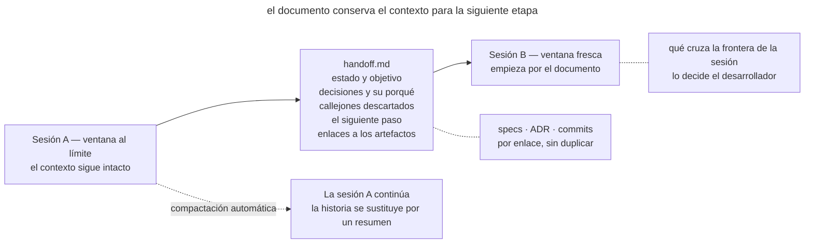

# Traspaso de sesión

## Propósito

Antes de cambiar de sesión, guardar el estado del trabajo en un documento de traspaso. El siguiente agente recibe el objetivo, las decisiones tomadas y el primer paso desde el que puede continuar.

## También conocido como

Handoff; `/handoff` en las skills de Matt Pocock; documento de traspaso.

## Problema

Hay que terminar una sesión cuando se acaba la ventana o cambia la naturaleza del trabajo. Por ejemplo, después de planificar hay que comprobar una decisión discutida con un prototipo aparte.

Un resumen automático puede conservar el curso de la discusión, pero omitir la razón por la que se descartó una opción. Entonces el agente nuevo repetirá una investigación ya hecha. Recontarlo a mano también lleva tiempo y depende de tu memoria.

Para la siguiente etapa es más útil seleccionar de antemano la información según su objetivo. Un prototipo necesita la pregunta abierta y el criterio del experimento, mientras que una implementación necesita el plan acordado.

## Solución

Antes de terminar, pide al agente que prepare un documento para un objetivo nombrado. Mientras el contexto está disponible, puede guardar la información necesaria.

- el estado actual y el objetivo de la siguiente sesión;
- las decisiones clave y sus razones;
- lo que ya se probó y se descartó, para no volver a probarlo;
- un siguiente paso concreto;
- enlaces a especificaciones, ADR, commits y tickets;
- recomendaciones sobre skills y herramientas para la siguiente sesión.

Elimina del documento los secretos y los datos personales innecesarios. En esta variante del patrón, el traspaso se guarda en un directorio temporal y se usa para una transferencia concreta. Guarda el conocimiento a largo plazo en especificaciones, ADR y el [diario de progreso](progress-file.md).

La siguiente sesión empieza por el documento y sigue los enlaces para leer los materiales adicionales que la tarea necesite.

## Estructura

El camino superior del diagrama muestra un traspaso para un objetivo dado.


```mermaid
---
title: el documento conserva el contexto para la siguiente etapa
---
flowchart LR
  a["Sesión A — ventana al límite<br/>el contexto sigue intacto"]
  doc["handoff.md<br/>estado y objetivo<br/>decisiones y su porqué<br/>callejones descartados<br/>el siguiente paso<br/>enlaces a los artefactos"]:::accent
  b["Sesión B — ventana fresca<br/>empieza por el documento"]
  artifacts["specs · ADR · commits<br/>por enlace, sin duplicar"]:::muted
  a --> doc --> b
  doc -.- artifacts
  compact["La sesión A continúa<br/>la historia se sustituye por un resumen"]:::muted
  a -. "compactación automática" .-> compact
  note["qué cruza la frontera de la sesión<br/>lo decide el desarrollador"]:::muted
  b -.- note
```

El agente actual redacta el documento, y el siguiente lo lee y accede a los artefactos permanentes mediante los enlaces. El camino inferior muestra la compactación automática dentro de la conversación actual, en la que controlas menos qué entra en el resumen.

## Participantes / Componentes

- **La sesión saliente** reúne el documento mientras el contexto necesario sigue disponible.
- **El documento de traspaso** conserva el estado y el siguiente paso para un objetivo concreto.
- **La siguiente sesión** lee el documento antes de continuar el trabajo.
- **Desarrollador** elige el momento del traspaso y el objetivo de la siguiente etapa.
- **Los artefactos permanentes** aportan los detalles mediante enlaces desde el documento.

## Cuándo aplicarlo

- La ventana se acaba antes de terminar la tarea.
- El trabajo pasa de la investigación a un prototipo, a la implementación o a la revisión.
- El trabajo se entrega a otro agente o a un compañero.
- Una discusión larga ha acumulado decisiones que no conviene confiar a la compactación.

Para continuar el mismo trabajo, a menudo basta un [diario de progreso](progress-file.md). El traspaso es útil en el momento de pasar de una sesión a otra.

## Consecuencias y compromisos

- ➕ Puedes comprobar qué información recibirá quien retome el trabajo.
- ➕ La sesión nueva recibe un contexto a medida de su tarea.
- ➕ Las razones de las decisiones y las hipótesis ya comprobadas se conservan de forma explícita.
- ➖ Hay que preparar el documento antes de que la información necesaria se pierda de la ventana.
- ➖ Un resumen incompleto puede omitir los mismos detalles que la compactación automática.
- ➖ Recontar los documentos permanentes crea copias que pueden divergir de los originales.

## Implementación

1. Prepara un comando de traspaso repetible. Por ejemplo, `/handoff` está en el [pack de Matt Pocock](matt-pocock-skills.md).
2. Nombra el objetivo de la siguiente sesión para que el agente seleccione la información para él.
3. Guarda el estado, las decisiones con sus razones, las hipótesis ya comprobadas y el siguiente paso.
4. Da enlaces a las especificaciones, los ADR y los tickets.
5. Comprueba que el documento no contiene secretos.
6. Coloca el traspaso en un directorio temporal. Lleva el conocimiento que se necesita a largo plazo a los documentos permanentes.
7. Empieza la siguiente sesión pidiéndole que lea el traspaso.
8. Prepara el traspaso antes de que se compacte la ventana, mientras el agente todavía puede reconstruir las razones de las decisiones.

## Ejemplo

Al planificar la migración de tarifas quedó una pregunta sobre los contratos corporativos con inicio diferido. Decides comprobar el modelo de cancelaciones con un prototipo y preparas una sesión nueva.

> Prepara un handoff para un prototipo del modelo de cancelaciones. La siguiente sesión debe comprobar si el modelo admite contratos corporativos con inicio diferido.

El agente guarda _handoff-cancellation-prototype.md_ en el directorio temporal.

```markdown
# Handoff: prototipo del modelo de cancelaciones

## Objetivo de la sesión
Verificar con un prototipo: ¿aguanta el modelo de cancelaciones basado
en eventos los contratos corporativos con inicio diferido?

## Contexto
El plan de migración de tarifas está listo (ver docs/specs/tariff-migration.md).
La pregunta abierta n.º 3 de ahí es el modelo de cancelaciones.

## Decisiones
- La cancelación es un evento con fecha de efecto, no un cambio de
  estado: facturación necesita la historia (ADR-0009).

## Descartado
- Un flag cancelled_at en la suscripción: pierde las cancelaciones
  repetidas tras la reactivación.

## Siguiente paso
Prototipo: tres escenarios — cancelación inmediata, cancelación con
fecha, cancelación antes del inicio del contrato.

## Skills recomendados
/prototype — la sesión va entera de código desechable.
```

En la sesión nueva pasas la ruta al documento.

> Lee /tmp/handoff-cancellation-prototype.md y ponte en marcha.

El agente empieza el prototipo a partir de la pregunta planteada y de los enlaces a las decisiones acordadas. No necesita reconstruirlas a partir de varias horas de discusión.

## Antipatrones y errores comunes

- **Confiar la frontera a la compactación automática.** Las decisiones y sus razones se van en silencio; el patrón existe precisamente para que eso no ocurra.
- **Traspaso-volcado.** La historia completa ocupa la ventana de la siguiente sesión. Selecciona la información según su objetivo.
- **Recontar los artefactos.** Una copia de la especificación puede quedarse obsoleta. Pasa un enlace al documento original.
- **Un traspaso de un solo uso en git.** Un resumen temporal se queda obsoleto enseguida. Guarda en el repositorio la información que el equipo piensa mantener.
- **Traspasar después de perder el contexto.** El agente solo podrá anotar la información que quede. Prepara el documento con antelación.

## Usos conocidos

- **Skills de Matt Pocock** usan `/handoff` para pasar de una etapa a otra, incluido el paso de la entrevista al prototipo.
- **Claude Code** permite fijar un foco para `/compact`. Ese resumen continúa el trabajo en la conversación actual.
- **El artículo de Anthropic sobre ingeniería de contexto** describe la compactación del contexto para el trabajo prolongado de los agentes.
- **Los subagentes** devuelven al coordinador un resumen de resultados seleccionados para su tarea.

## Patrones relacionados

- [Diario de progreso](progress-file.md) se actualiza sobre la marcha y se guarda en el repositorio.
- [Ingeniería de contexto](context-engineering.md) explica cómo seleccionar la información para el traspaso.
- [Cuatro fases](explore-plan-code-commit.md) permite pasar un plan aprobado a una sesión nueva de implementación.
- [Desarrollo orientado a especificaciones](spec-driven-development.md) guarda los documentos permanentes a los que remite el traspaso.
