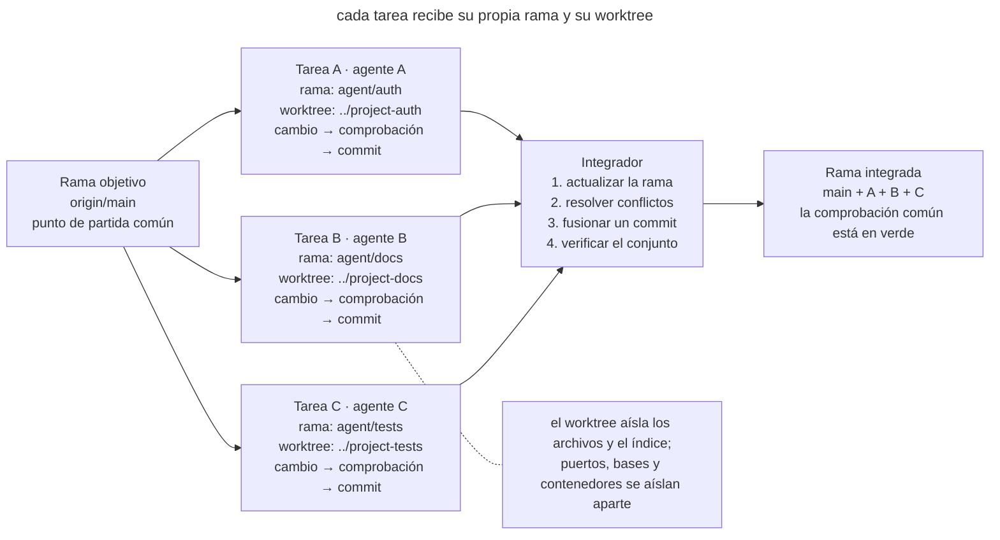
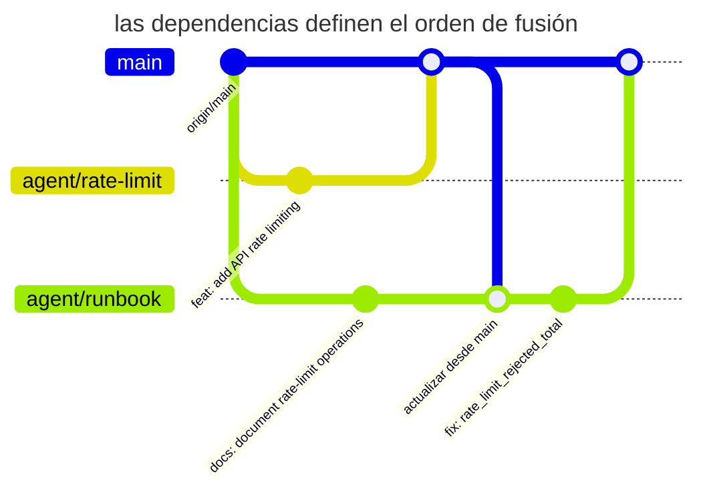

# Trabajo paralelo aislado

## Propósito

Asignar a cada tarea paralela su propia rama y su propio árbol de trabajo. El agente verifica el cambio en su directorio y entrega el resultado como un commit. El integrador fusiona los cambios terminados de uno en uno.

## También conocido como

Worktree per task, branch per agent, isolated checkout, worktrees paralelos.

## Problema

Un agente cambia la autenticación mientras un segundo actualiza la documentación en el mismo checkout. El segundo ve los archivos inacabados del primero y los formatea. Ahora las pruebas se ejecutan sobre una mezcla de cambios, y el commit de un agente puede capturar líneas ajenas.

Un checkout compartido mezcla los cambios antes incluso del commit. Esto complica varias operaciones habituales.

- `git diff` ya no responde qué tarea produjo una línea;
- la comprobación de una tarea se ejecuta sobre el código de otra y da una falsa señal verde;
- un agente puede borrar o reescribir un cambio desconocido por considerarlo «sobrante»;
- en la revisión y la reversión cuesta determinar los límites de la tarea;
- dos procesos compiten por el índice de Git, los archivos generados y las dependencias locales.

Crear ramas sin más no separa los archivos de trabajo. En un directorio hay una sola rama activa, así que cambiarla afecta a todos los procesos que usan ese directorio.

Los clones separados aíslan el trabajo, pero duplican la historia. Git worktree permite crear varios directorios, cada uno con su propio `HEAD`, índice y archivos, sobre un almacén de objetos de Git compartido.

## Solución

Asigna a cada tarea **su propia rama y su propio worktree**, un ámbito de responsabilidad y un criterio de finalización. El agente cambia y verifica archivos dentro de su directorio. El commit verificado es el resultado que se puede entregar para la integración.

Integra las ramas terminadas de una en una. Antes de fusionar, actualiza la rama desde la rama objetivo, resuelve los conflictos en el contexto de su tarea y vuelve a ejecutar las comprobaciones. Así la competencia deja de ser una escritura descontrolada en archivos compartidos y se convierte en una integración de Git normal y observable.

Las siguientes reglas sostienen el aislamiento.

1. **El directorio de trabajo** pertenece a una sola tarea o sesión.
2. **El ámbito de responsabilidad** define qué cambios están permitidos.
3. **La entrega del resultado** se hace mediante un commit verificado.
4. **La integración** actualiza la rama objetivo de forma secuencial y verifica el estado combinado.

## Estructura

En el diagrama, cada tarea recorre su propio ciclo en un worktree separado.



El integrador acepta los commits de uno en uno y verifica el estado ensamblado. Los solapamientos entre tareas aparecen al actualizar y fusionar las ramas.

## Participantes / Componentes

- **Rama objetivo** reúne los cambios terminados, por ejemplo en `main`.
- **Tarea** define un resultado independiente y un ámbito de cambios.
- **Rama de la tarea** guarda la historia de su implementación.
- **Worktree** contiene los archivos de trabajo y un índice de Git propio.
- **Agente** trabaja en el directorio asignado.
- **Integrador** decide el orden de fusión y verifica el resultado común.
- **Contrato de entorno** separa puertos, bases de datos, contenedores y archivos temporales.

## Cuándo aplicarlo

- Dos o más tareas independientes pueden hacerse realmente a la vez.
- Un agente implementa un cambio mientras otro escribe pruebas o documentación, o investiga el código.
- Necesitas comparar varias implementaciones sin sobrescribir los resultados de los experimentos.
- Una tarea larga no debe bloquear una corrección urgente en el mismo repositorio.
- Las sesiones paralelas se lanzan en local o mediante un harness automático.

Si dos cambios necesitan constantemente los resultados sin commit del otro, hazlos de forma secuencial. El trabajo paralelo compensa una vez que has separado partes con comprobación propia.

## Consecuencias y compromisos

- ➕ Los archivos de trabajo de las tareas quedan separados en directorios distintos.
- ➕ La comprobación en una rama se refiere a una tarea concreta, y repetirla tras la fusión evalúa el comportamiento conjunto.
- ➕ Un experimento fallido se puede borrar junto con su worktree.
- ➕ Un PR vincula el resultado con la tarea y con el participante responsable.
- ➖ Las tareas mal divididas siguen produciendo conflictos de fusión difíciles.
- ➖ Cada worktree necesita instalar dependencias y configurar su entorno; sin un bootstrap rápido, la preparación se come la ganancia.
- ➖ Git aísla archivos, pero no recursos externos. Los mismos puertos, una única base de pruebas o un directorio de caché común siguen creando carreras.
- ➖ Un gran número de ramas requiere un responsable de la integración y un orden de dependencias.

## Implementación

1. Separa resultados autónomos. Para cada tarea, anota el criterio de finalización, el ámbito de responsabilidad y las dependencias.
2. Fija el punto de partida y crea ramas separadas con worktrees.

   ```bash
   git fetch origin
   git worktree add -b agent/auth ../project-auth origin/main
   git worktree add -b agent/docs ../project-docs origin/main
   ```

   `git worktree list` muestra todos los directorios y ramas activos. Git no deja usar por accidente la misma rama en dos worktrees salvo que se fuerce la omisión de esta protección.
3. Ejecuta en cada directorio la preparación estándar del proyecto. Un comando como `make setup` debe llevar un worktree nuevo a un estado verde reproducible; configurar cada instancia a mano no escala.
4. Entrega al agente la tarea y las reglas de trabajo en el directorio asignado. Indica qué archivos puede cambiar y qué resultado verificado debe devolver.
5. Separa el entorno externo. Asigna puertos, nombres de contenedores, bases de pruebas y directorios temporales distintos. Es mejor montar los secretos como solo lectura o sustituirlos por valores locales seguros.
6. Cada agente verifica su cambio dentro de su rama y crea un único commit con sentido. El estado inacabado no se pasa a las tareas vecinas como dependencia.
7. El integrador elige el orden según las dependencias. Antes de fusionar, cada rama incorpora la rama objetivo actual, resuelve los conflictos y repite su comprobación.
8. Después de cada fusión, ejecuta la comprobación del estado común. Dos ramas verdes no garantizan una composición verde.
9. Tras la integración, elimina los worktrees limpios con el comando estándar.

   ```bash
   git worktree remove ../project-auth
   git worktree remove ../project-docs
   git worktree prune
   ```

   Usa `git worktree remove`. El comando se niega a eliminar un worktree con archivos sin commit, para que no se pierda trabajo.

### Resolver conflictos a partir de la intención

Ante un conflicto, pide al agente que reconstruya el propósito de ambos cambios a partir de los commits, los PR y las tareas originales. Debe explicar qué requisitos conserva la versión combinada. Si los requisitos son incompatibles, acuerda el comportamiento deseado antes de continuar la integración.

Por ejemplo, una rama añade un tiempo límite a las peticiones y otra limita el número de reintentos. Elegir solo un lado puede perder la otra restricción. Después de combinarlas, comprueba ambos comportamientos y su funcionamiento conjunto. Incluso la fusión automática de Git requiere esta comprobación. El skill [resolving-merge-conflicts](https://github.com/mattpocock/skills/blob/main/skills/engineering/resolving-merge-conflicts/SKILL.md) se basa en recuperar las intenciones originales; añade al índice solo los archivos de la integración actual y conserva los cambios ajenos.

## Ejemplo

Un equipo prepara la limitación de frecuencia de peticiones y una página de operaciones para una tienda en línea. Creas dos worktrees desde el mismo `origin/main`.

```text
shop/                 main, solo integración
shop-rate-limit/      agent/rate-limit, código + pruebas
shop-runbook/         agent/runbook, documentación + comprobación de enlaces
```

El primer agente cambia el middleware y las pruebas; el segundo escribe el runbook. Cada uno ejecuta `make setup` y sus comprobaciones en un directorio separado. El resultado son dos commits.

```text
4d23f91 feat: add API rate limiting
8a771bc docs: document rate-limit operations
```

El runbook depende de los nombres definitivos de las métricas, así que el integrador fusiona primero el código. Después actualiza la rama de documentación y detecta el cambio de nombre a `rate_limit_rejected_total`. Corrige la referencia y repite la comprobación de la documentación antes de fusionar.



En el diagrama, ambas ramas parten del mismo punto. La rama `agent/runbook` recibe el código fusionado antes de terminar, por eso la corrección del nombre de la métrica aparece como un commit de documentación separado.

Los servidores locales necesitan puertos distintos, por ejemplo `PORT=4101` y `PORT=4102`, y bases de pruebas separadas. El worktree separa los archivos, pero los recursos externos compartidos todavía pueden crear carreras.

## Antipatrones y errores comunes

- **Checkout compartido.** Varios agentes que escriben en un mismo directorio mezclan sus cambios inacabados.
- **Rama sin worktree.** Los procesos se turnan para cambiar de rama en un mismo directorio; los archivos cambian bajo sus pies.
- **Worktree sin propietario.** Varias tareas en un mismo directorio vuelven a mezclar sus cambios.
- **División por archivos en vez de resultados.** «Tú cambias el controlador; tú, las pruebas» crea dos mitades que no se pueden verificar ni terminar de forma independiente.
- **Infraestructura compartida.** Directorios distintos arrancan el mismo proyecto de Compose, usan una misma base o un mismo puerto y obtienen carreras fuera de Git.
- **Fusión en paralelo.** Varios procesos actualizan la rama objetivo a la vez. El punto de serialización desaparece y las comprobaciones verdes quedan obsoletas enseguida.
- **Integración sin volver a verificar.** Cada rama está en verde por separado, pero nadie ha ejecutado su composición.
- **Worktrees eternos.** Los directorios terminados no se eliminan, las ramas pierden a sus propietarios y una semana después nadie sabe dónde quedó el trabajo valioso.

## Usos conocidos

- **Claude Code** recomienda worktrees separados para sesiones CLI paralelas, de modo que sus cambios no choquen, y usa la misma técnica al repartir trabajo masivamente entre archivos.
- **El experimento de Anthropic con un compilador de C** usó contenedores y clones separados para los agentes, bloqueos de tareas y sincronización mediante Git.
- **Git worktree** admite varios árboles de trabajo de un mismo repositorio sin clones completos.

Los ejemplos se describen en [Claude Code best practices](https://code.claude.com/docs/en/best-practices), el [experimento con el compilador de C](https://www.anthropic.com/engineering/building-c-compiler) y la [documentación de Git worktree](https://git-scm.com/docs/git-worktree).

## Patrones relacionados

- [Una funcionalidad a la vez](one-feature-at-a-time.md) acota el trabajo dentro de un solo worktree.
- [Escritor y revisor](writer-reviewer.md) reparte la implementación y la revisión entre sesiones.
- [Bucle de retroalimentación](give-agent-a-way-to-verify.md) verifica las ramas antes y después de la integración.
- [Cuatro fases](explore-plan-code-commit.md) cierra el ciclo con un commit verificado.
- [Inicio reproducible del agente](reproducible-agent-bootstrap.md) prepara un worktree nuevo con un único comando verificable.
