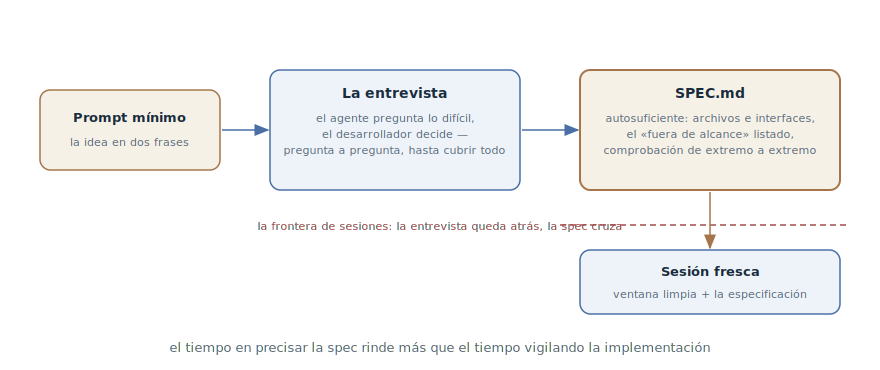

# Entrevista del agente

## Propósito

Invertir el planteamiento de una tarea grande: en vez de escribir la
especificación tú mismo, empezar con una descripción mínima y dejar que el
agente te entreviste — hasta que de tus respuestas se arme una
especificación autosuficiente. La ejecuta una sesión fresca con contexto
limpio.

## También conocido como

Let Claude interview you, la entrevista invertida.

## Problema

Una funcionalidad grande vive en tu cabeza — y de ahí sale mal:

- Escribir la especificación tú mismo es duro y sesgado: no sabes lo que no
  sabes. Los casos límite, las bifurcaciones de UX y los compromisos en los
  que no pensaste no llegarán al texto — no hay quien pregunte por ellos.
- Volcarlo todo en un prompt largo da un montón de texto sin estructura: lo
  importante mezclado con lo obvio, y los agujeros siguen ahí.
- Lo no dicho aflora en el peor momento: a mitad de la implementación el
  agente topa con una pregunta sin resolver — y la resuelve él solo, en
  silencio, como salga.

## Solución

Empezar con lo mínimo y ceder la iniciativa al agente:

> Quiero construir [descripción breve]. Entrevístame en detalle: pregunta
> por la implementación técnica, la UX, los casos límite, los riesgos y los
> compromisos. No hagas preguntas obvias — excava en las partes difíciles
> en las que quizá no pensé. Sigue hasta cubrirlo todo y luego escribe la
> especificación completa en SPEC.md.

Los roles se reparten limpiamente: el agente pregunta — y es bueno en ello,
porque conoce los agujeros típicos de este tipo de funcionalidades; tú
decides — cada respuesta fija una decisión que de otro modo habría aflorado
a mitad de la implementación.

El final de la entrevista es una especificación **autosuficiente**: nombra
los archivos y las interfaces implicados, lista explícitamente lo que queda
*fuera* del alcance y termina con un paso de verificación de extremo a
extremo que demuestra que la funcionalidad funciona. La autosuficiencia es
el criterio de listo: con una spec así se puede trabajar sin acceso a su
autor.

La ejecución ocurre en una sesión fresca: una ventana limpia dedicada
entera a la implementación, con la especificación como fuente. La
entrevista no se arrastra al contexto del ejecutor — todo lo valioso ya
está en SPEC.md. El tiempo invertido en precisar la especificación rinde
más que el tiempo invertido en vigilar la implementación.

## Estructura

A la izquierda, el prompt mínimo — la idea en un par de frases. En el
centro, el ciclo de la entrevista: el agente pregunta por lo difícil, el
desarrollador decide, pregunta a pregunta. A la derecha, el producto — una
especificación autosuficiente con los archivos, los límites del alcance y
la comprobación de extremo a extremo. La frontera discontinua la separa de
la ejecución: la sesión fresca recibe la spec y una ventana limpia; la
entrevista queda atrás.

## Participantes / Componentes

- **El desarrollador** — la fuente de las decisiones: responde, elige,
  recorta el alcance.
- **El agente entrevistador** — pregunta por lo que no pensaste; con la
  instrucción de no preguntar lo obvio.
- **SPEC.md** — el producto de la entrevista: una especificación
  autosuficiente con archivos, límites y comprobación.
- **La sesión fresca** — el ejecutor: ventana limpia más la
  especificación, sin la cola de la entrevista.

## Cuándo aplicarlo

- Una funcionalidad grande cuyos requisitos están en tu cabeza pero no en
  papel — y escribirlos tú mismo no sale.
- Trabajas solo o en un equipo pequeño sin analista dedicado: el agente
  cubre el rol de quien hace las preguntas incómodas.
- Las specs que escribiste solo en el pasado acababan sistemáticamente con
  agujeros en los mismos sitios.

No hace falta para cambios pequeños — basta el planteamiento normal — ni
cuando la especificación ya existe: un plan terminado no se entrevista, se
[ataca](grilling.md).

## Consecuencias y compromisos

- ➕ Las preguntas destapan lo que no habías pensado: el agente conoce los
  agujeros típicos — reintentos, carreras, estados vacíos, permisos.
- ➕ La especificación nace estructurada y autosuficiente — una entrada
  lista para la [tubería SDD](spec-driven-development.md).
- ➕ El ejecutor recibe contexto limpio: la ventana no está sepultada bajo
  una hora de negociaciones.
- ➖ La entrevista cuesta tiempo y paciencia: docenas de preguntas seguidas
  agotan.
- ➖ La calidad cuelga de la instrucción: sin el «no preguntes lo obvio» el
  agente empieza con «¿qué framework usamos?».
- ➖ Las respuestas desganadas lo devalúan todo: un «como mejor te parezca»
  a cada pregunta da una especificación hecha de conjeturas del agente —
  para eso no hacía falta entrevistarse.

## Implementación

1. Escribe el prompt mínimo: la idea en una o dos frases más la petición de
   entrevistarte — con un explícito «excava lo difícil, no preguntes lo
   obvio».
2. Responde como dueño: cada respuesta es una decisión. Si no sabes, dilo:
   «no lo sé — propón opciones» es mejor que una elección al azar.
3. Exige el final como archivo: la especificación completa en `SPEC.md`, no
   un resumen en el chat.
4. Comprueba la autosuficiencia: archivos e interfaces nombrados, el «fuera
   de alcance» listado, al final el paso de verificación de extremo a
   extremo. ¿Falta algo? — otra ronda de preguntas.
5. Ejecuta con una sesión fresca: contexto nuevo, `SPEC.md` de entrada.
   Para trabajo mayor que una sesión, la spec entra en la
   [tubería SDD](spec-driven-development.md) — como plan y tareas.

## Ejemplo

El desarrollador quiere webhooks para las integraciones y escribe
exactamente eso:

> Quiero añadir webhooks para que los clientes reciban eventos de pedidos.
> Entrevístame en detalle, excava lo que no haya considerado y luego
> escribe la especificación en SPEC.md.

El agente pregunta — de una en una, con recomendación en cada pregunta: qué
eventos van en la primera versión; qué hacer si el receptor devuelve un
500 — recomiendo reintentos exponenciales con tope; ¿se firma el payload? —
recomiendo HMAC; ¿garantizamos el orden de los eventos?; ¿qué hay de la
deduplicación en el cliente? En «¿qué pasa si un receptor es
consistentemente lento y acumula cola?» el desarrollador se detiene: no lo
había pensado en absoluto — deciden desactivar el webhook tras N fallos,
con notificación.

Veinte preguntas después, en `SPEC.md` está la especificación: los eventos
y su formato, la política de reintentos, la firma, «fuera de alcance: la UI
de configuración — siguiente iteración» y la comprobación de extremo a
extremo — «crear un pedido, ver el evento entregado en un receptor de
prueba, tumbar el receptor, ver los reintentos y la desactivación». El
desarrollador abre una sesión fresca: «implementa según SPEC.md» — y el
ejecutor trabaja con un documento donde la pregunta del receptor lento ya
está decidida.

## Antipatrones y errores comunes

- **«Como mejor te parezca» a todo.** La entrevista funciona solo mientras
  las decisiones son tuyas: un agente que se responde a sí mismo produce
  una especificación de conjeturas.
- **Entrevista sin archivo.** Las decisiones que se quedan en la
  conversación mueren con la sesión — el final es siempre `SPEC.md`.
- **Ejecutar en la misma sesión.** La ventana está sepultada bajo la
  entrevista, y el ejecutor arrastra una hora de negociación en vez de un
  contexto limpio. La spec es autosuficiente — dale una sesión fresca.
- **Preguntas obvias.** Sin el explícito «excava lo difícil» el agente
  entrevista por la superficie — y los agujeros se quedan donde estaban.
- **Entrevista en vez de grilling.** Si el plan ya está escrito,
  reconstruirlo a preguntas llega tarde — hay que [atacarlo](grilling.md).

## Usos conocidos

- **Claude Code best practices** — la fuente primaria con el prompt ya
  hecho: la entrevista vía AskUserQuestion, «dig into the hard parts I
  might not have considered», la especificación a SPEC.md, la ejecución en
  sesión fresca.
- **Kiro** — las sesiones de especificación como modo del IDE: la misma
  idea integrada en la herramienta — los requisitos nacen en un diálogo con
  aprobaciones por fases.
- **Skills de Matt Pocock** — `/grill-with-docs`: una entrevista que lee la
  base de código en paralelo y asienta sus decisiones en CONTEXT.md y los
  ADR.

## Patrones relacionados

- [Grilling](grilling.md) — el vecino espejo: la entrevista *construye* una
  especificación desde cero, el grilling *ataca* un plan terminado.
- [Desarrollo orientado a especificaciones](spec-driven-development.md) —
  el receptor del resultado: SPEC.md es una entrada lista de la tubería.
- [Cuatro fases](explore-plan-code-commit.md) — la escala menor: allí el
  agente explora y planifica solo; aquí el plan nace de tus decisiones.
- [Especificación prematura](premature-specification.md) — el antipatrón
  del que protege la entrevista: la especificación se arma de decisiones
  sobre preguntas, no de conjeturas tempranas sobre la implementación.
