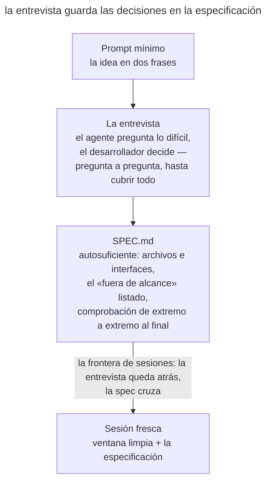

# Entrevista del agente

## Propósito

Si los requisitos de una funcionalidad aún no están escritos, describe brevemente la idea al agente y pídele que te entreviste. El agente preguntará por escenarios que quizá pasaste por alto. A partir de tus respuestas redactará una especificación autosuficiente: un documento que se entiende sin leer la entrevista. Después, una sesión fresca implementa la tarea a partir de ella.

## También conocido como

Let Claude interview you, la entrevista invertida, agent-led interview.

## Problema

Supongamos que pides al agente que añada webhooks de pedidos. Te imaginas cómo debe funcionar la funcionalidad, pero aún no has escrito todos los escenarios. La experiencia te sugiere el camino habitual, y no ves las excepciones.

Tu petición no dice qué hacer si el receptor responde despacio. Así que el agente tendrá que elegir la política de reintentos por su cuenta, ya durante la implementación. Incluso una descripción detallada de la idea puede conservar ese hueco, porque la escribes apoyándote en la misma experiencia. Por eso hace falta un interlocutor que pregunte qué debe pasar ante un fallo.

## Solución

Describe la intención en unas pocas frases y pide al agente que te pregunte por lo que podrías haber pasado por alto. Por ejemplo:

> Quiero construir [descripción breve]. Entrevístame y escribe los requisitos en SPEC.md

El agente busca los puntos donde el comportamiento de la funcionalidad aún no está definido y te pregunta por ellos. Lo que está registrado en el proyecto, el agente lo averigua sin ti, y las decisiones de producto las tomas tú. Con cada respuesta decides algo que, de otro modo, el agente elegiría por su cuenta durante la implementación: por ejemplo, qué hacer con un receptor lento.

Al final, el agente escribe una **especificación autosuficiente**: un documento que el siguiente ejecutor entenderá sin leer la entrevista. Incluye los requisitos, los límites de la tarea y una comprobación de extremo a extremo, es decir, un escenario que muestra que la funcionalidad funciona en su conjunto.

Empieza la implementación en una sesión fresca, una conversación nueva con el agente. La entrevista larga ya ocupó parte de la [ventana de contexto](glossary.md), el volumen de datos que el modelo tiene en cuenta en cada respuesta. Una sesión fresca empieza con la ventana limpia y la especificación. No ve la entrevista, así que todas las decisiones importantes de ella deben quedar escritas en el documento.

## Estructura

En el diagrama empiezas con una idea corta, respondes a las preguntas del agente y obtienes una especificación.


```mermaid
---
title: la entrevista guarda las decisiones en la especificación
---
flowchart TB
  prompt["Prompt mínimo<br/>la idea en dos frases"]:::accent
  interview["La entrevista<br/>el agente pregunta lo difícil,<br/>el desarrollador decide —<br/>pregunta a pregunta, hasta cubrir todo"]
  spec["SPEC.md<br/>autosuficiente: archivos e interfaces,<br/>el «fuera de alcance» listado,<br/>comprobación de extremo a extremo al final"]:::accent
  fresh["Sesión fresca<br/>ventana limpia + la especificación"]
  prompt --> interview --> spec
  spec -- "la frontera de sesiones: la entrevista queda atrás,<br/>la spec cruza" --> fresh
```

La frontera de sesiones del diagrama es el momento en que abres una sesión nueva y le pasas SPEC.md.

## Participantes / Componentes

- **Desarrollador** toma las decisiones y limita el alcance de la tarea.
- **Agente entrevistador** hace preguntas sobre los escenarios pasados por alto.
- **SPEC.md** es el archivo con los requisitos y los criterios de aceptación.
- **Sesión fresca** implementa la tarea según la especificación.

## Cuándo aplicarlo

- Tienes la idea de una funcionalidad grande, pero sus requisitos aún no están escritos.
- El equipo necesita un interlocutor que ayude a comprobar si se han tenido en cuenta todos los escenarios.
- Las especificaciones que escribías en solitario salían una y otra vez con agujeros en los mismos sitios.

Un cambio pequeño suele bastar con encargárselo al agente. Y un plan terminado conviene más comprobarlo con [grilling](grilling.md): ahí el agente hace preguntas sobre un plan ya escrito.

## Consecuencias y compromisos

- ➕ Al responder a las preguntas del agente, encuentras errores y restricciones que aún no habíais discutido.
- ➕ La especificación puede servir de base para el [desarrollo orientado a especificaciones (SDD)](spec-driven-development.md).
- ➕ El ejecutor recibe solo las decisiones seleccionadas, sin toda la historia de la entrevista.
- ➖ Una entrevista detallada te quita tiempo y atención.
- ➖ Si el agente no ve el código, puede preguntarte por cosas que ya están registradas en el proyecto.
- ➖ Si no tomas decisiones, el agente llenará la especificación con sus propias suposiciones.

## Implementación

1. Describe la idea en unas pocas frases y pide al agente que averigüe qué escenarios pasaste por alto.
2. Discute con el agente las opciones de respuesta. Si aún no hay decisión, anota una pregunta abierta.
3. Pide al agente que guarde la especificación en _SPEC.md_.
4. Relee los requisitos, las restricciones y la comprobación de extremo a extremo. Precisa los puntos que el ejecutor no entenderá sin la entrevista.
5. Pasa el documento a una sesión fresca. Si el trabajo es largo, añade a la especificación un plan y tareas según [SDD](spec-driven-development.md).

### Si la respuesta la conoce otra persona

A veces el agente pregunta por una regla que no conoces. Entonces pide al agente que prepare un cuestionario para la persona que conoce la respuesta. El agente pone el contexto de la tarea en el propio cuestionario, así que se le puede dar a un experto que no participó en tu conversación.

Por ejemplo, preparas una migración de facturación y el equipo de finanzas tiene que precisar las reglas de reembolso. Entonces el agente preguntará en el cuestionario qué ocurre si el cliente usó solo una parte del periodo y qué excepciones prevé el contrato. Si a alguna pregunta responden «no lo sé», anótala como abierta. Cuando lleguen las respuestas, compruébalas y pide al agente que actualice los requisitos.

Preparar un cuestionario así lo sabe hacer el skill [to-questionnaire](https://github.com/mattpocock/skills/blob/main/skills/productivity/to-questionnaire/SKILL.md). Un [skill](glossary.md) es un procedimiento repetible escrito en instrucciones para el agente. Primero, to-questionnaire te pregunta a quién va dirigido el cuestionario y qué información hay que obtener. Pero enviar el cuestionario y trasladar las respuestas a la especificación lo tiene que hacer el propio equipo: el skill no lo hace.

## Ejemplo

Volvamos a los webhooks de pedidos. Empiezas con esta petición:

> Quiero añadir webhooks para que los clientes reciban eventos de pedidos. Entrevístame en detalle, excava en lo que no he pensado y luego escribe la especificación en SPEC.md.

El agente te pregunta por turnos qué hacer ante errores de entrega. Cuando pregunta por un receptor que responde despacio de forma constante, te das cuenta de que pasaste por alto ese escenario. Acuerdas con el agente: tras un número dado de fallos el webhook se desactiva y el cliente recibe una notificación.

El agente escribe estas condiciones en _SPEC.md_ junto con el formato de los eventos, la firma y la política de reintentos. Este es el fragmento sobre la desactivación del webhook que acordaste:

```markdown
Desactivamos el webhook tras cinco intentos de entrega fallidos seguidos.
Un fallo es una respuesta fuera del rango 200–299 o la ausencia de respuesta
en 10 segundos. Una entrega correcta pone el contador a cero.
Tras el quinto fallo dejamos de enviar y creamos una sola notificación
en el panel del cliente. El propio cliente puede volver a activar el webhook.
```

El fragmento tiene un umbral, una forma de contar los fallos y un resultado observable. Por eso se puede construir con él una comprobación de extremo a extremo. Esta reproduce cinco fallos y confirma que el webhook está desactivado y que el cliente recibió la notificación. Un escenario aparte intercala una entrega correcta entre los fallos y comprueba que el contador se reinició.

Son las condiciones de un producto de ejemplo. En tu producto, elige valores acordes con tu carga y tus requisitos de entrega.

## Antipatrones y errores comunes

- **«Lo que tú veas mejor» para todo.** Si respondes así a cada pregunta, en el documento acabarán las conjeturas del agente en vez de tus decisiones.
- **Entrevista sin archivo.** Las decisiones importantes quedan solo en la conversación, y la siguiente sesión no las verá.
- **Ejecutar en una ventana llena.** Una entrevista larga ocupa sitio en la ventana de contexto que hará falta para la implementación. Pasa la especificación acordada a una sesión fresca.
- **Solo preguntas obvias.** Si el agente pregunta solo por lo que ya está claro, los huecos pasan desapercibidos. Pídele que pregunte por las excepciones y restricciones que aún no habéis discutido. En el prompt del ejemplo, para eso están las palabras «excava en lo que no he pensado».
- **Otra entrevista sobre un plan terminado.** Si el plan ya está escrito, comprueba sus decisiones con [grilling](grilling.md), no con una entrevista nueva.

## Usos conocidos

- **Claude Code best practices** aconsejan hacer la entrevista mediante la herramienta AskUserQuestion, guardar el resultado en SPEC.md e implementarlo en una sesión fresca.
- **Kiro** redacta los requisitos en diálogo contigo, y tú los confirmas por fases.
- **Los skills de Matt Pocock** guardan los resultados de `/grill-with-docs` en CONTEXT.md y en ADR, registros de decisiones de arquitectura.

## Patrones relacionados

- [Grilling](grilling.md) comprueba un plan ya escrito.
- [Desarrollo orientado a especificaciones](spec-driven-development.md) toma el resultado de la entrevista como base del plan.
- [Cuatro fases](explore-plan-code-commit.md) separan la exploración de la tarea de su implementación.
- [Especificación prematura](premature-specification.md) es un antipatrón: eliges la implementación antes de haber precisado los requisitos.
