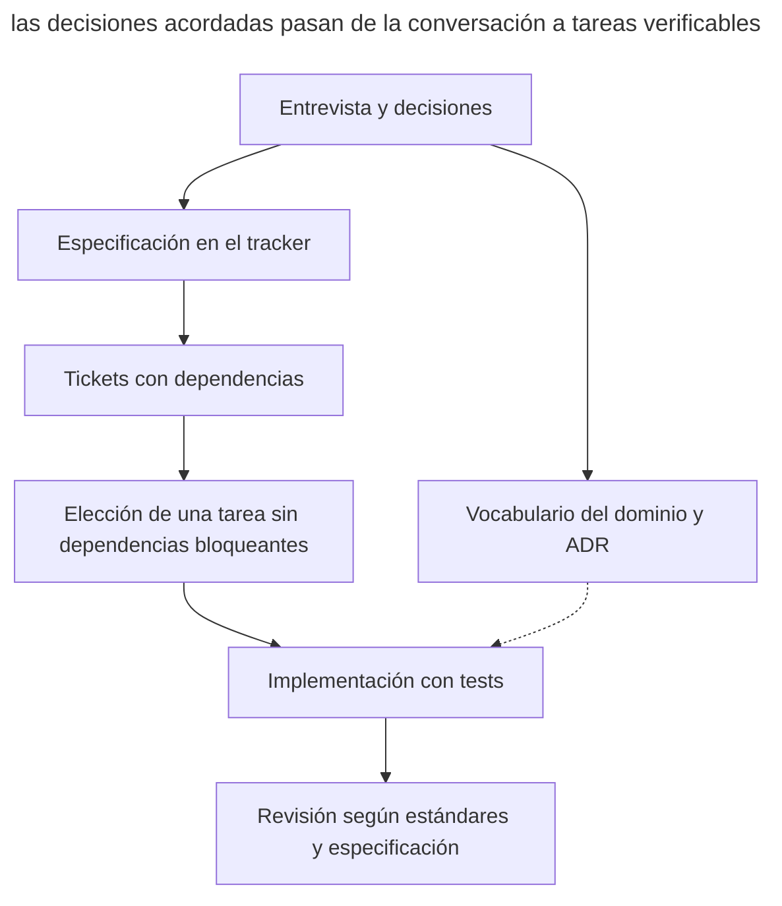

# Skills de Matt Pocock

_Comandos y capacidades comprobados el 21 de septiembre de 2026._

[El pack de skills de Matt Pocock](https://github.com/mattpocock/skills) implementa el [desarrollo orientado a especificaciones](spec-driven-development.md) mediante un conjunto de [procedimientos para el agente de código](skills-as-packaged-workflows.md). La especificación y los tickets vinculados van al **tracker**, donde el equipo sigue con su trabajo habitual.

## Instalación y configuración

Para una instalación editable, usa `npx skills@latest add mattpocock/skills`. Para una instalación gestionada a través del marketplace de Claude Code existe el comando `/plugin install mattpocock-skills`. Tras instalar, ejecuta una vez `/setup-matt-pocock-skills`, que acuerda el tracker, las etiquetas de triaje y la ubicación de los documentos de dominio. La configuración se guarda en _docs/agents/_. Hay plantillas para GitHub, GitLab y archivos Markdown locales. Para otros trackers, incluido Linear, el skill registra cómo trabajar con ellos a partir de la descripción del usuario.

## Flujo de trabajo

El proceso principal consta de varias fases.

1. **Entrevista.** `/grill-me` plantea, mediante `grilling`, rondas de preguntas independientes con recomendaciones. Las preguntas que dependen de puntos sin resolver pasan a la siguiente ronda. Los hechos los busca el skill en el código; las decisiones las acuerda con el humano. `/grill-with-docs` guarda además los términos en _CONTEXT.md_ y las decisiones arquitectónicas en ADR mediante `domain-modeling`.
2. **Especificación.** `/to-spec` reúne los requisitos de la discusión y publica un documento con la etiqueta `ready-for-agent`. No incluye rutas de archivos concretas ni listados ordinarios, porque caducan rápido. La excepción es un fragmento breve de un prototipo que fija con más precisión una decisión tomada, por ejemplo un modelo de estados. Los límites de testing el skill los acuerda con el usuario.
3. **Tareas.** `/to-tickets` crea tickets trazadores, cada uno con un resultado verificable propio y enlaces de bloqueo. El agente elige un ticket cuyas dependencias estén cerradas. Para una refactorización mecánica amplia se usa expand–contract.
4. **Implementación.** `/implement` ejecuta la tarea con `/tdd` en los límites acordados y lanza la comprobación de tipos y los tests.
5. **Revisión.** `/code-review` comprueba los estándares del proyecto y los requisitos de la especificación en contextos separados.

El diagrama muestra qué artefactos conectan la conversación con la implementación.

En este diagrama el tracker guarda los requisitos y la cola de trabajo. El vocabulario y los ADR aportan a la tarea el significado de los términos y las razones de las decisiones, y la revisión contrasta el resultado con la especificación original.

Otros skills dan soporte a etapas adicionales del trabajo.

- `/wayfinder` crea un mapa de preguntas de investigación para una idea grande.
- `/triage` lleva las incidencias entrantes hasta un brief y el estado de lista para trabajar.
- `/prototype` pone a prueba una pregunta de diseño. Para la lógica crea un archivo HTML independiente con escenarios controlables; para la UI, varias variantes intercambiables. El prototipo se conserva en una rama separada enlazada desde la tarea.
- `/handoff` traspasa el estado del trabajo a la siguiente sesión.
- `/diagnosing-bugs` organiza el [diagnóstico mediante hipótesis](hypothesis-driven-debugging.md).
- `/to-questionnaire` prepara un cuestionario para la persona que dispone de la información que falta.
- `/wizard` crea un script interactivo para pasos manuales de configuración o migración.
- `/writing-for-agents` ayuda a redactar instrucciones y documentos para el agente. Es el nuevo nombre del ampliado `writing-great-skills`.

## Artefactos

| Artefacto | Dónde vive |
| ---------- | ----------- |
| Especificación (PRD) | Una issue del tracker con la etiqueta `ready-for-agent` |
| Tickets con enlaces de bloqueo | El tracker (o archivos en _.scratch/\<funcionalidad\>/issues/_, si el tracker es local) |
| _CONTEXT.md_ | Raíz del repositorio: el glosario de dominio |
| ADR | _docs/adr/_: decisiones arquitectónicas |
| Documento de handoff | El directorio temporal del SO — deliberadamente fuera del repositorio |

## En qué se diferencia

- Las especificaciones y los tickets viven en el tracker junto con las tareas del equipo.
- La entrevista ayuda a descubrir la incertidumbre antes de escribir la especificación.
- Cada ticket trazador termina en un comportamiento verificable y declara explícitamente sus dependencias.
- El glosario y los ADR se completan durante la discusión y los usan el resto de skills.

## Cuándo elegirlo

El pack encaja con un equipo que quiere organizar el SDD dentro de un agente de código y del tracker que ya tiene. La instalación gestionada está disponible en Claude Code; la editable permite adaptar los procedimientos al proyecto. [OpenSpec](openspec.md) es cómodo para guardar el paquete de cambio en el repositorio, y [Superpowers](superpowers.md) ofrece otro conjunto de skills con puntos de control obligatorios.
