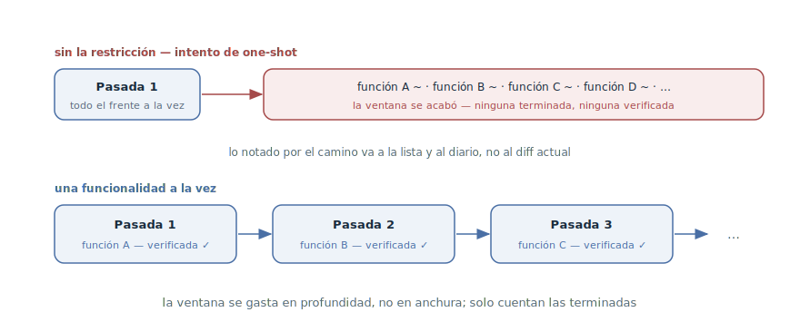

# Una funcionalidad a la vez

## Propósito

Restringir al agente a una funcionalidad por pasada: la sesión toma un
punto, lo lleva hasta un «funciona» verificado — y solo entonces toma el
siguiente. Una restricción contra el impulso innato del agente de hacerlo
todo de golpe: la ventana se gasta en profundidad, no en anchura.

## También conocido como

One feature at a time, one feature per session, progreso incremental;
pariente del límite WIP del kanban.

## Problema

Dejado a su aire en una tarea grande, el agente intenta hacer demasiado a la
vez — en esencia, resolver toda la aplicación de un solo golpe. Parece
productivo: los archivos aparecen por docenas, las funcionalidades se
«empiezan» una tras otra. Termina siempre igual:

- La anchura del frente se come la ventana: a mitad de la décima
  funcionalidad el contexto se agota, y ninguna de las diez está terminada.
- El «casi listo» no se puede verificar: la verificación necesita un
  comportamiento terminado, y no lo hay en ninguna parte.
- Lo a medias es peor que lo no hecho: la siguiente sesión hereda no una
  lista limpia sino una excavación — qué de lo empezado funciona, qué
  abandonar, qué terminar.
- El corte de la sesión sale caro: se pierde el progreso de todo el frente a
  la vez.

## Solución

Una restricción explícita, anclada en la memoria del proyecto y los prompts:
**una pasada — una funcionalidad, llevada hasta el final**. El final no es
«código escrito» sino el ciclo completo:

1. Tomar un punto — el siguiente no superado de la
   [lista de funcionalidades](feature-list-harness.md), o un único ticket.
2. Implementarlo y solo a él.
3. Verificar como usuario — pasar el
   [bucle de retroalimentación](give-agent-a-way-to-verify.md) hasta el
   verde.
4. Registrar: el estado en la lista, un commit, una anotación en el
   [diario de progreso](progress-file.md).

Todo lo notado por el camino — una funcionalidad vecina rota, una
refactorización que pide paso — no amplía la pasada actual sino que se
anota: como punto nuevo de la lista o nota del diario. Si tras el final la
ventana lo permite, el agente toma el siguiente punto — con el mismo ciclo,
no «de paso».

Por qué funciona: una funcionalidad cabe entera en la ventana con margen
para las iteraciones de verificación; la completitud se vuelve binaria — la
funcionalidad está terminada y verificada o no está empezada; y cualquier
corte de sesión cuesta como mucho una funcionalidad inacabada, no todo el
frente.

## Estructura

El carril de arriba es lo que pasa sin la restricción: una pasada se abre en
abanico por todo el frente, la ventana se acaba antes que el frente, y el
poso es un puñado de «casis» que nada puede verificar. El carril de abajo es
el patrón: una cadena de pasadas, cada una terminando en una funcionalidad
acabada y verificada. La velocidad percibida es menor; la real, mayor — solo
cuentan los puntos terminados.

## Participantes / Componentes

- **La pasada** — la unidad de trabajo: una sesión, o parte de una, dedicada
  a exactamente una funcionalidad.
- **La funcionalidad** — un punto verificable; «terminada» lo define la
  comprobación, no el volumen de código escrito.
- **La lista de funcionalidades** — la cola de la que la pasada toma el
  siguiente punto y adonde va todo lo notado por el camino.
- **El agente** — implementa y verifica; la restricción la sostienen el
  prompt y la memoria del proyecto.
- **El desarrollador** — mantiene la disciplina: no añade «de paso» y exige
  el final antes del siguiente punto.

## Cuándo aplicarlo

- Trabajo largo guiado por la lista de funcionalidades — ahí nació la
  restricción: sin ella, las sesiones autónomas intentan sistemáticamente
  hacerlo todo de golpe.
- Ejecuciones autónomas: a menos vigilancia, más estricto debe ser el marco
  de la pasada.
- Como valor por defecto de cualquier trabajo no trivial: un «y de paso X»
  en el prompt ya es una apuesta por un diff difuso e inverificable.

No encaja en cambios honestamente transversales — una migración de formato,
un renombrado por toda la base: no se trocean en funcionalidades y
necesitan una pasada aparte con su propio criterio de finalización.

## Consecuencias y compromisos

- ➕ Cada pasada termina con un incremento verificado: el progreso se cuenta
  en funcionalidades terminadas, no empezadas.
- ➕ La ventana se gasta en profundidad: la implementación, la verificación
  y las iteraciones de una funcionalidad — en vez de dispersarse entre diez.
- ➕ El corte es barato: murió la sesión — se pierde como mucho una
  funcionalidad inacabada, y los artefactos dicen cuál.
- ➖ Se siente más lento: no hay la ilusión estimulante de «todo casi
  listo». Es el precio de que «listo» sea verdad.
- ➖ Los cambios transversales no caben en el marco — hay que sacarlos a
  pasadas aparte con sus propios criterios.
- ➖ La disciplina corta por ambos lados: al agente lo sujeta el prompt, al
  desarrollador nada; la tentación de «añade también Y» al final de una
  buena pasada rompe el patrón desde dentro.

## Implementación

1. Ancla la regla en la [memoria del proyecto](claude-md-memory.md): «una
   funcionalidad por pasada, llevada a un estado verificado; los hallazgos
   incidentales van a la lista, no al diff».
2. Redacta el prompt de la pasada de forma estrecha: «toma la siguiente
   funcionalidad no superada de la lista y llévala a passes», no «trabaja
   en la aplicación».
3. Define el final de la pasada y exígelo completo: comprobación, estado,
   commit, anotación en el diario. Una funcionalidad sin final no está
   hecha.
4. Encauza lo notado por el camino hacia los artefactos: un bug — como
   punto nuevo de la lista, una idea de refactorización — como nota del
   diario. El diff de la pasada toca solo su funcionalidad.
5. Si la ventana permite continuar — el siguiente punto empieza como una
   pasada nueva, leyendo la lista, no como extensión del diff actual.
6. Planifica el trabajo transversal — migraciones, renombrados,
   infraestructura — como pasadas aparte con criterio de finalización
   explícito.

## Ejemplo

El servicio de notas del
[capítulo sobre la lista](feature-list-harness.md). En la memoria del
proyecto — la regla de una pasada. El desarrollador lanza la sesión:

> Toma la siguiente funcionalidad no superada de feature-list.json y llévala
> a passes.

El agente toma «búsqueda por etiqueta». Por el camino nota: la paginación de
la lista de notas está rota, y los filtros piden una refactorización. En vez
de arreglar y reescribir «de paso», añade la paginación como punto nuevo de
la lista, anota la idea de refactorización en el diario — y sigue con la
búsqueda. Al final de la pasada: búsqueda implementada, recorrida como
usuario, `passes: true`, commit, anotación en el diario.

Para contrastar — lo que pasaba antes de la regla: el prompt «trabaja en la
aplicación» terminó en una sesión que había «implementado la búsqueda, los
filtros, la paginación y empezado la exportación». La ventana murió en la
exportación; no se verificó nada; la siguiente sesión gastó medio contexto
averiguando qué de aquello funcionaba.

## Antipatrones y errores comunes

- **El intento de one-shot.** «Haz toda la aplicación» en una pasada — el
  frente es más ancho que la ventana, y el poso es un puñado de «casis».
  Esperar una funcionalidad de un solo prompt sin ciclo de verificación es
  un antipatrón aparte, tratado en su propia sección.
- **«De paso».** Cada «y arregla también X» incidental difumina el diff y
  aleja la verificación. Lo notado va a la lista, no a la pasada.
- **Funcionalidad sin final.** Implementada pero no verificada ni
  registrada — la pasada no cuenta: la siguiente sesión empieza con una
  excavación.
- **Anchura en vez de profundidad.** Empezar tres puntos «en paralelo» es
  el mismo one-shot en miniatura: acaba con cero terminados.
- **Refactorización incidental.** Reescribir código vecino dentro de la
  pasada mezcla dos cambios en un diff — y la verificación de la
  funcionalidad con la de la refactorización.

## Usos conocidos

- **El harness de Anthropic para agentes de larga duración** — la fuente
  primaria: sin la restricción «el agente tendía a intentar demasiado a la
  vez — en esencia, a resolver la aplicación de un golpe»; la regla «elige
  una sola funcionalidad» junto con el ritual de sesión.
- **Superpowers** — el mismo marco a nivel de tareas: el plan se trocea en
  tareas de 2–5 minutos, cada una implementada por un subagente con ventana
  fresca.
- **Skills de Matt Pocock** — los tickets trazadores: el trabajo se trocea
  en tickets con dependencias bloqueantes, y `/implement` conduce
  exactamente un ticket a la vez.
- **Los límites WIP del kanban** — el linaje pre-agente: limitar el trabajo
  en curso como forma de obligar al sistema a *terminar* en vez de
  *empezar*.

## Patrones relacionados

- [Lista de funcionalidades](feature-list-harness.md) — aporta la cola: la
  pasada toma el siguiente punto no superado y devuelve un estado
  verificado.
- [Bucle de retroalimentación](give-agent-a-way-to-verify.md) — define
  «terminada»: el final de la pasada es una comprobación en verde, no un
  volumen de código.
- [Diario de progreso](progress-file.md) — recibe los hallazgos
  incidentales y registra el final de la pasada para la siguiente sesión.
- [Cuatro fases](explore-plan-code-commit.md) — el mismo principio de
  completitud a escala de una tarea: la pasada termina con un commit, no con
  un «casi».
