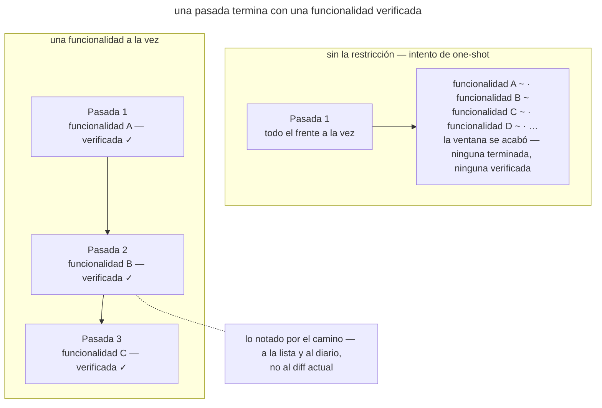

# Una funcionalidad a la vez

## Propósito

Limitar una pasada a una funcionalidad y terminarla con una comprobación antes de pasar a la siguiente. Así queda sitio en la ventana para analizar errores y llevar el escenario a un estado funcional.

## También conocido como

One feature at a time, one feature per session, progreso incremental; pariente del límite WIP del kanban.

## Problema

En una tarea grande, el agente puede empezar varias funcionalidades seguidas. Los archivos se multiplican, pero todavía no se puede verificar entero ni un solo escenario.

Por ejemplo, una sesión cambia a la vez la búsqueda, los filtros y la exportación de notas. Cuando la ventana se llena, cada parte necesita más trabajo. La siguiente sesión primero averigua qué partes se pueden usar y qué comprobaciones ya se ejecutaron. Esa reconstrucción le quita tiempo a la implementación, y los cambios sin terminar dificultan localizar los errores.

## Solución

Fija la regla de **terminar una funcionalidad por pasada**. Para cada punto, recorre el ciclo completo.

1. Elige un punto no superado de la [lista de funcionalidades](feature-list-harness.md) o un solo ticket.
2. Implementa solo ese punto.
3. Recorre el escenario de usuario con el [bucle de retroalimentación](give-agent-a-way-to-verify.md).
4. Actualiza el estado, crea un commit y anota el resultado en el [diario de progreso](progress-file.md).

Guarda los hallazgos del camino como tareas o notas aparte. Si bloquean el escenario actual, revisa el plan de forma explícita. Empieza la siguiente funcionalidad cuando termines la actual, aunque ambas quepan en una sesión.

El tamaño de la funcionalidad debe dejar sitio para la verificación y las correcciones. Con esta limitación, un corte de sesión deja una sola parte sin terminar, y los resultados anteriores ya están guardados y verificados.

## Estructura

La parte superior del diagrama muestra varias funcionalidades empezadas sin comprobación.

```mermaid
---
title: una pasada termina con una funcionalidad verificada
---
flowchart TB
  subgraph oneshot["sin la restricción — intento de one-shot"]
    direction LR
    p0["Pasada 1<br/>todo el frente a la vez"]
    wide["funcionalidad A ~ · funcionalidad B ~<br/>funcionalidad C ~ · funcionalidad D ~ · …<br/>la ventana se acabó — ninguna terminada, ninguna verificada"]:::warn
    p0 --> wide
  end
  subgraph oneAtATime["una funcionalidad a la vez"]
    direction LR
    p1["Pasada 1<br/>funcionalidad A — verificada ✓"]
    p2["Pasada 2<br/>funcionalidad B — verificada ✓"]
    p3["Pasada 3<br/>funcionalidad C — verificada ✓"]
    p1 --> p2 --> p3
  end
  note["lo notado por el camino — a la lista y al diario,<br/>no al diff actual"]:::accent
  p2 -.- note
```

La parte inferior muestra pasadas consecutivas, cada una con un resultado terminado. El progreso se mide por el número de escenarios verificados.

## Participantes / Componentes

- **La pasada** se dedica a una funcionalidad y puede ocupar una sesión o parte de ella.
- **La funcionalidad** define un resultado independiente y verificable.
- **La lista de funcionalidades** guarda la cola de trabajo.
- **El agente** implementa y verifica el punto elegido.
- **El desarrollador** mantiene los límites de la tarea y acepta el resultado.

## Cuándo aplicarlo

- El trabajo está dividido en una lista de funcionalidades con criterios de verificación propios.
- El agente hace pasadas autónomas largas.
- Las tareas del camino impiden con frecuencia terminar la original.

Una migración de formato o un renombrado masivo necesitan una pasada aparte con su propio criterio de finalización. Esos cambios no siempre se dejan dividir cómodamente por funcionalidades de usuario.

## Consecuencias y compromisos

- ➕ Cada pasada deja un resultado verificado.
- ➕ El contexto queda disponible para verificar y corregir una funcionalidad.
- ➕ Tras un corte, solo hay que reconstruir el estado del punto actual.
- ➖ Verificar cada punto lleva tiempo antes de pasar al siguiente.
- ➖ Los cambios preparatorios comunes hay que planificarlos por separado.
- ➖ Tú también tienes que contenerte para no ampliar la tarea actual.

## Implementación

1. Anota en la [memoria del proyecto](claude-md-memory.md) la regla de terminar una funcionalidad por pasada y registrar aparte los hallazgos del camino.
2. Nombra un punto concreto o pide que se elija la siguiente funcionalidad no superada.
3. Define la finalización como comprobación, estado actualizado, commit y anotación en el diario.
4. Guarda los bugs e ideas del camino en tareas aparte si no bloquean el trabajo actual.
5. Empieza el siguiente punto en una pasada nueva después de registrar el anterior.
6. Planifica por separado las migraciones y los cambios preparatorios comunes.

## Ejemplo

En el servicio de notas del [capítulo sobre la lista de funcionalidades](feature-list-harness.md), lanzas una pasada sobre la cola.

> Toma la siguiente funcionalidad no superada de feature-list.json y llévala a passes.

El agente elige la búsqueda por etiqueta y nota un fallo de paginación que no impide verificar la búsqueda. Anota el bug como tarea aparte y sigue con el escenario elegido. Tras verificar la búsqueda en el navegador, el agente actualiza el estado, hace un commit y anota el resultado en el diario.

La siguiente sesión recibe una búsqueda que funciona y una tarea aparte sobre la paginación. No tiene que desenredar un diff mezclado de dos cambios sin terminar.

## Antipatrones y errores comunes

- **Intento de one-shot.** Un gran volumen de trabajo puede llenar la ventana antes de verificar el primer escenario.
- **«De paso».** Las ediciones del camino amplían el diff y retrasan la finalización. Anótalas aparte.
- **Funcionalidad sin final.** El código sin verificar deja a la siguiente sesión el trabajo de reconstruir el estado.
- **Varios puntos empezados.** El agente gasta contexto en saltar entre escenarios sin terminar.
- **Refactorización de paso.** Un diff mezclado obliga a verificar a la vez el comportamiento nuevo y la conservación del antiguo.

## Usos conocidos

- **El harness de Anthropic para agentes de larga duración** limita al agente a la funcionalidad elegida y fija el orden para cerrar la sesión.
- **Superpowers** divide el plan en tareas pequeñas para subagentes separados.
- **Los skills de Matt Pocock** implementan los tickets trazadores de uno en uno mediante `/implement`.
- **Los límites WIP del kanban** acotan el volumen de trabajo sin terminar.

## Patrones relacionados

- [Lista de funcionalidades](feature-list-harness.md) fija la cola y guarda los estados verificados.
- [Bucle de retroalimentación](give-agent-a-way-to-verify.md) determina cuándo una funcionalidad está lista.
- [Diario de progreso](progress-file.md) guarda el estado de la pasada y los hallazgos del camino.
- [Cuatro fases](explore-plan-code-commit.md) cierra el trabajo con una comprobación y un commit.
- [One-shotting](one-shotting.md) describe el intento de obtener toda la aplicación en una pasada sin comprobaciones intermedias.
