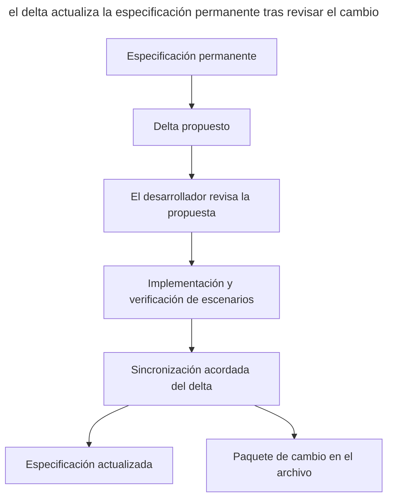

# OpenSpec

_Comandos y capacidades comprobados el 21 de septiembre de 2026._

[OpenSpec](https://github.com/Fission-AI/OpenSpec), de Fission-AI, organiza el [SDD](spec-driven-development.md) alrededor de un **cambio** con las etapas propose, review, apply y archive. Las especificaciones permanentes describen el sistema, y los deltas registran los cambios propuestos a los requisitos.

OpenSpec soporta distintos agentes y asistentes de código, incluidos Claude Code, Codex, Cursor y GitHub Copilot.

## Instalación

La CLI se instala con npm y requiere Node.js ≥ 20.19.

```sh
npm install -g @fission-ai/openspec@latest
openspec init
```

`openspec init` crea el directorio _openspec/_ y registra comandos slash con el prefijo `/opsx:`; `openspec update` actualiza las instrucciones para los agentes tras una actualización.

## Flujo de trabajo

El conjunto de comandos depende del perfil. Elígelo con `openspec config profile` y luego ejecuta `openspec update` en el proyecto para aplicar la elección a las instrucciones del agente. El flujo básico recorre los siguientes pasos.

1. `/opsx:explore` ayuda a explorar el código y comparar opciones antes de preparar artefactos.
2. `/opsx:propose <idea>` crea un paquete de propuesta que revisas antes de implementar.
3. `/opsx:apply` ejecuta las tareas del checklist.
4. `/opsx:archive` propone sincronizar los deltas con las especificaciones permanentes, si aún no se ha hecho, y mueve el cambio al archivo.

El perfil ampliado incluye `/opsx:new`, `/opsx:continue`, `/opsx:ff`, `/opsx:verify`, `/opsx:bulk-archive` y `/opsx:onboard`. Dan soporte a la preparación por etapas, la verificación y el archivado de cambios grandes.

Al terminar un cambio, ejecuta `/opsx:archive` y confirma la sincronización de deltas propuesta. Si las especificaciones ya se actualizaron con `/opsx:sync`, no hace falta sincronizar de nuevo. El archivado conserva los artefactos del cambio; el orden respecto al merge lo decide el equipo en su propio proceso.

El diagrama muestra cómo un paquete de cambio conecta la implementación con la descripción permanente del sistema.



Aquí la especificación se guarda aparte de la propuesta. La sincronización traslada los requisitos aceptados desde el delta, y el archivo guarda la explicación y la historia del cambio.

La sintaxis depende del agente. Codex puede mostrar `$openspec-propose`, mientras que Cursor y GitHub Copilot usan la forma `/opsx-propose`. `openspec init` imprime la sintaxis exacta de la herramienta elegida.

## Artefactos

El directorio _openspec/_ separa las especificaciones permanentes de los paquetes de cambio.

| Ruta | Qué contiene |
| ------ | ----------- |
| _openspec/specs/_ | Especificaciones permanentes — el modelo actual de lo que _ya está construido_ |
| _openspec/changes/\<cambio\>/proposal.md_ | Por qué cambiamos esto |
| _openspec/changes/\<cambio\>/specs/_ | Deltas de requisitos con escenarios concretos |
| _openspec/changes/\<cambio\>/design.md_ | Enfoque técnico |
| _openspec/changes/\<cambio\>/tasks.md_ | Checklist de implementación |
| _openspec/changes/archive/_ | Cambios completados |

## Ejemplo de cambio de un requisito

En un servicio de entrega de eventos, un webhook se desactiva tras cinco fallos seguidos. La especificación permanente en _openspec/specs/webhooks/spec.md_ contiene esta regla.

```markdown
### Requirement: Delivery failure cutoff
El sistema SHALL desactivar el webhook tras cinco intentos fallidos seguidos.

#### Scenario: Failed deliveries reach cutoff
- **WHEN** el quinto intento de entrega seguido falla
- **THEN** el webhook se desactiva
```

El equipo acordó otro umbral para destinatarios temporalmente no disponibles. En el paquete de cambio, el agente crea un delta en _openspec/changes/raise-cutoff/specs/webhooks/spec.md_. Para el requisito modificado conserva el encabezado y da el nuevo requisito con su escenario completo.

```markdown
## MODIFIED Requirements

### Requirement: Delivery failure cutoff
El sistema SHALL desactivar el webhook tras diez intentos fallidos seguidos.

#### Scenario: Failed deliveries reach cutoff
- **WHEN** el décimo intento de entrega seguido falla
- **THEN** el webhook se desactiva
```

En este ejemplo, `MODIFIED Requirements` indica la sustitución de un requisito existente. Tras la implementación y la verificación, el equipo confirma la sincronización en `/opsx:archive`. En el _spec.md_ permanente, el requisito `Delivery failure cutoff` contiene ahora el umbral de diez y el escenario correspondiente; el marcador `MODIFIED Requirements` sigue formando parte del delta archivado. Si la propuesta se rechaza, la regla permanente con el umbral de cinco no cambia. El formato de secciones y escenarios se describe en la [documentación de OpenSpec](https://github.com/Fission-AI/OpenSpec/blob/main/docs/concepts.md).

## En qué se diferencia

- Las especificaciones permanentes describen el comportamiento requerido actual del sistema.
- Un delta registra la diferencia entre los requisitos actuales y los propuestos.
- El proceso está pensado para cambios sucesivos en una base de código existente.
- Las especificaciones compartidas ayudan al equipo a acordar los requisitos y la historia de sus cambios.

## Cuándo elegirlo

OpenSpec encaja en un sistema existente cuyos requisitos hay que mantener junto con el código. Para un proceso basado en skills con puntos de control obligatorios, considera [Superpowers](superpowers.md), y para trabajar a través del tracker, compara [el pack de Matt Pocock](matt-pocock-skills.md).
