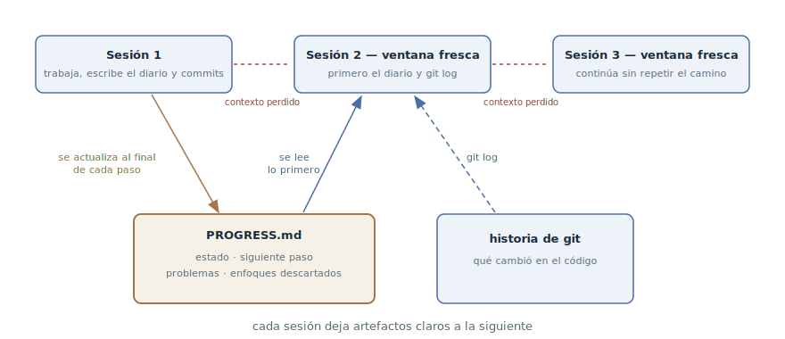

# Diario de progreso

## Propósito

Mantener junto al código un archivo-diario del trabajo largo — dónde estamos,
qué sigue, qué ya se descartó — que el agente actualiza sobre la marcha y lee
lo primero en una sesión nueva. Una ventana de contexto fresca recupera el
panorama con un solo archivo, y no con arqueología por el código y las
conversaciones.

## También conocido como

Progress file, progress log; `claude-progress.txt` del artículo de Anthropic
sobre harnesses, `PROGRESS.md`.

## Problema

El trabajo no cupo en una ventana de contexto: una funcionalidad de varios
días, una migración, una depuración larga. Cada sesión nueva — y cada
compactación — empieza con amnesia:

- La historia de git responde «qué cambió», pero calla lo principal: qué está
  *sin terminar*, por qué se eligió este camino y qué ya se probó y se
  descartó.
- El agente con ventana fresca repite los callejones sin salida: la solución
  rechazada ayer tras una hora de experimentos hoy vuelve a parecer
  atractiva.
- Recuperar el estado por el código sale caro: el agente quema media ventana
  fresca leyendo diffs y archivos antes de dar el primer paso útil — y a
  veces toma con seguridad lo que no toca.

Confiar en el resumen automático de la compactación es una lotería: qué
sobrevive exactamente del contexto no lo decides tú.

## Solución

Un diario de estado en el repositorio, junto al código. El agente lo
actualiza al final de cada paso significativo — es tan parte de terminar el
paso como el commit. La sesión nueva empieza con un ritual: leer el diario y
el git log reciente — y solo después trabajar.

En el diario vive lo que no está en la historia de git:

- **estado actual** — qué funciona, qué está en proceso;
- **siguiente paso** — por dónde empezar si la sesión se corta ahora mismo;
- **problemas conocidos** — los rastrillos que la siguiente sesión debe
  conocer de antemano;
- **enfoques descartados** — qué se probó y por qué no funcionó.

El diario y la historia de git se complementan y no se duplican: git responde
«qué cambió en el código», el diario — «dónde estamos y hacia dónde vamos».
Recontar los diffs en el diario no hace falta.

El ritual no se apoya en la memoria del agente sino en la
[memoria del proyecto](claude-md-memory.md): la regla «al empezar la sesión
lee `PROGRESS.md`, al final de un paso significativo — actualízalo» vive ahí
y rige en cada sesión automáticamente.

## Estructura



Las sesiones se suceden, y entre ellas hay un corte: la ventana se acabó o se
compactó, el contexto se perdió. La continuidad la dan los dos artefactos de
abajo: el diario de progreso, que cada sesión actualiza sobre la marcha, y la
historia de git con sus commits. La sesión nueva empieza leyendo ambos — el
diario da el estado y la dirección, el git log los cambios reales — y
continúa el trabajo desde donde se cortó la anterior, sin repetir su camino.

## Participantes / Componentes

- **Diario de progreso** (`PROGRESS.md`) — estado, siguiente paso, problemas,
  enfoques descartados; vive en el repositorio.
- **Historia de git** — el complemento del diario: los cambios reales del
  código y la posibilidad de volver a un estado funcional.
- **Agente** — actualiza el diario sobre la marcha y lo lee lo primero en la
  sesión nueva.
- **Desarrollador** — fija el ritual y revisa el diario: en él se ve el
  progreso sin excavar los diffs.
- **Memoria del proyecto** — ancla el ritual para que no dependa de la
  conversación.

## Cuándo aplicarlo

- El trabajo es de entrada más grande que una sesión: funcionalidad de varios
  días, migración, refactorización grande.
- Las sesiones son largas y chocan regularmente con la compactación — el
  diario asegura contra pérdidas en cada compresión de la ventana.
- Sobre la tarea trabajan en alternancia varias sesiones, varios agentes o un
  agente mezclado con un humano — el diario alinea el panorama para todos.

Para una tarea que cabe en una sesión el diario es excesivo: basta el plan
dentro de la propia sesión.

## Consecuencias y compromisos

- ➕ Recuperar el estado cuesta un archivo: la sesión nueva da un paso útil
  en un minuto, no tras media ventana de arqueología.
- ➕ Los callejones sin salida no se repiten: el enfoque descartado está
  anotado junto con el motivo.
- ➕ El progreso es visible para el humano: mirar el diario es más rápido que
  interrogar al agente o leer diffs.
- ➖ Exige disciplina de actualización: una anotación saltada — y el diario
  le miente a la siguiente sesión.
- ➖ Crece sin cuidado: un diario en el que solo se escribe se convierte en
  una segunda fuente de ruido (ver
  [ingeniería de contexto](context-engineering.md)).
- ➖ La tentación de duplicar git: recontar los diffs hincha el diario y no
  añade señal.

## Implementación

1. Crea el archivo al comenzar un trabajo largo y ancla el ritual en la
   [memoria del proyecto](claude-md-memory.md): «al empezar la sesión lee
   `PROGRESS.md` y el `git log` reciente; al final de un paso significativo
   actualiza `PROGRESS.md`».
2. Mantén cuatro secciones: estado, siguiente paso, problemas conocidos,
   enfoques descartados. «Siguiente paso» es la más valiosa: escríbelo de
   modo que la sesión pueda cortarse en cualquier momento.
3. Escribe «dónde estamos y por qué», no «qué cambió» — lo segundo ya está
   anotado en git.
4. Haz de la actualización parte de la definición de «paso terminado»:
   código, tests, commit, diario.
5. Mantén el diario corto: lo fresco arriba, las secciones ya trabajadas se
   pliegan o se borran. El diario se lee cada sesión y obedece la misma
   economía de atención que el resto del contexto.
6. Los estados que el agente actualiza mecánicamente — por ejemplo, la lista
   de funcionalidades con marcas «pasa/no pasa» — sácalos de la prosa a un
   archivo estructurado aparte: el agente estropea el JSON con menos
   frecuencia que el Markdown. Esa técnica se trata en el capítulo sobre la
   lista de funcionalidades de la sección de organización del proyecto.

En las tuberías del desarrollo orientado a especificaciones el papel del
diario para una funcionalidad concreta lo desempeña `tasks.md`: listas de
tareas con marcas de finalización existen en [Spec Kit](spec-kit.md),
[OpenSpec](openspec.md) y [Kiro](kiro.md), y en
[Superpowers](superpowers.md) el plan de tareas pequeñas está pensado
explícitamente como un documento desde el que retomar el trabajo en cualquier
punto. El diario de progreso es la misma técnica sin la tubería: un archivo
para cualquier trabajo largo.

## Ejemplo

Está en marcha una migración de pagos de varios días a una pasarela nueva. En
la raíz del repositorio — `PROGRESS.md`:

```markdown
# Migración de pagos a la pasarela PayFlow

## Estado
Webhooks migrados y cubiertos con tests. El mapa de errores de la
pasarela está listo. Reembolsos — en proceso.

## Siguiente paso
Migrar `RefundService`: es el último que llama al cliente viejo.
Empezar por las claves de idempotencia — ver «Descartado».

## Problemas conocidos
- El sandbox de la pasarela rechaza importes menores de 1.00 — en los
  tests usamos 1.05.

## Descartado
- Un adaptador sobre la interfaz vieja: las claves de idempotencia de
  PayFlow no encajan, sale más barato reescribir las llamadas
  (detalles en el ADR-0007).
```

La sesión se corta a la mitad — la ventana se acabó. El desarrollador abre
una nueva:

> Seguimos con la migración a PayFlow — empieza por PROGRESS.md.

El agente lee el diario y el git log, toma `RefundService` — y no vuelve a
proponer el «adaptador elegante» que la sesión anterior tardó una hora en
refutar: el motivo del rechazo está escrito. Al terminar los reembolsos,
actualiza el estado y el siguiente paso — ahora también esta sesión puede
cortarse sin peligro.

## Antipatrones y errores comunes

- **Diario-dietario.** Recontar cada acción en vez del estado: el archivo
  crece con cada sesión, y la siguiente gasta su ventana leyendo historia en
  vez de trabajar.
- **Duplicado del git log.** «Cambié X, añadí Y» — eso ya está anotado en los
  commits. El diario responde a las preguntas que git no puede responder.
- **Actualizar «luego».** Un diario rezagado respecto a la realidad es peor
  que uno vacío: la sesión nueva trabaja con seguridad sobre una mentira.
- **Estados en prosa.** Las marcas actualizadas mecánicamente en texto libre
  el agente tarde o temprano las reformula o las machaca — su sitio es un
  archivo estructurado al lado.
- **El diario en vez del traspaso.** Las notas sobre la marcha no sustituyen
  el empaquetado deliberado en la frontera de la sesión: el
  [traspaso de sesión](handoff.md) tiene otro momento y otra densidad.

## Usos conocidos

- **El harness de Anthropic para agentes de larga duración** — la fuente
  primaria: `claude-progress.txt` junto a la historia de git, el ritual de
  inicio de sesión (git log → diario → lista de funcionalidades → prueba de
  humo) y la regla de que cada sesión deja artefactos claros a la siguiente.
- **La auto memory de Claude Code** — un diario a nivel de herramienta: el
  agente lleva por su cuenta notas del proyecto en
  `~/.claude/projects/<project>/memory/` y las carga en cada sesión; el
  diario de progreso es la misma idea, pero sobre un trabajo concreto y
  dentro del propio repositorio.
- **Toolkits de SDD** — `tasks.md` con marcas de finalización en
  [Spec Kit](spec-kit.md), [OpenSpec](openspec.md), [Kiro](kiro.md) y los
  planes de [Superpowers](superpowers.md): un diario de progreso integrado en
  la tubería de la funcionalidad.
- **Las notas estructuradas** del artículo de Anthropic sobre ingeniería de
  contexto — un agente que lleva un `NOTES.md` fuera de la ventana es el
  mismo mecanismo en su forma general.

## Patrones relacionados

- [Traspaso de sesión](handoff.md) — el vecino en la capa de estado: el
  diario se lleva sobre la marcha, el traspaso se escribe una vez en la
  frontera de la sesión.
- [Ingeniería de contexto](context-engineering.md) — el diario es la capa de
  estado sacada fuera de la ventana, y obedece la misma regla de «corto y de
  alta señal».
- [Memoria del proyecto](claude-md-memory.md) — donde se ancla el ritual de
  leer y actualizar el diario.
- [Desarrollo orientado a especificaciones](spec-driven-development.md) — el
  `tasks.md` de la tubería desempeña el papel del diario a escala de una
  funcionalidad.
