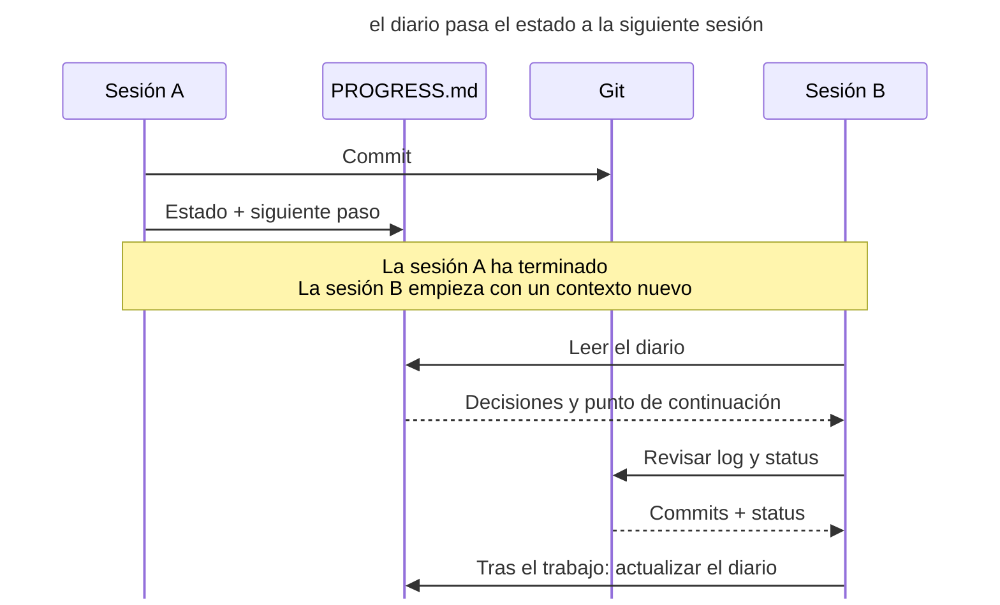

# Diario de progreso

## Propósito

Llevar junto al código un diario del estado de un trabajo largo. El agente lo actualiza sobre la marcha y lo lee al inicio de una sesión nueva para saber qué queda por hacer y qué enfoques ya se han probado.

## También conocido como

Progress file, progress log; _claude-progress.txt_ del artículo de Anthropic sobre harnesses, _PROGRESS.md_.

## Problema

En una migración de varios días, las sesiones nuevas reciben el código y los commits, pero pueden no conocer las razones de una decisión a medio terminar.

Por ejemplo, ayer el agente probó un adaptador sobre la API antigua y lo descartó por un modelo de reembolsos incompatible. En git quedó solo la implementación aceptada. Sin un registro de la razón, un agente nuevo puede volver a proponer el adaptador y repetir el mismo experimento. Reconstruir esas decisiones a partir de archivos y conversaciones retrasa el trabajo útil.

La compactación automática del contexto puede no conservar todas las razones de las decisiones. El diario permite elegirlas de forma explícita.

## Solución

Crea un diario en el repositorio y actualízalo después de cada paso significativo. Una sesión nueva lee el diario y los últimos commits antes de continuar el trabajo.

En el diario, guarda la información que falta en la historia de git.

- **El estado actual** muestra qué funciona y qué no está terminado todavía.
- **El siguiente paso** fija la primera acción al retomar el trabajo.
- **Los problemas conocidos** avisan de las limitaciones y los fallos encontrados.
- **Los enfoques descartados** conservan los resultados de los experimentos y las razones del descarte.

Git muestra los cambios del código, y el diario explica el estado y la dirección del trabajo. Para los detalles de los commits basta con una referencia.

Anota el procedimiento de lectura y actualización del diario en la [memoria del proyecto](claude-md-memory.md), para que las sesiones nuevas reciban esta instrucción.

## Estructura

Cada sesión lee el estado guardado antes de trabajar y lo actualiza antes de pasar el relevo a la siguiente sesión.


```mermaid
---
title: el diario pasa el estado a la siguiente sesión
config:
  sequence:
    mirrorActors: false
    width: 130
    height: 45
    actorMargin: 35
    messageMargin: 28
---
sequenceDiagram
  participant A as Sesión A
  participant P as PROGRESS.md
  participant G as Git
  participant B as Sesión B
  A->>G: Commit
  A->>P: Estado + siguiente paso
  Note over A,B: La sesión A ha terminado<br/>La sesión B empieza con un contexto nuevo
  B->>P: Leer el diario
  P-->>B: Decisiones y punto de continuación
  B->>G: Revisar log y status
  G-->>B: Commits + status
  B->>P: Tras el trabajo: actualizar el diario
```

El diario explica por qué el trabajo se detuvo en este punto y qué hacer a continuación. Git muestra los cambios reales; si no coinciden con el diario, la sesión nueva averigua primero el estado actual.

## Participantes / Componentes

- **Diario de progreso** (_PROGRESS.md_) guarda el estado, el siguiente paso y las razones de las decisiones.
- **Historia de git** conserva los cambios del código.
- **Agente** lee el diario al arrancar y lo actualiza después de los pasos significativos.
- **Desarrollador** fija el orden de trabajo y revisa las entradas.
- **Memoria del proyecto** guarda la instrucción para llevar el diario.

## Cuándo aplicarlo

- La tarea ocupa varias sesiones.
- Las sesiones largas exigen compactar el contexto.
- Distintas personas o agentes se turnan en el trabajo sobre una misma tarea.

Para una tarea corta suele bastar un plan dentro de la sesión.

## Consecuencias y compromisos

- ➕ Una sesión nueva encuentra antes el siguiente paso.
- ➕ El agente ve las razones por las que se descartaron los enfoques ya probados.
- ➕ Puedes evaluar el estado sin leer todos los diffs.
- ➖ Una actualización omitida induce a error a la siguiente sesión.
- ➖ Sin recortes, el propio diario se convierte en contexto sobrante (véase [ingeniería de contexto](context-engineering.md)).
- ➖ Resumir los commits hace crecer el archivo sin explicar el estado del trabajo.

## Implementación

1. Crea el diario y anota el procedimiento para usarlo en la [memoria del proyecto](claude-md-memory.md).
2. Separa el estado, el siguiente paso, los problemas y los enfoques descartados. Formula el siguiente paso de modo que se pueda ejecutar tras un corte de la sesión.
3. Explica las razones de las decisiones y el trabajo pendiente. Remite a los cambios del código mediante los commits.
4. Incluye la actualización del diario en el cierre de cada paso significativo, junto con la verificación y el commit.
5. Mantén el estado actual arriba y abrevia las entradas ya cerradas.
6. Guarda los estados de las funcionalidades en un archivo estructurado aparte, donde el agente cambie campos concretos (véase [Lista de funcionalidades](feature-list-harness.md)).

En [OpenSpec](openspec.md), las marcas en _tasks.md_ y los planes de [Superpowers](superpowers.md) ayudan a continuar el trabajo sobre una funcionalidad. El diario complementa las marcas con las razones de las decisiones y los problemas abiertos; también puede usarse sin un toolkit de SDD.

## Ejemplo

Un equipo migra los pagos a una pasarela nueva y guarda el estado en _PROGRESS.md_.

```markdown
# Migración de pagos a la pasarela PayFlow

## Estado
Webhooks migrados y cubiertos con tests. El mapa de errores de la pasarela está listo.
Reembolsos — en proceso.

## Siguiente paso
Migrar `RefundService`: es el último que llama al cliente viejo.
Empezar por las claves de idempotencia — ver «Descartado».

## Problemas conocidos
- El sandbox de la pasarela rechaza importes menores de 1.00 — en los tests usamos 1.05.

## Descartado
- Un adaptador sobre la interfaz vieja: las claves de idempotencia de
  PayFlow no encajan, sale más barato reescribir las llamadas (detalles en ADR-0007).
```

Cuando se acaba la ventana, abres una sesión nueva.

> Seguimos con la migración a PayFlow. Empieza por PROGRESS.md.

El agente lee el diario y el git log, y luego continúa con `RefundService`. Ve la razón por la que se descartó el adaptador y no repite el experimento. Al terminar los reembolsos, el agente anota el resultado y el siguiente paso.

## Antipatrones y errores comunes

- **Diario-bitácora.** Un historial completo de acciones dificulta encontrar el estado actual.
- **Duplicado del git log.** La lista de archivos cambiados ya está en los commits. El diario necesita las razones de las decisiones y las tareas abiertas.
- **Actualizar «luego».** Una entrada obsoleta lleva a la siguiente sesión a una acción equivocada.
- **Estados dentro del relato.** Al reescribir el texto, las marcas pueden perderse. Usa campos estructurados.
- **El diario en lugar del traspaso.** Para un objetivo nuevo, prepara un [traspaso](handoff.md) aparte que seleccione la información para la siguiente etapa.

## Usos conocidos

- **El harness de Anthropic para agentes de larga duración** usa _claude-progress.txt_ junto con la historia de git y la lista de funcionalidades al inicio de la sesión.
- **La auto memory de Claude Code** guarda notas sobre el proyecto a nivel de la herramienta. El diario del repositorio describe un trabajo largo concreto.
- **Los toolkits de SDD** guardan tareas y marcas en [OpenSpec](openspec.md) y en los planes de [Superpowers](superpowers.md).
- **Las notas estructuradas** del artículo de Anthropic sobre ingeniería de contexto conservan el estado fuera de la ventana.

## Patrones relacionados

- [Traspaso de sesión](handoff.md) prepara un documento para una transición concreta entre personas o agentes.
- [Ingeniería de contexto](context-engineering.md) ayuda a seleccionar el contenido del diario.
- [Memoria del proyecto](claude-md-memory.md) fija el procedimiento de lectura y actualización del diario.
- [Desarrollo orientado a especificaciones](spec-driven-development.md) vincula el estado del trabajo con la especificación y las tareas.
