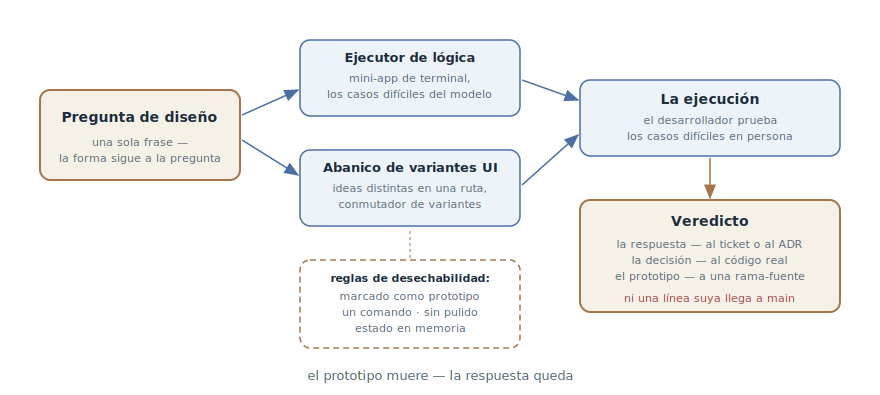

# Prototipo desechable

## Propósito

Construir un prototipo desechable que responda a una pregunta de diseño
concreta — «¿este modelo de estados siquiera vuela?», «¿qué aspecto debería
tener esto?» — antes de escribir la implementación real. Lo que se verifica
es el diseño, no el código: el prototipo muere, la respuesta queda.

## También conocido como

Throwaway prototype, spike (en términos de la programación extrema),
prototipo-respuesta; `/prototype` en los skills de Matt Pocock.

## Problema

Algunas preguntas de diseño no se resuelven razonando:

- El modelo de estados es impecable sobre el papel y en el plan — y en el
  tercer escenario real resulta que las transiciones son incómodas y la
  mitad de los casos no encaja. La revisión textual no lo caza: el revisor
  tiene las mismas limitaciones que el autor — también razona en vez de
  ejecutar.
- Una interfaz no se elige por descripción. «¿Lista o kanban?» es una
  discusión de una hora; dos variantes funcionando la resuelven en un
  minuto.
- La discusión del plan llegó a un punto muerto: ambas partes son
  plausibles, los argumentos se agotaron, y la decisión es importante y
  difícil de revertir.

Construir de verdad solo para comprobar es caro: si el modelo está mal, la
implementación se rehace. Y un prototipo «rápido» sin disciplina se
convierte sigilosamente en producción: código escrito sin tests ni manejo
de errores empieza a vivir para siempre, porque «ya funciona».

## Solución

Formular la pregunta en una sola frase — y construir el artefacto más
barato que la responda. La pregunta decide la forma:

- **«¿Esta lógica / modelo de estados se siente correcto?»** — una mini-app
  interactiva de terminal que empuja el modelo por los casos difíciles de
  razonar sobre el papel. Tras cada acción se imprime el estado completo: se
  ve qué cambió.
- **«¿Qué aspecto debería tener?»** — varias variantes de interfaz
  radicalmente distintas en una sola ruta con un conmutador. No tres
  matices de una idea — ideas distintas.

Las reglas que hacen seguro un prototipo:

1. **Desechable desde el primer día** — y claramente marcado: con un nombre
   del que un lector casual entienda que no es producción.
2. **Un comando para ejecutarlo** — el desarrollador lo arranca sin pensar.
3. **Sin persistencia** — el estado vive en memoria: el almacenamiento es
   lo que el prototipo *comprueba*, no aquello de lo que depende.
4. **Sin pulido** — ni tests, ni manejo de errores más allá del mínimo, ni
   abstracciones. El objetivo es aprender rápido.

El agente es lo que hizo práctico este patrón: un prototipo que costaba un
día de trabajo ahora cuesta decenas de minutos — y de verdad no duele
tirarlo.

El final es obligatorio: el veredicto — la respuesta y la pregunta que
cerró — se anota en el ticket o en un ADR; la decisión validada va a la
implementación real; el propio prototipo se commitea a una rama desechable
como fuente primaria, con un puntero. A main llega solo la decisión — no el
código del prototipo.

## Estructura

A la izquierda, la pregunta — existe antes que el prototipo y determina su
forma: una pregunta sobre lógica produce un ejecutor de terminal, una sobre
el aspecto — un abanico de variantes de interfaz. Ambos artefactos se
construyen bajo las mismas reglas de desechabilidad y caen en manos del
desarrollador: él mismo conduce los casos difíciles. A la derecha, el único
artefacto superviviente: el veredicto. La decisión va a la implementación,
el prototipo a una rama-fuente, y ni una línea de código del prototipo llega
a main.

## Participantes / Componentes

- **La pregunta de diseño** — una sola frase; existe antes que el prototipo
  y decide su forma. Sin pregunta no hay prototipo.
- **El prototipo** — el artefacto desechable: un ejecutor de terminal para
  la lógica o un abanico de variantes para la UI.
- **El desarrollador** — conduce los casos difíciles con sus propias manos
  y emite el veredicto; el prototipo se construye para sus manos.
- **El agente** — construye rápido y sin pulido; la disciplina de
  desechabilidad la sostiene el prompt.
- **El veredicto** — la respuesta anotada: qué se comprobó, qué se aprendió,
  qué se decidió.

## Cuándo aplicarlo

- Un modelo de estados o una lógica con casos difíciles de razonar sobre el
  papel: suscripciones, estados de pedidos, conflictos de sincronización.
- La elección de una interfaz: varias variantes funcionando en vez de una
  discusión sobre descripciones.
- La discusión del plan se atascó y la decisión es difícil de revertir: una
  hora de prototipo es más barata que un día de rehacer.

No hace falta cuando la pregunta se responde leyendo el código o la
documentación — ni cuando la respuesta es obvia por cualquier medio más
barato que un prototipo.

## Consecuencias y compromisos

- ➕ El diseño se verifica antes de la implementación: el rehacer de «el
  modelo no encajó» no ocurre, porque el modelo se ejecutó de antemano.
- ➕ La discusión se convierte en experimento: en vez de «me parece», ambas
  partes miran variantes funcionando.
- ➕ La respuesta es barata: sin tests, pulido ni persistencia, el prototipo
  cuesta una fracción de la implementación real.
- ➖ El riesgo principal — «termina este prototipo»: código sin tests ni
  manejo de errores en producción. La disciplina del final es parte del
  patrón.
- ➖ El prototipo responde solo a la pregunta planteada: «en el prototipo
  funcionaba» no se generaliza a la carga, la seguridad ni los casos límite
  que no tocó.
- ➖ Tiempo perdido si la respuesta era obvia: primero los medios baratos —
  el código, la documentación, una discusión corta.

## Implementación

1. Formula la pregunta en una sola frase y ponla en el prompt literalmente:
   «el prototipo debe responder a la pregunta X».
2. Elige la forma: lógica — un ejecutor de terminal con comandos e
   impresión del estado; UI — varias variantes radicalmente distintas con
   conmutador.
3. Dicta las reglas de desechabilidad: cerca de su futuro lugar en el
   código, nombre marcado como prototipo, un comando de arranque, estado en
   memoria, sin tests ni pulido.
4. Condúcelo tú mismo: pide al agente preparar los casos difíciles, pero
   las manos en el teclado son las tuyas. «¿Se siente correcto?» se
   responde con la sensación.
5. Anota el veredicto en el ticket o en un ADR: la pregunta, la respuesta,
   la decisión.
6. Cierra con limpieza: la decisión — a la implementación real (escrita de
   nuevo, no copiada del prototipo), el prototipo — a una rama desechable
   enlazada desde el ticket, y a main — nada.
7. El prototipo en una sesión fresca empieza por un
   [traspaso](handoff.md): el extracto de la pregunta y el contexto en vez
   de la cola de la discusión.

## Ejemplo

Continuación de la historia del capítulo sobre el
[traspaso de sesión](handoff.md): el plan de migración de tarifas chocó con
la pregunta de si el modelo de cancelaciones basado en eventos aguanta los
contratos corporativos con inicio diferido. La sesión del prototipo empieza
por el documento de traspaso:

> Lee /tmp/handoff-cancellation-prototype.md. Monta un prototipo desechable
> de terminal del modelo de cancelaciones: comandos subscribe,
> cancel <fecha>, reactivate, tick; tras cada comando imprime el estado
> completo de la suscripción y la cola de eventos. Sin tests ni
> almacenamiento — estado en memoria. Nómbralo de modo que se vea que es un
> prototipo.

El agente monta un ejecutor que arranca con un solo comando. El
desarrollador conduce los escenarios: cancelación inmediata — bien;
cancelación con fecha — bien; pero en «cancelación diferida y reactivación
antes de que surta efecto» el modelo se rompe: el evento de cancelación se
queda en la cola y se dispara después de la reactivación. Sobre el papel
nadie había visto ese caso.

El veredicto va a un ADR: el modelo de eventos queda confirmado con una
enmienda — la reactivación desplaza los eventos de cancelación no
ejecutados. El prototipo va a la rama `prototype/cancellation-model`, el
enlace al ticket de implementación. La implementación se escribe desde cero
contra el modelo aprobado; ni una línea del prototipo llega a main.

## Antipatrones y errores comunes

- **«Termina este prototipo».** El pecado capital: código escrito como
  desechable se cuela en producción. La implementación se escribe de nuevo
  a partir del veredicto — el prototipo era una pregunta, no una primera
  versión.
- **Un prototipo sin pregunta.** «Probemos y veamos» produce código pero no
  respuesta: nada que anotar en el veredicto, ninguna razón para haberlo
  construido.
- **Pulir lo desechable.** Tests, manejo de errores y abstracciones en un
  prototipo son desperdicio: morirá antes de que se amorticen.
- **Generalizar el veredicto.** «En el prototipo funcionaba» se aplica
  exactamente a la pregunta comprobada — no a la carga, ni a la seguridad,
  ni a los casos límite que la ejecución no tocó.
- **El prototipo tirado junto con la respuesta.** Se borró el código y no
  se anotó el veredicto — al mes la pregunta vuelve, y otra vez no hay con
  qué responderla.

## Usos conocidos

- **Skills de Matt Pocock** — `/prototype`: dos ramas (lógica — ejecutor de
  terminal, UI — abanico de variantes en una ruta), las reglas de
  desechabilidad y el final obligatorio «la decisión al código, el
  prototipo a una rama-fuente».
- **Las spike solutions de la programación extrema** — el antecesor
  clásico: un experimento corto y desechable para retirar el riesgo técnico
  antes de estimar e implementar.
- **El «design it twice» de John Ousterhout** — el principio emparentado:
  obligarse a considerar diseños radicalmente distintos; el abanico de
  variantes de UI es su mecanización.
- **Las balas trazadoras de The Pragmatic Programmer** — un contraste útil:
  el código trazador se queda y crece, el prototipo se tira. Mezclar los
  dos modos es lo que produce «un prototipo en producción».

## Patrones relacionados

- [Bucle de retroalimentación](give-agent-a-way-to-verify.md) — el
  prototipo es la verificación para decisiones sin oráculo mecánico: aquí
  la señal de «pasa / no pasa» la dan las manos y los ojos del
  desarrollador.
- [Traspaso de sesión](handoff.md) — la entrada estándar al prototipo: el
  extracto de la pregunta y el contexto para una sesión limpia en vez de la
  cola de la discusión.
- [Cuatro fases](explore-plan-code-commit.md) — la pregunta del prototipo
  suele nacer en la fase de plan: la discusión que el texto no resuelve se
  lleva al experimento.
- [Desarrollo orientado a especificaciones](spec-driven-development.md) —
  el veredicto del prototipo vuelve a la especificación como requisito o
  restricción — antes de que empiece la implementación.
