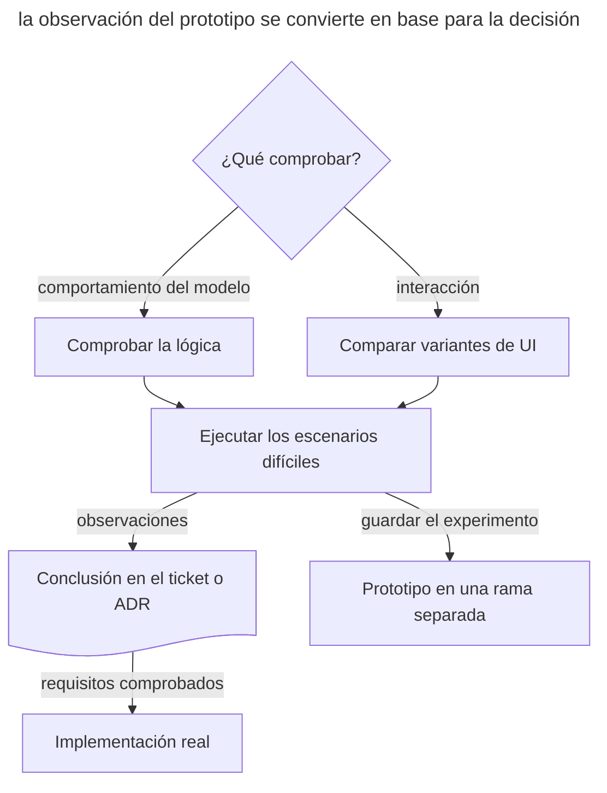

# Prototipo desechable

## Propósito

Comprobar una pregunta de diseño concreta con un prototipo pequeño y desechable. Tras el experimento, el equipo conserva la conclusión y la usa al preparar la implementación real.

## También conocido como

Throwaway prototype, spike (en términos de la programación extrema), prototipo-respuesta; `/prototype` en los skills de Matt Pocock.

## Problema

Algunas decisiones son difíciles de comprobar solo con una discusión. Un modelo de estados puede parecer completo hasta que se aplica a una secuencia de acciones reales.

Por ejemplo, la cancelación de una suscripción y su reactivación funcionan cada una por separado, pero si la suscripción se reactiva antes de una cancelación diferida, el evento antiguo se queda en la cola. Para notar el error, conviene ejecutar las transiciones y ver el estado tras cada una. En una interfaz, el prototipo permite probar distintas formas de hacer la misma tarea y compararlas en la práctica.

Una implementación completa solo para esa comprobación sale cara. Un prototipo rápido reduce el coste, siempre que el equipo separe de antemano el experimento del código que va a mantener.

## Solución

Formula la pregunta y elige el experimento mínimo capaz de responderla.

- Para un **modelo de estados**, crea una herramienta pequeña con acciones y estado visible. La terminal le sirve a un desarrollador; para discutir con un experto del dominio, es más cómodo un archivo HTML independiente con botones y escenarios.
- Para una **interfaz**, prepara varias variantes con un conmutador y compáralas en el mismo escenario de usuario.

Limita el volumen de código experimental.

1. Marca el prototipo explícitamente en el nombre y la descripción.
2. Haz que arranque con un solo comando.
3. Guarda el estado en memoria, salvo que la pregunta exija comprobar el almacenamiento persistente.
4. Añade solo el código que necesita el experimento.

El agente puede montar una herramienta así rápidamente, así que comprobar una decisión sale más barato. Esto es especialmente útil cuando una elección equivocada obligaría a rehacer varios módulos.

Anota la pregunta, las observaciones y la conclusión en el ticket o en un ADR. Guarda el prototipo en una rama separada, enlazada desde la decisión. Construye la implementación real a partir de los requisitos comprobados, con las pruebas y el manejo de errores habituales.

## Estructura

La pregunta determina la forma del experimento. Tras la ejecución, la conclusión y el código experimental se guardan por separado.

```mermaid
---
title: la observación del prototipo se convierte en base para la decisión
config:
  flowchart:
    rankSpacing: 30
---
flowchart TB
  question{"¿Qué comprobar?"}:::accent
  logic["Comprobar la lógica"]
  ui["Comparar variantes de UI"]
  run["Ejecutar los escenarios difíciles"]
  decision@{ shape: doc, label: "Conclusión en el ticket o ADR" }
  branch["Prototipo en una rama separada"]:::muted
  code["Implementación real"]:::accent
  question -- "comportamiento del modelo" --> logic
  question -- "interacción" --> ui
  logic --> run
  ui --> run
  run -- "observaciones" --> decision
  run -- "guardar el experimento" --> branch
  decision -- "requisitos comprobados" --> code
```

Tú ejecutas los escenarios y anotas la conclusión con un enlace a la rama del prototipo. La implementación real se construye a partir de los requisitos comprobados. El código experimental queda en una rama separada como evidencia de la comprobación.

## Participantes / Componentes

- **La pregunta de diseño** fija el objetivo del experimento.
- **El prototipo** permite obtener las observaciones necesarias.
- **El desarrollador** ejecuta los escenarios y toma la decisión según los resultados.
- **El agente** construye la herramienta mínima del experimento.
- **La conclusión** guarda la pregunta comprobada, las observaciones y la decisión.

## Cuándo aplicarlo

- El modelo tiene secuencias de estados difíciles de comprobar razonando.
- Hay que comparar variantes de interfaz en la práctica.
- A una decisión difícil de revertir le faltan observaciones.

Primero comprueba si la respuesta se puede obtener leyendo el código o la documentación. El prototipo hace falta cuando la información más barata no basta.

## Consecuencias y compromisos

- ➕ Un error del modelo puede aparecer antes de la implementación completa.
- ➕ Los participantes discuten los resultados de un mismo experimento.
- ➕ El volumen limitado reduce el coste de comprobar una idea.
- ➖ El código experimental se confunde fácilmente con una base lista para el producto.
- ➖ El resultado vale solo para la pregunta comprobada y las condiciones del experimento.
- ➖ El prototipo hace perder tiempo si la respuesta ya está en la documentación.

## Implementación

1. Escribe la pregunta en una sola frase.
2. Elige un escenario de terminal, una maqueta de UI u otra forma que dé las observaciones necesarias.
3. Define el nombre, el comando de arranque y las restricciones mínimas del experimento.
4. Ejecuta los escenarios difíciles y guarda las observaciones.
5. Anota la conclusión y la decisión tomada en el ticket o en un ADR.
6. Guarda el prototipo en una rama separada y construye la implementación real a partir de la decisión comprobada.
7. Para una sesión aparte del prototipo, prepara un [traspaso](handoff.md) con la pregunta y el contexto.

## Ejemplo

En la historia del capítulo sobre el [traspaso de sesión](handoff.md) hay que comprobar el modelo de cancelaciones para contratos corporativos con inicio diferido. Le pasas a una sesión nueva el documento y la tarea del experimento.

> Lee /tmp/handoff-cancellation-prototype.md y monta un prototipo desechable del modelo de cancelaciones

El primer escenario comprueba la pregunta original. Fijas el inicio del contrato el 1 de octubre, la cancelación el 25 de septiembre y adelantas el reloj al 2 de octubre. En este experimento ilustrativo, el manejador del inicio da acceso aunque la cancelación ya ha entrado en vigor. Esta observación muestra que una sola cola de eventos con fecha no basta. Al procesar el inicio hay que tener en cuenta la cancelación vigente.

El segundo escenario comprueba la reactivación antes de una cancelación diferida. Si el evento de cancelación antiguo se queda en la cola, más tarde cerrará la suscripción restaurada. El equipo fija una regla aparte: la reactivación anula ese evento.

En el ADR se guardan ambas observaciones y decisiones junto con los límites del experimento. El prototipo queda en _prototype/cancellation-model_, y el ticket de implementación recibe un enlace a él. En el código real, ambos escenarios quedarán protegidos por pruebas. Las observaciones descritas ilustran resultados posibles del prototipo; en su propio proyecto, el equipo los obtiene ejecutándolo de verdad.

## Antipatrones y errores comunes

- **«Termina este prototipo».** El código experimental puede carecer de las protecciones que necesita un sistema en producción. Implementa la decisión tomada con los controles de calidad habituales.
- **Un prototipo sin pregunta.** Sin un criterio no se puede saber qué observaciones darán por terminado el experimento.
- **Pulir lo desechable.** Las abstracciones de más aumentan el coste de obtener la respuesta.
- **Generalizar la conclusión.** El éxito de un escenario no confirma la carga ni otras condiciones que el experimento no tocó.
- **Una conclusión perdida.** Si se borra el código sin anotar el resultado, habrá que investigar la pregunta otra vez.

## Usos conocidos

- **Los skills de Matt Pocock** implementan el experimento mediante [/prototype](https://github.com/mattpocock/skills/blob/main/skills/engineering/prototype/SKILL.md). Para la lógica, el skill crea un archivo HTML independiente con acciones libres y escenarios paso a paso; para la UI, variantes intercambiables. El prototipo comprobado se guarda en una rama separada enlazada desde la tarea.
- **Las spike solutions de la programación extrema** eliminan un riesgo técnico con un experimento corto.
- **[Diseña dos veces](design-it-twice.md)** desarrolla el principio de John Ousterhout: comparar variantes de diseño sustancialmente distintas antes de la implementación.
- **Las balas trazadoras de The Pragmatic Programmer** dan código que sigue evolucionando. El prototipo desechable conserva solo la decisión comprobada para una implementación nueva.

## Patrones relacionados

- [Diseña dos veces](design-it-twice.md) compara diseños alternativos; el prototipo comprueba preguntas que requieren observaciones.
- [Bucle de retroalimentación](give-agent-a-way-to-verify.md) vincula la decisión con un resultado de comprobación observable.
- [Traspaso de sesión](handoff.md) conserva la pregunta para un experimento aparte.
- [Cuatro fases](explore-plan-code-commit.md) permite llevar la incertidumbre del plan a un prototipo.
- [Desarrollo orientado a especificaciones](spec-driven-development.md) conserva la conclusión del prototipo como requisito o restricción.
- [Vibe coding](vibe-coding.md) describe aceptar código sin contrastarlo con los requisitos. Así termina el prototipo que se completó hasta convertirlo en el sistema de producción.
