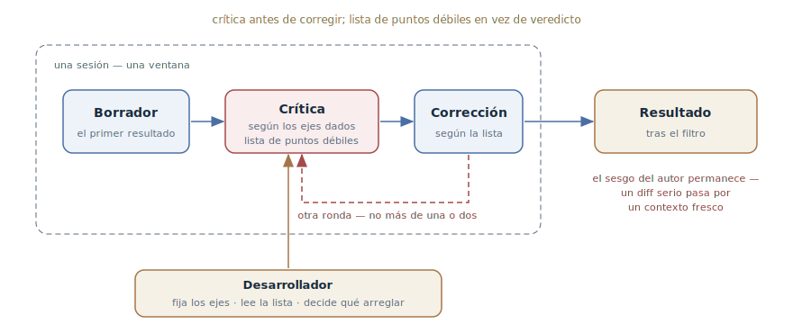

# Reflexión

## Propósito

Como jugada aparte, pedir al agente que critique su propio resultado según
ejes dados y lo mejore a partir de la crítica: generar → evaluar → mejorar.
La jugada de verificación más barata que existe — sin oráculo externo, sin
sesión fresca, dentro de la misma ventana.

## También conocido como

Reflection (uno de los cuatro patrones canónicos de Andrew Ng),
self-critique, autocrítica; en términos de Anthropic — el
evaluator-optimizer pasado a modo manual.

## Problema

La primera respuesta del agente es un borrador, aunque parezca terminada. El
código funciona en el camino feliz, pero los casos límite no están
tratados, los errores se tragan, y un requisito de mitad de la conversación
se perdió. Y mientras tanto:

- No hay oráculo mecánico: la legibilidad, la completitud del manejo de
  errores, la adherencia a los requisitos y la calidad del diseño no las
  comprueba un test — hasta aquí no llega el
  [bucle de retroalimentación](give-agent-a-way-to-verify.md).
- Montar una sesión fresca para cada borrador es caro: un
  [escritor y revisor](writer-reviewer.md) completo se justifica para un
  diff serio, no para cada función.
- Un «hazlo mejor» sin estructura da cosmética: el agente renombra
  variables y añade comentarios sin tocar los puntos débiles de verdad.

Un dato curioso sobre los modelos: encuentran sus propios errores si se lo
piden — pero no los buscan por defecto, porque terminaron el trabajo y lo
consideran bueno.

## Solución

Una vez recibido el resultado, hacer dos jugadas explícitas.

**Primera jugada — crítica sin corrección.** Pedir al agente examinar su
propio trabajo y enumerar los puntos débiles según ejes que tú fijas:
corrección, casos límite, manejo de errores, adherencia a los requisitos,
simplicidad. Las palabras clave son «enumera los problemas», no «¿está todo
bien?»: a la pregunta-veredicto el agente responde «todo bien»; pedido que
nombre los tres puntos más débiles — busca y los encuentra.

**Segunda jugada — corrección según la lista.** De lo hallado se arregla lo
que lo merece: la lista de problemas llega primero a ti, y qué arreglar y
qué aceptar como compromiso consciente es decisión del desarrollador.

Separar las jugadas no es un formalismo: la crítica mezclada con la
corrección en un solo prompt degenera en «lo arreglé y de paso me elogié».
Evaluación antes de mejora.

El patrón tiene un techo incorporado: el crítico está en la misma ventana
que el autor y comparte sus puntos ciegos. La reflexión atrapa lo que el
autor es *capaz* de ver — un caso omitido, un requisito olvidado — pero no
un fallo en el propio razonamiento que produjo la solución. Una o dos rondas
dan la mayor parte de la ganancia; después es pulir en círculos, y si el
resultado sigue sin inspirar confianza, hace falta contexto fresco.

## Estructura

Todo el ciclo vive dentro de una sesión: el borrador, la crítica según los
ejes dados, la corrección según la lista — y, si hace falta, una ronda más.
El desarrollador, desde fuera, fija los ejes y decide qué de la lista se
arregla. La salida a la derecha es el resultado con una advertencia: el
sesgo del autor no está eliminado, así que los cambios serios pasan la
comprobación final en un contexto fresco.

## Participantes / Componentes

- **Agente-autor y agente-crítico** — el mismo modelo en la misma ventana:
  ahí están la baratura del patrón y su techo.
- **Ejes de crítica** — la lista del desarrollador: límites, errores,
  requisitos, simplicidad. Sin ejes la crítica resbala a la cosmética.
- **La lista de puntos débiles** — el artefacto de la primera jugada; pasa
  por el desarrollador, no directo a la corrección.
- **Desarrollador** — fija los ejes, lee la lista, decide qué arreglar y
  cuántas rondas dar.

## Cuándo aplicarlo

- Donde no hay oráculo mecánico: calidad del diseño, completitud del manejo
  de errores, legibilidad, adherencia a los requisitos de la conversación.
- Como jugada estándar antes del commit y antes de la revisión: una
  limpieza barata que sube el listón de lo que llega a los humanos.
- Para artefactos no de código: una especificación, un plan, documentación —
  «encuentra los agujeros de este plan» funciona igual que con código.
- Cuando la sesión fresca sobra: el cambio es pequeño y el ciclo completo
  escritor-revisor cuesta más que el propio cambio.

## Consecuencias y compromisos

- ➕ Casi gratis: una o dos jugadas en la misma sesión, sin infraestructura.
- ➕ Eleva notablemente el primer borrador: las omisiones típicas — límites,
  errores, requisitos olvidados — las atrapa el propio agente.
- ➕ Funciona con todo lo que el agente produce — no solo con código.
- ➖ El crítico está sesgado: es el autor. Un fallo del razonamiento
  original la reflexión no lo hallará — lo reproducirá también en la
  crítica.
- ➖ Rendimientos decrecientes: tras la segunda ronda el agente pule y
  reordena en vez de encontrar algo nuevo.
- ➖ El riesgo del ritual: una reflexión «para cumplir» con veredicto «todo
  bien» crea confianza falsa — peor que nada.

## Implementación

1. Espera el resultado y pide la crítica como jugada aparte — no en el
   mismo prompt que la tarea.
2. Fija los ejes explícitamente: «revisa casos límite, manejo de errores y
   adherencia a los requisitos de la tarea». Ejes sin dirección — crítica
   sin dirección.
3. Fuerza la búsqueda: «enumera los tres puntos más débiles» en vez de
   «¿está todo bien?». Veredictos prohibidos; se exige una lista.
4. Lee la lista tú mismo: qué arreglar y qué aceptar es tu decisión — si
   no, el agente «arreglará» también los compromisos conscientes.
5. Pide la corrección de los puntos elegidos y párate tras una o dos
   rondas.
6. Empaqueta los ejes recurrentes en un comando — tu propio slash command o
   skill, para que la reflexión sea una invocación y no un párrafo de texto
   cada vez.
7. Calibra la confianza: la reflexión es un filtro antes de la
   verificación, no su sustituto. Un diff serio pasa igualmente por el
   [escritor y revisor](writer-reviewer.md) o por un bucle con oráculo.

## Ejemplo

El agente terminó la función de exportación de informes a CSV. Antes de
commitear, el desarrollador hace la jugada de crítica:

> No defiendas este código — encuentra sus problemas. Enumera los tres
> puntos más débiles según estos ejes: casos límite, manejo de errores,
> memoria con datos grandes. No corrijas nada todavía.

El agente devuelve la lista: con un error de escritura el descriptor de
archivo no se cierra; el informe se construye entero en memoria — cientos de
megabytes en exportaciones grandes; un informe vacío se exporta sin
cabeceras de columnas, lo que rompe el parser externo. El desarrollador
responde:

> Arregla el primero y el tercero. El streaming no lo hacemos aún — las
> exportaciones están limitadas a diez mil filas; deja un comentario con esa
> restricción.

Dos problemas reales atrapados antes del commit al precio de dos réplicas.
Nota lo que *no* pasó: el agente no «reescribió mejor» todo en bloque ni
tocó el compromiso consciente con la memoria — porque la lista pasó por el
desarrollador.

## Antipatrones y errores comunes

- **La pregunta-veredicto.** «Comprueba que todo esté bien» recibe «todo
  bien». Pide una lista de puntos débiles — con número.
- **Crítica y corrección en un prompt.** La jugada mezclada degenera en
  cosmética con autoelogio. Primero la lista, luego la decisión, luego la
  corrección.
- **Reflexión sin ejes.** «Mejora el código» da renombrados y comentarios.
  Los ejes dicen dónde excavar.
- **Pulido sin fin.** La tercera ronda y siguientes es mover los muebles.
  Si no aparece nada nuevo — cambia de instrumento, no repitas la jugada.
- **Reflexión en vez de verificación.** La autocrítica no sustituye ni a
  los tests ni a la mirada fresca: es un filtro que reduce el ruido antes
  de la comprobación real, y no debe usarse para fabricar confianza.

## Usos conocidos

- **Andrew Ng, los cuatro patrones agénticos** — Reflection en su
  formulación canónica: «el LLM examina su propio trabajo para encontrar
  formas de mejorarlo»; junto con los demás patrones, un bucle agéntico
  subió a GPT-3.5 en HumanEval del 48,1 % (zero-shot) al 95,1 %.
- **Reflexion (Shinn et al., NeurIPS 2023)** — el antecesor interno del
  agente: autorreflexión verbal acumulada en memoria episódica entre
  intentos.
- **Anthropic, evaluator-optimizer** — el mismo ciclo generador-evaluador
  como flujo automatizado en «Building effective agents»; la reflexión es
  su caso manual, dirigido por el desarrollador.
- **Constitutional AI** — la autocrítica como mecanismo de entrenamiento:
  el modelo critica sus propias respuestas contra una lista de principios y
  las reescribe — prueba de que la autocrítica de los modelos funciona
  cuando se solicita.

## Patrones relacionados

- [Bucle de retroalimentación](give-agent-a-way-to-verify.md) — cuando
  existe un oráculo mecánico, siempre gana a la autocrítica; la reflexión
  cubre lo que el oráculo no alcanza.
- [Escritor y revisor](writer-reviewer.md) — el siguiente peldaño: un
  crítico con contexto fresco que no comparte los puntos ciegos del autor.
  La reflexión es un filtro previo, no un sustituto.
- [TDD con agente](tdd-with-agent.md) — el vecino de sección: el TDD
  asegura la corrección con un oráculo escrito antes del código; la
  reflexión limpia lo que un oráculo no puede expresar.
