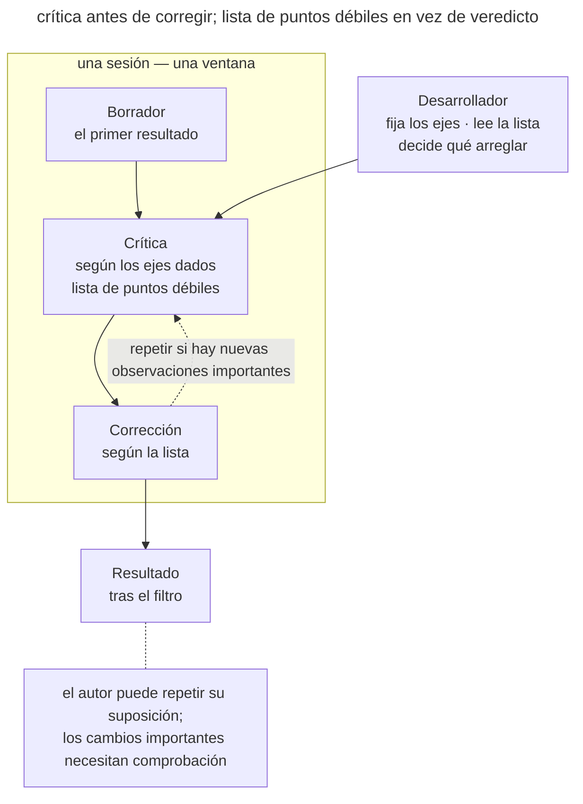

# Reflexión

## Propósito

Pedir al agente que evalúe por separado su propio resultado según ejes dados y luego corrija los defectos confirmados. La comprobación ocurre en la misma ventana y ayuda a mejorar el borrador antes de una evaluación externa.

## También conocido como

Reflection, self-critique, autocrítica. Un ciclo similar de generación y evaluación se usa en evaluator-optimizer.

## Problema

El primer resultado puede omitir un requisito o el manejo de un error, aunque el escenario habitual funcione. Para esas omisiones es útil una pasada de revisión aparte.

Por ejemplo, una función de exportación genera un CSV correcto, pero aún no has comprobado que el archivo se cierre si falla la escritura. Pedir que se revise el manejo de errores dirige al agente hacia ese camino. Una revisión completa en una sesión nueva tiene el coste adicional de traspasar el contexto. Para un borrador pequeño puedes empezar con la [reflexión](reflection.md) y pasar los cambios importantes a un [revisor independiente](writer-reviewer.md). La petición «mejóralo» no fija qué comprobar, así que puede no dar más que renombrados y comentarios.

Una tarea aparte de buscar defectos cambia el foco del trabajo del agente. Pero las observaciones encontradas también hay que comprobarlas.

## Solución

Una vez obtenido el resultado, haz dos movimientos explícitos.

**Primero, obtén la crítica sin correcciones.** Indica los ejes de revisión y pide describir defectos concretos con las condiciones en que se manifiestan. Para una exportación, por ejemplo, conviene revisar los errores de escritura y el tamaño de los datos.

**Luego elige las correcciones.** Evalúas las observaciones, separas los defectos de los compromisos aceptados y encargas al agente los cambios necesarios.

La separación te ayuda a ver con qué fundamento cambia el agente el código. Si no, una corrección útil puede mezclarse con una reescritura innecesaria.

El autor y el crítico comparten un contexto, así que pueden repetir la misma suposición errónea de partida. Si una nueva pasada no añade observaciones verificables, detén el pulido y recurre a tests o a un contexto fresco.

## Estructura

En el diagrama, el agente toma el borrador, elabora una lista de observaciones y corrige los puntos elegidos.

```mermaid
---
title: crítica antes de corregir; lista de puntos débiles en vez de veredicto
---
flowchart TB
  subgraph session["una sesión — una ventana"]
    direction LR
    draft["Borrador<br/>el primer resultado"]
    critique["Crítica<br/>según los ejes dados<br/>lista de puntos débiles"]:::warn
    revise["Corrección<br/>según la lista"]
    draft --> critique --> revise
    revise -. "repetir si hay nuevas observaciones importantes" .-> critique
  end
  dev["Desarrollador<br/>fija los ejes · lee la lista<br/>decide qué arreglar"]:::accent
  result["Resultado<br/>tras el filtro"]:::accent
  caveat["el autor puede repetir su suposición;<br/>los cambios importantes necesitan comprobación"]:::warn
  dev --> critique
  revise --> result
  result -.- caveat
```

El desarrollador fija los ejes y toma las decisiones. El resultado del ciclo sigue necesitando una comprobación proporcional al riesgo del cambio.

## Participantes / Componentes

- **Agente** crea y critica el resultado en un mismo contexto.
- **Ejes de la crítica** fijan las propiedades que hay que comprobar.
- **Lista de observaciones** conserva los defectos encontrados antes de las correcciones.
- **Desarrollador** evalúa las observaciones y elige las correcciones.

## Cuándo aplicarlo

- Las comprobaciones automáticas existentes no bastan para evaluar la legibilidad o la completitud de los requisitos.
- Hay que preparar un borrador para una revisión independiente.
- Hay que revisar un plan, una especificación o documentación.
- El pequeño tamaño de la corrección aún no justifica una sesión de revisor aparte.

## Consecuencias y compromisos

- ➕ Para empezar basta un prompt adicional en la sesión actual.
- ➕ El agente puede notar un escenario o requisito omitido.
- ➕ La técnica se aplica tanto al código como a los documentos.
- ➖ El crítico puede repetir las suposiciones del autor.
- ➖ Las pasadas repetidas pueden producir retoques cosméticos sin hallazgos nuevos.
- ➖ Una aprobación formal crea una confianza infundada en el resultado.

## Implementación

1. Una vez obtenido el resultado, pide una evaluación crítica aparte.
2. Indica ejes concretos, por ejemplo el manejo de errores y el cumplimiento de los requisitos.
3. Pide describir los defectos con las condiciones en que se manifiestan y la evidencia.
4. Revisa la lista y elige las correcciones teniendo en cuenta las restricciones aceptadas.
5. Pide corregir los puntos elegidos y detente tras una o dos rondas.
6. Guarda los criterios recurrentes en un comando o una skill.
7. Confirma las correcciones con tests o una [revisión independiente](writer-reviewer.md) si el cambio lo requiere.

## Ejemplo

El agente terminó la exportación de un informe a CSV. Antes del commit, le pides que revise el código.

> Encuentra problemas en el manejo de errores, los casos límite y la memoria con datos grandes. Para cada uno, muestra la condición en la que se manifiesta. No corrijas nada todavía.

El agente detecta un descriptor sin cerrar ante un error de escritura y la falta de encabezados en un informe vacío. También señala que el informe se construye entero en memoria. Eliges las correcciones.

> Corrige el cierre del archivo y los encabezados del informe vacío. Las exportaciones están limitadas a diez mil filas, así que el streaming aún no hace falta. Deja constancia de este límite en un comentario.

El agente corrige los dos defectos y mantiene la forma elegida de construir el informe. Revisar las observaciones permitió tener en cuenta el límite conocido del volumen de datos.

## Antipatrones y errores comunes

- **Pregunta-veredicto.** Pedir que apruebe el código puede dar un sí formal. Pide defectos concretos y evidencia.
- **Crítica junto con la corrección.** Primero revisa las observaciones, luego cambia el código según los puntos elegidos.
- **Sin criterios.** Una petición general de mejorar el código no fija qué comprobar.
- **Pulido sin fin.** Si las nuevas pasadas no dan hallazgos importantes, cambia la forma de comprobar.
- **La autocrítica como prueba.** La reflexión ayuda a preparar el resultado, pero no confirma por sí sola su corrección.

## Usos conocidos

- **Andrew Ng** describe Reflection como un patrón propio en el que el modelo examina su trabajo para mejorarlo.
- **Reflexion (Shinn et al., NeurIPS 2023)** conserva las conclusiones de la autorreflexión entre intentos en una memoria episódica.
- **El evaluator-optimizer de Anthropic** automatiza el ciclo de generación, evaluación y refinamiento del resultado.
- **Constitutional AI** usa, durante el entrenamiento, la crítica de las respuestas según una lista de principios y su posterior reescritura.

## Patrones relacionados

- [Bucle de retroalimentación](give-agent-a-way-to-verify.md) añade una señal externa verificable.
- [Escritor y revisor](writer-reviewer.md) traslada la crítica a un contexto fresco.
- [TDD con agente](tdd-with-agent.md) fija una comprobación del comportamiento antes de la implementación.
