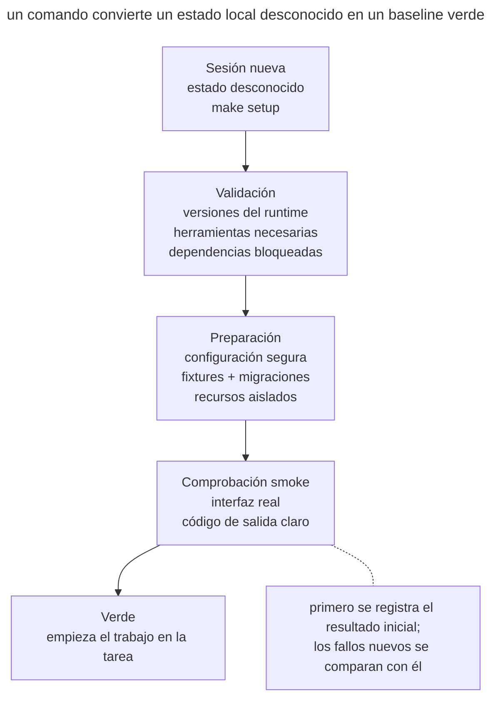

# Inicio reproducible del agente

## Propósito

Dar a una sesión nueva un único comando que prepare el entorno y verifique el estado inicial. Tras ejecutarlo, el agente sabe que el escenario base funciona y puede comparar con él los cambios posteriores.

## También conocido como

Reproducible agent bootstrap, one-command setup, initializer script, green baseline.

## Problema

Una sesión nueva abre el repositorio y no sabe cómo ponerlo en marcha. El README enumera cinco comandos, algunos ya obsoletos; el _.env_ hay que montarlo a partir de un mensaje del chat; la base de datos espera una migración manual, y la comprobación necesita un servicio aparte. El agente prueba variantes, cambia la configuración por accidente y veinte minutos después obtiene un test que falla.

Si el test ya fallaba al principio, más tarde cuesta determinar la causa de un fallo nuevo. En un worktree separado la preparación manual se repite y encarece cada tarea paralela.

Un comando de «instalar dependencias» no basta. Estar listo significa que las herramientas necesarias están disponibles, se ha creado una configuración segura, los servicios están levantados o sustituidos por fixtures y pasa una comprobación smoke mínima de extremo a extremo.

## Solución

Prepara un comando idempotente, por ejemplo `make setup` o `./scripts/bootstrap`, que lleve un entorno soportado a un **estado inicial verificado**.

El bootstrap ejecuta cuatro acciones en orden.

1. **Comprueba los requisitos previos**, incluidas las versiones del runtime y de las herramientas del sistema.
2. **Prepara el estado local** con dependencias, configuración segura y datos de prueba.
3. **Arranca los servicios** o indica un comando de arranque no interactivo conocido.
4. **Verifica la preparación** con un test smoke corto del escenario clave.

El script debe poder ejecutarse de nuevo sin riesgo. No requiere secretos de producción, no toca datos de usuario y no enmascara un baseline rojo. Si falta un requisito previo, el error nombra el comando concreto que lo corrige.

El bootstrap verifica el estado inicial y usa versiones fijadas de las dependencias. La suite completa de tests se ejecuta aparte, según lo que exija la tarea.

## Estructura

Una sesión nueva llega con un estado local desconocido e invoca un único comando.



El comando valida las herramientas, crea un estado seguro y ejecuta la comprobación smoke. Solo un resultado verde abre el trabajo en la tarea; uno rojo lo detiene y separa el problema del entorno del futuro diff.

## Participantes / Componentes

- **Base soportada** define el sistema operativo y las versiones de las herramientas.
- **Comando de bootstrap** prepara el entorno de forma repetible.
- **Lockfile** fija las versiones de las dependencias.
- **Configuración segura** usa valores locales y datos de prueba.
- **Recursos aislados** separan los puertos, las bases y los contenedores de cada instancia.
- **Comprobación smoke** verifica el escenario de funcionamiento mínimo.
- **Agente** ejecuta la preparación antes de implementar y guarda el resultado.

## Cuándo aplicarlo

- El repositorio lo abren con regularidad nuevos desarrolladores, agentes, jobs de CI o worktrees.
- Arrancarlo requiere más de un comando obvio o servicios externos.
- Las sesiones del agente son cortas, y repetir la configuración se come notablemente el contexto.
- Las tareas paralelas necesitan instancias locales independientes.
- A menudo resulta que los tests ya fallaban antes de empezar el cambio.

Para una biblioteca sencilla basta un comando corto de instalación y comprobación. El alcance del bootstrap depende de cómo esté construido el proyecto.

## Consecuencias y compromisos

- ➕ El resultado inicial ayuda a separar los fallos existentes de los que aparecen tras el cambio.
- ➕ Una sesión nueva se orienta antes y gasta el contexto en el trabajo de producto.
- ➕ Los worktrees y la CI reciben el mismo camino de preparación, lo que reduce el efecto «en mi máquina funciona».
- ➕ Ejecutarlo en un entorno limpio comprueba que el procedimiento de preparación sigue vigente.
- ➖ El bootstrap se convierte en un producto dentro del producto y necesita mantenimiento cuando cambia el entorno.
- ➖ La preparación completa puede ser lenta; hacen falta caché y un smoke rápido aparte, pero sin saltarse pasos a escondidas.
- ➖ La idempotencia es difícil con bases de datos y servicios externos; una repetición descuidada puede destruir datos.
- ➖ Los fixtures locales pueden diferir demasiado de producción y dar una falsa confianza.

## Implementación

1. Anota el camino desde un checkout limpio hasta la primera acción de usuario exitosa. Elimina todos los pasos que solo viven en notas personales.
2. Fija las versiones del runtime y de las dependencias con un lockfile. Comprueba al principio las versiones incompatibles, con un error comprensible.
3. Crea la configuración a partir de un ejemplo seguro. No copies tokens reales ni sobrescribas un _.env_ existente sin una decisión explícita.
4. Haz que repetir la ejecución sea seguro. Debe confirmar el estado necesario sin duplicar datos.
5. Define la base, el puerto y el proyecto de Compose mediante un parámetro de instancia o el nombre del worktree.
6. Termina con un test smoke a través de la interfaz de usuario del sistema, por ejemplo una petición HTTP o un comando CLI.
7. Devuelve un código distinto de cero si alguna fase queda incompleta e imprime el siguiente paso seguro.
8. Ejecuta el bootstrap en la CI sobre un entorno limpio para que el comando no se degrade sin que nadie lo note.

## Ejemplo

A continuación se muestra el esqueleto de un comando común de preparación de un servicio.

```make
setup:
	pnpm install --frozen-lockfile
	if [ ! -e .env.local ]; then cp .env.example .env.local; fi
	docker compose up -d db
	pnpm db:migrate
	pnpm smoke
```

En un proyecto real hay que afinar este esqueleto. La condición conserva un archivo de configuración existente, y un error al copiar detiene `make`. El puerto y el proyecto de Compose deben diferir entre worktrees, y el test smoke debe esperar a que la base esté lista con un tiempo límite acotado.

Una vez añadidas la comprobación de la versión del runtime y la generación del informe, el bootstrap puede mostrar el resultado en el siguiente formato. Es una muestra del informe deseado; el esqueleto de arriba todavía no lo imprime.

```console
$ make setup
runtime: node 24.8.0 ✓
dependencies: lockfile unchanged ✓
database: agent_auth_42 ready ✓
smoke: create and read note ✓
baseline: green
```

Si el test smoke falla antes de cualquier cambio, el agente registra el problema preexistente. Si el fallo apareció después de la implementación, empieza a investigar por el diff nuevo, teniendo en cuenta la posibilidad de un test inestable o de un cambio en el entorno externo.

## Antipatrones y errores comunes

- **README en lugar de un comando.** Cinco pasos manuales se alejan de la realidad y se ejecutan cada vez de forma algo distinta.
- **Solo install.** Los paquetes están instalados, pero la configuración, la base y el camino del usuario no se han comprobado.
- **Secretos de producción.** Para arrancar en local se exige un token de producción con permisos amplios.
- **Setup no idempotente.** La segunda ejecución duplica los fixtures, reinicia la base o rompe la primera.
- **Verde a cualquier precio.** `|| true` se traga un error significativo y declara exitoso un arranque incompleto.
- **Versiones flotantes.** El mismo comando instala hoy un conjunto de dependencias distinto del de ayer.
- **Recursos compartidos.** Todos los worktrees usan la misma base y el mismo puerto, así que las sesiones independientes se estorban entre sí.
- **Ejecución completa pesada.** El setup tarda una hora aunque un smoke de cinco minutos basta para demostrar el arranque; los desarrolladores dejan de ejecutarlo.

## Usos conocidos

- **El harness de Anthropic para agentes de larga duración** usa un initializer agent que crea `init.sh`, y cada sesión siguiente arranca el servidor y un test básico de extremo a extremo antes del trabajo nuevo.
- **Dev containers y Codespaces** codifican el runtime, los paquetes del sistema y los comandos de preparación en una configuración versionada.
- **La CI desde un checkout limpio** comprueba que la instalación es reproducible sin el estado local del autor.

El enfoque se describe en el artículo [Effective harnesses for long-running agents](https://www.anthropic.com/engineering/effective-harnesses-for-long-running-agents).

## Patrones relacionados

- [Trabajo paralelo aislado](isolated-parallel-work.md) usa el bootstrap para cada worktree nuevo.
- [Diario de progreso](progress-file.md) guarda el estado tras la comprobación inicial.
- [Bucle de retroalimentación](give-agent-a-way-to-verify.md) empieza con una comprobación corta del comportamiento base.
- [Una funcionalidad a la vez](one-feature-at-a-time.md) usa un arranque verificado para una pasada acotada.
