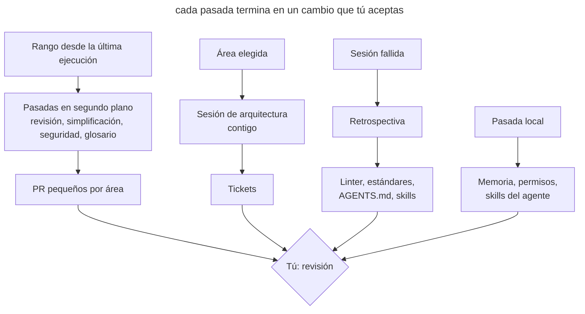

# Mantenimiento programado

## Propósito

Lanzar al agente con regularidad en pasadas que buscan deriva en el código, la documentación y el propio entorno del agente, y devolver el resultado en forma de PR pequeños o tickets. Cada pasada tiene su propia frecuencia, su propio alcance y su propia forma de ejecución: en la nube, en local o contigo.

## También conocido como

Garbage collection, doc gardening, maintenance routines, tareas periódicas, pasadas de higiene.

## Problema

Los agentes escriben decenas de miles de líneas a la semana. La revisión de cada PR solo comprueba su diff. Si tres PR se desvían un poco del estándar, cada uno en un sitio distinto, ninguna revisión lo nota, y al cabo de un mes la desviación se convierte en la nueva norma que el agente sigue copiando.

Junto con el código envejece todo lo que ayuda al agente a trabajar. El glosario no conoce los modelos nuevos, en _AGENTS.md_ se acumulan reglas que ya no cambian nada, el skill que arranca la aplicación apunta a un script borrado, la lista de permisos no para de crecer y en la memoria privada del agente se depositan hechos del proyecto que no están en el repositorio. Cada uno de estos detalles le cuesta al agente llamadas extra y errores en cada sesión siguiente.

Una limpieza puntual «cuando la cosa se ponga fea» no funciona: para entonces la deriva ya se ha extendido por el código, y arreglarla se convierte en una refactorización grande y arriesgada. Una limpieza manual semanal tampoco escala: el equipo le dedica un día y aun así no alcanza el volumen.

## Solución

Haz una lista de las pasadas periódicas y decide cuatro cosas para cada una.

1. **Qué deriva.** El código respecto a los estándares, el lenguaje del dominio respecto al glosario, las instrucciones respecto a la práctica, el entorno del agente respecto al proyecto real.
2. **La frecuencia.** Depende de lo rápido que ocurre la deriva. Todo lo que sigue al código, revísalo cada semana. Las instrucciones y el entorno del agente cambian más despacio; basta con mirarlos una vez al mes.
3. **El alcance.** Una pasada por todo el repositorio da un informe superficial. Fija un rango de commits, los directorios con más cambios, una capa o un concepto del dominio.
4. **La forma de ejecución.** A una pasada que solo necesita el repositorio le sirve una tarea en segundo plano en la nube. Una pasada que necesita tu memoria, tus transcripciones o la aplicación en marcha necesita tu máquina. Una pasada con decisiones que solo tomas tú se hace contigo.

El resultado de cada pasada debe ser una acción, no un informe: un PR con correcciones para un área, o tickets. Un informe que nadie convirtió en un cambio solo añade ruido.

Aparte de las pasadas programadas, mantén una revisión por evento. La retrospectiva de una sesión sirve justo después de un trabajo que salió mal, mientras aún recuerdas qué falló. Una semana después ya no queda nada que revisar.

## Estructura

El diagrama muestra las tres formas de ejecución y adónde llega el resultado de cada una.



Las pasadas en segundo plano funcionan sin ti y llegan como PR listos. Los hallazgos de la revisión semanal indican qué área llevar a la sesión de arquitectura. La retrospectiva no la dispara el calendario, sino una sesión fallida. Las pasadas locales mantienen la propia herramienta y rara vez llegan al proyecto.

## Participantes / Componentes

- **El calendario** lanza las pasadas con la frecuencia fijada y guarda sus prompts.
- **El punto de referencia** fija el rango: una etiqueta de la última ejecución o una fecha.
- **Una pasada** comprueba un área en busca de un tipo de deriva.
- **La referencia** describe la norma: estándares de código, glosario, ADR, _AGENTS.md_.
- **El resultado** convierte los hallazgos en PR o tickets.
- **Tú** aceptas los cambios, eliges el área para la sesión de arquitectura y respondes a las preguntas de la retrospectiva.

## Cuándo aplicarlo

- Los agentes escriben más código del que el equipo puede leer con atención.
- El proyecto tiene una referencia con la que comparar: estándares, un glosario, ADR.
- Sobre el repositorio trabajan varias personas o varias sesiones en paralelo.
- El proyecto ya ha acumulado un entorno para el agente: instrucciones, skills, hooks, permisos.

En un proyecto pequeño con un solo desarrollador y cambios poco frecuentes, basta con una retrospectiva tras las sesiones fallidas y una pasada mensual por las instrucciones.

## Consecuencias y compromisos

- ➕ La deriva se corrige en pasos pequeños mientras todavía es local.
- ➕ Las instrucciones y los skills siguen siendo cortos y corresponden al trabajo real.
- ➕ Las pasadas en segundo plano no te quitan tiempo hasta la revisión.
- ➖ Los PR semanales también hay que leerlos; si se acumulan, las pasadas pierden su sentido.
- ➖ Un agente en segundo plano se equivoca como cualquier otro, así que sus PR pasan por la revisión normal.
- ➖ Las pasadas cuestan tokens y límites de uso, sobre todo en rangos grandes.
- ➖ El calendario envejece junto con el proyecto y también necesita revisión.

## Implementación

1. Anota qué sirve de referencia en el proyecto y qué puede quedarse atrás respecto a ella. Sin referencia, la revisión de estándares y la comprobación del glosario se convierten en cuestión de gustos.
2. Para cada pasada, fija la frecuencia, el alcance y el formato del resultado. Empieza con una revisión semanal de estándares y una pasada mensual por las instrucciones; añade el resto cuando aparezca un problema recurrente.
3. Fija el rango de forma explícita. Una tarea en segundo plano no tiene por qué recordar su última ejecución: pon en el prompt la etiqueta de la ejecución o un periodo como «commits de los últimos 7 días».
4. Divide un diff grande por directorios. Decenas de miles de líneas no caben en una sola pasada, así que lanza una tarea por cada área grande.
5. Separa las pasadas del proyecto del mantenimiento de la herramienta. Las primeras cambian el repositorio y van a PR; las segundas cambian tus ajustes y tu memoria.
6. Una vez al mes, revisa el propio calendario: qué pasadas llevan tiempo sin encontrar nada y cuáles producen PR que nadie lee.

### Pasadas del proyecto

Estas pasadas no dependen del agente. La mayoría son [skills de Matt Pocock](matt-pocock-skills.md), y el paquete hay que instalarlo antes: `npx skills@latest add mattpocock/skills` y luego, una vez, `/setup-matt-pocock-skills`. El instalador deja los skills en _.agents/skills_, de donde los lee Codex; Claude Code solo lee _.claude/skills_, así que ahí tiene que haber enlaces a ellos. En Claude Code un skill se invoca como `/nombre`, en Codex como `$nombre`. Cuando un agente tiene un comando integrado, se describe en la misma subsección.

#### Retrospectiva

**Qué es.** El skill `retro` de la sección in-progress del paquete de Matt Pocock ([código fuente](https://github.com/mattpocock/skills/tree/main/skills/in-progress/retro)). El modelo no lo invoca por su cuenta; solo lo lanzas tú.

**Cómo funciona.** El skill carga `writing-for-agents` como guía de estilo y lee la transcripción de la sesión, por defecto la actual. Busca mejoras en siete categorías: navegación por el proyecto, comprobaciones automáticas, estándares de revisión, _AGENTS.md_, economía de llamadas, reglas que no cambian nada y acceso a la información. Propone detectar una infracción mecánica con un linter, un hook o CI, y anotar en los estándares solo lo que requiere criterio. Presenta los candidatos por gravedad y no cambia nada por sí mismo.

**Cuándo.** Justo después de una sesión en la que el agente se atascó: muchas correcciones, una vuelta atrás, una búsqueda larga, un error repetido.

**Cómo lanzarlo.**

```text
/retro el agente buscó tres veces dónde se configuran los envíos de correo y editó dos veces un archivo generado
```

En Codex el mismo texto empieza con `$retro`. Las propuestas aceptadas las implementas en esa misma sesión.

#### Revisión de estándares

**Qué es.** El skill `code-review` del paquete ([código fuente](https://github.com/mattpocock/skills/tree/main/skills/engineering/code-review)). Claude Code tiene un comando integrado `/code-review` que busca errores de corrección. Un skill del proyecto con el mismo nombre lo sustituye, y el integrado sigue disponible como `/review`.

**Cómo funciona.** El skill toma el diff desde un punto de referencia (`git diff <punto>...HEAD`) y encuentra los documentos con estándares, como _CODING_STANDARDS.md_ y _CONTRIBUTING.md_. Luego lanza dos subagentes en paralelo. Standards contrasta el diff con los estándares del proyecto y con una lista base de code smells de *Refactoring* de Fowler. Spec contrasta el diff con la tarea de origen. Para una pasada programada basta con el eje Standards. Las infracciones se dividen en graves y discutibles, cada una con un enlace a la regla.

**Cuándo.** Cada semana, como tarea en la nube, una tarea por cada área grande.

**Cómo lanzarlo.** Un prompt para la tarea de un área:

```text
/code-review desde el último commit de main con más de 7 días, solo el eje Standards, solo app/services. Corrige las infracciones y abre un PR que enumere en la descripción las reglas incumplidas de CODING_STANDARDS.md
```

En Codex el mismo prompt empieza con `$code-review`. Codex también tiene el comando integrado `codex review --base <rama>`, que toma las reglas de revisión de la sección `## Code Review Rules` de _AGENTS.md_ ([documentación](https://learn.chatgpt.com/docs/code-review)). La revisión automática de PR en GitHub (`@codex review`) mira un solo PR e informa solo de problemas graves, así que no sustituye a la pasada semanal.

#### Simplificación

**Qué es.** En Claude Code, el skill integrado `/simplify` ([documentación](https://code.claude.com/docs/en/commands)). Codex no tiene un equivalente integrado.

**Cómo funciona.** Cuatro subagentes miran en paralelo el código modificado: reutilización de helpers existentes, simplificación, eficiencia y nivel de abstracción. Lo que encuentran se corrige enseguida. `/simplify` no busca errores de corrección; para eso está `/code-review`. Se le puede pasar una ruta o un PR como argumento.

**Cuándo.** Cada semana, sobre los 3–5 directorios con más cambios.

**Cómo lanzarlo.** La tarea en la nube primero localiza los directorios con `git log --since="7 days ago" --stat` y después lanza el comando para cada uno:

```text
/simplify app/services
```

En Codex, usa un prompt normal: «encuentra repeticiones, capas sobrantes y código muerto en los cambios de la semana en app/services y elimínalos».

#### Revisión de seguridad

**Qué es.** En Claude Code, el comando integrado `/security-review` ([documentación](https://code.claude.com/docs/en/security-guidance), [código fuente](https://github.com/anthropics/claude-code-security-review)). En Codex, la mención `@codex security review` en un PR y el plugin aparte Codex Security ([documentación](https://learn.chatgpt.com/docs/security)).

**Cómo funciona.** `/security-review` toma el diff entre la rama actual y la rama por defecto de `origin` y busca inyecciones, fallos de autorización y fugas de datos. No acepta un rango de commits. `@codex security review` comprueba un PR; el informe completo aparece en la pestaña Security Report de la tarea.

**Cuándo.** En cada rama antes de fusionar y cada semana sobre la rama principal.

**Cómo lanzarlo.** En una rama antes de fusionar:

```text
/security-review
```

La pasada semanal por la rama principal es una tarea en la nube con un prompt normal:

```text
Revisa la seguridad de los cambios en main de los últimos 7 días: autorización, pagos, subida de archivos, llamadas a API externas. Para cada hallazgo confirmado, abre un PR aparte con la corrección y un test que lo reproduzca
```

#### Comprobación del glosario

**Qué es.** El skill `domain-modeling` del paquete ([código fuente](https://github.com/mattpocock/skills/tree/main/skills/engineering/domain-modeling)).

**Cómo funciona.** El skill contrasta los términos del código y de la conversación con _CONTEXT.md_ y señala las contradicciones: el glosario llama a un concepto de una manera y el código de otra, o el código se comporta distinto de lo descrito. Un término resuelto lo anota en el glosario enseguida. _CONTEXT.md_ sigue siendo solo un diccionario, sin detalles de implementación. Si en la raíz hay un _CONTEXT-MAP.md_, el skill trabaja con varios contextos.

**Cuándo.** Cada semana, como tarea en la nube.

**Cómo lanzarlo.**

```text
/domain-modeling contrasta CONTEXT.md con los modelos y servicios añadidos a main en los últimos 7 días: conceptos nuevos sin entrada, entradas con nombres de clase antiguos, términos de la sección Avoid que han vuelto al código. Pon los cambios del glosario en un PR y enumera en la descripción los términos dudosos
```

El skill está pensado para una conversación contigo. En una tarea en la nube no hay a quién preguntar, así que los términos dudosos van a la descripción del PR y los decides tú.

#### Arquitectura

**Qué es.** El skill `improve-codebase-architecture` del paquete ([código fuente](https://github.com/mattpocock/skills/tree/main/skills/engineering/improve-codebase-architecture)). Carga por sí mismo `codebase-design` y `grilling`. El plan se convierte en tickets con el skill `to-tickets` ([código fuente](https://github.com/mattpocock/skills/tree/main/skills/engineering/to-tickets)).

**Cómo funciona.** El skill toma su vocabulario de `codebase-design`: módulo, interfaz, profundidad, costura, adaptador. Luego lee _CONTEXT.md_ y los ADR del área elegida, y un subagente recorre el código buscando fricción: para entender un concepto hay que saltar entre muchos módulos pequeños; una interfaz es casi tan compleja como su implementación; los módulos se filtran unos en otros a través de las costuras. A los módulos sospechosos se les aplica la prueba de borrado: si borraras el módulo, ¿la complejidad se concentraría en un sitio o solo se movería? El skill presenta los candidatos en un informe HTML en una carpeta temporal. Para el candidato elegido hace un `grilling` y, si quieres, compara variantes de interfaz con design-it-twice. `to-tickets` corta el plan en rebanadas verticales con dependencias de bloqueo y las publica en el tracker.

**Cuándo.** Cada semana, contigo. El área alterna entre una capa y un concepto del dominio. Elígela donde la revisión y la simplificación semanales encontraron más cosas.

**Cómo lanzarlo.**

```text
/improve-codebase-architecture app/services
```

Después de trabajar el sitio elegido, lanza `/to-tickets`.

#### Instrucciones para agentes

**Qué es.** El skill `writing-for-agents` del paquete ([código fuente](https://github.com/mattpocock/skills/tree/main/skills/productivity/writing-for-agents)).

**Cómo funciona.** Es una referencia sobre cómo escribir documentos para un agente. Trata los punteros de contexto, las dos cargas (sobre el contexto del agente y sobre la atención de la persona), el orden de pasos y referencia, los criterios de finalización y la fuente única de verdad. Con él se ven los duplicados entre archivos, los documentos hinchados y las prohibiciones que atraen la atención hacia lo prohibido más de lo que la apartan.

**Cuándo.** Cada mes.

**Cómo lanzarlo.**

```text
/writing-for-agents repasa AGENTS.md, CODING_STANDARDS.md y docs/agents/: encuentra duplicados entre archivos, reglas que se han alejado de cómo trabajamos de verdad y lo que conviene mover detrás de un puntero
```

#### Tus propios skills

**Qué es.** El mismo `writing-for-agents`. Para los skills trata además el frontmatter y la forma de invocación.

**Cómo funciona.** El skill contrasta las instrucciones con la referencia y con cómo se activa realmente el skill: la descripción debe nombrar los casos en que hace falta, y cada paso debe terminar en un criterio comprobable.

**Cuándo.** Cada mes.

**Cómo lanzarlo.**

```text
/writing-for-agents repasa los skills que escribimos nosotros: run-app y finish-task. Quita los pasos que el agente ya no ejecuta y ajusta las descripciones para que cada skill se active cuando hace falta
```

#### ADR

**Qué es.** El mismo `domain-modeling`.

**Cómo funciona.** El skill lee _docs/adr_, contrasta las decisiones con el código y con ADR posteriores, y pone estados y enlaces.

**Cuándo.** Cada mes.

**Cómo lanzarlo.**

```text
/domain-modeling repasa docs/adr: qué decisiones fueron sustituidas por otras posteriores y cuáles nunca se implementaron. Pon los estados y los enlaces a los ADR que las sustituyen
```

#### Memoria del agente

**Qué es.** Un prompt normal; no hay comando propio. En Claude Code, la memoria automática vive en _~/.claude/projects/&lt;proyecto&gt;/memory_, y `/memory` muestra las entradas ([documentación](https://code.claude.com/docs/en/memory)). Codex tiene Memories en _~/.codex/memories/_; están desactivadas por defecto ([documentación](https://learn.chatgpt.com/docs/customization/memories)).

**Cómo funciona.** El agente lee su memoria y la contrasta con el repositorio. En Claude Code, la consolidación en segundo plano (el ajuste `autoDreamEnabled`) ya elimina entradas obsoletas y marca contradicciones con _CLAUDE.md_, pero no lleva los hechos del proyecto al repositorio. La documentación de Codex desaconseja editar las Memories a mano, así que allí los hechos van a _AGENTS.md_ y, si hace falta, la generación se desactiva con `memories.generate_memories`.

**Cuándo.** Cada mes, en local.

**Cómo lanzarlo.**

```text
Repasa tu memoria de este proyecto. Lleva los hechos sobre el código, los comandos y la estructura del proyecto a AGENTS.md o a docs/ si todavía no están, y bórralos de la memoria. Deja solo cómo trabajar conmigo
```

### Calendario y mantenimiento en Claude Code

Comprobado con Claude Code 2.1.283 y la [referencia de comandos](https://code.claude.com/docs/en/commands) el 2026-09-26. Los nombres de los comandos cambian más rápido que el enfoque. Todo salvo `/schedule` se ejecuta en local: estos comandos necesitan tus transcripciones, tus ajustes o un entorno en marcha.

#### Calendario: `/schedule`

**Qué es.** Un comando integrado, también `/routines` ([documentación](https://code.claude.com/docs/en/routines)).

**Cómo funciona.** El comando crea una tarea en la nube conversando contigo: pregunta el calendario, el repositorio y el prompt. Cada ejecución clona el repositorio en su rama por defecto y puede usar los conectores conectados. La tarea entrega su resultado como un PR desde una rama con el prefijo `claude/`, y la ejecución se puede seguir en su transcripción en claude.ai.

**Cómo lanzarlo.**

```text
/schedule cada lunes a las 9:00 revisa los estándares en main de los últimos 7 días en app/services, app/policies y app/javascript, un PR aparte por directorio
```

#### Permisos: `/fewer-permission-prompts`

**Qué es.** Un skill integrado.

**Cómo funciona.** El skill lee las transcripciones de las sesiones, reúne las llamadas frecuentes de solo lectura a Bash y MCP y propone una lista por prioridad. Cuando das tu conformidad, añade las reglas a `permissions.allow` del _.claude/settings.json_ compartido.

**Cuándo.** Cada mes.

**Cómo lanzarlo.**

```text
/fewer-permission-prompts
```

#### Estado de la instalación: `/doctor`

**Qué es.** Un skill integrado.

**Cómo funciona.** El skill comprueba la instalación (duplicados, `PATH`, archivos de ajustes dañados) y la versión. Encuentra skills, servidores MCP y plugins sin uso junto con su coste en contexto, y señala los hooks lentos. Limpia los archivos _CLAUDE.md_ de duplicados y de lo que se puede deducir del código. Añade los comandos de solo lectura que se rechazan a menudo al _.claude/settings.local.json_ personal. _AGENTS.md_ no forma parte de sus comprobaciones, así que las instrucciones las recorta la pasada de `writing-for-agents`.

**Cuándo.** Cada mes, después de `/fewer-permission-prompts`.

**Cómo lanzarlo.**

```text
/doctor
```

#### Skills: `/skill-doctor`

**Qué es.** Un comando integrado, disponible desde la versión 2.1.252.

**Cómo funciona.** El comando muestra, para cada skill, cuánto cuesta en contexto y con qué frecuencia se usa, para que se vea qué desactivar. Claude Code no ve en absoluto los skills que no están en _.claude/skills_, así que comprueba también que los enlaces a _.agents/skills_ siguen en su sitio.

**Cuándo.** Cada mes.

**Cómo lanzarlo.**

```text
/skill-doctor qué skills compensan sus tokens y cuáles son peso muerto
```

#### Arranque de la aplicación: `/run-skill-generator`

**Qué es.** Un skill integrado.

**Cómo funciona.** El skill escribe un skill del proyecto que enseña a `/run` y `/verify` a compilar, arrancar y comprobar tu aplicación desde un entorno limpio. Si el skill guardado deja de funcionar, `/run` propone actualizarlo. Claude edita el archivo solo cuando una ejecución salió mal.

**Cuándo.** Cada mes y cada vez que `/run` avise de que el skill está obsoleto.

**Cómo lanzarlo.**

```text
/run-skill-generator
```

### Calendario y mantenimiento en Codex

Comprobado con Codex CLI 0.156.1 y la documentación de learn.chatgpt.com el 2026-09-26.

#### Calendario: Scheduled tasks y `codex-action`

**Qué es.** Scheduled tasks es una función de la aplicación de Codex ([documentación](https://learn.chatgpt.com/docs/automations)). `openai/codex-action` es una GitHub Action que ejecuta Codex en CI ([documentación](https://learn.chatgpt.com/docs/github-action), [código fuente](https://github.com/openai/codex-action)).

**Cómo funciona.** Una tarea de la aplicación se ejecuta según el calendario en el proyecto local o en un worktree aparte, sin confirmaciones (`approval_policy = "never"`), en tu sandbox por defecto. El resultado llega a la vista Scheduled, que funciona como bandeja de entrada. El ordenador y la aplicación tienen que estar encendidos. La Action ejecuta `codex exec` con cualquier disparador de GitHub, incluido cron, y no depende de tu máquina. No abre PR por sí misma; para eso hace falta un paso aparte.

**Cómo lanzarlo.** En la aplicación, crea una tarea en la vista Scheduled con un calendario y un prompt, por ejemplo `$code-review desde el último commit de main con más de 7 días, solo el eje Standards, solo app/services`. En CI la misma pasada queda así:

```yaml
on:
  schedule:
    - cron: "0 6 * * 1"
jobs:
  standards:
    runs-on: ubuntu-latest
    permissions:
      contents: write
      pull-requests: write
    steps:
      - uses: actions/checkout@v5
        with:
          fetch-depth: 0
      - uses: openai/codex-action@v1
        with:
          openai-api-key: ${{ secrets.OPENAI_API_KEY }}
          prompt-file: .github/prompts/weekly-standards.md
      - uses: peter-evans/create-pull-request@v7
        with:
          branch: maintenance/weekly-standards
          title: "refactor: weekly standards pass"
```

Antes de poner una pasada en el calendario, asegúrate de que el sandbox la mantiene dentro del repositorio.

#### Permisos: archivos `.rules`

**Qué es.** El mecanismo de reglas de ejecución de comandos, marcado como experimental ([documentación](https://learn.chatgpt.com/docs/agent-configuration/rules)).

**Cómo funciona.** Las reglas se escriben como `prefix_rule(pattern=[...], decision="allow" | "prompt" | "forbidden")` en archivos _.rules_ junto a cada capa de configuración: _~/.codex/rules/_ y _.codex/rules/_ en un proyecto de confianza. De las reglas que coinciden gana la más estricta. Cada «permitir» en la TUI añade una regla a _~/.codex/rules/default.rules_, y no hay comando para revisarla ni limpiarla.

**Cuándo.** Cada mes: repasa el archivo a mano, lleva las reglas compartidas a _.codex/rules/_ del repositorio y borra las que sobran.

**Cómo lanzarlo.** Comprobar cómo deciden las reglas un comando concreto:

```text
codex execpolicy check --pretty --rules ~/.codex/rules/default.rules -- git push origin main
```

#### Estado de la instalación: `codex doctor`

**Qué es.** Un comando integrado de la CLI ([documentación](https://learn.chatgpt.com/docs/cli/reference)).

**Cómo funciona.** El comando comprueba la instalación, la configuración, la autenticación, el entorno de ejecución, Git y el terminal. En la TUI, `/debug-config` muestra las capas de configuración, y `/hooks` muestra los hooks y permite confiar en ellos o desactivarlos ([documentación](https://learn.chatgpt.com/docs/hooks)).

**Cuándo.** Cada mes.

**Cómo lanzarlo.**

```text
codex doctor
```

#### Tamaño de _AGENTS.md_

**Qué es.** El límite de configuración `project_doc_max_bytes`, 32 KiB por defecto ([documentación](https://learn.chatgpt.com/docs/agent-configuration/agents-md)).

**Cómo funciona.** Codex reúne los _AGENTS.md_ desde la raíz del proyecto hasta el directorio de trabajo y deja de cargarlos cuando el tamaño total llega al límite. No hay aviso: las reglas de los últimos archivos simplemente no entran en el contexto.

**Cuándo.** Cada mes, junto con la pasada de `writing-for-agents`.

**Cómo lanzarlo.** En esa misma pasada, pide al agente que sume el tamaño de todos los _AGENTS.md_ en el camino hasta los directorios más profundos y lo compare con el límite.

#### Skills

**Qué es.** El ajuste `[[skills.config]]` en _config.toml_ ([documentación](https://learn.chatgpt.com/docs/build-skills)). No hay equivalente de `/skill-doctor`.

**Cómo funciona.** Codex lee _.agents/skills_ directamente; no hacen falta symlinks. Un skill sin uso se desactiva con una entrada `[[skills.config]]` con `enabled = false`. La frecuencia con que se activa un skill se puede estimar a partir de las sesiones en _~/.codex/sessions_.

**Cuándo.** Cada mes.

**Cómo lanzarlo.**

```text
Cuenta, a partir de las sesiones en ~/.codex/sessions del último mes, qué skills de .agents/skills se invocaron y cuántas veces. Enumera los que no se invocaron nunca
```

#### Arranque de la aplicación

**Qué es.** Los Local environments de la aplicación de Codex ([documentación](https://learn.chatgpt.com/docs/environments/local-environment)). No hay generador de un skill de arranque.

**Cómo funciona.** En Local environments se describen los scripts de preparación del worktree y las acciones frecuentes, como arrancar la aplicación.

**Cuándo.** Cada mes: comprueba que los scripts siguen levantando la aplicación desde cero.

## Ejemplo

El proyecto recibe unas veinte mil líneas a la semana, los estándares están en _CODING_STANDARDS.md_ y el código está organizado por capas en _app/_. La tarea semanal de revisión de estándares recibe este prompt.

> Comprueba el cumplimiento de los estándares en main de los últimos 7 días. Usa el skill code-review, solo el eje Standards. Divide los cambios por directorio de primer nivel dentro de app/ y recorre cada uno por separado. Abre un PR aparte para cada área con hallazgos y enumera en la descripción las reglas de CODING_STANDARDS.md que se incumplen, con enlaces a los commits donde aparecieron.

El lunes llegan tres PR: en _app/services_ dos servicios vuelven a ir a la base de datos saltándose los repositorios, en _app/policies_ una comprobación de rol compara cadenas en lugar de usar una enumeración, y en _app/javascript/pages_ se duplica el formateo de fechas. Aceptas los dos primeros tras una revisión breve. El tercero muestra que la regla del formateo de fechas se puede comprobar con un linter, así que abres un ticket para una regla de lint en lugar de una línea en los estándares.

Para la sesión de arquitectura de esta semana eliges _app/services_: es donde más hallazgos hubo por segundo mes seguido. El informe muestra que los servicios son finos y casi solo repiten los repositorios; el sitio elegido se desarrolla hasta un plan y sale en forma de tickets.

## Antipatrones y errores comunes

- **Una pasada por todo el repositorio.** El agente mira un poco de todo y solo encuentra lo evidente. Fija un alcance.
- **Un único PR grande.** Las correcciones de todas las áreas en un solo PR no se pueden revisar, se aplaza, y la siguiente pasada encuentra lo mismo.
- **Un informe en lugar de un cambio.** Los informes HTML se acumulan en una carpeta temporal y nada cambia.
- **Una retrospectiva de memoria.** Revisar sesiones de hace una semana depende de lo que ya nadie recuerda.
- **Confiar en la revisión de cada PR.** La revisión automática de PR detecta errores en un diff, pero no una desviación que se acumula a lo largo de muchos PR.
- **Mantenimiento de la herramienta mezclado con el proyecto.** Los cambios de permisos y memoria personales acaban en un PR del equipo o, al revés, las reglas del equipo se quedan en ajustes personales.
- **Un calendario que nadie revisa.** Las pasadas que llevan tiempo sin encontrar nada siguen gastando límites, y la gente deja de leer sus PR.

## Usos conocidos

- **OpenAI** describe en [Harness engineering](https://openai.com/index/harness-engineering/) tareas de Codex en segundo plano que, con una frecuencia regular, buscan desviaciones de los «principios de oro», actualizan las calificaciones de calidad por dominio y capa, y abren PR de refactorización concretos. Un agente aparte de doc-gardening busca documentación obsoleta. Antes el equipo dedicaba cada viernes a la limpieza, y eso no escalaba.
- **Los skills de Matt Pocock** ofrecen pasadas listas para ejecutar con regularidad: `retro`, `code-review`, `domain-modeling`, `writing-for-agents`, `improve-codebase-architecture`.
- **Claude Code** incluye las comprobaciones de entorno integradas `/doctor`, `/skill-doctor` y `/fewer-permission-prompts`, y `/schedule` ejecuta tareas en la nube según un calendario.
- **Codex** da, en la documentación de Scheduled tasks, un ejemplo de tarea que repasa sesiones anteriores y mejora los skills.

## Patrones relacionados

- [Memoria del proyecto](claude-md-memory.md) describe el archivo de instrucciones que la pasada mensual mantiene corto.
- [Memoria hinchada](bloated-claude-md.md) muestra en qué se convierten las instrucciones sin una limpieza regular.
- [Vocabulario del dominio](domain-context-file.md) fija la referencia para la comprobación semanal del glosario.
- [Skills](skills-as-packaged-workflows.md) empaquetan las pasadas para que puedan ejecutarse según un calendario.
- [Escritor y revisor](writer-reviewer.md) separa la escritura de la revisión; la revisión programada de estándares trabaja a escala de semana, no de un PR.
- [Límites ejecutables](executable-guardrails.md) reciben nuevas comprobaciones de las retrospectivas y limitan las tareas en segundo plano a un sandbox.
