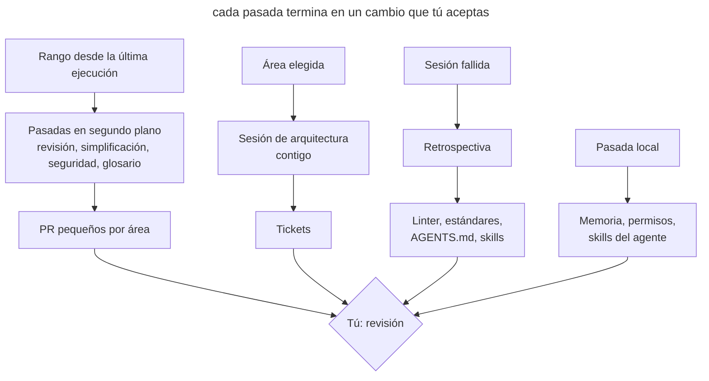

# Mantenimiento programado

## Propósito

Lanzar al agente con regularidad en pasadas que buscan deriva en el código, la documentación y el propio entorno del agente, y devolver el resultado en forma de PR pequeños o tickets. Cada pasada tiene su propia frecuencia, su propio alcance y su propia forma de ejecución: en la nube, en local o contigo.

## También conocido como

Garbage collection, doc gardening, maintenance routines, tareas periódicas, pasadas de higiene.

## Problema

Los agentes escriben decenas de miles de líneas a la semana. La revisión de cada PR solo comprueba su diff. Si tres PR se desvían un poco del estándar, cada uno en un sitio distinto, ninguna revisión lo nota, y al cabo de un mes la desviación se convierte en la nueva norma que el agente sigue copiando.

Junto con el código envejece todo lo que ayuda al agente a trabajar. El glosario no conoce los modelos nuevos, en _AGENTS.md_ se acumulan reglas que ya no cambian nada, el skill que arranca la aplicación apunta a un script borrado, la lista de permisos no para de crecer y en la memoria privada del agente se depositan hechos del proyecto que no están en el repositorio. Cada uno de estos detalles le cuesta al agente llamadas extra y errores en cada sesión siguiente.

Una limpieza puntual «cuando la cosa se ponga fea» no funciona: para entonces la deriva ya se ha extendido por el código, y arreglarla se convierte en una refactorización grande y arriesgada. Una limpieza manual semanal tampoco escala: el equipo le dedica un día y aun así no alcanza el volumen.

## Solución

Cuando hay mucho código de agentes, todo deriva a la vez: la arquitectura, los límites entre capas, el glosario, el cumplimiento de los estándares, las instrucciones para los propios agentes. Por eso las comprobaciones no esperan a un motivo; simplemente se ejecutan con regularidad. Todo lo que sigue al código se revisa cada semana: estándares, simplificación, seguridad, glosario, arquitectura. Las instrucciones, los skills, los ADR y los ajustes del agente cambian más despacio, y basta con revisarlos una vez al mes.

Cada pasada mira una parte concreta: los cambios de la semana, un directorio, una capa o un concepto del dominio. Una pasada por todo el repositorio de golpe da un informe superficial.

El resultado de cada pasada debe ser una acción, no un informe: un PR con correcciones para un área, o tickets. Un informe que nadie convirtió en un cambio solo añade ruido.

Aparte de las pasadas programadas, mantén una revisión por evento. La retrospectiva de una sesión sirve justo después de un trabajo que salió mal, mientras aún recuerdas qué falló. Una semana después ya no queda nada que revisar.

## Estructura

El diagrama muestra las tres formas de ejecución y adónde llega el resultado de cada una.



Las pasadas en segundo plano funcionan sin ti y llegan como PR listos. Los hallazgos de la revisión semanal indican qué área llevar a la sesión de arquitectura. La retrospectiva no la dispara el calendario, sino una sesión fallida. Las pasadas locales mantienen la propia herramienta y rara vez llegan al proyecto.

## Participantes / Componentes

- **El calendario** lanza las pasadas con la frecuencia fijada y guarda sus prompts.
- **El punto de referencia** fija el rango: una etiqueta de la última ejecución o una fecha.
- **Una pasada** comprueba un área en busca de un tipo de deriva.
- **La referencia** describe la norma: estándares de código, glosario, ADR, _AGENTS.md_.
- **El resultado** convierte los hallazgos en PR o tickets.
- **Tú** aceptas los cambios, eliges el área para la sesión de arquitectura y respondes a las preguntas de la retrospectiva.

## Cuándo aplicarlo

- Los agentes escriben más código del que el equipo puede leer con atención.
- El proyecto tiene una referencia con la que comparar: estándares, un glosario, ADR.
- Sobre el repositorio trabajan varias personas o varias sesiones en paralelo.
- El proyecto ya ha acumulado un entorno para el agente: instrucciones, skills, hooks, permisos.

En un proyecto pequeño con un solo desarrollador y cambios poco frecuentes, basta con una retrospectiva tras las sesiones fallidas y una pasada mensual por las instrucciones.

## Consecuencias y compromisos

- ➕ La deriva se corrige en pasos pequeños mientras todavía es local.
- ➕ Las instrucciones y los skills siguen siendo cortos y corresponden al trabajo real.
- ➕ Las pasadas en segundo plano no te quitan tiempo hasta la revisión.
- ➖ Los PR semanales también hay que leerlos; si se acumulan, las pasadas pierden su sentido.
- ➖ Un agente en segundo plano se equivoca como cualquier otro, así que sus PR pasan por la revisión normal.
- ➖ Las pasadas cuestan tokens y límites de uso, sobre todo en rangos grandes.
- ➖ El calendario envejece junto con el proyecto y también necesita revisión.

## Implementación

Las pasadas semanales por el código es cómodo ponerlas como tareas en la nube: llegan solas como PR listos. La arquitectura, la retrospectiva y el mantenimiento del agente se lanzan a mano. Una tarea en segundo plano no recuerda su última ejecución, así que indica el periodo directamente en el prompt, por ejemplo «de la última semana». Si hay demasiados cambios para una sola pasada, lánzala por directorios. Una vez al mes, mira qué pasadas llevan tiempo sin encontrar nada y cuáles producen PR que nadie lee.

### Pasadas que no dependen del agente

La mayoría de estas pasadas son [skills de Matt Pocock](matt-pocock-skills.md), y el paquete hay que instalarlo antes: `npx skills@latest add mattpocock/skills` y luego, una vez, `/setup-matt-pocock-skills`. El instalador deja los skills en _.agents/skills_, de donde los lee Codex; Claude Code solo lee _.claude/skills_, así que ahí tiene que haber enlaces a ellos. En los ejemplos los skills se invocan como en Claude Code, con `/nombre`; en Codex la misma llamada se escribe `$nombre`. Los comandos integrados de cada agente se describen en los bloques siguientes.

#### Retrospectiva

Es el skill `retro` de la sección in-progress del paquete ([código fuente](https://github.com/mattpocock/skills/tree/main/skills/in-progress/retro)). El modelo no lo invoca por su cuenta; solo lo lanzas tú.

El skill carga `writing-for-agents` como guía de estilo y lee la transcripción de la sesión, por defecto la actual. Busca mejoras en siete categorías: navegación por el proyecto, comprobaciones automáticas, estándares de revisión, _AGENTS.md_, economía de llamadas, reglas que no cambian nada y acceso a la información. Propone detectar una infracción mecánica con un linter, un hook o CI, y anotar en los estándares solo lo que requiere criterio. Presenta los candidatos por gravedad y no cambia nada por sí mismo.

Lánzalo justo después de una sesión en la que el agente se atascó: muchas correcciones, una vuelta atrás, una búsqueda larga, un error repetido. Implementa las propuestas aceptadas en esa misma sesión.

##### Ejemplo

```text
/retro
```

#### Revisión de estándares

Es el skill `code-review` del paquete ([código fuente](https://github.com/mattpocock/skills/tree/main/skills/engineering/code-review)).

El skill toma el diff desde un punto de referencia (`git diff <punto>...HEAD`) y encuentra los documentos con estándares, como _CODING_STANDARDS.md_ y _CONTRIBUTING.md_. Luego lanza dos subagentes en paralelo: uno contrasta el diff con los estándares del proyecto y con una lista base de code smells de *Refactoring* de Fowler, el otro lo contrasta con la tarea de origen. Para una pasada programada basta con la primera parte. Las infracciones se dividen en graves y discutibles, cada una con un enlace a la regla.

Lánzalo cada semana como tarea en la nube, una tarea por cada área grande.

##### Ejemplo

```text
/code-review de la última semana
```

#### Simplificación

El paquete no tiene un skill propio para esto; la pasada es un prompt normal. El agente busca repeticiones, capas sobrantes y código muerto en el código cambiado hace poco y los elimina enseguida.

Lánzalo cada semana sobre los 3–5 directorios con más cambios. La tarea en la nube los localiza sola con `git log --since="7 days ago" --stat`.

##### Ejemplo

```text
Simplifica el código que cambió en la última semana
```

#### Revisión de seguridad

Un prompt normal. El agente lee los cambios del periodo y revisa los sitios donde un error sale más caro: autorización, pagos, subida de archivos y llamadas a API externas.

Lánzalo cada semana como tarea en la nube sobre la rama principal.

##### Ejemplo

```text
Revisa si hay vulnerabilidades en los cambios de la última semana
```

#### Comprobación del glosario

Es el skill `domain-modeling` del paquete ([código fuente](https://github.com/mattpocock/skills/tree/main/skills/engineering/domain-modeling)).

El skill contrasta los términos del código y de la conversación con _CONTEXT.md_ y señala las contradicciones: el glosario llama a un concepto de una manera y el código de otra, o el código se comporta distinto de lo descrito. Un término resuelto lo anota en el glosario enseguida. _CONTEXT.md_ sigue siendo solo un diccionario, sin detalles de implementación. El skill está pensado para una conversación contigo; en una tarea en la nube no hay a quién preguntar, así que los términos dudosos van a la descripción del PR.

Lánzalo cada semana como tarea en la nube.

##### Ejemplo

```text
/domain-modeling de la última semana
```

#### Arquitectura

Es el skill `improve-codebase-architecture` del paquete ([código fuente](https://github.com/mattpocock/skills/tree/main/skills/engineering/improve-codebase-architecture)). Carga por sí mismo `codebase-design` y `grilling`. El plan se convierte en tickets con el skill `to-tickets` ([código fuente](https://github.com/mattpocock/skills/tree/main/skills/engineering/to-tickets)).

El skill toma su vocabulario de `codebase-design`: módulo, interfaz, profundidad, costura, adaptador. Luego lee _CONTEXT.md_ y los ADR del área elegida, y un subagente recorre el código buscando fricción: para entender un concepto hay que saltar entre muchos módulos pequeños; una interfaz es casi tan compleja como su implementación; los módulos se filtran unos en otros a través de las costuras. A los módulos sospechosos se les aplica la prueba de borrado: si borraras el módulo, ¿la complejidad se concentraría en un sitio o solo se movería? El skill presenta los candidatos en un informe HTML en una carpeta temporal. Para el candidato elegido hace un `grilling` y, si quieres, compara variantes de interfaz con design-it-twice. `to-tickets` corta el plan en rebanadas verticales con dependencias de bloqueo y las publica en el tracker.

Lánzalo cada semana, contigo. El área alterna entre una capa y un concepto del dominio. Elígela donde la revisión y la simplificación semanales encontraron más cosas.

##### Ejemplo

```text
/improve-codebase-architecture app/services
```

Después de trabajar el sitio elegido, lanza `/to-tickets`.

#### Instrucciones para agentes

Es el skill `writing-for-agents` del paquete ([código fuente](https://github.com/mattpocock/skills/tree/main/skills/productivity/writing-for-agents)).

Es una referencia sobre cómo escribir documentos para un agente. Trata los punteros de contexto, las dos cargas (sobre el contexto del agente y sobre la atención de la persona), el orden de pasos y referencia, los criterios de finalización y la fuente única de verdad. Con él se ven los duplicados entre archivos, los documentos hinchados y las prohibiciones que atraen la atención hacia lo prohibido más de lo que la apartan.

Lánzalo cada mes.

##### Ejemplo

```text
/writing-for-agents revisa la documentación
```

#### Tus propios skills

Tus propios skills se revisan con el mismo `writing-for-agents`; para los skills trata además el frontmatter y la forma de invocación. La descripción de un skill debe nombrar los casos en que hace falta, y cada paso debe terminar en un criterio comprobable.

Lánzalo cada mes.

##### Ejemplo

```text
/writing-for-agents revisa los skills
```

#### ADR

Los ADR se revisan con el mismo `domain-modeling`. El skill lee _docs/adr_, contrasta las decisiones con el código y con ADR posteriores, y pone estados y enlaces.

Lánzalo cada mes.

##### Ejemplo

```text
/domain-modeling revisa los ADR
```

#### Memoria del agente

No hay comando propio; basta un prompt normal. El agente lee su memoria sobre el proyecto, lleva al repositorio los hechos sobre el código y los comandos y deja en la memoria solo cómo trabajar contigo. Dónde vive la memoria y cómo se limpia sola depende del agente y se describe en su bloque.

Lánzalo cada mes, en local.

##### Ejemplo

```text
Limpia tu memoria de este proyecto
```

### Claude Code

Comprobado con Claude Code 2.1.283 y la [referencia de comandos](https://code.claude.com/docs/en/commands) el 2026-09-26. Los nombres de los comandos cambian más rápido que el enfoque. Todo salvo `/schedule` se ejecuta en local: estos comandos necesitan tus transcripciones, tus ajustes o un entorno en marcha.

#### Calendario: `/schedule`

`/schedule` es un comando integrado, también `/routines` ([documentación](https://code.claude.com/docs/en/routines)).

El comando crea una tarea en la nube conversando contigo: pregunta el calendario, el repositorio y el prompt. Cada ejecución clona el repositorio en su rama por defecto y puede usar los conectores conectados. La tarea entrega su resultado como un PR desde una rama con el prefijo `claude/`, y la ejecución se puede seguir en su transcripción en claude.ai.

##### Ejemplo

```text
/schedule cada lunes /code-review de la última semana
```

#### Revisión: `/code-review` y `/review`

Claude Code tiene un skill integrado `/code-review` que busca errores de corrección. Un skill del proyecto con el mismo nombre, como `code-review` del paquete de Matt Pocock, lo sustituye, y el integrado sigue disponible como `/review` ([documentación](https://code.claude.com/docs/en/skills)).

##### Ejemplo

```text
/review
```

#### Simplificación: `/simplify`

`/simplify` es un skill integrado ([documentación](https://code.claude.com/docs/en/commands)).

Cuatro subagentes miran en paralelo el código modificado: reutilización de helpers existentes, simplificación, eficiencia y nivel de abstracción. Lo que encuentran se corrige enseguida. `/simplify` no busca errores de corrección. Se le puede pasar una ruta o un PR como argumento, así que la tarea semanal lo lanza por directorio.

##### Ejemplo

```text
/simplify app/services
```

#### Seguridad: `/security-review`

`/security-review` es un comando integrado ([documentación](https://code.claude.com/docs/en/security-guidance), [código fuente](https://github.com/anthropics/claude-code-security-review)).

El comando toma el diff entre la rama actual y la rama por defecto de `origin` y busca inyecciones, fallos de autorización y fugas de datos. No acepta un rango de commits, así que se ejecuta en una rama antes de fusionar, y la pasada semanal por la rama principal sigue siendo un prompt normal del bloque común.

##### Ejemplo

```text
/security-review
```

#### Memoria

La memoria automática vive en _~/.claude/projects/&lt;proyecto&gt;/memory_, y `/memory` muestra las entradas y la activa o desactiva ([documentación](https://code.claude.com/docs/en/memory)). La consolidación en segundo plano (el ajuste `autoDreamEnabled`) elimina entradas obsoletas y marca contradicciones con _CLAUDE.md_, pero no lleva los hechos del proyecto al repositorio, así que la pasada mensual del bloque común sigue haciendo falta.

#### Permisos: `/fewer-permission-prompts`

`/fewer-permission-prompts` es un skill integrado.

El skill lee las transcripciones de las sesiones, reúne las llamadas frecuentes de solo lectura a Bash y MCP y propone una lista por prioridad. Cuando das tu conformidad, añade las reglas a `permissions.allow` del _.claude/settings.json_ compartido.

Lánzalo cada mes.

##### Ejemplo

```text
/fewer-permission-prompts
```

#### Estado de la instalación: `/doctor`

`/doctor` es un skill integrado.

El skill comprueba la instalación (duplicados, `PATH`, archivos de ajustes dañados) y la versión. Encuentra skills, servidores MCP y plugins sin uso junto con su coste en contexto, y señala los hooks lentos. Limpia los archivos _CLAUDE.md_ de duplicados y de lo que se puede deducir del código. Añade los comandos de solo lectura que se rechazan a menudo al _.claude/settings.local.json_ personal. _AGENTS.md_ no forma parte de sus comprobaciones, así que las instrucciones las recorta la pasada de `writing-for-agents`.

Lánzalo cada mes, después de `/fewer-permission-prompts`.

##### Ejemplo

```text
/doctor
```

#### Skills: `/skill-doctor`

`/skill-doctor` es un comando integrado, disponible desde la versión 2.1.252.

El comando muestra, para cada skill, cuánto cuesta en contexto y con qué frecuencia se usa, para que se vea qué desactivar. Claude Code no ve en absoluto los skills que no están en _.claude/skills_, así que comprueba también que los enlaces a _.agents/skills_ siguen en su sitio.

Lánzalo cada mes.

##### Ejemplo

```text
/skill-doctor
```

#### Arranque de la aplicación: `/run-skill-generator`

`/run-skill-generator` es un skill integrado.

El skill escribe un skill del proyecto que enseña a `/run` y `/verify` a compilar, arrancar y comprobar tu aplicación desde un entorno limpio. Si el skill guardado deja de funcionar, `/run` propone actualizarlo. Claude edita el archivo solo cuando una ejecución salió mal.

Lánzalo cada mes y cada vez que `/run` avise de que el skill está obsoleto.

##### Ejemplo

```text
/run-skill-generator
```

### Codex

Comprobado con Codex CLI 0.156.1 y la documentación de learn.chatgpt.com el 2026-09-26.

#### Calendario: Scheduled tasks y `codex-action`

Scheduled tasks es una función de la aplicación de Codex ([documentación](https://learn.chatgpt.com/docs/automations)). `openai/codex-action` es una GitHub Action que ejecuta Codex en CI ([documentación](https://learn.chatgpt.com/docs/github-action), [código fuente](https://github.com/openai/codex-action)).

Una tarea de la aplicación se ejecuta según el calendario en el proyecto local o en un worktree aparte, sin confirmaciones (`approval_policy = "never"`), en tu sandbox por defecto. El resultado llega a la vista Scheduled, que funciona como bandeja de entrada. El ordenador y la aplicación tienen que estar encendidos. La Action ejecuta `codex exec` con cualquier disparador de GitHub, incluido cron, y no depende de tu máquina. No abre PR por sí misma; para eso hace falta un paso aparte. Antes de poner una pasada en el calendario, asegúrate de que el sandbox la mantiene dentro del repositorio.

##### Ejemplo en la aplicación

En la vista Scheduled, crea una tarea con un calendario y un prompt:

```text
$code-review de la última semana
```

##### Ejemplo en GitHub Actions

```yaml
on:
  schedule:
    - cron: "0 6 * * 1"
jobs:
  standards:
    runs-on: ubuntu-latest
    permissions:
      contents: write
      pull-requests: write
    steps:
      - uses: actions/checkout@v5
        with:
          fetch-depth: 0
      - uses: openai/codex-action@v1
        with:
          openai-api-key: ${{ secrets.OPENAI_API_KEY }}
          prompt-file: .github/prompts/weekly-standards.md
      - uses: peter-evans/create-pull-request@v7
        with:
          branch: maintenance/weekly-standards
          title: "refactor: weekly standards pass"
```

#### Revisión: `codex review` y `@codex review`

`codex review` es un comando integrado de la CLI; `/review` hace lo mismo en la TUI ([documentación](https://learn.chatgpt.com/docs/code-review)). Codex toma sus reglas de revisión de la sección `## Code Review Rules` de _AGENTS.md_, así que ahí conviene tener el enlace a los estándares del proyecto. La revisión automática de PR en GitHub (`@codex review`) mira un solo PR e informa solo de problemas graves, así que no sustituye a la pasada semanal.

##### Ejemplo

```text
codex review --base main
```

#### Seguridad: `@codex security review`

Mencionar `@codex security review` en un comentario de un PR lanza un Security Review; el informe completo aparece en la pestaña Security Report de la tarea. Para comprobaciones más amplias existe el plugin aparte Codex Security ([documentación](https://learn.chatgpt.com/docs/security)).

##### Ejemplo

```text
@codex security review
```

#### Memoria: Memories

Las Memories están desactivadas por defecto ([documentación](https://learn.chatgpt.com/docs/customization/memories)). Si las activaste, las entradas viven en _~/.codex/memories/_ y se generan a partir de sesiones anteriores. La documentación desaconseja editarlas a mano, así que en la pasada mensual los hechos del proyecto van a _AGENTS.md_ y, si hace falta, la generación se desactiva con `memories.generate_memories`.

#### Permisos: archivos `.rules`

Los permisos en Codex los fija el mecanismo de reglas de ejecución de comandos, marcado como experimental ([documentación](https://learn.chatgpt.com/docs/agent-configuration/rules)).

Las reglas se escriben como `prefix_rule(pattern=[...], decision="allow" | "prompt" | "forbidden")` en archivos _.rules_ junto a cada capa de configuración: _~/.codex/rules/_ y _.codex/rules/_ en un proyecto de confianza. De las reglas que coinciden gana la más estricta. Cada «permitir» en la TUI añade una regla a _~/.codex/rules/default.rules_, y no hay comando para revisarla ni limpiarla.

Una vez al mes, repasa el archivo a mano, lleva las reglas compartidas a _.codex/rules/_ del repositorio y borra las que sobran.

##### Ejemplo

Comprobar cómo deciden las reglas un comando concreto:

```text
codex execpolicy check --pretty --rules ~/.codex/rules/default.rules -- git push origin main
```

#### Estado de la instalación: `codex doctor`

`codex doctor` es un comando integrado de la CLI ([documentación](https://learn.chatgpt.com/docs/cli/reference)).

El comando comprueba la instalación, la configuración, la autenticación, el entorno de ejecución, Git y el terminal. En la TUI, `/debug-config` muestra las capas de configuración, y `/hooks` muestra los hooks y permite confiar en ellos o desactivarlos ([documentación](https://learn.chatgpt.com/docs/hooks)).

Lánzalo cada mes.

##### Ejemplo

```text
codex doctor
```

#### Tamaño de _AGENTS.md_

El tamaño de las instrucciones lo limita el ajuste `project_doc_max_bytes`, 32 KiB por defecto ([documentación](https://learn.chatgpt.com/docs/agent-configuration/agents-md)).

Codex reúne los _AGENTS.md_ desde la raíz del proyecto hasta el directorio de trabajo y deja de cargarlos cuando el tamaño total llega al límite. No hay aviso: las reglas de los últimos archivos simplemente no entran en el contexto. Compruébalo cada mes junto con la pasada de `writing-for-agents`.

##### Ejemplo

```text
Suma cuánto pesan todos los AGENTS.md juntos
```

#### Skills

Los skills en Codex se gestionan con el ajuste `[[skills.config]]` en _config.toml_ ([documentación](https://learn.chatgpt.com/docs/build-skills)). No hay equivalente de `/skill-doctor`.

Codex lee _.agents/skills_ directamente; no hacen falta symlinks. Un skill sin uso se desactiva con una entrada `[[skills.config]]` con `enabled = false`. La frecuencia con que se activa un skill se puede estimar a partir de las sesiones en _~/.codex/sessions_.

Lánzalo cada mes.

##### Ejemplo

```text
¿Qué skills no he usado en el último mes?
```

#### Arranque de la aplicación

El arranque de la aplicación en Codex se describe en los Local environments de la aplicación ([documentación](https://learn.chatgpt.com/docs/environments/local-environment)). No hay generador de un skill de arranque. Una vez al mes, comprueba que los scripts siguen levantando la aplicación desde cero.

## Ejemplo

El proyecto recibe unas veinte mil líneas a la semana, los estándares están en _CODING_STANDARDS.md_ y el código está organizado por capas en _app/_. Cada lunes una tarea en la nube se ejecuta con este prompt:

> /code-review de la última semana

El lunes llegan tres PR: en _app/services_ dos servicios vuelven a ir a la base de datos saltándose los repositorios, en _app/policies_ una comprobación de rol compara cadenas en lugar de usar una enumeración, y en _app/javascript/pages_ se duplica el formateo de fechas. Aceptas los dos primeros tras una revisión breve. El tercero muestra que la regla del formateo de fechas se puede comprobar con un linter, así que abres un ticket para una regla de lint en lugar de una línea en los estándares.

Para la sesión de arquitectura de esta semana eliges _app/services_: es donde más hallazgos hubo por segundo mes seguido. El informe muestra que los servicios son finos y casi solo repiten los repositorios; el sitio elegido se desarrolla hasta un plan y sale en forma de tickets.

## Antipatrones y errores comunes

- **Una pasada por todo el repositorio.** El agente mira un poco de todo y solo encuentra lo evidente. Fija un alcance.
- **Un único PR grande.** Las correcciones de todas las áreas en un solo PR no se pueden revisar, se aplaza, y la siguiente pasada encuentra lo mismo.
- **Un informe en lugar de un cambio.** Los informes HTML se acumulan en una carpeta temporal y nada cambia.
- **Una retrospectiva de memoria.** Revisar sesiones de hace una semana depende de lo que ya nadie recuerda.
- **Confiar en la revisión de cada PR.** La revisión automática de PR detecta errores en un diff, pero no una desviación que se acumula a lo largo de muchos PR.
- **Mantenimiento de la herramienta mezclado con el proyecto.** Los cambios de permisos y memoria personales acaban en un PR del equipo o, al revés, las reglas del equipo se quedan en ajustes personales.
- **Un calendario que nadie revisa.** Las pasadas que llevan tiempo sin encontrar nada siguen gastando límites, y la gente deja de leer sus PR.

## Usos conocidos

- **OpenAI** describe en [Harness engineering](https://openai.com/index/harness-engineering/) tareas de Codex en segundo plano que, con una frecuencia regular, buscan desviaciones de los «principios de oro», actualizan las calificaciones de calidad por dominio y capa, y abren PR de refactorización concretos. Un agente aparte de doc-gardening busca documentación obsoleta. Antes el equipo dedicaba cada viernes a la limpieza, y eso no escalaba.
- **Los skills de Matt Pocock** ofrecen pasadas listas para ejecutar con regularidad: `retro`, `code-review`, `domain-modeling`, `writing-for-agents`, `improve-codebase-architecture`.
- **Claude Code** incluye las comprobaciones de entorno integradas `/doctor`, `/skill-doctor` y `/fewer-permission-prompts`, y `/schedule` ejecuta tareas en la nube según un calendario.
- **Codex** da, en la documentación de Scheduled tasks, un ejemplo de tarea que repasa sesiones anteriores y mejora los skills.

## Patrones relacionados

- [Memoria del proyecto](claude-md-memory.md) describe el archivo de instrucciones que la pasada mensual mantiene corto.
- [Memoria hinchada](bloated-claude-md.md) muestra en qué se convierten las instrucciones sin una limpieza regular.
- [Vocabulario del dominio](domain-context-file.md) fija la referencia para la comprobación semanal del glosario.
- [Skills](skills-as-packaged-workflows.md) empaquetan las pasadas para que puedan ejecutarse según un calendario.
- [Escritor y revisor](writer-reviewer.md) separa la escritura de la revisión; la revisión programada de estándares trabaja a escala de semana, no de un PR.
- [Límites ejecutables](executable-guardrails.md) reciben nuevas comprobaciones de las retrospectivas y limitan las tareas en segundo plano a un sandbox.
