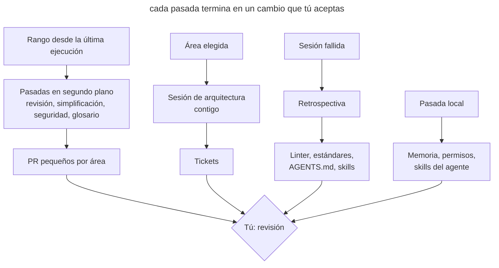

# Mantenimiento programado

## Propósito

Lanzar al agente con regularidad en pasadas que buscan deriva en el código, la documentación y el propio entorno del agente, y devolver el resultado en forma de PR pequeños o tickets. Cada pasada tiene su propia frecuencia, su propio alcance y su propia forma de ejecución: en la nube, en local o contigo.

## También conocido como

Garbage collection, doc gardening, maintenance routines, tareas periódicas, pasadas de higiene.

## Problema

Los agentes escriben decenas de miles de líneas a la semana. La revisión de cada PR solo comprueba su diff. Si tres PR se desvían un poco del estándar, cada uno en un sitio distinto, ninguna revisión lo nota, y al cabo de un mes la desviación se convierte en la nueva norma que el agente sigue copiando.

Junto con el código envejece todo lo que ayuda al agente a trabajar. El glosario no conoce los modelos nuevos, en _AGENTS.md_ se acumulan reglas que ya no cambian nada, el skill que arranca la aplicación apunta a un script borrado, la lista de permisos no para de crecer y en la memoria privada del agente se depositan hechos del proyecto que no están en el repositorio. Cada uno de estos detalles le cuesta al agente llamadas extra y errores en cada sesión siguiente.

Una limpieza puntual «cuando la cosa se ponga fea» no funciona: para entonces la deriva ya se ha extendido por el código, y arreglarla se convierte en una refactorización grande y arriesgada. Una limpieza manual semanal tampoco escala: el equipo le dedica un día y aun así no alcanza el volumen.

## Solución

Haz una lista de las pasadas periódicas y decide cuatro cosas para cada una.

1. **Qué deriva.** El código respecto a los estándares, el lenguaje del dominio respecto al glosario, las instrucciones respecto a la práctica, el entorno del agente respecto al proyecto real.
2. **La frecuencia.** Depende de lo rápido que ocurre la deriva. Todo lo que sigue al código, revísalo cada semana. Las instrucciones y el entorno del agente cambian más despacio; basta con mirarlos una vez al mes.
3. **El alcance.** Una pasada por todo el repositorio da un informe superficial. Fija un rango de commits, los directorios con más cambios, una capa o un concepto del dominio.
4. **La forma de ejecución.** A una pasada que solo necesita el repositorio le sirve una tarea en segundo plano en la nube. Una pasada que necesita tu memoria, tus transcripciones o la aplicación en marcha necesita tu máquina. Una pasada con decisiones que solo tomas tú se hace contigo.

El resultado de cada pasada debe ser una acción, no un informe: un PR con correcciones para un área, o tickets. Un informe que nadie convirtió en un cambio solo añade ruido.

Aparte de las pasadas programadas, mantén una revisión por evento. La retrospectiva de una sesión sirve justo después de un trabajo que salió mal, mientras aún recuerdas qué falló. Una semana después ya no queda nada que revisar.

## Estructura

El diagrama muestra las tres formas de ejecución y adónde llega el resultado de cada una.

Las pasadas en segundo plano funcionan sin ti y llegan como PR listos. Los hallazgos de la revisión semanal indican qué área llevar a la sesión de arquitectura. La retrospectiva no la dispara el calendario, sino una sesión fallida. Las pasadas locales mantienen la propia herramienta y rara vez llegan al proyecto.

## Participantes / Componentes

- **El calendario** lanza las pasadas con la frecuencia fijada y guarda sus prompts.
- **El punto de referencia** fija el rango: una etiqueta de la última ejecución o una fecha.
- **Una pasada** comprueba un área en busca de un tipo de deriva.
- **La referencia** describe la norma: estándares de código, glosario, ADR, _AGENTS.md_.
- **El resultado** convierte los hallazgos en PR o tickets.
- **Tú** aceptas los cambios, eliges el área para la sesión de arquitectura y respondes a las preguntas de la retrospectiva.

## Cuándo aplicarlo

- Los agentes escriben más código del que el equipo puede leer con atención.
- El proyecto tiene una referencia con la que comparar: estándares, un glosario, ADR.
- Sobre el repositorio trabajan varias personas o varias sesiones en paralelo.
- El proyecto ya ha acumulado un entorno para el agente: instrucciones, skills, hooks, permisos.

En un proyecto pequeño con un solo desarrollador y cambios poco frecuentes, basta con una retrospectiva tras las sesiones fallidas y una pasada mensual por las instrucciones.

## Consecuencias y compromisos

- ➕ La deriva se corrige en pasos pequeños mientras todavía es local.
- ➕ Las instrucciones y los skills siguen siendo cortos y corresponden al trabajo real.
- ➕ Las pasadas en segundo plano no te quitan tiempo hasta la revisión.
- ➖ Los PR semanales también hay que leerlos; si se acumulan, las pasadas pierden su sentido.
- ➖ Un agente en segundo plano se equivoca como cualquier otro, así que sus PR pasan por la revisión normal.
- ➖ Las pasadas cuestan tokens y límites de uso, sobre todo en rangos grandes.
- ➖ El calendario envejece junto con el proyecto y también necesita revisión.

## Implementación

1. Anota qué sirve de referencia en el proyecto y qué puede quedarse atrás respecto a ella. Sin referencia, la revisión de estándares y la comprobación del glosario se convierten en cuestión de gustos.
2. Para cada pasada, fija la frecuencia, el alcance y el formato del resultado. Empieza con una revisión semanal de estándares y una pasada mensual por las instrucciones; añade el resto cuando aparezca un problema recurrente.
3. Fija el rango de forma explícita. Una tarea en segundo plano no tiene por qué recordar su última ejecución: pon en el prompt la etiqueta de la ejecución o un periodo como «commits de los últimos 7 días».
4. Divide un diff grande por directorios. Decenas de miles de líneas no caben en una sola pasada, así que lanza una tarea por cada área grande.
5. Separa las pasadas del proyecto del mantenimiento de la herramienta. Las primeras cambian el repositorio y van a PR; las segundas cambian tus ajustes y tu memoria.
6. Una vez al mes, revisa el propio calendario: qué pasadas llevan tiempo sin encontrar nada y cuáles producen PR que nadie lee.

### El conjunto común

Las pasadas de abajo no dependen del agente. La mayoría se apoya en los [skills de Matt Pocock](matt-pocock-skills.md), que están en _.agents/skills_ tanto para Claude Code como para Codex.

| Frecuencia | Pasada | Resultado |
|---|---|---|
| justo después de una sesión en la que el agente se atascó | `retro` en esa misma sesión | Propuestas para el entorno. Las infracciones mecánicas las detecta un linter, un hook o CI; las cuestiones de criterio se anotan en los estándares de revisión; de _AGENTS.md_ se quitan las reglas que no cambian nada |
| cada semana | `code-review` sobre la rama principal de la semana, solo el eje de estándares, una tarea por área | La desviación de los estándares que no se ve en un solo PR se corrige en PR separados |
| cada semana | Simplificar los 3–5 directorios con más cambios de la semana | Se eliminan repeticiones, capas sobrantes y código muerto |
| cada semana | Revisión de seguridad de los cambios de la semana, empezando por autorización, pagos, subida de archivos y API externas | Los hallazgos se corrigen |
| cada semana | `domain-modeling` sobre _CONTEXT.md_ | Los modelos nuevos entran en el glosario, los renombrados se reflejan, los términos prohibidos salen del código |
| cada semana | `improve-codebase-architecture <área>` contigo; el área alterna entre una capa y un concepto del dominio | Un sitio donde conviene profundizar un módulo se desarrolla hasta un plan y se divide en tickets con `to-tickets` |
| cada mes | `writing-for-agents` sobre _AGENTS.md_, los estándares de revisión y la documentación para agentes | Se quitan los duplicados entre archivos y se corrigen las reglas que se alejaron de la práctica |
| cada mes | `writing-for-agents` sobre tus propios skills | Se eliminan pasos muertos y se ajustan las descripciones para que el skill se active cuando hace falta |
| cada mes | `domain-modeling` sobre _docs/adr_ | Los ADR sustituidos o nunca implementados reciben estado y enlaces |
| cada mes | Revisión de la memoria del agente | Los hechos del proyecto de la memoria privada pasan al repositorio o se borran; en la memoria queda solo cómo trabajar contigo |

Las pasadas semanales sugieren el área para la sesión de arquitectura: toma el directorio donde la revisión y la simplificación encontraron más cosas, o el sitio en el que la retrospectiva se quejó de que costaba orientarse.

### En Claude Code

Comprobado con Claude Code 2.1.283 el 2026-09-26. Los nombres de los comandos cambian más rápido que el enfoque.

- **Calendario.** `/schedule` (también `/routines`) crea tareas en la nube según un calendario. La tarea clona el repositorio, puede usar los conectores conectados y entrega su resultado como un PR desde una rama con el prefijo `claude/`. Aquí encajan las pasadas semanales de revisión, simplificación, seguridad y glosario.
- **Simplificación.** El `/simplify` integrado mira el código modificado y aplica las correcciones enseguida; no busca errores. Pásale la lista de directorios de forma explícita.
- **Seguridad.** `/security-review` comprueba solo los cambios de la rama actual respecto a su base y no acepta un rango de commits. Ejecútalo en la rama antes de fusionar, y programa la pasada semanal por la rama principal como tarea en la nube con un prompt normal de revisión de seguridad del periodo.
- **Permisos.** `/fewer-permission-prompts` busca en las transcripciones llamadas seguras frecuentes y las añade al _.claude/settings.json_ compartido.
- **Estado de la instalación.** `/doctor` comprueba la instalación y la versión, los servidores MCP y plugins sin uso, los hooks lentos, y añade los comandos de solo lectura que se rechazan a menudo al _.claude/settings.local.json_ personal. Sus comprobaciones de duplicados y recortes miran los archivos _CLAUDE.md_ y _.claude/rules_; _AGENTS.md_ no está en esa lista, así que las instrucciones las recorta la pasada de `writing-for-agents`.
- **Skills.** `/skill-doctor` muestra qué skills cargados no se usan y cuánto contexto ocupan. Claude Code lee los skills de _.claude/skills_, así que los skills de _.agents/skills_ se enlazan allí con symlinks; comprueba que no se haya perdido ninguno.
- **Arranque de la aplicación.** `/run-skill-generator` crea un skill que sabe arrancar tu aplicación. El `/run` integrado propone por sí mismo actualizar ese skill cuando deja de funcionar.
- **Memoria.** La memoria automática vive en _~/.claude/projects/&lt;proyecto&gt;/memory_. La consolidación en segundo plano (el ajuste `autoDreamEnabled`) elimina entradas obsoletas y marca contradicciones con _CLAUDE.md_, pero no lleva los hechos del proyecto al repositorio. Esa parte de la revisión hazla tú.

Las tareas en la nube solo reciben el repositorio. La revisión de la memoria, `/doctor`, `/fewer-permission-prompts`, `/skill-doctor` y `/run-skill-generator` se ejecutan en local, porque necesitan tus transcripciones, tus ajustes o un entorno en marcha.

### En Codex

Comprobado con Codex CLI 0.156.1 y la documentación de learn.chatgpt.com el 2026-09-26.

- **Calendario.** La aplicación de Codex tiene **Scheduled tasks**. Una tarea se ejecuta en el proyecto local o en un worktree aparte, y el resultado llega a la vista Scheduled, que funciona como bandeja de entrada. El ordenador y la aplicación tienen que estar encendidos. Para ejecutar sin tu máquina, usa `openai/codex-action` en GitHub Actions con un disparador cron.
- **Revisión.** `codex review --base <rama>` comprueba un diff sin sesión interactiva; `/review` hace lo mismo en la TUI. La revisión automática de PR en GitHub (`@codex review`) mira un solo PR e informa solo de problemas graves, así que no sustituye a una pasada semanal de estándares. Codex toma sus reglas de revisión de la sección `## Code Review Rules` de _AGENTS.md_.
- **Seguridad.** `@codex security review` comprueba un PR; para comprobaciones más amplias existe el plugin aparte Codex Security.
- **Simplificación.** No hay comando integrado. Usa `codex review` con tus propias instrucciones o tu propio skill.
- **Permisos.** Cada «permitir» en la TUI añade una regla a _~/.codex/rules/default.rules_, y no hay comando para revisarla ni limpiarla. Una vez al mes, repasa el archivo a mano, lleva las reglas compartidas a _.codex/rules/_ del repositorio y pruébalas con `codex execpolicy check`. El mecanismo de reglas está marcado como experimental.
- **Estado de la instalación.** `codex doctor` comprueba la instalación, la configuración, la autenticación y Git; `/debug-config` muestra las capas de configuración; `/hooks` muestra los hooks y su confianza.
- **Instrucciones.** Codex deja de cargar los _AGENTS.md_ cuando su tamaño total supera `project_doc_max_bytes` (32 KiB por defecto), y no avisa. La pasada mensual por las instrucciones también debe vigilar ese umbral.
- **Skills.** Codex lee _.agents/skills_ directamente; no hacen falta symlinks. No hay equivalente de `/skill-doctor`: los skills sin uso se desactivan con `[[skills.config]]` y `enabled = false`, y el uso se puede estimar a partir de las sesiones en _~/.codex/sessions_.
- **Arranque de la aplicación.** No hay generador de skills. Los comandos para arrancar la aplicación y preparar un worktree se describen en los Local environments de la aplicación; revísalos junto con el resto del entorno.
- **Memoria.** Las Memories están desactivadas por defecto. Si las activaste, las entradas viven en _~/.codex/memories/_ y se generan a partir de sesiones anteriores. La documentación desaconseja editarlas a mano, así que durante la revisión lleva los hechos del proyecto a _AGENTS.md_ o a la documentación y, si hace falta, desactiva la generación con `memories.generate_memories`.

Las tareas de la aplicación se ejecutan sin confirmaciones (`approval_policy = "never"`) en tu sandbox por defecto. Antes de poner una pasada en el calendario, asegúrate de que el sandbox la mantiene dentro del repositorio.

## Ejemplo

El proyecto recibe unas veinte mil líneas a la semana, los estándares están en _CODING_STANDARDS.md_ y el código está organizado por capas en _app/_. La tarea semanal de revisión de estándares recibe este prompt.

> Comprueba el cumplimiento de los estándares en main de los últimos 7 días. Usa el skill code-review, solo el eje Standards. Divide los cambios por directorio de primer nivel dentro de app/ y recorre cada uno por separado. Abre un PR aparte para cada área con hallazgos y enumera en la descripción las reglas de CODING_STANDARDS.md que se incumplen, con enlaces a los commits donde aparecieron.

El lunes llegan tres PR: en _app/services_ dos servicios vuelven a ir a la base de datos saltándose los repositorios, en _app/policies_ una comprobación de rol compara cadenas en lugar de usar una enumeración, y en _app/javascript/pages_ se duplica el formateo de fechas. Aceptas los dos primeros tras una revisión breve. El tercero muestra que la regla del formateo de fechas se puede comprobar con un linter, así que abres un ticket para una regla de lint en lugar de una línea en los estándares.

Para la sesión de arquitectura de esta semana eliges _app/services_: es donde más hallazgos hubo por segundo mes seguido. El informe muestra que los servicios son finos y casi solo repiten los repositorios; el sitio elegido se desarrolla hasta un plan y sale en forma de tickets.

## Antipatrones y errores comunes

- **Una pasada por todo el repositorio.** El agente mira un poco de todo y solo encuentra lo evidente. Fija un alcance.
- **Un único PR grande.** Las correcciones de todas las áreas en un solo PR no se pueden revisar, se aplaza, y la siguiente pasada encuentra lo mismo.
- **Un informe en lugar de un cambio.** Los informes HTML se acumulan en una carpeta temporal y nada cambia.
- **Una retrospectiva de memoria.** Revisar sesiones de hace una semana depende de lo que ya nadie recuerda.
- **Confiar en la revisión de cada PR.** La revisión automática de PR detecta errores en un diff, pero no una desviación que se acumula a lo largo de muchos PR.
- **Mantenimiento de la herramienta mezclado con el proyecto.** Los cambios de permisos y memoria personales acaban en un PR del equipo o, al revés, las reglas del equipo se quedan en ajustes personales.
- **Un calendario que nadie revisa.** Las pasadas que llevan tiempo sin encontrar nada siguen gastando límites, y la gente deja de leer sus PR.

## Usos conocidos

- **OpenAI** describe en [Harness engineering](https://openai.com/index/harness-engineering/) tareas de Codex en segundo plano que, con una frecuencia regular, buscan desviaciones de los «principios de oro», actualizan las calificaciones de calidad por dominio y capa, y abren PR de refactorización concretos. Un agente aparte de doc-gardening busca documentación obsoleta. Antes el equipo dedicaba cada viernes a la limpieza, y eso no escalaba.
- **Los skills de Matt Pocock** ofrecen pasadas listas para ejecutar con regularidad: `retro`, `code-review`, `domain-modeling`, `writing-for-agents`, `improve-codebase-architecture`.
- **Claude Code** incluye las comprobaciones de entorno integradas `/doctor`, `/skill-doctor` y `/fewer-permission-prompts`, y `/schedule` ejecuta tareas en la nube según un calendario.
- **Codex** da, en la documentación de Scheduled tasks, un ejemplo de tarea que repasa sesiones anteriores y mejora los skills.

## Patrones relacionados

- [Memoria del proyecto](claude-md-memory.md) describe el archivo de instrucciones que la pasada mensual mantiene corto.
- [Memoria hinchada](bloated-claude-md.md) muestra en qué se convierten las instrucciones sin una limpieza regular.
- [Vocabulario del dominio](domain-context-file.md) fija la referencia para la comprobación semanal del glosario.
- [Skills](skills-as-packaged-workflows.md) empaquetan las pasadas para que puedan ejecutarse según un calendario.
- [Escritor y revisor](writer-reviewer.md) separa la escritura de la revisión; la revisión programada de estándares trabaja a escala de semana, no de un PR.
- [Límites ejecutables](executable-guardrails.md) reciben nuevas comprobaciones de las retrospectivas y limitan las tareas en segundo plano a un sandbox.
