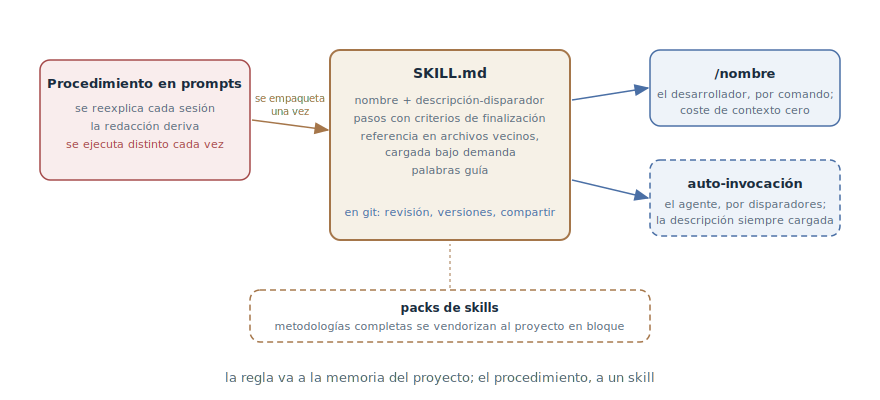

# Skills

## Propósito

Empaquetar un procedimiento recurrente en un skill — un archivo de
instrucciones con nombre que el agente carga bajo demanda y el desarrollador
invoca con un solo comando — en lugar de reexplicar el procedimiento en cada
prompt. El metapatrón de este libro: casi cualquiera de sus patrones puede
empaquetarse como skill — y la mitad ya lo está.

## También conocido como

Skills, slash commands, comandos personalizados, packaged workflows.

## Problema

Un proceso de trabajo tiene procedimientos: el ritual de release, el orden
de revisión, los pasos del triaje, el ciclo TDD. Mientras viven en cabezas y
conversaciones, ocurre lo previsible:

- El procedimiento se reexplica en cada sesión — un párrafo de texto que
  tecleas por vigésima vez.
- La redacción deriva: hoy se explicó un poco distinto que ayer — y el
  agente lo ejecutó un poco distinto. A un sistema estocástico le basta
  incluso menos motivo.
- Volcar los procedimientos en la
  [memoria del proyecto](claude-md-memory.md) no es opción: se carga entera
  en cada sesión, y las instrucciones de varios pasos no pintan nada ahí —
  es el camino directo a la memoria hinchada que el agente ignora a medias.
- El procedimiento no se transfiere: el colega le explica a su agente el
  mismo ritual con sus propias palabras — con otro resultado.

## Solución

El procedimiento se convierte en un archivo del repositorio: un skill — un
`SKILL.md` con nombre, descripción y cuerpo de instrucciones. Este empaque
tiene cuatro propiedades que un prompt no tiene:

1. **Bajo demanda.** A diferencia de la memoria del proyecto, el skill no
   ocupa la ventana hasta ser invocado: su coste es cero en cada sesión que
   no lo necesita — es justo el lugar adonde se sacan de la memoria los
   procedimientos de varios pasos.
2. **Dos modos de invocación.** *De usuario* — el skill se dispara solo por
   nombre (`/release`), no le cuesta nada al contexto, pero recordarlo es
   cosa tuya. *De modelo* — la descripción del skill con sus disparadores
   está siempre en la ventana, y el agente lo alcanza por sí mismo cuando
   la petición encaja. El modo de modelo se elige solo cuando el agente
   debe decidir por su cuenta que el skill hace falta — cada descripción
   así se paga con el contexto de cada sesión.
3. **Como código.** El skill vive en git: editar el procedimiento es un
   diff bajo revisión, no tradición oral. El equipo obtiene un
   procedimiento para todos.
4. **Portabilidad.** Los skills se agrupan en packs y se vendorizan de
   proyecto en proyecto — así se difunden metodologías enteras.

El objetivo del empaque es la **predecibilidad**: el agente recorre el
mismo *proceso* en cada ejecución, aunque los resultados difieran. A ella
sirven las técnicas de escritura: pasos con criterios de finalización
comprobables («cada modelo modificado contabilizado», no «haz una lista»);
la referencia sacada a archivos vecinos y cargada bajo demanda; las
palabras guía — términos compactos que el modelo ya conoce y de los que se
cuelga toda una región de comportamiento.

La frontera con la memoria del proyecto es simple: **la regla va a la
memoria, el procedimiento al skill**. «Commits en inglés» es una regla —
hace falta siempre. «Cómo hacemos el release» es un procedimiento — hace
falta bajo demanda.

## Estructura



A la izquierda, la vida del procedimiento antes del empaque: reexplicación
en cada sesión y deriva. En el centro, el skill: nombre,
descripción-disparador, pasos con criterios de finalización, referencia en
archivos vecinos — todo en git y editado mediante revisión. A la derecha,
las dos formas de invocarlo: el desarrollador por nombre con un comando o
el agente por los disparadores de la descripción. Abajo, los packs: los
skills viajan entre proyectos como conjuntos ya hechos.

## Participantes / Componentes

- **El skill** — `SKILL.md` más sus archivos de referencia vecinos; un
  procedimiento — un skill.
- **La descripción-disparador** — determina la invocación: una línea para
  humanos en el modo de usuario, una lista de disparadores en el de modelo.
- **El desarrollador** — autor y editor: nota el procedimiento recurrente,
  lo empaqueta, lo poda.
- **El agente** — ejecuta el skill como proceso: paso a paso, hasta los
  criterios de finalización.
- **El pack** — un conjunto de skills vendorizado al proyecto: una
  metodología como directorio de archivos.

## Cuándo aplicarlo

- El procedimiento se repitió dos o tres veces — el mismo disparador que
  para la memoria del proyecto, solo que para el «cómo hacer» y no el «qué
  es verdad».
- El procedimiento debe ejecutarse igual para todos y siempre: releases,
  revisiones, triaje, migraciones.
- Quieres que los patrones de este libro sean invocables: el traspaso de
  sesión, el TDD, el triaje y el mapa de investigación se empaquetan en
  skills literalmente.

No empaquetes lo de una sola vez: un skill invocado una vez es sobrecoste
por un archivo que nadie encontrará al mes.

## Consecuencias y compromisos

- ➕ Predecibilidad: el procedimiento corre como el mismo proceso en cada
  sesión y para cada miembro del equipo.
- ➕ El contexto queda libre: a diferencia de la memoria, el skill no
  cuesta nada hasta la invocación; la ventana se gasta solo en el
  procedimiento necesario.
- ➕ Los procedimientos se vuelven código: revisión, versiones, historial,
  compartir como pack.
- ➖ Mantenimiento: los skills sedimentan — las capas caducas se acumulan
  porque añadir parece seguro y borrar da miedo. Sin poda, el pack degrada.
- ➖ Los skills de usuario gravan la memoria del desarrollador: el índice
  eres tú. Cuando hay más skills de los que se recuerdan, hace falta un
  skill-enrutador que conozca a los demás.
- ➖ Las descripciones de modelo comen contexto siempre: repartir la
  auto-invocación con generosidad es la misma memoria hinchada por la
  puerta de atrás.

## Implementación

1. Atrapa el disparador: el procedimiento se explica por segunda vez —
   hora de empaquetar.
2. Crea `SKILL.md` con frontmatter (nombre, descripción) y cuerpo: los
   pasos en orden de ejecución, cada uno con criterio de finalización
   comprobable.
3. Elige el modo de invocación. Por defecto, el de usuario: disparo por
   nombre, coste de contexto cero. El de modelo — solo si el agente debe
   alcanzar el skill por sí mismo; entonces la descripción se escribe como
   lista de disparadores.
4. Saca la referencia a archivos vecinos y enlázala desde los pasos — se
   cargarán solo cuando llegue su momento (ver la
   [ingeniería de contexto](context-engineering.md): su principio de «bajo
   demanda» en miniatura).
5. Busca palabras guía: un término compacto («trazador», «niebla de
   guerra», «rojo») ancla el comportamiento más barato que un párrafo.
6. Poda con regularidad: revisa cada línea por relevancia, borra enteras
   las frases huecas. Los skills sin poda sedimentan.
7. Si se multiplican — monta un enrutador: un skill de usuario que
   enumera a los demás y cuándo llamar a cada uno.
8. No inventes el pack desde cero: [Superpowers](superpowers.md) y los
   [skills de Matt Pocock](matt-pocock-skills.md) son metodologías listas
   en forma de skills; vendoriza y adapta.

## Ejemplo

En cada release del servicio el desarrollador le dicta al agente el mismo
párrafo: armar el changelog con los commits desde el último tag, subir la
versión, revisar las migraciones, pasar el set de humo, crear el tag y el
release. Una vez al mes el párrafo muta — y los releases salen un poco
distintos.

El procedimiento se empaqueta en `.claude/skills/release/SKILL.md`:

```markdown
---
name: release
description: Armar y publicar un release del servicio
disable-model-invocation: true
---

1. Arma el changelog con los commits desde el último tag; cada línea,
   un Conventional Commit. Criterio: cada commit está en el changelog
   o descartado explícitamente como mantenimiento.
2. Sube la versión por semver según el contenido del changelog.
3. Revisa migraciones sin aplicar — no debe haber ninguna.
4. Pasa el set de humo: make smoke. Criterio: salida verde adjunta.
5. Tag y release con el changelog en la descripción.
```

Ahora el release es `/release`. Al mes el equipo decide añadir la revisión
de feature flags sin cerrar — eso es un pull request de una línea a
SKILL.md, no un comunicado de «ahora explíquenle también esto a su agente».

Que el patrón es meta se ve en este mismo libro: el traspaso de sesión, el
TDD, el triaje, el mapa de investigación y el prototipo están tratados en
capítulos como patrones — y los cinco existen en el pack de Matt Pocock
como skills invocables.

## Antipatrones y errores comunes

- **El skill-vertedero.** Toda la memoria del proyecto trasladada a un
  skill, o un skill «para todo»: el empaque funciona mientras un
  procedimiento sea un skill.
- **Todo en modo de modelo.** Auto-invocación en cada skill — y las
  descripciones se comen la ventana de cada sesión: la memoria hinchada
  volvió por la puerta trasera.
- **Pasos sin criterios.** «Haz la revisión y corrige» sin un «listo»
  comprobable — el agente termina el paso cuando se cansa, no cuando
  acaba.
- **Sedimento.** Capas de instrucciones caducas que nadie se atreve a
  borrar. Podar los skills es la misma disciplina que podar la memoria del
  proyecto.
- **Duplicación con la memoria.** La misma regla en CLAUDE.md y en un
  skill — dos fuentes de verdad que divergirán. La regla vive en un solo
  sitio.

## Usos conocidos

- **Claude Code** — los skills como mecanismo: `SKILL.md` en
  `.claude/skills/`, modos de invocación vía `disable-model-invocation`,
  argumentos, plugins como packs; los skills incluidos como `/code-review`
  son el mismo patrón de fábrica.
- **Superpowers** — una metodología SDD completa distribuida como pack de
  skills: brainstorming, planificación, implementación TDD con subagentes,
  revisión.
- **Skills de Matt Pocock** — un pack con enrutador y el metaskill
  *writing great skills* — una referencia sobre cómo escribir los propios
  skills: predecibilidad, modos de invocación, criterios de finalización,
  palabras guía.
- **El ecosistema AGENTS.md** — catálogos de procedimientos de equipo en
  otras herramientas: de las reglas de Cursor a los comandos
  personalizados de distintos agentes; el formato varía, el patrón es el
  mismo.

## Patrones relacionados

- [Memoria del proyecto](claude-md-memory.md) — el patrón pareja con una
  frontera limpia: la regla a la memoria (hace falta siempre), el
  procedimiento al skill (hace falta bajo demanda); los skills son el
  remedio principal contra la memoria hinchada.
- [Ingeniería de contexto](context-engineering.md) — el skill es la carga
  bajo demanda en estado puro: cero tokens antes de la invocación, la
  instrucción completa después.
- [Traspaso de sesión](handoff.md), [TDD con agente](tdd-with-agent.md),
  [Triaje de tareas](triage-state-machine.md) y el
  [mapa de investigación](wayfinder.md) — patrones de este libro que en
  los packs reales existen precisamente como skills: el empaque es su
  forma nativa.
