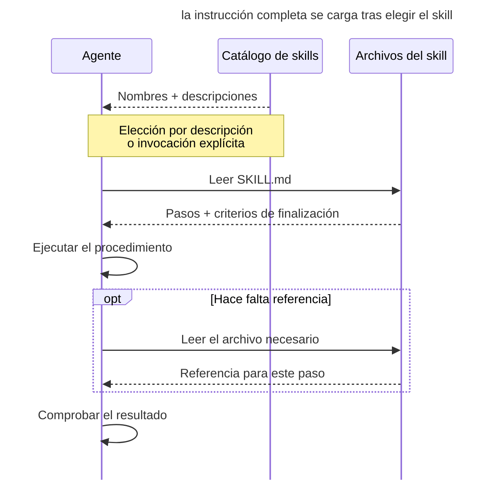

# Skills

## Propósito

Guardar un procedimiento recurrente en un skill que el agente carga cuando hace falta. El desarrollador obtiene un flujo de trabajo con nombre, versión y criterios de finalización que se puede usar en distintas sesiones.

## También conocido como

Skills, slash commands, comandos personalizados, packaged workflows.

## Problema

En cada release el desarrollador vuelve a explicarle al agente el orden de preparación. Un día se olvida de mencionar la revisión de migraciones, y el agente publica la versión sin ella.

Si el procedimiento solo vive en la conversación, lo completa que sea cada ejecución depende del nuevo prompt. Un colega puede describir el mismo proceso de otra manera y obtener otro orden de acciones. Trasladar todo el procedimiento a la [memoria del proyecto](claude-md-memory.md) lo carga también en las sesiones que no tienen nada que ver con el release.

## Solución

Escribe el procedimiento en un _SKILL.md_ con un nombre, una descripción de su propósito y una secuencia de acciones. Este empaque te da varias posibilidades.

1. **Carga bajo demanda.** La instrucción completa entra en el contexto cuando se usa el skill. La descripción para elegir el skill puede quedarse en el catálogo de procedimientos disponibles.
2. **Elección del modo de invocación.** El usuario puede invocar el skill por su nombre. Si la herramienta admite la selección automática, la descripción debe explicar a qué tareas se aplica el procedimiento.
3. **Versionado.** El equipo guarda el skill en git y discute los cambios del proceso en la revisión.
4. **Portabilidad.** Un conjunto de skills se puede llevar de un proyecto a otro y adaptar a las reglas locales.

Indica para cada paso un resultado comprobable. Por ejemplo, un paso del release debe confirmar que las migraciones pasan en una base de datos de prueba. Saca los detalles de referencia a archivos aparte para que el agente los lea a medida que los necesite.

**Guarda las reglas permanentes en la memoria del proyecto y carga los procedimientos mediante skills.** La regla sobre el idioma de los commits hace falta en tareas muy distintas. El orden detallado del release hace falta mientras se publica una versión.

## Estructura

Primero el agente recibe un catálogo de nombres y descripciones. El procedimiento completo y los materiales de referencia entran en el contexto a medida que hacen falta.


```mermaid
---
title: la instrucción completa se carga tras elegir el skill
config:
  sequence:
    mirrorActors: false
    width: 130
    height: 45
    actorMargin: 35
    messageMargin: 28
---
sequenceDiagram
  participant A as Agente
  participant C as Catálogo de skills
  participant F as Archivos del skill
  C-->>A: Nombres + descripciones
  Note over A,C: Elección por descripción<br/>o invocación explícita
  A->>F: Leer SKILL.md
  F-->>A: Pasos + criterios de finalización
  A->>A: Ejecutar el procedimiento
  opt Hace falta referencia
    A->>F: Leer el archivo necesario
    F-->>A: Referencia para este paso
  end
  A->>A: Comprobar el resultado
```

El procedimiento se guarda en git y pasa por revisión. Al invocarlo, el agente lee su versión actual y abre los archivos vecinos a través de los enlaces de la instrucción. El conjunto de descripciones ocupa el contexto antes de que se elija un skill, así que también hay que mantenerlo compacto.

## Participantes / Componentes

- **El skill** guarda un procedimiento en un _SKILL.md_ y sus materiales relacionados.
- **La descripción** explica cuándo aplicar el procedimiento.
- **El desarrollador** escribe, revisa y actualiza las instrucciones.
- **El agente** ejecuta los pasos y comprueba los criterios de finalización.
- **El pack** agrupa skills relacionados para instalarlos en un proyecto.

## Cuándo aplicarlo

- El desarrollador explica una y otra vez el mismo procedimiento.
- El equipo necesita un orden común para el release, la revisión o el triaje.
- Uno de los patrones del libro tiene que aplicarse con regularidad.

Para una tarea puntual, un skill aparte suele crear trabajo extra de mantenimiento del archivo.

## Consecuencias y compromisos

- ➕ Todos los participantes reciben una versión común del procedimiento.
- ➕ La instrucción completa se carga solo cuando hace falta.
- ➕ Los cambios del proceso pasan por revisión y quedan en el historial.
- ➖ El equipo tiene que borrar los pasos caducos y volver a comprobar el procedimiento tras los cambios del proyecto.
- ➖ El usuario tiene que encontrar el skill adecuado entre los disponibles.
- ➖ Un catálogo grande de descripciones también ocupa el contexto.

## Implementación

1. Elige un procedimiento que tengas que explicar una y otra vez.
2. Crea un _SKILL.md_ con nombre, propósito, pasos y sus criterios de finalización.
3. Define el modo de invocación. En la descripción indica en qué tareas hace falta el skill, en lugar de resumir su contenido: a partir de la descripción el agente decide si cargar el procedimiento.
4. Saca la referencia a archivos vecinos y enlázala desde los pasos que la necesitan (ver la [ingeniería de contexto](context-engineering.md)).
5. Usa términos del proceso coherentes y explícalos donde influyen en una acción.
6. Pon a prueba el procedimiento en tareas reales y borra las instrucciones caducas.
7. Reúne en el skill una sección «Trampas» con los errores que el agente cometió al seguirlo. Estas entradas contienen lo que el agente no sabe sin el skill.
8. Para un conjunto grande, añade un índice que ayude a elegir el skill adecuado.
9. Si hace falta, adapta los procedimientos ya hechos de [Superpowers](superpowers.md) o de los [skills de Matt Pocock](matt-pocock-skills.md).

## Ejemplo

Cada release del servicio incluye el changelog, la subida de versión, la revisión de migraciones, el test de humo y la creación del release. El desarrollador quiere guardar este orden para no tener que reconstruirlo de memoria.

Escribe el procedimiento en _.claude/skills/release/SKILL.md_.

```markdown
---
name: release
description: Armar y publicar un release del servicio
disable-model-invocation: true
---

1. Arma el changelog con los commits desde el último tag; cada línea,
   un Conventional Commit. Criterio: cada commit está en el changelog
   o descartado explícitamente como mantenimiento.
2. Sube la versión por semver según el contenido del changelog.
3. En una base de datos de prueba aparte, restaura el esquema del release anterior y aplica las migraciones nuevas. Adjunta el resultado de la ejecución y la comprobación de los datos tras la migración.
4. Pasa el set de humo: make smoke. Criterio: salida verde adjunta.
5. Tag y release con el changelog en la descripción.
```

Ahora el desarrollador invoca `/release`. Cuando el equipo añade la revisión de feature flags sin cerrar, cambia el skill mediante un pull request. Las siguientes ejecuciones reciben la nueva versión de la instrucción.

Con el mismo principio, el pack de Matt Pocock guarda los procedimientos de traspaso de sesión, TDD, triaje, investigación y prototipado.

## Antipatrones y errores comunes

- **Un skill para todo.** Los procedimientos sin relación en un mismo archivo dificultan elegir los pasos aplicables.
- **Condiciones de invocación demasiado amplias.** El agente carga el procedimiento incluso en tareas que no lo necesitan.
- **Pasos sin criterios.** Sin un resultado comprobable, al agente le cuesta saber cuándo ha terminado un paso.
- **Instrucciones caducas.** Las reglas acumuladas pueden llevar al agente hacia una acción que ya no es correcta.
- **Un guion rígido donde importa el resultado.** Si el orden de los pasos no influye en el resultado final, una instrucción paso a paso le impide al agente adaptarse a la tarea. Fija el objetivo y las restricciones, y deja los pasos donde el orden importa.
- **Reglas duplicadas.** Las copias en la memoria y en el skill pueden divergir. Guarda la regla en un solo sitio y enlázala.

## Usos conocidos

- **Claude Code** admite _SKILL.md_ en _.claude/skills/_, argumentos y la configuración de la invocación mediante `disable-model-invocation`.
- **El equipo de Claude Code** [describe](https://x.com/trq212/status/2033949937936085378) cómo escribe sus skills. La descripción sirve como condición de invocación para el modelo. La sección de trampas se amplía a medida que aparecen fallos nuevos. En lugar de un guion paso a paso, el skill fija el objetivo y las restricciones.
- **Codex** admite skills y el asistente integrado `$skill-creator`. La [guía de OpenAI](https://learn.chatgpt.com/guides/best-practices) aconseja extraer el skill de un proceso que ya funciona y limitarlo a una sola tarea.
- **Superpowers** reúne la planificación, el TDD, la implementación y la revisión en un conjunto de skills.
- **Los skills de Matt Pocock** incluyen un índice de procedimientos y la guía [writing-for-agents](https://github.com/mattpocock/skills/blob/main/skills/productivity/writing-for-agents/SKILL.md) sobre cómo escribir instrucciones para agentes.
- **Otros agentes de programación** también admiten procedimientos guardados, aunque el formato y las reglas de carga varían.

## Patrones relacionados

- [Memoria del proyecto](claude-md-memory.md) guarda las reglas permanentes a las que remiten los procedimientos.
- [Ingeniería de contexto](context-engineering.md) explica la carga de instrucciones bajo demanda.
- [Traspaso de sesión](handoff.md), [TDD con agente](tdd-with-agent.md), [triaje](triage-state-machine.md) y el [mapa de investigación](wayfinder.md) pueden empaquetarse como skills repetibles.
- [Memoria hinchada](bloated-claude-md.md) describe un archivo de memoria sobrecargado que se descarga sacando los procedimientos a skills.
