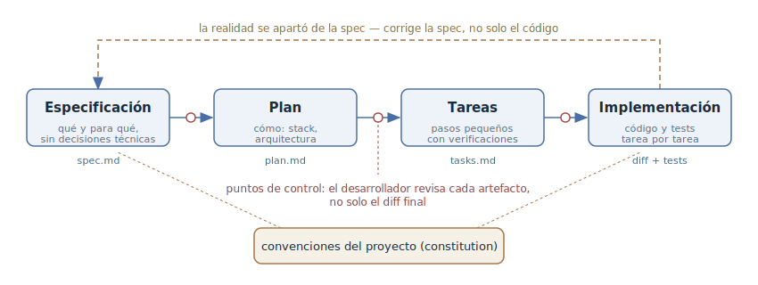

# Desarrollo orientado a especificaciones

## Propósito

Hacer que la fuente de verdad no sea ni el código ni la conversación con el
agente, sino la especificación: un documento vivo en el repositorio que
describe *qué* construimos y *para qué*. La especificación se despliega en un
plan técnico y una lista de tareas, el agente las implementa paso a paso y el
desarrollador revisa los artefactos en cada transición — mucho antes de que
aparezca un diff.

## También conocido como

Spec-Driven Development (SDD), spec-first, «la especificación como fuente de
verdad».

## Problema

En el trabajo conversacional con un agente, la intención vive en el chat. Para
una tarea corta basta, pero en una funcionalidad grande el chat no escala:

- La ventana de contexto se acaba antes que la funcionalidad. Una sesión nueva
  empieza de cero: qué se decidió, por qué se eligió ese enfoque y qué queda
  por hacer hay que reconstruirlo de memoria y a partir del código.
- El prompt es efímero. Un mes después nadie — ni humano ni agente — puede
  decir si «así estaba pensado» o «así salió»: la intención no está registrada
  en ninguna parte, solo queda el código.
- Sin requisitos fijados, cada nueva petición de «retoca esto de aquí» aleja
  poco a poco la implementación del objetivo original, y no hay con qué
  detectar la deriva: no hay contra qué comparar.

El extremo opuesto es el vibe coding: describir el objetivo en una frase y
aceptar todo lo que compile. En un prototipo funciona; en una base de código
viva deja una capa de código de la que nadie puede decir qué *debería* hacer.

## Solución

Antes de implementar, fijar la intención en una especificación — un archivo en
el repositorio, no un chat — y conducir el trabajo desde ella:

1. **Especificación.** Qué construimos y para qué: escenarios de usuario,
   requisitos, criterios de aceptación. Sin decisiones técnicas: el «qué», no
   el «cómo».
2. **Plan.** Cómo lo construimos: stack, arquitectura, módulos afectados,
   contratos. Las decisiones técnicas aparecen solo aquí, cuando el «qué» ya
   está acordado.
3. **Tareas.** El plan se corta en pasos pequeños y verificables — cada uno
   tiene una forma de confirmar que está hecho.
4. **Implementación.** El agente recorre la lista de tareas contrastando con
   la especificación y el plan.

Cada transición es un punto de control: el desarrollador revisa el artefacto y
lo corrige como texto. Un error de requisitos se atrapa en la especificación;
uno de arquitectura, en el plan — ambos más baratos que sobre un diff
terminado. Si durante la implementación resulta que la especificación está
mal, primero se corrige ella y después el código; de lo contrario el documento
envejece en silencio y deja de ser la fuente de verdad.

## Estructura

Los cuatro artefactos forman una tubería, y cada uno se deriva del anterior:
el plan de la especificación, las tareas del plan, el código de las tareas.
Todos los artefactos viven en el repositorio y pasan por una revisión normal.
Una entrada aparte son las convenciones del proyecto (en Spec Kit, la
«constitution»): estándares y restricciones que el agente debe respetar en
cada fase. La flecha discontinua de vuelta es la corrección de la
especificación cuando la realidad se ha apartado de ella.

## Participantes / Componentes

- **Desarrollador** — formula la intención, revisa y aprueba cada artefacto,
  acepta el resultado.
- **Agente** — despliega la intención en especificación, plan y tareas;
  implementa las tareas contrastando con los artefactos.
- **Especificación** — la fuente de verdad: qué construimos y para qué,
  criterios de aceptación.
- **Plan y tareas** — artefactos derivados: el enfoque técnico y el corte en
  pasos verificables.
- **Convenciones del proyecto** — reglas permanentes (estándares, stack,
  restricciones) comunes a todas las especificaciones.

## Cuándo aplicarlo

- La funcionalidad es más grande que una sesión: el trabajo sobrevive a la
  ventana de contexto, y los artefactos son la única forma de pasar el estado
  a la siguiente sesión o a otro agente.
- En la tarea trabajan varias personas o varios agentes: hace falta un
  documento común, no el chat de alguien.
- Un dominio con requisitos estrictos: hay que poder mostrar *qué* está
  obligado a hacer el sistema y verificar la implementación contra esa lista.
- Greenfield donde el «qué construimos» aún no se ha asentado: la
  especificación obliga a decidirlo antes del código.

Para un cambio de dos archivos la tubería es excesiva — ahí basta con
[exploración — plan — código — commit](explore-plan-code-commit.md) o una
petición simple.

## Consecuencias y compromisos

- ➕ La intención sobrevive a la sesión: una sesión nueva, otro agente o un
  colega continúan desde los artefactos, no desde un relato.
- ➕ La deriva es visible: la implementación puede contrastarse con la
  especificación, y la divergencia se discute con concreción.
- ➕ La revisión se reparte en puntos baratos: requisitos, enfoque y corte se
  comprueban como texto antes de que exista código.
- ➕ La especificación queda como documentación: medio año después se ve qué
  *debería* hacer el sistema, no solo qué hace.
- ➖ Sobrecoste: en una tarea corta la tubería de cuatro artefactos cuesta más
  que la propia tarea.
- ➖ Los artefactos hay que mantenerlos: una especificación desactualizada es
  peor que ninguna — miente con cara de autoridad.
- ➖ La tentación de detallar la especificación hasta el pseudocódigo devuelve
  a la [especificación prematura](premature-specification.md): fija requisitos
  y restricciones, no la implementación.

## Implementación

El patrón rara vez se monta a mano: hay toolkits listos, cada uno con su
propia visión de cómo debe ser la tubería. Abajo, cuatro soluciones extendidas
y cómo funcionan.

### GitHub Spec Kit

[Spec Kit](https://github.com/github/spec-kit) es la traducción más directa
del patrón a una herramienta. El CLI `specify init` instala en el proyecto un
conjunto de comandos slash (funcionan en Claude Code, Copilot, Cursor, Gemini
CLI y otros agentes); cada fase es su propio comando y su propio artefacto en
`specs/<número>-<funcionalidad>/`:

- `/speckit.constitution` — convenciones del proyecto: principios, stack,
  estándares de calidad. Se escribe una vez y aplica a todas las
  funcionalidades.
- `/speckit.specify` — la especificación de la funcionalidad (`spec.md`):
  historias de usuario y requisitos, deliberadamente sin decisiones técnicas.
- `/speckit.clarify` — el agente hace preguntas sobre los puntos
  infraespecificados y escribe las respuestas en la propia especificación.
- `/speckit.plan` — el plan técnico (`plan.md`): stack, arquitectura,
  contratos, modelo de datos.
- `/speckit.tasks` — el plan cortado en tareas con dependencias (`tasks.md`).
- `/speckit.analyze` — comprobación de consistencia: ¿se contradicen la
  especificación, el plan y las tareas?
- `/speckit.implement` — ejecución de las tareas según la lista.

El punto de vista de Spec Kit: especificación y código están separados de
forma estricta — el «qué» no debe saber del «cómo», así que
`/speckit.specify` se niega a discutir el stack hasta llegar a
`/speckit.plan`.

### OpenSpec

[OpenSpec](https://github.com/Fission-AI/OpenSpec) construye la tubería no
alrededor de una funcionalidad sino de un **cambio** con ciclo de vida
propose → review → apply → archive. En el repositorio viven dos zonas:
`openspec/specs/` — las especificaciones actuales de lo que *ya está
construido*, y `openspec/changes/` — las propuestas de cambio:

- `/opsx:explore` — modo de reflexión: el agente lee el código y sopesa
  opciones sin cambiar nada.
- `/opsx:propose` — crea el paquete de artefactos del cambio: `proposal.md`
  (por qué), deltas a las especificaciones (qué cambia en los requisitos),
  `design.md` (enfoque técnico) y `tasks.md` (checklist).
- La revisión del paquete es el punto de control antes de la primera línea de
  código.
- `/opsx:apply` — implementación según `tasks.md`.
- Archivado — tras el merge las deltas se funden en `openspec/specs/` y el
  cambio pasa a `openspec/changes/archive/`: la historia de decisiones queda
  en el repositorio.

El punto de vista de OpenSpec: la especificación no es un documento de usar y
tirar, sino un modelo del sistema siempre actual que los cambios actualizan
mediante deltas — como las migraciones actualizan el esquema de una base de
datos.

### Kiro

[Kiro](https://kiro.dev) (AWS) integra el patrón en el IDE: junto a las
sesiones vibe hay sesiones spec, y el propio agente te lleva por tres fases,
cada una aprobada explícitamente; los artefactos viven en
`.kiro/specs/<funcionalidad>/`:

- `requirements.md` — historias de usuario con criterios de aceptación en
  notación EARS («WHEN … THEN the system SHALL …»): formulaciones que se
  pueden verificar.
- `design.md` — el diseño técnico: arquitectura, interfaces, modelo de datos;
  Kiro lo genera leyendo el código existente.
- `tasks.md` — tareas ligadas a los requisitos; se marcan de una en una, y
  «Run all Tasks» construye un grafo de dependencias y ejecuta en paralelo las
  tareas independientes.

El papel de las convenciones lo cumplen los archivos de steering
(`.kiro/steering/`): reglas del proyecto que se mezclan en cada sesión. El
punto de vista de Kiro: SDD debe ser un modo del IDE, no disciplina del
desarrollador — la propia interfaz impide saltar de los requisitos al código.

### Tessl

[Tessl](https://tessl.io) lleva la idea al límite: la especificación no es la
compañera del código sino su *fuente*. En el framework original (2025) los
archivos se marcaban como generados desde la especificación y no se editaban a
mano: corriges la especificación y el código se regenera, mientras los tests
están ligados a sus afirmaciones (capabilities) y verifican la conformidad.
Hoy Tessl es una plataforma de «context as code» con un registro-gestor de
paquetes, y SDD se instala en el proyecto como plugin
(`tessl install tessl-labs/spec-driven-development`): el agente recoge los
requisitos con preguntas, escribe las especificaciones en `specs/`, y tras la
aprobación implementa contra ellas, devolviendo a la especificación todo lo
descubierto durante el desarrollo. El punto de vista de Tessl: el código es un
artefacto derivado; editarlo a espaldas de la especificación es como parchear
la salida del compilador.

### Con skills: Superpowers y el pack de Matt Pocock

La misma tubería se monta con skills de Claude Code, sin herramienta aparte.
En [Superpowers](https://github.com/obra/superpowers), `brainstorming` lleva
la idea hasta un diseño validado sección a sección, `writing-plans` escribe un
plan de tareas pequeñas, y la implementación corre con subagentes y ciclo TDD.
En el [pack de Matt Pocock](https://github.com/mattpocock/skills), `/to-spec`
convierte una conversación trabajada en una especificación autocontenida,
`/to-tickets` la corta en tickets trazadores con dependencias bloqueantes, y
`/implement` conduce la implementación ticket a ticket. Ambos packs se
analizan en detalle en
[exploración — plan — código — commit](explore-plan-code-commit.md).

## Ejemplo

La tarea: añadir al servicio la exportación de informes programada.

**Especificación** (`/speckit.specify` o `/opsx:propose` — la esencia es la
misma):

> El usuario configura una exportación recurrente de un informe: elige el
> informe, el horario y los destinatarios. A la hora programada el sistema
> genera el informe y lo envía por correo. Criterios de aceptación: la
> exportación sale como máximo cinco minutos después del horario; si la
> generación falla, los destinatarios reciben una notificación de fallo, no
> silencio; borrar un informe desactiva sus horarios.

La revisión de la especificación destapa un agujero de inmediato: ¿y las zonas
horarias de los destinatarios? El requisito se añade — antes de que pudiera
convertirse en un bug.

**Plan:** el agente propone un worker de cron y una tabla
`report_schedules`; en la revisión el desarrollador sustituye el cron casero
por el planificador de tareas que el proyecto ya usa — una corrección de una
línea de texto.

**Tareas:** migración, modelo, worker, notificaciones, UI de configuración —
cada una con su comprobación (test o escenario manual).

**Implementación:** el agente recorre la lista; cuando resulta que la pasarela
de correo no acepta adjuntos de más de 10 MB, eso es una corrección de la
especificación (añadir el requisito de un enlace de descarga en vez de un
adjunto), no un rodeo silencioso en el código.

## Antipatrones y errores comunes

- **Especificación para cubrir el expediente.** Los artefactos se generan y se
  aprueban sin leerlos: la tubería añade sobrecoste pero no atrapa nada. Los
  puntos de control funcionan solo si alguien mira de verdad.
- **El código se apartó de la especificación — qué le vamos a hacer.** La
  primera edición sin sincronizar convierte la especificación de fuente de
  verdad en pieza de museo. La regla es una: primero el documento, después el
  código.
- **La especificación-pseudocódigo.** Detallar en la especificación nombres de
  funciones y orden de llamadas es la
  [especificación prematura](premature-specification.md) con otro envoltorio.
  En el nivel del «qué» viven los requisitos, no la implementación.
- **Una tubería para un cambio de dos archivos.** Si la tarea cabe en una
  sesión y una pantalla de diff, cuatro artefactos son burocracia, no
  ingeniería.

## Usos conocidos

- **GitHub Spec Kit** — el toolkit open source de GitHub; el manifiesto de SDD
  como metodología está en el
  [anuncio](https://github.blog/ai-and-ml/generative-ai/spec-driven-development-with-ai-get-started-with-a-new-open-source-toolkit/).
- **OpenSpec** — un ciclo de vida de cambios sobre especificaciones siempre
  actuales.
- **Kiro (AWS)** — sesiones spec como modo integrado del IDE: requirements →
  design → tasks.
- **Tessl** — la variante radical «la especificación como fuente»: el código
  se regenera desde la especificación.
- **BMAD-Method** — SDD con envoltorio agile: agentes de rol (analista, PM,
  arquitecto, desarrollador) conducen PRD → arquitectura → historias.
- **Superpowers y el pack de skills de Matt Pocock** — la misma tubería
  montada con skills de Claude Code.

## Patrones relacionados

- [Exploración — plan — código — commit](explore-plan-code-commit.md) — el
  mismo principio de «primero acordar, después codificar» a escala de una
  sesión; SDD lo despliega en artefactos que sobreviven a la sesión.
- [Especificación prematura](premature-specification.md) — el antipatrón en el
  que degenera la especificación si se fija en ella la implementación en vez
  de los requisitos.
