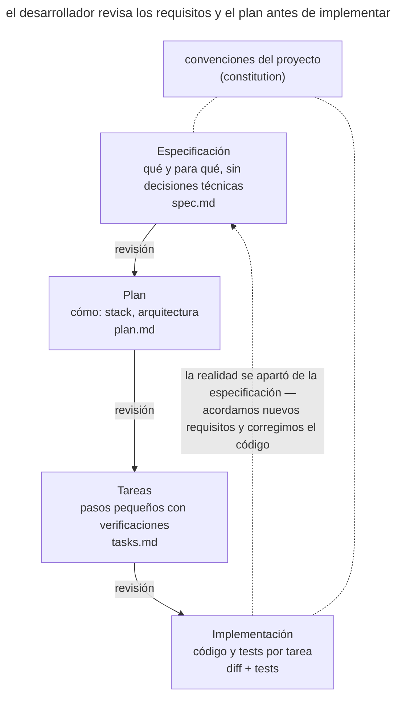

# Desarrollo orientado a especificaciones

## Propósito

Conservar el objetivo y los requisitos en una especificación acordada. A partir de ella el equipo prepara un plan técnico y tareas, y el agente las implementa verificando el resultado. Los documentos permiten continuar el trabajo en otra sesión y valorar si el resultado corresponde a la intención original.

## También conocido como

Spec-Driven Development (SDD), spec-first, «la especificación como fuente de verdad».

## Problema

En una funcionalidad grande, los requisitos pueden quedar perdidos entre los mensajes de una conversación larga. Una sesión nueva ve el código, pero no conoce todo lo acordado.

Por ejemplo, en el chat se decidió enviar los informes grandes como enlace. En la implementación se quedó el envío de adjuntos, y un agente nuevo no puede saber si fue una limitación deliberada o algo sin terminar. Sin un registro escrito, los requisitos hay que reconstruirlos de memoria del autor. Las correcciones posteriores pueden alejar aún más el comportamiento del objetivo, porque no hay con qué compararlo.

Aceptar código generado sin esa comparación se describe en el antipatrón del [vibe coding](vibe-coding.md).

## Solución

Antes de implementar, escribe el objetivo en una especificación y úsala en las etapas siguientes.

1. **La especificación** describe escenarios, requisitos, restricciones y criterios de aceptación.
2. **El plan** elige un enfoque técnico una vez acordados los requisitos.
3. **Las tareas** dividen el plan en pasos pequeños con un resultado verificable.
4. **Implementación.** El agente ejecuta las tareas en orden, contrastándolas con la especificación y el plan.

En cada transición revisas el documento obtenido. Así puedes corregir un requisito antes de implementarlo. Si la nueva información cambia la tarea, acuerda primero la especificación y después adapta el código a ella.

## Estructura

El diagrama conecta la especificación, el plan, las tareas y el código.

```mermaid
---
title: el desarrollador revisa los requisitos y el plan antes de implementar
---
flowchart TB
  spec["Especificación<br/>qué y para qué, sin decisiones técnicas<br/>spec.md"]
  plan["Plan<br/>cómo: stack, arquitectura<br/>plan.md"]
  tasks["Tareas<br/>pasos pequeños con verificaciones<br/>tasks.md"]
  impl["Implementación<br/>código y tests por tarea<br/>diff + tests"]
  rules["convenciones del proyecto<br/>(constitution)"]:::accent
  spec -- "revisión" --> plan -- "revisión" --> tasks -- "revisión" --> impl
  impl -. "la realidad se apartó de la especificación —<br/>acordamos nuevos requisitos y corregimos el código" .-> spec
  rules -.- spec
  rules -.- impl
```

Las convenciones permanentes del proyecto limitan las decisiones en cada fase. La flecha de vuelta muestra la revisión de los requisitos ante información nueva.

## Participantes / Componentes

- **Desarrollador** fija el objetivo y revisa los documentos y el resultado.
- **Agente** prepara los documentos e implementa las tareas acordadas.
- **Especificación** guarda los requisitos y los criterios de aceptación.
- **Plan y tareas** fijan el enfoque técnico y el orden de implementación.
- **Convenciones del proyecto** conservan los estándares y restricciones comunes.

## Cuándo aplicarlo

- El trabajo ocupa varias sesiones.
- Varios participantes necesitan requisitos comunes.
- La corrección del sistema debe contrastarse con escenarios definidos explícitamente.
- El equipo todavía está precisando el comportamiento de un sistema nuevo.

Para un cambio pequeño bastan las [cuatro fases](explore-plan-code-commit.md) o una petición directa.

## Consecuencias y compromisos

- ➕ Los requisitos están disponibles para la siguiente sesión y para otros participantes.
- ➕ Las divergencias entre la implementación y la intención se pueden comprobar con el documento.
- ➕ Los errores en los requisitos y en el enfoque pueden aparecer antes de escribir código.
- ➕ Una especificación al día explica el comportamiento esperado una vez terminado el desarrollo.
- ➖ Preparar los documentos encarece las tareas cortas.
- ➖ Los documentos hay que actualizarlos cuando cambian los requisitos.
- ➖ Demasiado detalle de implementación en la especificación lleva a la [especificación prematura](premature-specification.md).

## Implementación

1. Escribe los estándares y restricciones comunes del proyecto.
2. Prepara escenarios, requisitos y criterios de aceptación. Comprueba que estén completos.
3. Redacta y discute el plan técnico.
4. Divide el plan en tareas, cada una con una forma de verificar su resultado.
5. Lanza la implementación según la lista de tareas; el agente se contrasta con la especificación y el plan.
6. Si el código incumple los requisitos vigentes, corrige la implementación. Si lo que cambió son los propios requisitos, acuerda una especificación nueva y después adapta el código a ella.

Puedes montar el flujo de trabajo a mano o usar un toolkit ya hecho. En esta sección se analizan tres opciones.

- [OpenSpec](openspec.md) guarda especificaciones permanentes y deltas de cambios.
- [Superpowers](superpowers.md) enlaza las fases mediante skills y puntos de control obligatorios.
- [Los skills de Matt Pocock](matt-pocock-skills.md) guardan las especificaciones y los tickets trazadores en el tracker.

Otras herramientas están reunidas en [Enlaces útiles](resources.md) y en la comparativa [spec-compare](https://cameronsjo.github.io/spec-compare/).

## Ejemplo

Un equipo añade la exportación programada de informes.

Primero escribe la **especificación**, por ejemplo con `/opsx:propose` en OpenSpec.

> El usuario elige un informe, una programación y los destinatarios. El sistema envía el informe como máximo cinco minutos después de la hora programada. Si falla la generación, notifica el fallo a los destinatarios. Eliminar un informe desactiva sus programaciones.

En la revisión el equipo se da cuenta de que no está definida la zona horaria de la programación y completa el requisito antes de implementar.

En el **plan**, el agente propone un worker de cron y `report_schedules`. Tú indicas el planificador que el proyecto ya usa, y el agente ajusta el enfoque.

Las **tareas** añaden uno tras otro escenarios verificables: crear una programación, enviar un informe y gestionar un fallo.

Durante la **implementación** se descubre que la pasarela de correo limita los adjuntos a 10 MB. El equipo acuerda enviar un enlace para los informes grandes y registra este comportamiento en la especificación.

## Antipatrones y errores comunes

- **Documentos sin revisión.** Los requisitos sin comprobar pueden trasladar un error a la implementación.
- **Especificación desactualizada.** Cuando cambie el comportamiento, actualiza los requisitos acordados junto con el código.
- **Especificación-pseudocódigo.** Un orden de llamadas detallado antes de explorar la tarea crea una [especificación prematura](premature-specification.md).
- **Proceso excesivo.** Para un cambio pequeño y reversible, el juego completo de documentos puede costar más que el propio trabajo.

## Usos conocidos

- [OpenSpec](openspec.md), [Superpowers](superpowers.md) y [los skills de Matt Pocock](matt-pocock-skills.md) se analizan en esta sección. El enfoque general también se describe en el [anuncio de Spec Kit](https://github.blog/ai-and-ml/generative-ai/spec-driven-development-with-ai-get-started-with-a-new-open-source-toolkit/).
- Hay una comparativa de otras herramientas en [spec-compare](https://cameronsjo.github.io/spec-compare/) y en la [recopilación de enlaces](resources.md).

## Patrones relacionados

- [Cuatro fases](explore-plan-code-commit.md) organiza el acuerdo y la implementación a la escala de una sola tarea.
- [Especificación prematura](premature-specification.md) describe el riesgo de elegir la implementación antes de precisar los requisitos.
