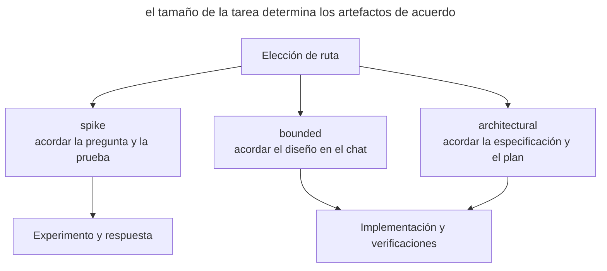

# Superpowers

_Comandos y capacidades comprobados el 21 de septiembre de 2026._

[Superpowers](https://github.com/obra/superpowers), de Jesse Vincent (obra), implementa el [SDD](spec-driven-development.md) como un conjunto de [skills](skills-as-packaged-workflows.md). Entre el diseño y la implementación, las instrucciones fijan puntos de control obligatorios llamados HARD-GATE.

## Instalación

La vía principal de instalación usa el marketplace de Claude Code.

```text
/plugin install superpowers@claude-plugins-official
```

El pack también incluye instrucciones y manifiestos para Codex, Cursor, Antigravity, GitHub Copilot CLI y OpenCode.

## Flujo de trabajo

Al iniciar la sesión, un hook carga `using-superpowers`, que exige comprobar si algún skill es aplicable antes de responder. Una petición de funcionalidad nueva se dirige a `brainstorming`, y un informe de bug a `systematic-debugging`. La elección del procedimiento pasa a formar parte del proceso general.

En `brainstorming`, el agente elige primero una ruta según el carácter de la tarea. En todas las rutas acuerdas el paso propuesto antes de implementar, pero el volumen de documentos varía.

| Ruta | Tarea | Qué se acuerda |
| --- | --- | --- |
| `spike` | Comprobar si una idea es viable | La pregunta y la forma del experimento; el resultado es una respuesta |
| `bounded` | Cambiar de forma acotada código existente | Un diseño breve en el chat; no hacen falta especificación ni plan aparte |
| `architectural` | Crear un proyecto o subsistema, o cambiar las relaciones entre componentes | Una especificación escrita, luego un plan y la forma de ejecución |

El siguiente diagrama muestra los distintos resultados de estas rutas.



En este diagrama, el experimento termina con una conclusión sobre si la solución es posible. Un cambio acotado pasa a la implementación tras acordarlo en el chat, mientras que una tarea arquitectónica requiere documentos aparte. Los detalles de la elección se describen en las [instrucciones de brainstorming](https://github.com/obra/superpowers/blob/main/skills/brainstorming/SKILL.md).

Para una tarea arquitectónica, el proceso completo es así.

1. **`brainstorming`** precisa la intención y las opciones de solución. Acuerdas el diseño y luego revisas la especificación escrita.
2. **`using-git-worktrees`** aísla el trabajo en un worktree y una rama propios.
3. **`writing-plans`** crea tareas pequeñas con acciones y verificaciones suficientes para un ejecutor que no tiene el historial de la discusión.
4. **`subagent-driven-development`** o **`executing-plans`** ejecutan el plan. La primera opción usa un subagente nuevo por tarea y una revisión aparte. Las tareas independientes se pueden repartir con `dispatching-parallel-agents`, y `test-driven-development` fija el ciclo TDD.
5. **`requesting-code-review`** contrasta el resultado con el plan. `receiving-code-review` ayuda a procesar los comentarios.
6. **`finishing-a-development-branch`** comprueba los tests y propone cerrar mediante merge o PR.

La depuración la cubre `systematic-debugging`, y `verification-before-completion` exige verificar antes de dar el trabajo por terminado.

## Artefactos

| Artefacto | Dónde vive |
| ---------- | ----------- |
| Documento de diseño | _docs/superpowers/specs/AAAA-MM-DD-\<tema\>-design.md_ |
| Plan de implementación | _docs/superpowers/plans/AAAA-MM-DD-\<funcionalidad\>.md_ |

Estos documentos pertenecen a la ruta arquitectónica y se guardan en Markdown. La especificación pasa por la autorrevisión del agente y la revisión del usuario; la ubicación de los planes se puede configurar. Las rutas `spike` y `bounded` prescinden de estos archivos.

## En qué se diferencia

- Las instrucciones exigen acuerdo antes de implementar; para un cambio pequeño basta un diseño breve en el chat.
- Un hook ayuda al agente a elegir automáticamente el procedimiento adecuado.
- Contextos separados para el ejecutor y el revisor mantienen la implementación aparte de la evaluación.
- El plan incluye pasos red–green–refactor.

## Cuándo elegirlo

Superpowers encaja con un equipo que necesita un orden único con puntos de control obligatorios. Para cambios rápidos este proceso puede resultar excesivo. Si prefieres guardar el resultado de las discusiones en el tracker, compara [los skills de Matt Pocock](matt-pocock-skills.md).
