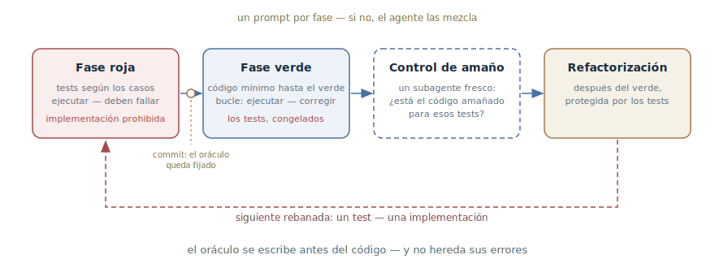

# TDD con agente

## Propósito

Guiar al agente por el ciclo «rojo — verde» con prompts por fase: primero
tests que fallan, fijados con un commit, después una implementación mínima
hasta el verde — sin derecho a editar los tests. El oráculo se escribe antes
del código y por eso no hereda sus errores.

## También conocido como

Test-driven development con agentes, red–green–refactor, test-first.

## Problema

Pídele al agente «haz la funcionalidad y cúbrela con tests» — y hará
exactamente eso, en ese orden: primero la implementación, después los tests
para ella. Esos tests parecen cobertura pero verifican poco:

- **Los tests están copiados del código.** El agente los escribe mirando la
  implementación terminada — repiten su estructura y sus errores. Si en el
  código hay una condición invertida, el test consagra la condición
  invertida como norma.
- **Tautología en vez de verificación.** El valor esperado se calcula de la
  misma manera que en el código — el test pasa por construcción y nunca
  puede discrepar del código.
- **Amaño al oráculo.** Si los tests ya existen, el agente bajo la presión
  de «ponlo en verde» sabe hacer trampa: un stub en vez de lógica, un caso
  especial escondido para un test concreto.

Una sola instrucción «usa TDD» no basta: sin puertas de fase explícitas el
agente resbala a su orden habitual — código, luego tests.

## Solución

Separar las fases roja y verde en prompts distintos y mantener la puerta
entre ellas en manos del desarrollador.

1. **Declarar las reglas.** Decirlo sin rodeos: trabajamos test-first — para
   que el agente no cree implementaciones ni stubs por adelantado.
2. **Fase roja.** El agente escribe tests a partir de pares esperados
   «entrada — salida», los ejecuta y comprueba que fallan. La implementación
   está explícitamente prohibida en esta fase. Un test que nunca falló no
   demuestra nada.
3. **Fijar el oráculo.** Los tests se commitean. Desde ese momento son la
   referencia, no un borrador.
4. **Fase verde.** El agente escribe el código mínimo hasta que los tests
   pasen, ejecutándolos e iterando — es el
   [bucle de retroalimentación](give-agent-a-way-to-verify.md) con el
   oráculo ya hecho. Editar los tests está prohibido: cambiarlos es decisión
   del desarrollador.
5. **Control de amaño.** Un subagente fresco mira la implementación: ¿está
   amañada para los tests concretos? (ver
   [Escritor y revisor](writer-reviewer.md)).
6. **La refactorización** — como jugada aparte después del verde, bajo la
   protección de los tests, no dentro del ciclo.

Trabaja en rebanadas verticales: un test → una implementación mínima → el
siguiente test. Todos los tests de golpe es verificar un comportamiento
imaginado: la estructura de los tests queda fijada antes de entender la
tarea. Y acuerda las costuras por adelantado: los tests viven en las
fronteras públicas, no en las tripas — si no, se rompen con la
refactorización y no con los cambios de comportamiento.

## Estructura

Las fases van de izquierda a derecha, cada una con su prompt: la roja
produce un oráculo que falla, el commit lo congela, la verde hace girar el
bucle de implementación con los tests congelados, después una mirada fresca
comprueba el amaño, y solo entonces llega la refactorización protegida por
los tests. El bucle de abajo son las rebanadas verticales: el ciclo se
repite test a test, y cada rebanada se apoya en lo que enseñó la anterior.

## Participantes / Componentes

- **Desarrollador** — aporta los casos y las costuras, sostiene las puertas
  de fase, es la única autoridad sobre la edición de tests.
- **Agente** — escribe tests en la fase roja y la implementación en la
  verde; no mezcla las fases porque cada una llega en un prompt aparte.
- **El oráculo de tests** — fallando en la fase roja, congelado en la verde;
  una especificación del comportamiento independiente de la implementación.
- **Costuras** — las fronteras públicas acordadas donde viven los tests.
- **Revisor** — un subagente fresco que comprueba el amaño de la
  implementación.

## Cuándo aplicarlo

- Lógica con pares verificables «entrada — salida»: parsers, cálculos,
  validación, transformaciones de datos.
- Corrección de bugs: un test de reproducción que falla antes del arreglo es
  el seguro más barato contra el regreso del bug.
- Código donde el precio de la regresión es alto y los tests quedarán como
  especificación.

Para maquetar interfaces, prototipos y exploración el patrón sobra: no hay
nada que fijar con un par «entrada — salida», y funcionan mejor el
[bucle de retroalimentación](give-agent-a-way-to-verify.md) con capturas o
el [prototipo desechable](prototype-to-answer.md).

## Consecuencias y compromisos

- ➕ El oráculo es independiente de la implementación: los tests no heredan
  los errores del código porque se escribieron antes que él.
- ➕ La trampa se ve: con los tests congelados un stub no pasa, y el intento
  de editar un test es una violación explícita, no un retoque silencioso.
- ➕ Los tests se leen como especificación y sobreviven a las
  refactorizaciones — están atados a costuras, no a tripas.
- ➖ Más lento que una petición directa: dos fases, commits, control de
  amaño — en un cambio trivial es burocracia.
- ➖ La disciplina recae en el desarrollador: sáltate una puerta y el agente
  habrá resbalado en silencio a «código, luego tests».
- ➖ La calidad la limitan las costuras: los tests sobre fronteras mal
  elegidas serán frágiles, por muchas fases que haya.

## Implementación

1. Empieza con la declaración: «hacemos TDD: primero los tests, la
   implementación después».
2. El prompt rojo: «escribe tests para los casos X, Y, Z; ejecútalos y
   muestra que fallan; no escribas la implementación». Aporta los casos tú
   mismo — es tu parte de la especificación; pide al agente proponer casos
   límite olvidados.
3. Acuerda las costuras antes de los tests: «¿cuál es aquí la frontera
   pública? ¿en qué costuras testeamos?» — rechaza tests sobre tripas.
4. Commitea los tests rojos. Desde aquí rige la regla: los tests los cambia
   solo el desarrollador, como decisión aparte.
5. El prompt verde: «implementa hasta que los tests pasen; no edites los
   tests; ejecuta e itera». Exige evidencia — la salida del test runner.
6. Tras el verde — con contexto fresco: «comprueba que la implementación no
   está amañada para los tests: stubs, casos especiales para entradas
   concretas».
7. Pide la refactorización aparte, bajo la protección de los tests verdes.
8. Repite rebanada a rebanada; ancla las reglas «rojo antes que verde» y
   «los tests no se editan» en la
   [memoria del proyecto](claude-md-memory.md).

En los toolkits el ciclo viene ya montado: en [Superpowers](superpowers.md)
el skill `test-driven-development` es obligatorio dentro de cada tarea del
plan, en los [skills de Matt Pocock](matt-pocock-skills.md) `/tdd` añade
costuras y rebanadas verticales y saca la refactorización a la revisión, y
en [Kiro](kiro.md) los criterios de aceptación de la fase de requisitos se
convierten en casos de test antes de cualquier implementación.

## Ejemplo

El bug: un usuario con la sesión caducada no es desconectado y mira un
spinner eterno. El desarrollador empieza por la fase roja:

> Hacemos TDD. Escribe un test que reproduzca el bug: la sesión caducó — una
> petición a la API devuelve 401 — el usuario acaba en /login. Ejecútalo y
> muestra que falla. No escribas el arreglo todavía.

El agente escribe el test en la costura «cliente HTTP → manejador de
respuestas» y lo ejecuta: rojo — con un 401 el cliente entra en reintentos
infinitos. El test se commitea.

> Ahora arréglalo. No edites el test; ejecuta e itera hasta el verde.

El agente descubre que el interceptor reintenta todos los errores sin
distinción, añade la excepción para el 401 con redirección — verde, con la
salida del test runner en la respuesta. El toque final:

> Con un subagente fresco: comprueba que el arreglo no está amañado para el
> test — que el manejo del 401 funciona para todas las peticiones, no solo
> para el endpoint del test.

El revisor lo confirma: el cambio está en el interceptor común. El bug queda
cerrado, y su regreso ahora lo atrapa un test que nació antes que el
arreglo — y por eso verifica el comportamiento en lugar de transcribirlo del
código.

## Antipatrones y errores comunes

- **Tests a posteriori.** «Haz la funcionalidad y cúbrela con tests» produce
  tests copiados de la implementación — hay cobertura, no hay verificación.
- **Saltarse el rojo.** Un test que nunca falló puede estar pasando por
  cualquier motivo — incluido que no verifica nada.
- **Todos los tests de golpe.** La rebanada horizontal fija la estructura de
  los tests antes de entender la tarea; trabaja en rebanadas verticales.
- **El agente edita el oráculo.** Editar un test en la fase verde es
  reescribir la especificación para que cuadre con la respuesta. Solo el
  desarrollador, solo como decisión aparte.
- **Tests sobre tripas.** Mockear colaboradores internos y asertar sobre
  métodos privados se rompe con la refactorización, no con los cambios de
  comportamiento — la costura está mal elegida.
- **Oráculo tautológico.** Un valor esperado calculado igual que en el
  código pasa por construcción. Las referencias salen de una fuente
  independiente: la especificación, un ejemplo resuelto a mano, una
  respuesta conocida.

## Usos conocidos

- **Claude Code best practices** — el flujo por fases canónico: tests a
  partir de pares «entrada — salida» con un explícito «hacemos TDD»,
  confirmación del fallo, commit de los tests, implementación sin derecho a
  cambiarlos y control independiente de amaño.
- **Superpowers** — TDD como modo obligatorio: cada punto del plan lo
  implementa un subagente mediante red–green–refactor; el ciclo no se puede
  saltar.
- **Skills de Matt Pocock** — `/tdd`: costuras preacordadas, rebanadas
  verticales trazadoras, prohibición de tests tautológicos, refactorización
  sacada a la revisión.
- **Kent Beck, Test-Driven Development: By Example** — la fuente primaria de
  la práctica misma; con los agentes cobra un segundo aire: un ciclo que
  exigía disciplina humana ahora puede imponerse con prompts.

## Patrones relacionados

- [Bucle de retroalimentación](give-agent-a-way-to-verify.md) — el patrón
  general cuya forma disciplinada es el TDD: el oráculo se escribe antes del
  código, uno por paso.
- [Escritor y revisor](writer-reviewer.md) — el control de amaño al final
  del ciclo: la implementación la juzga alguien distinto de su autor.
- [Cuatro fases](explore-plan-code-commit.md) — los casos de test nacen de
  forma natural en la fase de plan: el plan aprobado nombra qué cuenta como
  «funciona».
