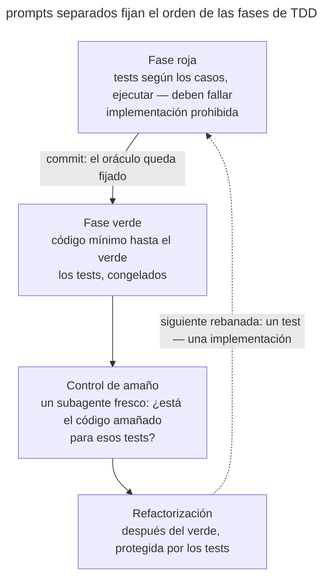

# TDD con agente

## Propósito

Separar la escritura del test y la implementación en fases explícitas. Primero el agente confirma que el test falla por el motivo esperado, luego cambia el código hasta que pase. Los criterios fijados ayudan a notar cuándo se amaña el resultado.

## También conocido como

Test-driven development con agente, red–green–refactor, test-first.

## Problema

Cuando el agente escribe los tests a partir de una implementación terminada, puede tomar su comportamiento por el esperado. Un error en la lógica acaba entonces tanto en el código como en la comprobación.

Por ejemplo, un test calcula un descuento con la misma fórmula que usa la función. Si la fórmula es incorrecta, ambos resultados coincidirán. El valor esperado hay que obtenerlo de forma independiente, a partir del requisito o de un ejemplo resuelto. Incluso un test independiente se puede pasar con un stub para el caso particular. Por eso, tras el verde, conviene un control de amaño.

Separar las fases de forma explícita te permite ver el test antes de la implementación y controlar los cambios del criterio.

## Solución

Lleva las fases roja y verde a prompts distintos y quédate tú con la puerta entre ellas.

1. **Fija el orden.** El agente escribe primero el test y luego la implementación.
2. **Obtén el rojo.** El agente ejecuta el test y muestra que falla porque falta el comportamiento.
3. **Fija el criterio.** Revisa el test y guárdalo con un commit.
4. **Obtén el verde.** El agente cambia la implementación y repite la [comprobación](give-agent-a-way-to-verify.md). Cambiar el test requiere una decisión aparte.
5. **Comprueba el amaño.** Un revisor evalúa si el código resuelve el caso general (ver [Escritor y revisor](writer-reviewer.md)).
6. **Refactoriza** bajo la protección de los tests que pasan.

Recorre el ciclo de un comportamiento a la vez. El siguiente test tiene en cuenta lo que salió a la luz en el paso anterior. Antes de empezar, acuerda el límite público en el que se comprueba el resultado, para que la refactorización interna no rompa un test sin que cambie el comportamiento.

## Estructura

El diagrama muestra el paso de un test que falla a la implementación y a una comprobación independiente.

```mermaid
---
title: prompts separados fijan el orden de las fases de TDD
---
flowchart TB
  red["Fase roja<br/>tests según los casos, ejecutar — deben fallar<br/>implementación prohibida"]:::warn
  green["Fase verde<br/>código mínimo hasta el verde<br/>los tests, congelados"]
  overfit["Control de amaño<br/>un subagente fresco: ¿está el código amañado<br/>para esos tests?"]:::muted
  refactor["Refactorización<br/>después del verde, protegida por los tests"]:::accent
  red -- "commit: el oráculo queda fijado" --> green
  green --> overfit --> refactor
  refactor -. "siguiente rebanada: un test — una implementación" .-> red
```

El bucle de vuelta repite el ciclo para el siguiente escenario una vez confirmado el actual.

## Participantes / Componentes

- **Desarrollador** fija el comportamiento esperado y aprueba los cambios de los criterios.
- **Agente** escribe el test y después la implementación, en secuencia.
- **Test** comprueba el requisito y se guarda antes de la implementación.
- **Costura de testing** fija la interfaz pública a través de la que se observa el comportamiento.
- **Revisor** busca amaños para casos particulares.

## Cuándo aplicarlo

- El resultado se puede expresar con entradas concretas y salidas esperadas.
- Un bug se puede reproducir con un test antes de la corrección.
- Código donde una regresión sale cara y los tests seguirán vivos como especificación.

Para una elección visual o un prototipo exploratorio pueden encajar mejor la [comprobación por capturas](give-agent-a-way-to-verify.md) y un [experimento desechable](prototype-to-answer.md).

## Consecuencias y compromisos

- ➕ El test se puede contrastar con el requisito antes de que exista la implementación.
- ➕ Un cambio en un criterio fijado se ve en el diff.
- ➕ Comprobar el comportamiento público depende menos de la estructura interna del código.
- ➖ Las fases explícitas y la revisión encarecen una edición pequeña.
- ➖ Hay que controlar el orden de los pasos y los motivos por los que fallan los tests.
- ➖ Una costura mal elegida vuelve frágiles los tests.

## Implementación

1. Declara un orden de trabajo test-first.
2. Acuerda los casos esperados y pide al agente que proponga los casos límite que falten.
3. Elige la interfaz pública de la comprobación antes de escribir los tests.
4. Comprueba el motivo por el que falla el primer test y guárdalo con un commit.
5. Pide cambiar la implementación hasta que pase, sin tocar el test. Obtén la salida de la ejecución.
6. Pasa el código a un revisor fresco para buscar stubs de casos particulares y casos omitidos.
7. Pide la refactorización por separado, bajo la protección de tests en verde.
8. Repite el ciclo para el siguiente comportamiento. Fija el orden en la [memoria del proyecto](claude-md-memory.md).

[Superpowers](superpowers.md) incluye `test-driven-development` en la implementación de las tareas. En el [pack de Matt Pocock](matt-pocock-skills.md), `/tdd` también fija las costuras de testing y el trabajo de un escenario a la vez.

## Ejemplo

Cuando la sesión caduca, el usuario ve un spinner infinito. Empiezas por la reproducción.

> Escribe un test que falle: ante un 401 de la API, el usuario acaba en /login

El agente comprueba cómo se comporta el cliente HTTP ante una respuesta 401. El test falla porque el cliente repite la petición sin fin. Revisas el test y lo guardas con un commit.

> Ahora arréglalo

El agente corrige el interceptor común, añadiendo el manejo del 401 con redirección a la página de inicio de sesión. Cuando el test pasa, pides una revisión.

> En un contexto fresco, comprueba que el manejo del 401 se aplica a todas las peticiones y no depende del endpoint concreto del test.

El revisor comprueba el interceptor común. El test conserva el escenario original y detectará si vuelve a fallar.

## Antipatrones y errores comunes

- **Tests a partir de la implementación.** La comprobación puede fijar un error del código terminado. Deriva el comportamiento esperado del requisito.
- **Saltarse el rojo.** Sin un fallo observado no está claro si el test detecta el defecto original.
- **Todos los tests de antemano.** Una suite grande puede fijar suposiciones no verificadas. Añade escenarios uno tras otro.
- **Amañar el criterio.** Debilitar un test durante la corrección requiere una discusión aparte.
- **Comprobar detalles internos.** Los tests de métodos privados pueden romperse tras una refactorización aunque el comportamiento se conserve.
- **Oráculo tautológico.** Calcular la respuesta esperada de la misma forma repite el error de la implementación. Usa un ejemplo independiente o el requisito.

## Usos conocidos

- **Claude Code best practices** describen confirmar el fallo, hacer commit de los tests, implementar y comprobar el amaño.
- **Superpowers** hace del TDD una parte obligatoria de la ejecución del plan.
- **Los skills de Matt Pocock** usan `/tdd` con costuras de testing acordadas.
- **Kent Beck** describió la práctica en el libro _Test-Driven Development: By Example_.

## Patrones relacionados

- [Bucle de retroalimentación](give-agent-a-way-to-verify.md) fija el ciclo general de comprobación y corrección.
- [Escritor y revisor](writer-reviewer.md) ayuda a detectar el amaño una vez que los tests pasan.
- [Cuatro fases](explore-plan-code-commit.md) permite acordar en el plan los escenarios a comprobar.
- [Diagnóstico mediante hipótesis](hypothesis-driven-debugging.md) ayuda a establecer la causa de un defecto antes de corregirlo.
- [Éxito prematuro](premature-success.md) surge cuando se toman unos tests unitarios en verde por una funcionalidad que funciona.
