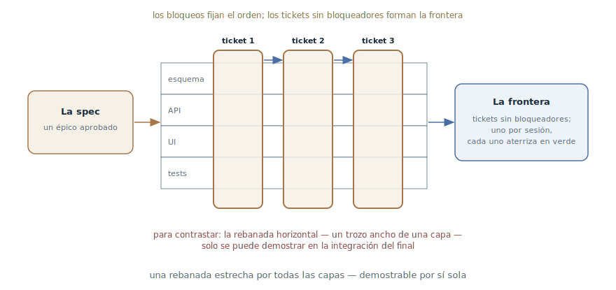

# Tickets trazadores

## Propósito

Trocear un plan o una especificación en tickets trazadores: rebanadas
verticales estrechas a través de todas las capas, cada una demostrable por
sí sola y del tamaño de una ventana de contexto fresca, con dependencias
bloqueantes explícitas entre tickets. El agente recibe trozos ejecutables,
no un épico.

## También conocido como

Tracer-bullet tickets, rebanadas verticales, trazadores; `/to-tickets` en
los skills de Matt Pocock.

## Problema

La especificación está aprobada — y es un épico. Entregársela al agente tal
cual no funciona, y las formas habituales de trocear fallan:

- Entera no cabe en la ventana: el agente que recibe «implementa la spec»
  intenta previsiblemente [resolverla de un golpe](one-feature-at-a-time.md)
  y deja un reguero de trabajo a medias.
- Trocear por capas — «primero todo el esquema, luego toda la API, luego
  toda la UI» — da piezas que no se pueden demostrar: si el sistema
  funciona se sabrá solo en la integración del final, el punto más caro.
- Los trozos sin dependencias explícitas son una trampa para el ejecutor:
  el agente toma una tarea que depende de lo no hecho y empieza a inventar
  los detalles que faltan.

## Solución

Trocear en vertical y declarar las dependencias. Cada ticket es un
**trazador**: como una bala trazadora, atraviesa una trayectoria estrecha
pero completa por todas las capas del sistema — esquema, API, interfaz,
tests — y muestra hacia dónde va la ráfaga.

Las reglas de la rebanada:

- **Vertical, no horizontal**: un camino estrecho por todas las capas, no
  un trozo ancho de una capa.
- **Demostrable por sí sola**: el ticket terminado se puede enseñar o
  verificar sin esperar al resto.
- **Del tamaño de una ventana fresca**: el agente saca el ticket en una
  sesión, con margen para las iteraciones de verificación.
- **El prefactoring, como primer ticket**: si conviene hacer fácil el
  cambio primero, eso es una rebanada aparte al frente de la cola.

Cada ticket declara sus **bloqueadores** — qué tickets deben terminar antes
de que pueda empezar. Un ticket sin bloqueadores se puede tomar de
inmediato; el conjunto de esos tickets es la frontera, visible en el
tracker.

El troceado pasa por el desarrollador: el agente presenta el desglose como
lista — título, bloqueadores, qué comportamiento de extremo a extremo hace
funcionar el ticket — e itera con los comentarios: ¿demasiado grueso? ¿las
dependencias son correctas? ¿qué fusionar, qué dividir? Los tickets
aprobados se publican en el tracker con relaciones de bloqueo nativas.

La excepción son las **refactorizaciones anchas**: un cambio mecánico con
radio de impacto en toda la base (renombrar una columna, retipar un símbolo
compartido) no se rebana en vertical. Se lleva como **expand–contract**:
primero expandir — añadir la forma nueva junto a la vieja para que nada se
rompa; luego migrar los puntos de llamada por lotes — cada lote su propio
ticket bloqueado por la expansión; y un ticket final de contracción borra
la forma vieja cuando no queda ningún llamador.

## Estructura

A la izquierda, la especificación-épico. En el centro, su troceado: cada
ticket atraviesa todas las capas en una franja estrecha, y las flechas de
bloqueo ordenan los tickets en un orden parcial. Abajo, para contrastar, el
troceado horizontal por capas: piezas anchas, ninguna demostrable antes de
la integración final. A la derecha, la ejecución: una frontera de tickets
sin bloquear, uno por sesión, cada uno aterrizando en verde.

## Participantes / Componentes

- **La especificación** — la fuente del troceado: el «qué construimos»
  aprobado.
- **El ticket trazador** — una rebanada vertical: comportamiento de extremo
  a extremo, criterios de aceptación, lista de bloqueadores.
- **Las dependencias bloqueantes** — el orden parcial explícito; la
  frontera se calcula a partir de ellas.
- **El desarrollador** — aprueba la granularidad y las dependencias; el
  agente propone, el humano decide.
- **El agente ejecutor** — toma un ticket de la frontera y lo lleva hasta
  el final en una ventana fresca.

## Cuándo aplicarlo

- Trabajo aprobado mayor que una sesión: una especificación, un plan
  grande, el resultado de un [mapa de investigación](wayfinder.md).
- Se busca paralelismo: la frontera permite que varias sesiones trabajen a
  la vez sin pisarse.
- Es la mecánica concreta del paso «tareas» de la
  [tubería SDD](spec-driven-development.md) — cuando `tasks.md` hace falta
  como cola ejecutable y no como lista de control.

No hace falta para trabajo de una sesión — basta un plan. Y no para la
exploración: el trabajo confuso lo aclara primero el
[mapa de investigación](wayfinder.md); los tickets se cortan de lo ya
claro.

## Consecuencias y compromisos

- ➕ Cada ticket aterriza verde y demostrable: no hay explosión de
  integración al final, porque la integración ocurre dentro de cada
  rebanada.
- ➕ El tamaño de ventana significa que al ejecutor siempre le alcanza el
  contexto — y el corte de sesión cuesta un ticket.
- ➕ La frontera da paralelismo barato y una imagen honesta del progreso.
- ➖ Trocear es una destreza: rebanadas demasiado gruesas no caben en la
  ventana, demasiado finas entierran el trabajo en sobrecostes.
- ➖ Las refactorizaciones anchas rompen la regla de verticalidad — piden
  el modo aparte expand–contract.
- ➖ Infraestructura de tracker: tickets, dependencias, estados — para un
  trabajo pequeño es burocracia.

## Implementación

1. Reúne el contexto: la especificación o el plan están en la conversación;
   estudia la base de código antes de trocear y busca oportunidades de
   prefactoring: «haz fácil el cambio y luego haz el cambio fácil».
2. Trocea en vertical: cada ticket describe un comportamiento de extremo a
   extremo desde el usuario — no «hacer la tabla» sino «el horario se crea
   y aparece en la lista».
3. Declara los bloqueadores de cada ticket; sin bloqueadores — candidato a
   la frontera.
4. Presenta el desglose al desarrollador como lista e itera: granularidad,
   dependencias, fusiones y divisiones.
5. Publica en el tracker en orden de dependencias, con bloqueo nativo y
   criterios de aceptación. Evita rutas de archivos y fragmentos de código
   en los tickets — caducan; la excepción son piezas ricas en decisiones de
   los [prototipos](prototype-to-answer.md), que codifican una decisión con
   más precisión que la prosa.
6. La refactorización ancha llévala aparte: ticket de expansión → lotes de
   migración por radio de impacto → ticket de contracción bloqueado por
   todos los lotes.
7. Ejecuta la frontera a [un ticket por pasada](one-feature-at-a-time.md),
   limpiando el contexto entre tickets.

## Ejemplo

La especificación «exportación de informes programada» del
[capítulo de SDD](spec-driven-development.md) está aprobada. El agente
propone el desglose:

1. **El horario se crea y se ve** — la migración, el modelo, una UI mínima:
   el usuario guarda un horario y lo ve en la lista. Sin bloqueadores.
2. **El informe sale según el horario** — el worker, el armado, el correo:
   a la hora fijada el informe llega al buzón. Bloqueado por: 1.
3. **El fallo se convierte en notificación** — un error de armado es un
   correo de fallo, no silencio. Bloqueado por: 2.
4. **Borrar un informe desactiva sus horarios.** Bloqueado por: 1.

El desarrollador ajusta la granularidad — «el primer ticket pesa; saca la
UI de la lista como rebanada propia» — y aprueba. Los tickets van al
tracker con sus bloqueos. La frontera es el ticket 1; tras él se abren el 2
y el 4, y dos sesiones paralelas los toman a la vez. Cada ticket termina en
comportamiento demostrable: tras el segundo ya se puede enseñar al cliente
un correo con el informe — mucho antes del final de toda la especificación.

## Antipatrones y errores comunes

- **Trocear por capas.** «Primero todo el esquema, luego toda la API» —
  ninguna pieza es demostrable y la integración explota al final. Cortar a
  través de las capas, no a lo largo.
- **El ticket-épico.** Una rebanada que no cabe en la ventana reproduce el
  problema original en miniatura: el agente vuelve a intentar el golpe
  único.
- **Dependencias en la cabeza.** Los bloqueos sin escribir significan que
  el agente tomará un ticket que depende de lo no hecho — e inventará lo
  que falta.
- **Rutas y fragmentos en los tickets.** La concreción de implementación
  caduca antes de que le llegue el turno al ticket. Describe
  comportamiento; código — solo las piezas ricas en decisiones de los
  prototipos.
- **Una refactorización ancha como trazador.** Un renombrado por toda la
  base no se enhebra en vertical — la rebanada forzada no aterrizará en
  verde. Expand–contract.

## Usos conocidos

- **Skills de Matt Pocock** — `/to-tickets`: la fuente primaria de la
  mecánica — las reglas de la rebanada vertical, las dependencias
  bloqueantes, el cuestionario con el desarrollador, la publicación al
  tracker y el expand–contract para refactorizaciones anchas; la ejecución
  con `/implement`, un ticket a la vez.
- **The Pragmatic Programmer** — las balas trazadoras como metáfora: un
  canal fino de extremo a extremo por el sistema que muestra hacia dónde va
  la ráfaga — y, a diferencia del prototipo, se queda en el código.
- **Toolkits de SDD** — `tasks.md` en [Spec Kit](spec-kit.md) y los planes
  de [Superpowers](superpowers.md): el mismo troceado en pasos ejecutables;
  los trazadores añaden la verticalidad y el bloqueo explícito.

## Patrones relacionados

- [Desarrollo orientado a especificaciones](spec-driven-development.md) —
  los tickets trazadores son la mecánica concreta del paso «tareas»: la
  especificación se convierte en una cola ejecutable.
- [Una funcionalidad a la vez](one-feature-at-a-time.md) — la regla de
  ejecución de la cola: un ticket por pasada, en ventana fresca.
- [Mapa de investigación](wayfinder.md) — el predecesor por etapa: el mapa
  despeja la niebla hasta las decisiones; los tickets cortan lo claro en lo
  ejecutable.
- [Prototipo desechable](prototype-to-answer.md) — el proveedor de
  fragmentos ricos en decisiones para los tickets — y un contraste útil: el
  prototipo se tira, el trazador se queda y crece.
